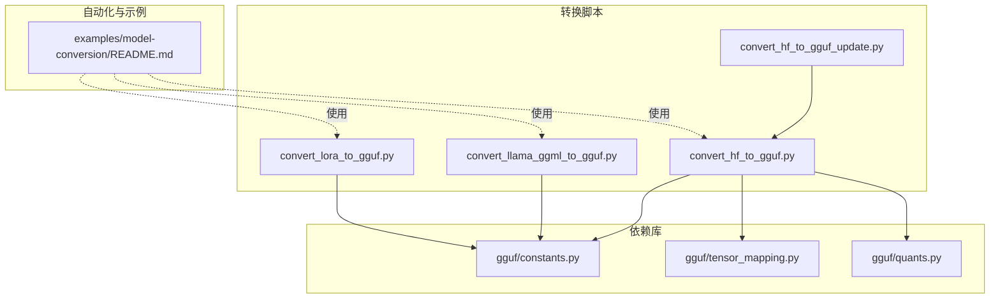
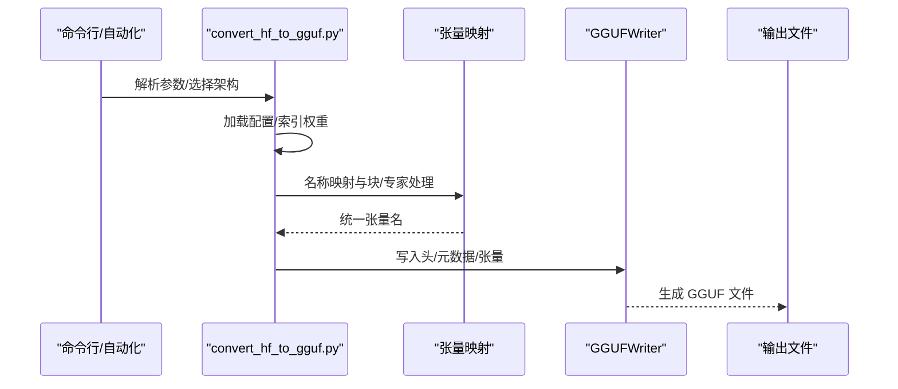
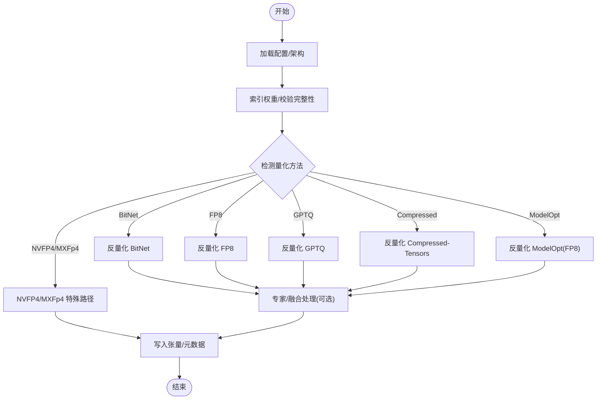
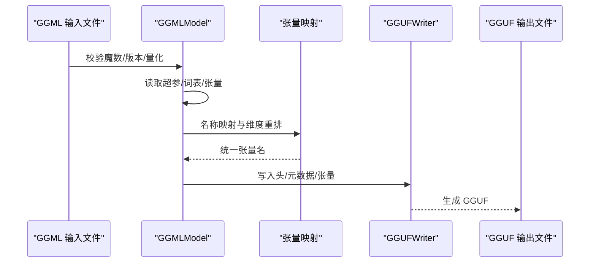
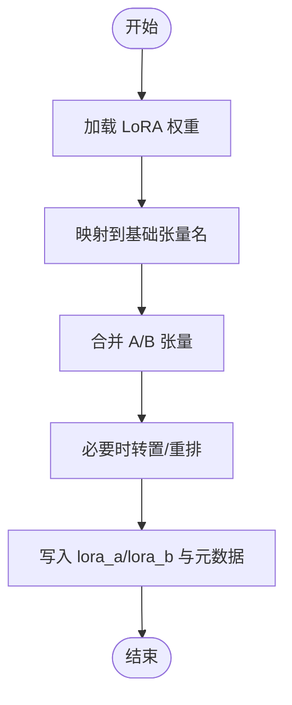
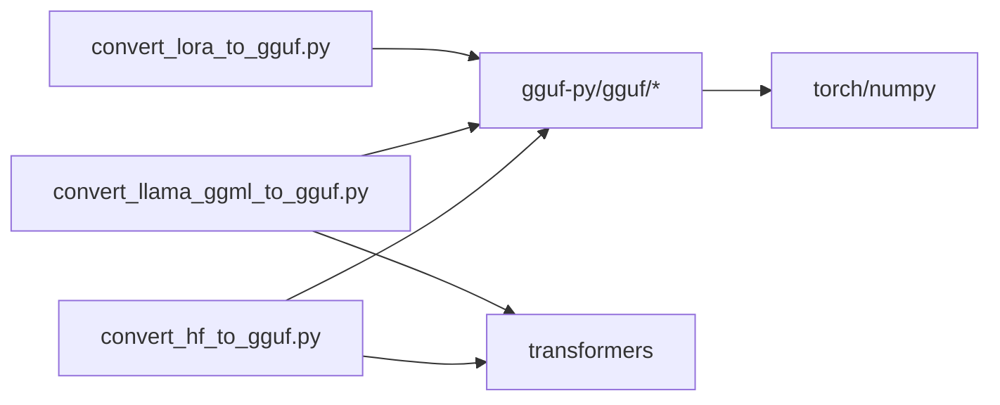

# 模型转换工具

<cite>
**本文引用的文件**
- [convert_hf_to_gguf.py](file://convert_hf_to_gguf.py)
- [convert_llama_ggml_to_gguf.py](file://convert_llama_ggml_to_gguf.py)
- [convert_lora_to_gguf.py](file://convert_lora_to_gguf.py)
- [convert_hf_to_gguf_update.py](file://convert_hf_to_gguf_update.py)
- [README.md（模型转换示例）](file://examples/model-conversion/README.md)
- [requirements-convert_hf_to_gguf.txt](file://requirements/requirements-convert_hf_to_gguf.txt)
- [requirements-convert_llama_ggml_to_gguf.txt](file://requirements/requirements-convert_llama_ggml_to_gguf.txt)
- [requirements-convert_lora_to_gguf.txt](file://requirements/requirements-convert_lora_to_gguf.txt)
- [constants.py](file://gguf-py/gguf/constants.py)
- [tensor_mapping.py](file://gguf-py/gguf/tensor_mapping.py)
- [quants.py](file://gguf-py/gguf/quants.py)
</cite>

## 目录
1. [简介](#简介)
2. [项目结构](#项目结构)
3. [核心组件](#核心组件)
4. [架构总览](#架构总览)
5. [详细组件分析](#详细组件分析)
6. [依赖关系分析](#依赖关系分析)
7. [性能考虑](#性能考虑)
8. [故障排查指南](#故障排查指南)
9. [结论](#结论)
10. [附录](#附录)

## 简介
本文件系统性梳理 llama.cpp 仓库中的模型转换工具链，覆盖从 Hugging Face Transformers 模型、原始 LLaMA GGML 模型到 LoRA 适配器的 GGUF 转换流程。文档重点解释以下方面：
- 转换脚本的工作原理：模型架构检测、权重映射、元数据提取与张量重排
- 针对不同模型类型的转换参数配置：量化选项、分片设置、内存优化策略
- 常见问题与解决方案：权重不匹配、内存不足、精度损失
- 批量转换脚本与自动化工具的使用指南
- 转换后模型的验证与测试方法

## 项目结构
围绕“模型转换”的核心脚本与配套模块如下：
- Hugging Face 转换主脚本：convert_hf_to_gguf.py
- LLaMA GGML 到 GGUF 的迁移脚本：convert_llama_ggml_to_gguf.py
- LoRA 适配器转 GGUF：convert_lora_to_gguf.py
- 词表预处理器更新脚本：convert_hf_to_gguf_update.py
- 示例与自动化：examples/model-conversion/README.md 及其配套 Makefile 目标
- 要求与依赖：requirements/*.txt
- GGUF 写入与量化支持：gguf-py/gguf/*（常量、张量映射、量化）

图示来源
- [convert_hf_to_gguf.py](file://convert_hf_to_gguf.py)
- [convert_llama_ggml_to_gguf.py](file://convert_llama_ggml_to_gguf.py)
- [convert_lora_to_gguf.py](file://convert_lora_to_gguf.py)
- [convert_hf_to_gguf_update.py](file://convert_hf_to_gguf_update.py)
- [README.md（模型转换示例）](file://examples/model-conversion/README.md)
- [constants.py](file://gguf-py/gguf/constants.py)
- [tensor_mapping.py](file://gguf-py/gguf/tensor_mapping.py)
- [quants.py](file://gguf-py/gguf/quants.py)

章节来源
- [README.md（模型转换示例）:1-409](file://examples/model-conversion/README.md#L1-L409)

## 核心组件
- 模型基类与转换流程
  - ModelBase 提供统一的索引、解码、张量修改、元数据写入与分片控制能力
  - 自动推断输出类型（F32/F16/BF16/Q8_0），支持懒加载以降低内存峰值
  - 支持多种量化方法的反量化与 NVFP4/MXFp4 特殊路径
- 张量映射与名称转换
  - TensorNameMap 将上游模型权重键名映射到 GGUF 统一命名规范
  - 支持块级（block-level）与专家级（MoE）张量的特殊处理
- GGUF 写入与量化
  - GGUFWriter 负责头、KV 元数据与张量的顺序写入
  - quants.py 提供多种量化/反量化实现与形状推导

章节来源
- [convert_hf_to_gguf.py:79-172](file://convert_hf_to_gguf.py#L79-L172)
- [tensor_mapping.py:8-161](file://gguf-py/gguf/tensor_mapping.py#L8-L161)
- [constants.py:1-200](file://gguf-py/gguf/constants.py#L1-L200)
- [quants.py:14-76](file://gguf-py/gguf/quants.py#L14-L76)

## 架构总览
下图展示从输入模型到 GGUF 文件的端到端转换流程。

图示来源
- [convert_hf_to_gguf.py:170-172](file://convert_hf_to_gguf.py#L170-L172)
- [tensor_mapping.py:8-161](file://gguf-py/gguf/tensor_mapping.py#L8-L161)
- [constants.py:1-200](file://gguf-py/gguf/constants.py#L1-L200)

## 详细组件分析

### Hugging Face 转换器（convert_hf_to_gguf.py）
- 功能要点
  - 自动识别模型架构与块数，构建张量映射
  - 支持 safetensors 与 PyTorch bin 两种权重格式，自动索引与校验
  - 懒加载与分片写入，降低内存占用
  - 多种量化方法的反量化：BitNet、FP8、GPTQ、Compressed-Tensors、ModelOpt（NVFP4/MXFp4）
  - 专家级张量融合（可选）与缩放张量写入
- 关键流程
  - 索引权重：根据 index.json 或文件名推断权重分布
  - 反量化：按量化配置将量化权重还原为浮点
  - 修改与重排：通过 modify_tensors 对齐 GGUF 张量布局
  - 写入：add_tensor 写入张量，add_* 写入元数据

图示来源
- [convert_hf_to_gguf.py:291-524](file://convert_hf_to_gguf.py#L291-L524)
- [convert_hf_to_gguf.py:734-768](file://convert_hf_to_gguf.py#L734-L768)

章节来源
- [convert_hf_to_gguf.py:170-172](file://convert_hf_to_gguf.py#L170-L172)
- [convert_hf_to_gguf.py:291-524](file://convert_hf_to_gguf.py#L291-L524)
- [convert_hf_to_gguf.py:734-768](file://convert_hf_to_gguf.py#L734-L768)

### LLaMA GGML 到 GGUF 迁移（convert_llama_ggml_to_gguf.py）
- 功能要点
  - 读取旧版 GGML 文件头、超参、词表与张量
  - 校验版本与量化兼容性（不同 GGMLv2/v3 的量化规则差异）
  - 通过张量映射表将旧张量名映射到 GGUF 规范
  - 写入 GGUF 头、KV 元数据与张量
- 参数与约束
  - GQA（分组查询注意力）因子需要正确设置
  - RMSNorm eps 等超参需与目标架构匹配

图示来源
- [convert_llama_ggml_to_gguf.py:134-201](file://convert_llama_ggml_to_gguf.py#L134-L201)
- [convert_llama_ggml_to_gguf.py:203-246](file://convert_llama_ggml_to_gguf.py#L203-L246)

章节来源
- [convert_llama_ggml_to_gguf.py:134-201](file://convert_llama_ggml_to_gguf.py#L134-L201)
- [convert_llama_ggml_to_gguf.py:203-246](file://convert_llama_ggml_to_gguf.py#L203-L246)

### LoRA 适配器转换（convert_lora_to_gguf.py）
- 功能要点
  - 从 adapter_model.safetensors/bin 中读取 A/B 权重
  - 将 LoRA 权重量化为独立的 lora_a/lora_b 张量
  - 写入适配器类型与 Alpha 等元数据
  - 支持嵌入层与归一化层等额外张量保留
- 注意事项
  - 不支持直接对 lm_head 的适配器（在基础模型中被忽略）
  - 嵌入层的 A/B 需要转置以匹配推理路径

图示来源
- [convert_lora_to_gguf.py:419-484](file://convert_lora_to_gguf.py#L419-L484)

章节来源
- [convert_lora_to_gguf.py:419-484](file://convert_lora_to_gguf.py#L419-L484)

### 词表预处理器更新（convert_hf_to_gguf_update.py）
- 功能要点
  - 下载指定模型的分词器文件，计算编码签名哈希
  - 自动生成 get_vocab_base_pre 函数的分支逻辑
  - 生成词表测试用例与 GGUF 验证文件
- 使用场景
  - 当上游模型的 BPE 预处理变更或新增模型族时，补充预处理器映射

章节来源
- [convert_hf_to_gguf_update.py:265-364](file://convert_hf_to_gguf_update.py#L265-L364)
- [convert_hf_to_gguf_update.py:428-477](file://convert_hf_to_gguf_update.py#L428-L477)

## 依赖关系分析
- 脚本依赖
  - gguf-py：提供 GGUFWriter、常量、张量映射与量化工具
  - transformers：用于加载配置与分词器
  - torch/numpy：张量操作与量化
- 要求与环境
  - Python 虚拟环境安装 requirements/*.txt
  - 针对特定平台（如 s390x）使用夜间构建索引

图示来源
- [convert_hf_to_gguf.py:19-31](file://convert_hf_to_gguf.py#L19-L31)
- [convert_llama_ggml_to_gguf.py:14-16](file://convert_llama_ggml_to_gguf.py#L14-L16)
- [convert_lora_to_gguf.py:15-24](file://convert_lora_to_gguf.py#L15-L24)
- [requirements-convert_hf_to_gguf.txt:1-10](file://requirements/requirements-convert_hf_to_gguf.txt#L1-L10)
- [requirements-convert_llama_ggml_to_gguf.txt:1-2](file://requirements/requirements-convert_llama_ggml_to_gguf.txt#L1-L2)
- [requirements-convert_lora_to_gguf.txt:1-5](file://requirements/requirements-convert_lora_to_gguf.txt#L1-L5)

章节来源
- [requirements-convert_hf_to_gguf.txt:1-10](file://requirements/requirements-convert_hf_to_gguf.txt#L1-L10)
- [requirements-convert_llama_ggml_to_gguf.txt:1-2](file://requirements/requirements-convert_llama_ggml_to_gguf.txt#L1-L2)
- [requirements-convert_lora_to_gguf.txt:1-5](file://requirements/requirements-convert_lora_to_gguf.txt#L1-L5)

## 性能考虑
- 内存优化
  - 懒加载：默认启用 lazy，避免一次性将大权重映射到内存
  - 分片写入：通过 split_max_tensors 与 split_max_size 控制单文件张量数量与大小
  - 专家级张量合并：在 NVFP4/MXFp4 流程中按层合并专家权重，减少中间态内存
- 量化与精度
  - 自动推断输出类型（F32/F16/BF16/Q8_0），优先保持高保真
  - GPTQ/Compressed-Tensors 等量化需严格匹配块大小与零点布局
- I/O 与并发
  - 使用 mmap 读取 PyTorch 权重，降低内存峰值
  - safetensors 本地/远程索引提升大规模模型加载效率

章节来源
- [convert_hf_to_gguf.py:135-171](file://convert_hf_to_gguf.py#L135-L171)
- [convert_hf_to_gguf.py:734-768](file://convert_hf_to_gguf.py#L734-L768)
- [quants.py:14-76](file://gguf-py/gguf/quants.py#L14-L76)

## 故障排查指南
- 权重不匹配
  - 现象：weight_map 与实际权重文件不一致
  - 处理：检查 index.json 是否存在；确认分片文件是否完整下载
- 量化异常
  - 现象：反量化失败或形状不整除
  - 处理：核对量化配置（bits/block_size/group_size）与权重形状；确保块大小对齐
- 内存不足
  - 现象：大模型转换 OOM
  - 处理：开启 lazy；增大 split_max_size；关闭专家融合；降低批处理大小
- 精度损失
  - 现象：量化后 logits 明显偏差
  - 处理：优先使用 F16/BF16；对嵌入矩阵使用 Q8_0；进行 logits 验证与困惑度评估
- LoRA 适配器错误
  - 现象：lm_head 权重出现在适配器中
  - 处理：忽略该张量；仅保留嵌入层与归一化层的额外张量

章节来源
- [convert_hf_to_gguf.py:258-272](file://convert_hf_to_gguf.py#L258-L272)
- [convert_hf_to_gguf.py:437-440](file://convert_hf_to_gguf.py#L437-L440)
- [README.md（模型转换示例）:123-128](file://examples/model-conversion/README.md#L123-L128)
- [README.md（模型转换示例）:306-335](file://examples/model-conversion/README.md#L306-L335)

## 结论
本工具链提供了从 Hugging Face、旧版 GGML 到 LoRA 的全栈 GGUF 转换能力。通过统一的张量映射、灵活的量化与分片策略，以及完善的验证流程，能够高效、稳定地完成模型迁移与部署。建议在生产环境中结合自动化脚本与验证目标，确保转换质量与性能。

## 附录
- 自动化与批量转换
  - 使用 examples/model-conversion/README.md 中的 Makefile 目标进行迭代开发与验证
  - 支持原模型运行、转换、对比 logits、量化与上传等全流程
- 常用参数速查
  - 输出类型：f32/f16/bf16/q8_0/auto
  - 分片：split_max_tensors、split_max_size
  - 懒加载：no-lazy（禁用）
  - 大端序：bigendian
  - 干跑：dry-run（仅打印不写文件）

章节来源
- [README.md（模型转换示例）:1-409](file://examples/model-conversion/README.md#L1-L409)
- [convert_lora_to_gguf.py:247-287](file://convert_lora_to_gguf.py#L247-L287)