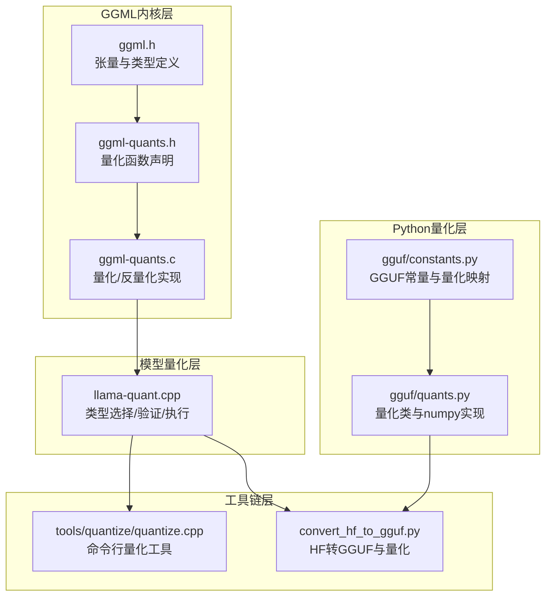
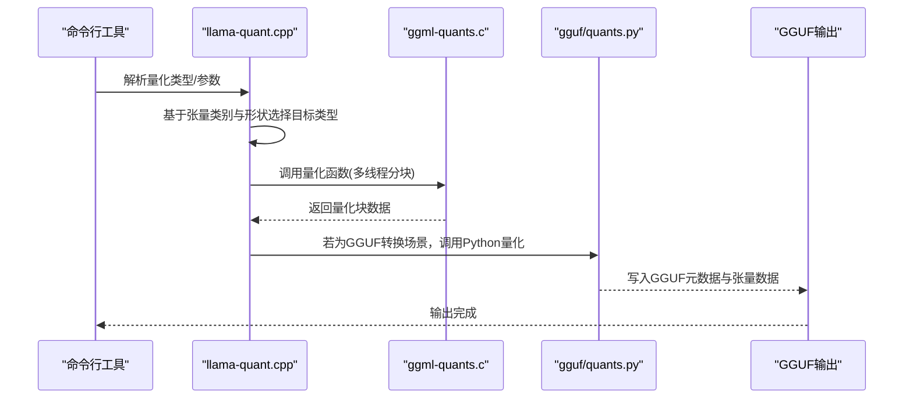
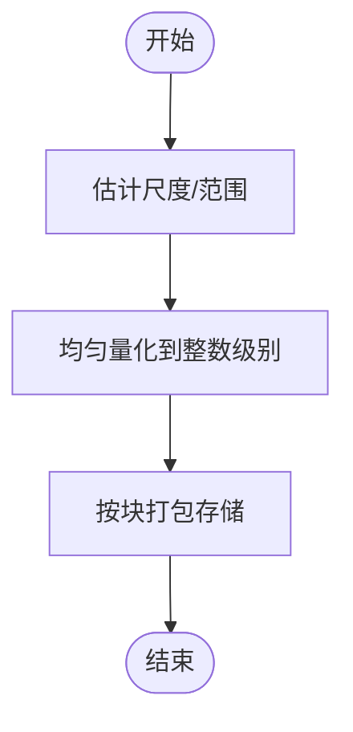
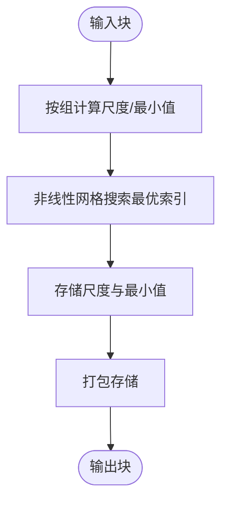
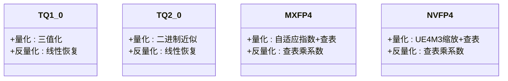
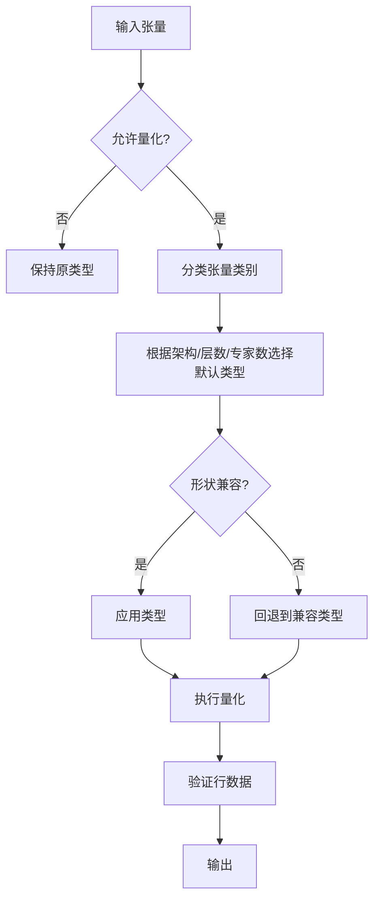
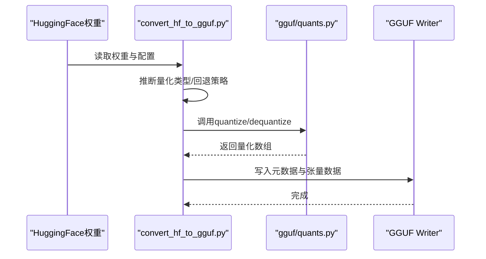
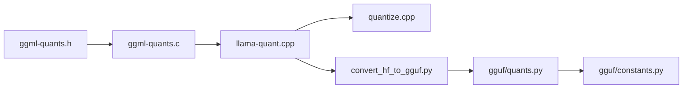

# 量化技术详解

<cite>
**本文档引用的文件**
- [ggml-quants.h](file://ggml/src/ggml-quants.h)
- [ggml-quants.c](file://ggml/src/ggml-quants.c)
- [llama-quant.cpp](file://src/llama-quant.cpp)
- [quantize.cpp](file://tools/quantize/quantize.cpp)
- [quants.py](file://gguf-py/gguf/quants.py)
- [constants.py](file://gguf-py/gguf/constants.py)
- [convert_hf_to_gguf.py](file://convert_hf_to_gguf.py)
- [ggml.h](file://ggml/include/ggml.h)
</cite>

## 目录
1. [引言](#引言)
2. [项目结构](#项目结构)
3. [核心组件](#核心组件)
4. [架构总览](#架构总览)
5. [详细组件分析](#详细组件分析)
6. [依赖关系分析](#依赖关系分析)
7. [性能考量](#性能考量)
8. [故障排查指南](#故障排查指南)
9. [结论](#结论)
10. [附录](#附录)

## 引言
本文件系统性梳理了该代码库中的量化技术体系，覆盖线性量化、非线性量化与混合精度量化，解析从1.5位到8位整数量化（含IQ系列、Q系列、TQ系列、MXFP4、NVFP4等）的数学原理与实现细节，并结合GGUF格式与转换工具链，给出量化质量评估、性能对比与工程实践建议。同时，文档还说明了重要矩阵（imatrix）在激活感知量化中的作用，以及如何通过工具链进行量化策略选择与部署。

## 项目结构
该仓库围绕GGML张量库构建，量化能力分布在以下层次：
- GGML内核层：提供基础量化/反量化接口与具体块格式实现
- 模型量化层：根据模型架构与张量类别自动选择最优量化类型
- 工具链层：命令行量化工具与GGUF转换脚本
- Python量化层：GGUF Python实现，支持多种量化类型的编码/解码

**图表来源**
- [ggml.h](file://ggml/include/ggml.h)
- [ggml-quants.h](file://ggml/src/ggml-quants.h)
- [ggml-quants.c](file://ggml/src/ggml-quants.c)
- [llama-quant.cpp](file://src/llama-quant.cpp)
- [quantize.cpp](file://tools/quantize/quantize.cpp)
- [quants.py](file://gguf-py/gguf/quants.py)
- [constants.py](file://gguf-py/gguf/constants.py)
- [convert_hf_to_gguf.py](file://convert_hf_to_gguf.py)

**章节来源**
- [ggml.h:1-200](file://ggml/include/ggml.h#L1-L200)
- [ggml-quants.h:1-113](file://ggml/src/ggml-quants.h#L1-L113)
- [ggml-quants.c:1-800](file://ggml/src/ggml-quants.c#L1-L800)
- [llama-quant.cpp:1-800](file://src/llama-quant.cpp#L1-L800)
- [quantize.cpp:1-200](file://tools/quantize/quantize.cpp#L1-L200)
- [quants.py:1-800](file://gguf-py/gguf/quants.py#L1-L800)
- [constants.py:1-800](file://gguf-py/gguf/constants.py#L1-L800)
- [convert_hf_to_gguf.py:328-381](file://convert_hf_to_gguf.py#L328-L381)

## 核心组件
- 量化/反量化接口：统一的量化函数签名与块格式定义，覆盖Q1_0、Q4_0/4_1/5_0/5_1、Q2_K/Q3_K/Q4_K/Q5_K/Q6_K、IQ系列、TQ系列、MXFP4、NVFP4等
- 类型选择与回退：基于张量类别（注意力V、FFN上下行等）、层数位置、专家结构与形状约束，自动选择最合适的量化类型，并在形状不兼容时进行安全回退
- 执行与验证：多线程分块量化、行级数据验证，确保输出符合GGML类型规范
- 工具链与转换：命令行量化工具支持多种混合精度策略；HF转GGUF脚本支持GPTQ权重解包与量化

**章节来源**
- [ggml-quants.h:16-113](file://ggml/src/ggml-quants.h#L16-L113)
- [ggml-quants.c:36-550](file://ggml/src/ggml-quants.c#L36-L550)
- [llama-quant.cpp:163-703](file://src/llama-quant.cpp#L163-L703)
- [quantize.cpp:34-74](file://tools/quantize/quantize.cpp#L34-L74)
- [convert_hf_to_gguf.py:328-381](file://convert_hf_to_gguf.py#L328-L381)

## 架构总览
量化流程自上而下分为“策略选择—执行量化—存储/传输”三个阶段，其中策略选择会综合考虑模型架构、张量类别、形状约束与是否启用纯量化（pure）模式。

**图表来源**
- [llama-quant.cpp:709-761](file://src/llama-quant.cpp#L709-L761)
- [ggml-quants.c:829-929](file://ggml/src/ggml-quants.c#L829-L929)
- [quants.py:56-76](file://gguf-py/gguf/quants.py#L56-L76)
- [quantize.cpp:1-200](file://tools/quantize/quantize.cpp#L1-L200)

## 详细组件分析

### 线性量化（Q系列）
- Q4_0/Q4_1/Q5_0/Q5_1/Q8_0：固定步长均匀量化，Q4系列采用16级或32级均匀划分，Q8_0采用8位有符号整数存储尺度与残差
- 实现要点：绝对最大值/范围估计、对称/非对称量化、打包存储（高低半字节交错）

**图表来源**
- [ggml-quants.c:71-143](file://ggml/src/ggml-quants.c#L71-L143)
- [ggml-quants.c:145-257](file://ggml/src/ggml-quants.c#L145-L257)

**章节来源**
- [ggml-quants.c:71-257](file://ggml/src/ggml-quants.c#L71-L257)

### 非线性量化（K系列与IQ系列）
- Q2_K/Q3_K/Q4_K/Q5_K/Q6_K：每K元素为一组，组内自适应尺度与最小值，Q2_K/Q3_K/Q4_K/Q5_K采用可变尺度与掩码组合存储
- IQ系列（IQ2_XXS/IQ2_XS/IQ2_S/IQ3_XXS/IQ3_S/IQ4_NL/IQ4_XS等）：非线性网格/格点量化，结合重要性矩阵（imatrix）进行激活感知优化

**图表来源**
- [ggml-quants.c:829-929](file://ggml/src/ggml-quants.c#L829-L929)
- [ggml-quants.c:1167-1291](file://ggml/src/ggml-quants.c#L1167-L1291)
- [ggml-quants.c:1395-1578](file://ggml/src/ggml-quants.c#L1395-L1578)

**章节来源**
- [ggml-quants.c:829-1578](file://ggml/src/ggml-quants.c#L829-L1578)

### 混合精度量化（TQ/MXFP4/NVFP4）
- TQ1_0/TQ2_0：三值化/二进制近似，以极低带宽换取精度
- MXFP4/NVFP4：可变指数的混合浮点格式，针对大动态范围数值进行自适应缩放

**图表来源**
- [ggml-quants.h:25-33](file://ggml/src/ggml-quants.h#L25-L33)
- [ggml-quants.c:308-375](file://ggml/src/ggml-quants.c#L308-L375)
- [quants.py:575-654](file://gguf-py/gguf/quants.py#L575-L654)
- [quants.py:656-705](file://gguf-py/gguf/quants.py#L656-L705)
- [quants.py:707-764](file://gguf-py/gguf/quants.py#L707-L764)

**章节来源**
- [ggml-quants.h:25-33](file://ggml/src/ggml-quants.h#L25-L33)
- [ggml-quants.c:308-375](file://ggml/src/ggml-quants.c#L308-L375)
- [quants.py:575-764](file://gguf-py/gguf/quants.py#L575-L764)

### 量化类型选择与回退机制
- 张量分类：嵌入、注意力Q/K/V/QK/VB、注意力输出、FFN上行/门控/下行、输出等
- 形状兼容性：当列数不能被块大小整除时，自动回退到更通用类型（如从IQ1_S回退到Q4_0）
- 纯量化模式：禁用混合策略，统一量化

**图表来源**
- [llama-quant.cpp:288-355](file://src/llama-quant.cpp#L288-L355)
- [llama-quant.cpp:411-658](file://src/llama-quant.cpp#L411-L658)
- [llama-quant.cpp:362-408](file://src/llama-quant.cpp#L362-L408)

**章节来源**
- [llama-quant.cpp:115-150](file://src/llama-quant.cpp#L115-L150)
- [llama-quant.cpp:362-408](file://src/llama-quant.cpp#L362-L408)
- [llama-quant.cpp:411-658](file://src/llama-quant.cpp#L411-L658)

### GGUF内置量化与转换
- GGUF常量与量化类型映射：定义了块大小、类型尺寸等关键信息
- Python量化实现：提供各量化类型的向量化实现，支持延迟加载与形状推导
- HF转GGUF：支持GPTQ权重解包与量化，自动处理量化回退

**图表来源**
- [constants.py:1-800](file://gguf-py/gguf/constants.py#L1-L800)
- [quants.py:14-26](file://gguf-py/gguf/quants.py#L14-L26)
- [quants.py:56-76](file://gguf-py/gguf/quants.py#L56-L76)
- [convert_hf_to_gguf.py:805-879](file://convert_hf_to_gguf.py#L805-L879)
- [convert_hf_to_gguf.py:328-381](file://convert_hf_to_gguf.py#L328-L381)

**章节来源**
- [constants.py:1-800](file://gguf-py/gguf/constants.py#L1-L800)
- [quants.py:14-202](file://gguf-py/gguf/quants.py#L14-L202)
- [convert_hf_to_gguf.py:805-879](file://convert_hf_to_gguf.py#L805-L879)
- [convert_hf_to_gguf.py:328-381](file://convert_hf_to_gguf.py#L328-L381)

## 依赖关系分析
- 头文件依赖：量化函数声明位于ggml-quants.h，具体实现位于ggml-quants.c
- 运行时依赖：llama-quant.cpp依赖GGML类型系统与量化函数；工具链依赖命令行参数解析与GGUF写入
- Python依赖：GGUF量化模块依赖numpy与LazyNumpyTensor，提供高效批量量化/解量化

**图表来源**
- [ggml-quants.h:1-113](file://ggml/src/ggml-quants.h#L1-L113)
- [ggml-quants.c:1-800](file://ggml/src/ggml-quants.c#L1-L800)
- [llama-quant.cpp:1-800](file://src/llama-quant.cpp#L1-L800)
- [quantize.cpp:1-200](file://tools/quantize/quantize.cpp#L1-L200)
- [convert_hf_to_gguf.py:1-200](file://convert_hf_to_gguf.py#L1-L200)
- [quants.py:1-200](file://gguf-py/gguf/quants.py#L1-L200)
- [constants.py:1-200](file://gguf-py/gguf/constants.py#L1-L200)

**章节来源**
- [ggml-quants.h:1-113](file://ggml/src/ggml-quants.h#L1-L113)
- [ggml-quants.c:1-800](file://ggml/src/ggml-quants.c#L1-L800)
- [llama-quant.cpp:1-800](file://src/llama-quant.cpp#L1-L800)
- [quantize.cpp:1-200](file://tools/quantize/quantize.cpp#L1-L200)
- [convert_hf_to_gguf.py:1-200](file://convert_hf_to_gguf.py#L1-L200)
- [quants.py:1-200](file://gguf-py/gguf/quants.py#L1-L200)
- [constants.py:1-200](file://gguf-py/gguf/constants.py#L1-L200)

## 性能考量
- 内存占用：量化后张量大小=元素总数/块大小×类型字节数；例如Q4_0为4位/元素，Q8_0为8位/元素
- 计算效率：K系列量化在推理时需要额外的尺度/最小值读取与乘加操作，但通常仍优于FP16全精度
- 并行化：量化过程支持多线程分块，显著缩短大规模模型量化时间
- 精度保持：对于注意力V/FFN下行等敏感层，优先选择更高位宽或更精细的非线性量化

[本节为通用指导，无需特定文件引用]

## 故障排查指南
- 形状不兼容：当列数无法被块大小整除时，系统会自动回退到兼容类型；若仍失败，检查张量维度或切换到F16/F32
- 数据验证失败：量化后会对行数据进行验证，若失败需检查量化实现或输入数据范围
- imatrix问题：使用IQ系列且未提供imatrix可能导致精度下降；可通过工具链生成/指定imatrix文件

**章节来源**
- [llama-quant.cpp:362-408](file://src/llama-quant.cpp#L362-L408)
- [llama-quant.cpp:710-761](file://src/llama-quant.cpp#L710-L761)
- [quantize.cpp:184-200](file://tools/quantize/quantize.cpp#L184-L200)

## 结论
该量化体系在保证精度的前提下，提供了从1.5位到8位整数的丰富选择，并通过K系列与IQ系列实现激活感知与非线性逼近。配合GGUF格式与转换工具链，可在工程中灵活选择混合精度策略，在内存节省、推理速度与精度之间取得平衡。

[本节为总结性内容，无需特定文件引用]

## 附录

### 量化类型与位宽对照
- IQ1_M/IQ1_S：约1.5–1.75位
- IQ2_XXS/IQ2_XS/IQ2_S：约2.0–2.7位
- IQ3_XXS/IQ3_S/IQ3_M：约3.0–3.66位
- IQ4_NL/IQ4_XS：约4.0–4.5位
- Q2_K/Q3_K/Q4_K/Q5_K/Q6_K：2–6位可变
- Q4_0/Q4_1/Q5_0/Q5_1/Q8_0：4/4/5/5/8位固定
- TQ1_0/TQ2_0：1.69/2.06位三值/二值
- MXFP4/NVFP4：可变指数混合浮点

**章节来源**
- [quantize.cpp:34-74](file://tools/quantize/quantize.cpp#L34-L74)
- [ggml-quants.h:16-113](file://ggml/src/ggml-quants.h#L16-L113)

### 使用指南与最佳实践
- 选择策略：优先对注意力V/FFN下行使用更高位宽；对嵌入与输出可适度放宽
- 纯量化模式：在追求极致一致性时启用pure，避免混合策略
- imatrix：对IQ系列启用imatrix可显著提升精度，尤其在小模型或敏感层
- 工具链：使用命令行工具进行批量量化，或在转换脚本中直接指定量化类型

**章节来源**
- [llama-quant.cpp:411-658](file://src/llama-quant.cpp#L411-L658)
- [quantize.cpp:125-182](file://tools/quantize/quantize.cpp#L125-L182)
- [convert_hf_to_gguf.py:805-879](file://convert_hf_to_gguf.py#L805-L879)