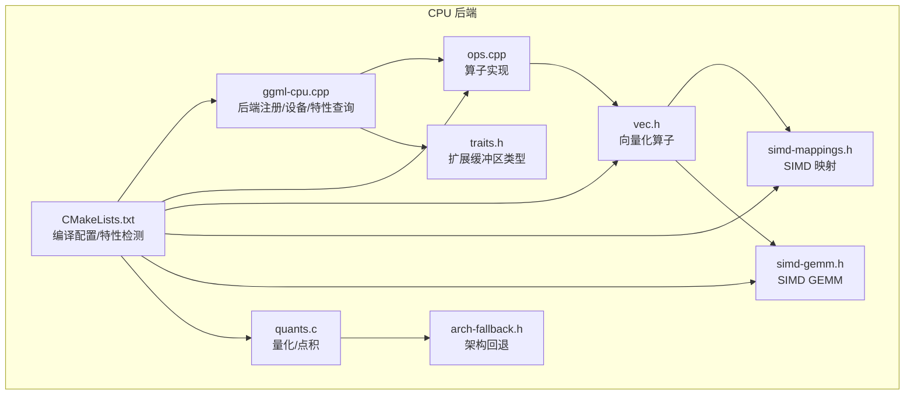
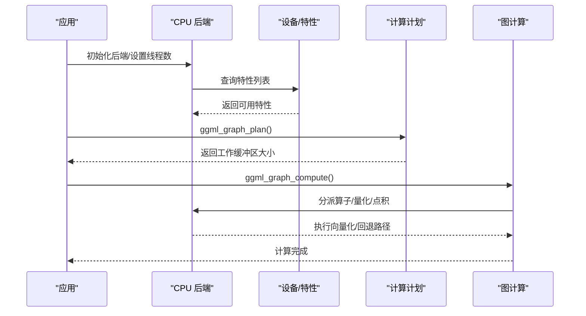
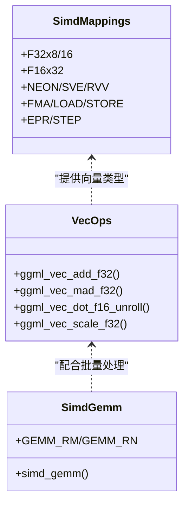
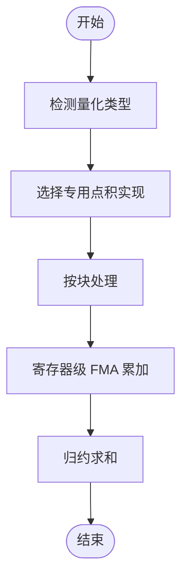
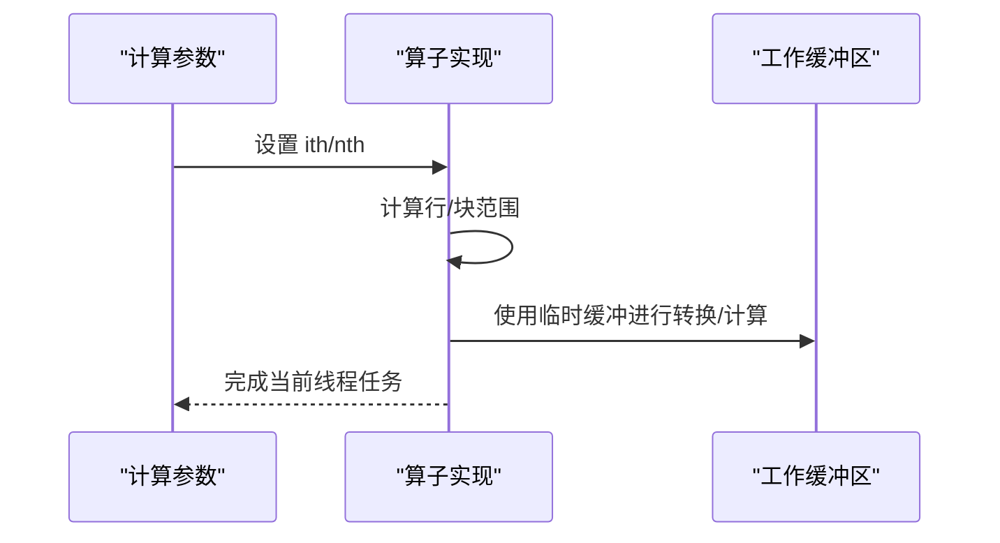
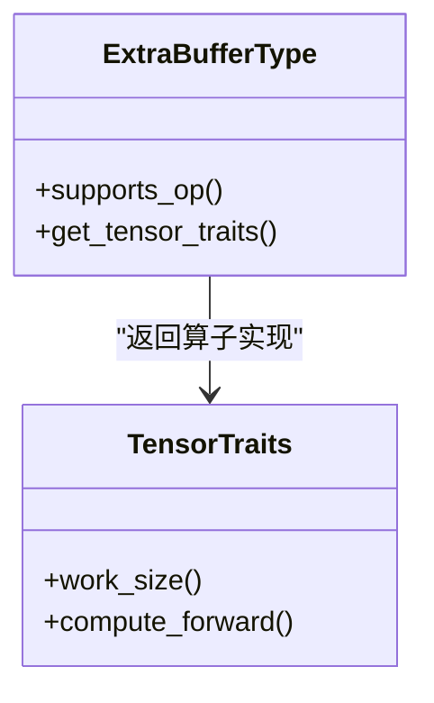

# CPU 后端实现

<cite>
**本文档引用的文件**
- [ggml-cpu.cpp](file://ggml/src/ggml-cpu/ggml-cpu.cpp)
- [quants.c](file://ggml/src/ggml-cpu/quants.c)
- [vec.h](file://ggml/src/ggml-cpu/vec.h)
- [simd-gemm.h](file://ggml/src/ggml-cpu/simd-gemm.h)
- [ggml-cpu.h](file://ggml/include/ggml-cpu.h)
- [simd-mappings.h](file://ggml/src/ggml-cpu/simd-mappings.h)
- [arch-fallback.h](file://ggml/src/ggml-cpu/arch-fallback.h)
- [ops.cpp](file://ggml/src/ggml-cpu/ops.cpp)
- [traits.h](file://ggml/src/ggml-cpu/traits.h)
- [CMakeLists.txt](file://ggml/src/ggml-cpu/CMakeLists.txt)
</cite>

## 目录
1. [引言](#引言)
2. [项目结构](#项目结构)
3. [核心组件](#核心组件)
4. [架构总览](#架构总览)
5. [详细组件分析](#详细组件分析)
6. [依赖关系分析](#依赖关系分析)
7. [性能考虑](#性能考虑)
8. [故障排除指南](#故障排除指南)
9. [结论](#结论)

## 引言
本文件系统性梳理 llama.cpp 中 CPU 后端的实现与优化策略，覆盖多架构支持（x86/x64 的 AVX、AVX2、AVX-512、AMX，ARM/ARM64 的 NEON、SVE、SME、DotProd、I8MM，RISC-V 的 RVV 等），向量化 SIMD 技术、量化算法（Q2_K 至 Q8_0 及 IQ 系列）、内存对齐与缓存优化、编译期优化选项与运行时检测机制，并给出针对不同 CPU 的性能调优建议。

## 项目结构
CPU 后端主要位于 ggml 子模块的 ggml-cpu 目录中，采用“按架构分目录 + 统一接口”的组织方式：
- 后端注册与设备管理：ggml-cpu.cpp
- 向量化算子与 SIMD 映射：vec.h、simd-mappings.h、simd-gemm.h
- 量化与点积实现：quants.c、arch-fallback.h
- 操作实现与线程池：ops.cpp、traits.h
- 编译配置与特性检测：CMakeLists.txt、ggml-cpu.h

**图表来源**
- [ggml-cpu.cpp:1-704](file://ggml/src/ggml-cpu/ggml-cpu.cpp#L1-L704)
- [ops.cpp:1-800](file://ggml/src/ggml-cpu/ops.cpp#L1-L800)
- [vec.h:1-800](file://ggml/src/ggml-cpu/vec.h#L1-L800)
- [simd-mappings.h:1-800](file://ggml/src/ggml-cpu/simd-mappings.h#L1-L800)
- [simd-gemm.h:1-227](file://ggml/src/ggml-cpu/simd-gemm.h#L1-L227)
- [quants.c:1-800](file://ggml/src/ggml-cpu/quants.c#L1-L800)
- [arch-fallback.h:1-350](file://ggml/src/ggml-cpu/arch-fallback.h#L1-L350)
- [traits.h:1-39](file://ggml/src/ggml-cpu/traits.h#L1-L39)
- [CMakeLists.txt:1-719](file://ggml/src/ggml-cpu/CMakeLists.txt#L1-L719)

**章节来源**
- [ggml-cpu.cpp:1-704](file://ggml/src/ggml-cpu/ggml-cpu.cpp#L1-L704)
- [CMakeLists.txt:1-719](file://ggml/src/ggml-cpu/CMakeLists.txt#L1-L719)

## 核心组件
- 后端注册与设备：提供 CPU 后端初始化、设备描述、内存查询、能力查询与特性列表导出。
- 向量与矩阵运算：基于 SIMD 的向量化加法、乘法、点积、缩放、GEMM 等。
- 量化与点积：实现多种精度格式（Q2_K 至 Q8_0、IQ 系列、MXFP4、NVFP4、Ternary）的量化与专用点积路径。
- 线程池与计划：图计算前的计划生成与执行，支持工作缓冲区与中止回调。
- 扩展缓冲区与加速器：支持额外缓冲区类型（如 AMX、KleidiAI、Spacemit 等）与算子级扩展。

**章节来源**
- [ggml-cpu.cpp:97-191](file://ggml/src/ggml-cpu/ggml-cpu.cpp#L97-L191)
- [ggml-cpu.h:125-152](file://ggml/include/ggml-cpu.h#L125-L152)
- [ops.cpp:1-800](file://ggml/src/ggml-cpu/ops.cpp#L1-L800)
- [vec.h:1-800](file://ggml/src/ggml-cpu/vec.h#L1-L800)
- [quants.c:1-800](file://ggml/src/ggml-cpu/quants.c#L1-L800)
- [traits.h:1-39](file://ggml/src/ggml-cpu/traits.h#L1-L39)

## 架构总览
CPU 后端通过统一的 ggml 后端接口暴露，内部以“类型特征 + SIMD 映射 + 架构回退”为核心设计：
- 类型特征表：为每种量化类型提供从浮点转换、向量化点积、向量化步长等信息。
- SIMD 映射：在编译期根据目标架构选择对应的向量指令集（AVX、AVX2、AVX-512、NEON、SVE、RVV 等）。
- 架构回退：当无原生实现时，自动选择通用实现或按架构重定向到对应源文件。
- 特性检测：运行时查询 CPU 能力并导出特性列表，供上层选择最优实现。

**图表来源**
- [ggml-cpu.cpp:217-285](file://ggml/src/ggml-cpu/ggml-cpu.cpp#L217-L285)
- [ggml-cpu.cpp:528-640](file://ggml/src/ggml-cpu/ggml-cpu.cpp#L528-L640)
- [ggml-cpu.h:64-75](file://ggml/include/ggml-cpu.h#L64-L75)

## 详细组件分析

### 多架构 SIMD 映射与向量化
- 编译期宏选择：通过条件编译在不同架构上定义向量类型、步长、加载/存储/FMA 指令等。
- 典型映射：
  - x86/x64：AVX（256 位）、AVX2（256 位）、AVX-512（512 位）、FMA、F16C、BMI2、AVX VNNI、AVX-512 VBMI/VNNI/BF16、AMX Tile/INT8/BF16。
  - ARM/ARM64：NEON（128 位）、SVE（可变长度）、SME（可流式执行）、DotProd、I8MM、FP16 向量、ARM FMA。
  - RISC-V：RVV（向量长度随配置变化）、ZVFH/ZVFBFWMA、XTheadVector、ZFH/ZICBOP/ZIHINTPAUSE 等扩展。
  - 其他：VSX（PowerPC）、WASM SIMD。
- 向量算子：向量加法、乘法、缩放、FMA、点积等均以 SIMD 步长批量处理，减少循环开销。

**图表来源**
- [simd-mappings.h:159-800](file://ggml/src/ggml-cpu/simd-mappings.h#L159-L800)
- [vec.h:42-785](file://ggml/src/ggml-cpu/vec.h#L42-L785)
- [simd-gemm.h:23-111](file://ggml/src/ggml-cpu/simd-gemm.h#L23-L111)

**章节来源**
- [simd-mappings.h:1-800](file://ggml/src/ggml-cpu/simd-mappings.h#L1-L800)
- [vec.h:1-800](file://ggml/src/ggml-cpu/vec.h#L1-L800)
- [simd-gemm.h:1-227](file://ggml/src/ggml-cpu/simd-gemm.h#L1-L227)

### 量化算法与点积实现
- 量化格式覆盖：Q1_0、Q2_K、Q3_K、Q4_0、Q4_1、Q5_0、Q5_1、Q6_K、Q8_0、Q8_K、MXFP4、NVFP4、Ternary（TQ1_0/TQ2_0）、IQ 系列（IQ2_XXS/XS/S/M、IQ3_XXS/S、IQ1_S/M、IQ4_NL/XS）。
- 点积路径：
  - 针对每种格式提供专用 ggml_vec_dot_* 实现，利用块结构与寄存器级 FMA 提升吞吐。
  - 对于通用路径，使用 arch-fallback.h 将函数名重定向到对应架构的实现。
- 量化流程：先将浮点转为中间 f32，再按格式打包；反量化时逐块解包并累加。

**图表来源**
- [quants.c:25-800](file://ggml/src/ggml-cpu/quants.c#L25-L800)
- [arch-fallback.h:7-350](file://ggml/src/ggml-cpu/arch-fallback.h#L7-L350)

**章节来源**
- [quants.c:1-800](file://ggml/src/ggml-cpu/quants.c#L1-L800)
- [arch-fallback.h:1-350](file://ggml/src/ggml-cpu/arch-fallback.h#L1-L350)

### 算子实现与线程化
- 算子实现：dup/add/add_id 等基础算子在 ops.cpp 中实现，支持非量化与量化混合场景。
- 线程化：每个算子通过 params->ith/nth 并行切分数据，按行/块粒度分发，避免锁竞争。
- 工作缓冲：ggml_graph_plan 返回工作缓冲区大小，由调用方分配，用于临时中间结果。

**图表来源**
- [ops.cpp:17-84](file://ggml/src/ggml-cpu/ops.cpp#L17-L84)
- [ops.cpp:526-574](file://ggml/src/ggml-cpu/ops.cpp#L526-L574)

**章节来源**
- [ops.cpp:1-800](file://ggml/src/ggml-cpu/ops.cpp#L1-L800)
- [ggml-cpu.h:64-75](file://ggml/include/ggml-cpu.h#L64-L75)

### 扩展缓冲区与加速器
- 扩展缓冲区类型：支持 AMX、KleidiAI、Spacemit、Repack 等扩展后端缓冲区类型。
- 算子级扩展：通过 traits 接口在 tensor->extra 中注册，按需选择扩展实现。
- 设备支持查询：根据源张量缓冲区类型判断是否支持某算子。

**图表来源**
- [traits.h:18-39](file://ggml/src/ggml-cpu/traits.h#L18-L39)
- [ggml-cpu.cpp:42-95](file://ggml/src/ggml-cpu/ggml-cpu.cpp#L42-L95)

**章节来源**
- [traits.h:1-39](file://ggml/src/ggml-cpu/traits.h#L1-L39)
- [ggml-cpu.cpp:1-704](file://ggml/src/ggml-cpu/ggml-cpu.cpp#L1-L704)

## 依赖关系分析
- 编译期依赖：CMakeLists.txt 根据系统架构与编译选项动态添加架构标志与定义，启用相应 SIMD/扩展。
- 运行时依赖：ggml_cpu_has_* 系列函数在运行时探测 CPU 能力，导出特性列表供上层选择实现。
- 回退策略：arch-fallback.h 在无原生实现时将函数名重定向到通用实现，保证跨平台可用性。

**图表来源**
- [CMakeLists.txt:1-719](file://ggml/src/ggml-cpu/CMakeLists.txt#L1-L719)
- [ggml-cpu.cpp:528-640](file://ggml/src/ggml-cpu/ggml-cpu.cpp#L528-L640)
- [arch-fallback.h:1-350](file://ggml/src/ggml-cpu/arch-fallback.h#L1-L350)

**章节来源**
- [CMakeLists.txt:1-719](file://ggml/src/ggml-cpu/CMakeLists.txt#L1-L719)
- [ggml-cpu.cpp:528-640](file://ggml/src/ggml-cpu/ggml-cpu.cpp#L528-L640)
- [arch-fallback.h:1-350](file://ggml/src/ggml-cpu/arch-fallback.h#L1-L350)

## 性能考虑
- 向量化步长与寄存器利用率：不同架构的 EPR/STEP 决定单次处理元素数量，应尽量使数据长度对齐到步长。
- 点积路径选择：优先使用专用点积实现（如 Q4_K/Q8_K 的专用路径），避免通用路径的分支与转换开销。
- 线程与 NUMA：合理设置线程数与 NUMA 策略（分布式/隔离/镜像），避免跨 NUMA 带来的带宽与延迟问题。
- 缓冲区复用：复用工作缓冲区，减少频繁分配/释放带来的内存碎片与 TLB 压力。
- 编译优化：启用对应架构的 SIMD 指令集与 FMA/BMI2 等扩展，确保编译器内联与向量化生效。

## 故障排除指南
- SIGILL 或崩溃于后端加载：特征检测代码禁用 LTO，避免将架构特定指令内联到探测函数中导致非法指令。
- 线程池相关问题：确保正确创建/暂停/恢复线程池，避免竞态与死锁。
- 量化不匹配：确认输入张量类型与目标量化类型一致，必要时使用 ggml_compute_forward_dup_to_q 或反量化路径。
- 性能异常：检查是否启用了正确的 SIMD/扩展，以及是否选择了合适的点积实现与线程数。

**章节来源**
- [CMakeLists.txt:12-16](file://ggml/src/ggml-cpu/CMakeLists.txt#L12-L16)
- [ggml-cpu.cpp:253-285](file://ggml/src/ggml-cpu/ggml-cpu.cpp#L253-L285)
- [ops.cpp:269-323](file://ggml/src/ggml-cpu/ops.cpp#L269-L323)

## 结论
llama.cpp 的 CPU 后端通过“类型特征 + SIMD 映射 + 架构回退”的设计，在多架构上实现了高性能、可移植的推理执行。结合编译期优化与运行时特性检测，能够在不同硬件平台上自动选择最优实现路径。针对特定 CPU 的调优建议包括：启用对应 SIMD/扩展、合理设置线程数与 NUMA 策略、使用专用量化点积路径、以及复用工作缓冲区以降低内存压力。