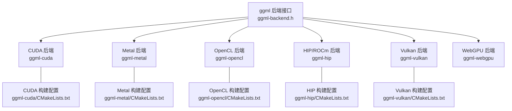
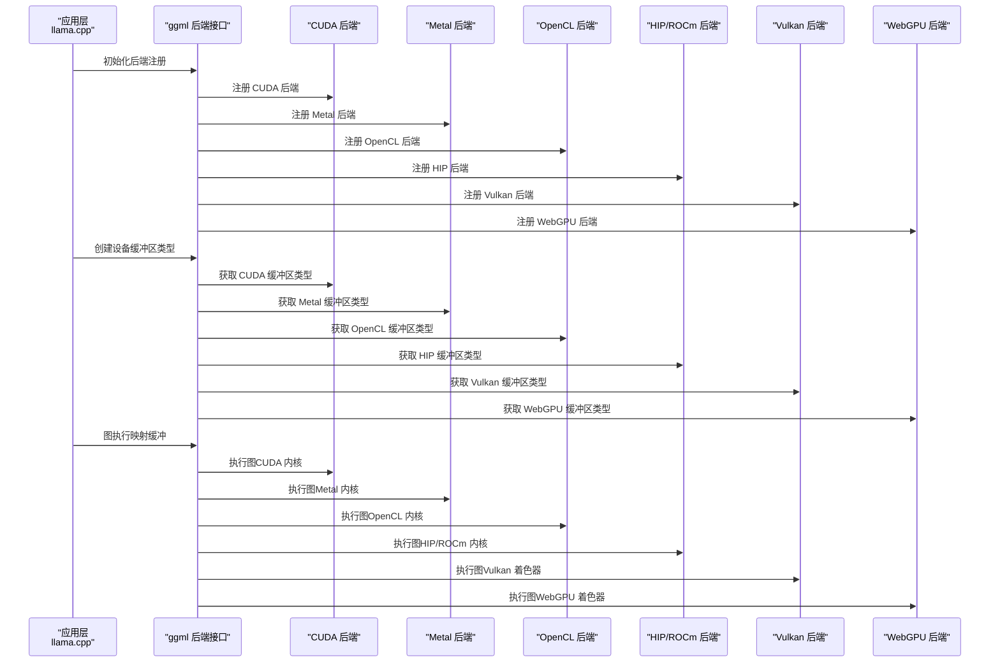
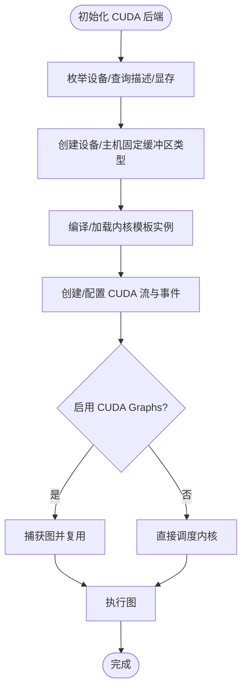
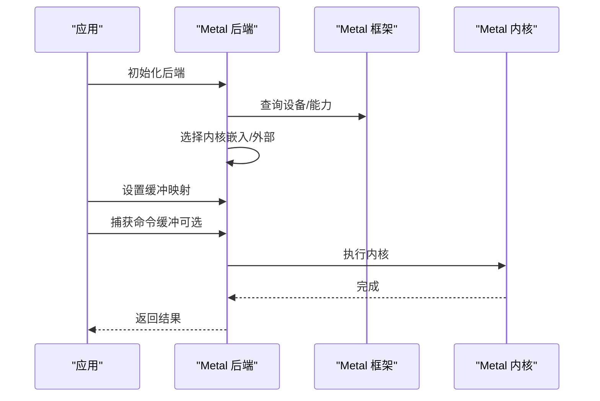
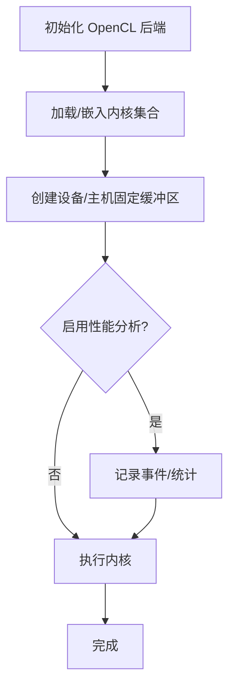
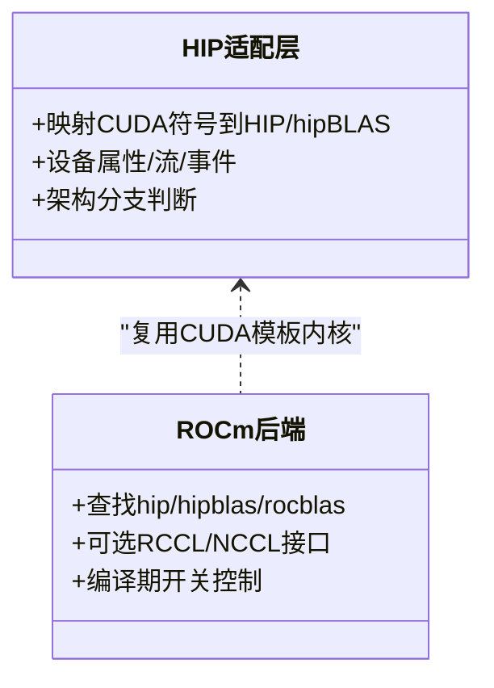
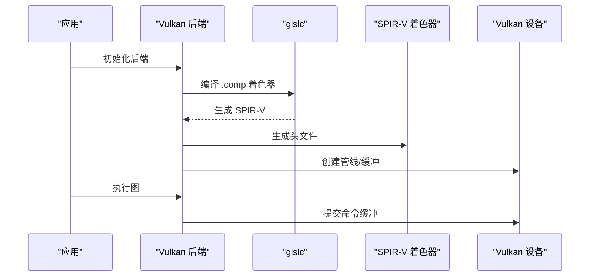
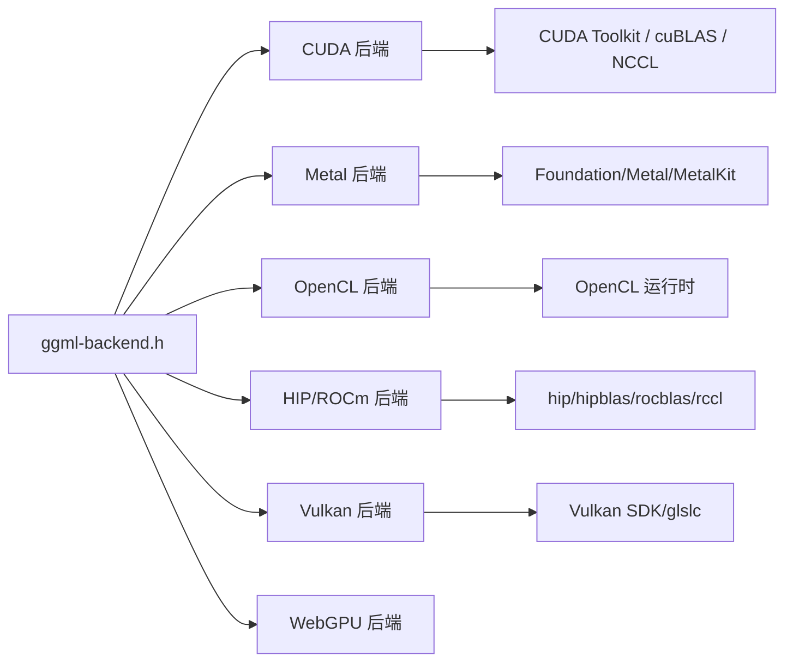

# GPU 后端实现

<cite>
**本文引用的文件**
- [ggml-cuda.h](file://ggml/include/ggml-cuda.h)
- [ggml-metal.h](file://ggml/include/ggml-metal.h)
- [ggml-opencl.h](file://ggml/include/ggml-opencl.h)
- [ggml-vulkan.h](file://ggml/include/ggml-vulkan.h)
- [ggml-webgpu.h](file://ggml/include/ggml-webgpu.h)
- [ggml-cuda CMakeLists](file://ggml/src/ggml-cuda/CMakeLists.txt)
- [ggml-metal CMakeLists](file://ggml/src/ggml-metal/CMakeLists.txt)
- [ggml-opencl CMakeLists](file://ggml/src/ggml-opencl/CMakeLists.txt)
- [ggml-vulkan CMakeLists](file://ggml/src/ggml-vulkan/CMakeLists.txt)
- [ggml-hip CMakeLists](file://ggml/src/ggml-hip/CMakeLists.txt)
- [hip.h](file://ggml/src/ggml-cuda/vendors/hip.h)
- [构建文档](file://docs/build.md)
- [CI 脚本](file://ci/run.sh)
- [VirtGPU 文档](file://docs/backend/VirtGPU.md)
</cite>

## 目录
1. [简介](#简介)
2. [项目结构](#项目结构)
3. [核心组件](#核心组件)
4. [架构总览](#架构总览)
5. [详细组件分析](#详细组件分析)
6. [依赖关系分析](#依赖关系分析)
7. [性能考量](#性能考量)
8. [故障排查指南](#故障排查指南)
9. [结论](#结论)
10. [附录](#附录)

## 简介
本文件系统化梳理 llama.cpp 在 ggml 后端框架下的多 GPU 后端实现与特性，覆盖以下内容：
- CUDA 后端：GPU 加速、内核模板实例化、内存与流管理、批处理与图执行、可选 NCCL 多卡通信
- Metal 后端：Apple Silicon（M 系列）优化路径、内核嵌入与编译流程、设备族检查与捕获调试
- OpenCL 后端：跨平台兼容、内核嵌入与动态加载、针对 Adreno 的矩阵乘优化
- HIP 后端：对 AMD GPU 的适配与 ROCm 集成、架构分支（GCN/RDNA/CDNA）、可选 rccl/NCCL 接口
- Vulkan 后端：现代图形 API 利用、着色器生成与扩展探测、内存与调试开关
- WebGPU 后端：现代浏览器与 Web 平台的 GPU 计算入口
- 性能对比、适用场景与配置选项：基于构建脚本与后端头文件的编译期控制项
- GPU 内存管理、流处理与异步执行策略：从后端接口到内核实现的关键点

## 项目结构
llama.cpp 将 GPU 后端以独立子模块组织在 ggml 子树中，每个后端通过独立 CMake 目标提供统一的 ggml 后端注册与缓冲区类型接口。

图表来源
- [ggml-cuda CMakeLists:1-269](file://ggml/src/ggml-cuda/CMakeLists.txt#L1-L269)
- [ggml-metal CMakeLists:1-125](file://ggml/src/ggml-metal/CMakeLists.txt#L1-L125)
- [ggml-opencl CMakeLists:1-174](file://ggml/src/ggml-opencl/CMakeLists.txt#L1-L174)
- [ggml-vulkan CMakeLists:1-221](file://ggml/src/ggml-vulkan/CMakeLists.txt#L1-L221)
- [ggml-hip CMakeLists:1-158](file://ggml/src/ggml-hip/CMakeLists.txt#L1-L158)

章节来源
- [ggml-cuda.h:1-51](file://ggml/include/ggml-cuda.h#L1-L51)
- [ggml-metal.h:1-62](file://ggml/include/ggml-metal.h#L1-L62)
- [ggml-opencl.h:1-27](file://ggml/include/ggml-opencl.h#L1-L27)
- [ggml-vulkan.h:1-30](file://ggml/include/ggml-vulkan.h#L1-L30)
- [ggml-webgpu.h:1-20](file://ggml/include/ggml-webgpu.h#L1-L20)

## 核心组件
- 统一后端接口：所有后端均通过 ggml_backend_t 暴露初始化、缓冲区类型、设备查询等能力；注册为后端工厂由 ggml_backend_reg_t 提供
- 设备与内存：后端提供设备计数、描述、显存信息；缓冲区类型用于分配设备侧或主机固定内存
- 批处理与图执行：后端支持图计算与缓冲映射，配合 ggml 图执行管线
- 多卡与通信：CUDA 可选 NCCL；HIP 可选 RCCL（与 NCCL 接口一致）

章节来源
- [ggml-cuda.h:22-46](file://ggml/include/ggml-cuda.h#L22-L46)
- [ggml-metal.h:38-57](file://ggml/include/ggml-metal.h#L38-L57)
- [ggml-opencl.h:11-20](file://ggml/include/ggml-opencl.h#L11-L20)
- [ggml-vulkan.h:13-25](file://ggml/include/ggml-vulkan.h#L13-L25)
- [ggml-webgpu.h:12-15](file://ggml/include/ggml-webgpu.h#L12-L15)

## 架构总览
下图展示 llama.cpp 通过 ggml 后端接口选择不同 GPU 后端，并在运行时进行缓冲映射与图执行。

图表来源
- [ggml-cuda.h:22-46](file://ggml/include/ggml-cuda.h#L22-L46)
- [ggml-metal.h:38-57](file://ggml/include/ggml-metal.h#L38-L57)
- [ggml-opencl.h:11-20](file://ggml/include/ggml-opencl.h#L11-L20)
- [ggml-vulkan.h:13-25](file://ggml/include/ggml-vulkan.h#L13-L25)
- [ggml-webgpu.h:12-15](file://ggml/include/ggml-webgpu.h#L12-L15)

## 详细组件分析

### CUDA 后端
- 功能与接口
  - 初始化与检测：提供初始化函数、后端类型判断、设备枚举与描述、显存查询
  - 缓冲区类型：设备缓冲区、主机固定缓冲区、多设备张量切分缓冲区类型
  - 可选功能：跨设备 allreduce、NCCL 支持（编译期开启）
- 内核与模板实例化
  - 通过 CMake 自动收集模板实例文件，按量化/注意力/矩阵乘等类别生成大量内核实例
  - 支持编译期开关：强制 MMQ、强制 cuBLAS、禁用 Flash-Attn、禁用 Peer Copy、启用 CUDA Graphs 等
- 内存与流
  - 通过 CUDA Runtime/Driver API 进行内存分配、拷贝、事件与流管理
  - 支持 VMM（虚拟内存管理）可选关闭
- 批处理与图执行
  - 支持 CUDA Graphs（编译期开关），提升重复图执行吞吐
  - 支持多设备张量切分，按行切分矩阵跨设备并行
- NCCL 与多卡
  - 可选 NCCL，用于多卡 allreduce 与分布式训练/推理

图表来源
- [ggml-cuda.h:22-46](file://ggml/include/ggml-cuda.h#L22-L46)
- [ggml-cuda CMakeLists:101-129](file://ggml/src/ggml-cuda/CMakeLists.txt#L101-L129)
- [ggml-cuda CMakeLists:133-156](file://ggml/src/ggml-cuda/CMakeLists.txt#L133-L156)
- [ggml-cuda CMakeLists:184-192](file://ggml/src/ggml-cuda/CMakeLists.txt#L184-L192)

章节来源
- [ggml-cuda.h:10-46](file://ggml/include/ggml-cuda.h#L10-L46)
- [ggml-cuda CMakeLists:8-98](file://ggml/src/ggml-cuda/CMakeLists.txt#L8-L98)
- [ggml-cuda CMakeLists:126-176](file://ggml/src/ggml-cuda/CMakeLists.txt#L126-L176)
- [ggml-cuda CMakeLists:184-192](file://ggml/src/ggml-cuda/CMakeLists.txt#L184-L192)

### Metal 后端（Apple Silicon）
- 功能与接口
  - 初始化与检测：后端初始化、类型判断、设备族检查、捕获调试命令缓冲
  - 回调与同步：可设置中止回调，便于中断长任务
  - 注册：通过后端注册表暴露工厂
- 内核与编译
  - 支持内核嵌入（可选）或外部 .metallib 文件
  - 可选禁用优化（NDEBUG）与调试模式（Shader Debug）
  - 支持 macOS 最低版本与标准版本编译参数
- Apple Silicon 优化
  - 通过设备族检查与 Metal 特性集表进行能力判定
  - 嵌入式 Metal 库减少运行时依赖

图表来源
- [ggml-metal.h:38-57](file://ggml/include/ggml-metal.h#L38-L57)
- [ggml-metal CMakeLists:22-108](file://ggml/src/ggml-metal/CMakeLists.txt#L22-L108)

章节来源
- [ggml-metal.h:1-62](file://ggml/include/ggml-metal.h#L1-L62)
- [ggml-metal CMakeLists:1-125](file://ggml/src/ggml-metal/CMakeLists.txt#L1-L125)

### OpenCL 后端
- 功能与接口
  - 初始化与检测：后端初始化、类型判断、缓冲区类型（设备/主机固定）
  - 注册：后端注册表
- 内核与兼容性
  - 内核集合覆盖常见算子（加减乘除、归约、注意力、卷积等）
  - 支持内核嵌入（可选）与动态加载
  - 针对 Adreno GPU 的矩阵乘内核优化开关
  - 支持 SOA_Q、目标版本等编译定义
- 跨平台
  - 通过 OpenCL 运行时在多种平台与设备上工作

图表来源
- [ggml-opencl.h:11-20](file://ggml/include/ggml-opencl.h#L11-L20)
- [ggml-opencl CMakeLists:12-54](file://ggml/src/ggml-opencl/CMakeLists.txt#L12-L54)
- [ggml-opencl CMakeLists:56-169](file://ggml/src/ggml-opencl/CMakeLists.txt#L56-L169)

章节来源
- [ggml-opencl.h:1-27](file://ggml/include/ggml-opencl.h#L1-L27)
- [ggml-opencl CMakeLists:1-174](file://ggml/src/ggml-opencl/CMakeLists.txt#L1-L174)

### HIP/ROCm 后端（AMD GPU）
- 适配与接口
  - 通过 hip.h 将 CUDA 符号映射到 HIP/hipBLAS，保持统一 API
  - 支持 NCCL/RCCL 接口一致性（可选）
- 架构分支与优化
  - 自动识别 GCN（gfx900/gfx906）、RDNA（gfx1010/gfx103x、gfx11xx）、CDNA（gfx908/90a/942/950）等家族
  - 可选使用 rocWMMA 以增强 RDNA3+/CDNA 的 Flash-Attn 性能
- 构建与链接
  - CMake 查找 hip/hipblas/rocblas，支持静态/共享库模式
  - 编译期开关：强制 MMQ、强制 cuBLAS、禁用 FA、禁用 Peer Copy、禁用 VMM、启用 HIP Graphs 等

图表来源
- [hip.h:1-303](file://ggml/src/ggml-cuda/vendors/hip.h#L1-L303)
- [ggml-hip CMakeLists:46-158](file://ggml/src/ggml-hip/CMakeLists.txt#L46-L158)

章节来源
- [hip.h:1-303](file://ggml/src/ggml-cuda/vendors/hip.h#L1-L303)
- [ggml-hip CMakeLists:1-158](file://ggml/src/ggml-hip/CMakeLists.txt#L1-L158)
- [构建文档:351-394](file://docs/build.md#L351-L394)

### Vulkan 后端
- 功能与接口
  - 初始化与检测：设备计数、描述、显存查询
  - 缓冲区类型：设备/主机固定缓冲区
  - 注册：后端注册表
- 着色器与扩展
  - 使用 glslc 将 .comp 着色器编译为 SPIR-V，并自动生成头文件
  - 自动探测扩展支持（协作矩阵、整数点积、bfloat16 等）
- 调试与验证
  - 支持结果校验、调试、内存调试、验证层、测试运行等编译期开关

图表来源
- [ggml-vulkan.h:13-25](file://ggml/include/ggml-vulkan.h#L13-L25)
- [ggml-vulkan CMakeLists:28-87](file://ggml/src/ggml-vulkan/CMakeLists.txt#L28-L87)
- [ggml-vulkan CMakeLists:149-216](file://ggml/src/ggml-vulkan/CMakeLists.txt#L149-L216)

章节来源
- [ggml-vulkan.h:1-30](file://ggml/include/ggml-vulkan.h#L1-L30)
- [ggml-vulkan CMakeLists:1-221](file://ggml/src/ggml-vulkan/CMakeLists.txt#L1-L221)

### WebGPU 后端
- 功能与接口
  - 初始化与注册：提供后端初始化与注册表
- 现代 Web 平台
  - 面向浏览器与 WebGPU 运行时的 GPU 计算入口

章节来源
- [ggml-webgpu.h:1-20](file://ggml/include/ggml-webgpu.h#L1-L20)

### VirtGPU 后端（远程/虚拟机）
- 架构概述
  - 前端（guest）与后端（host）分离，通过 virtio-gpu 与 VirglRenderer APIR 协议通信
  - 支持零拷贝共享内存页与命令序列化
- 支持与限制
  - macOS 支持 Metal 后端；Linux 正在开发中
  - 支持动态加载主机侧后端库（CPU/CUDA/Metal 等）

章节来源
- [VirtGPU 文档:1-137](file://docs/backend/VirtGPU.md#L1-L137)

## 依赖关系分析
- 统一接口依赖：各后端均依赖 ggml-backend.h 提供的后端注册与缓冲区抽象
- 外部库依赖：
  - CUDA：CUDAToolkit、cuBLAS、可选 NCCL
  - Metal：Foundation、Metal、MetalKit（系统框架）
  - OpenCL：OpenCL 运行时
  - HIP/ROCm：hip、hipblas、rocblas、可选 rccl
  - Vulkan：Vulkan SDK（含 glslc）、可选扩展支持
- 构建期控制：
  - 各后端 CMakeLists 定义了丰富的编译期开关，用于选择优化路径、启用/禁用特性、控制调试级别

图表来源
- [ggml-cuda CMakeLists:158-182](file://ggml/src/ggml-cuda/CMakeLists.txt#L158-L182)
- [ggml-metal CMakeLists:1-20](file://ggml/src/ggml-metal/CMakeLists.txt#L1-L20)
- [ggml-opencl CMakeLists:1-9](file://ggml/src/ggml-opencl/CMakeLists.txt#L1-L9)
- [ggml-hip CMakeLists:46-52](file://ggml/src/ggml-hip/CMakeLists.txt#L46-L52)
- [ggml-vulkan CMakeLists:9-89](file://ggml/src/ggml-vulkan/CMakeLists.txt#L9-L89)

章节来源
- [ggml-cuda CMakeLists:158-182](file://ggml/src/ggml-cuda/CMakeLists.txt#L158-L182)
- [ggml-metal CMakeLists:1-20](file://ggml/src/ggml-metal/CMakeLists.txt#L1-L20)
- [ggml-opencl CMakeLists:1-9](file://ggml/src/ggml-opencl/CMakeLists.txt#L1-L9)
- [ggml-hip CMakeLists:46-52](file://ggml/src/ggml-hip/CMakeLists.txt#L46-L52)
- [ggml-vulkan CMakeLists:9-89](file://ggml/src/ggml-vulkan/CMakeLists.txt#L9-L89)

## 性能考量
- CUDA
  - 架构覆盖：根据工具链版本自动选择虚拟/实架构，支持 Maxine/Turing/Ampere/Blackwell 等
  - 内核模板：按量化/注意力/矩阵乘实例化，覆盖主流精度组合
  - 优化开关：可强制 MMQ、强制 cuBLAS、禁用 FA、禁用 Peer Copy、启用 Graphs、压缩模式等
  - 多卡：可选 NCCL，适合分布式场景
- Metal
  - 内核嵌入减少部署复杂度；可选禁用优化与调试模式
  - Apple Silicon 设备族检查确保正确能力判定
- OpenCL
  - 内核集合广泛；可嵌入内核或外部加载；Adreno 优化可选
- HIP/ROCm
  - 架构分支自动识别；可选 rocWMMA 提升 RDNA3+/CDNA 性能；可选 rccl
- Vulkan
  - 扩展探测驱动特性利用；着色器生成与缓存；调试/验证开关
- WebGPU
  - 面向现代 Web 平台的轻量入口

章节来源
- [ggml-cuda CMakeLists:8-98](file://ggml/src/ggml-cuda/CMakeLists.txt#L8-L98)
- [ggml-cuda CMakeLists:114-156](file://ggml/src/ggml-cuda/CMakeLists.txt#L114-L156)
- [ggml-metal CMakeLists:22-108](file://ggml/src/ggml-metal/CMakeLists.txt#L22-L108)
- [ggml-opencl CMakeLists:12-32](file://ggml/src/ggml-opencl/CMakeLists.txt#L12-L32)
- [ggml-hip CMakeLists:109-135](file://ggml/src/ggml-hip/CMakeLists.txt#L109-L135)
- [ggml-vulkan CMakeLists:28-87](file://ggml/src/ggml-vulkan/CMakeLists.txt#L28-L87)

## 故障排查指南
- CUDA
  - 架构选择：若使用 native 架构且无 GPU，可能生成无效架构；CMake 已做替换逻辑
  - VMM 关闭：可通过编译期宏禁用 VMM，避免驱动库链接问题
  - NCCL：未找到时会提示多卡性能欠佳
- Metal
  - 内核嵌入：如需禁用 fast math 或内联以通过测试，可启用 Shader Debug 模式
  - 最低系统版本：可通过编译标志指定最低 macOS 版本
- OpenCL
  - 内核嵌入：Python 脚本生成头文件；未嵌入时需随包分发 .cl 文件
  - Adreno 优化：需显式开启相关开关
- HIP/ROCm
  - ROCm 版本：要求至少 6.1；HIP 路径与设备库路径需正确配置
  - 静态链接：不支持静态链接
- Vulkan
  - 扩展支持：glslc 会报告不支持的扩展；建议在支持的环境中构建
  - 调试：可启用调试/验证/内存调试等开关
- WebGPU
  - 平台支持：确保运行环境具备 WebGPU 支持

章节来源
- [ggml-cuda CMakeLists:94-98](file://ggml/src/ggml-cuda/CMakeLists.txt#L94-L98)
- [ggml-cuda CMakeLists:145-156](file://ggml/src/ggml-cuda/CMakeLists.txt#L145-L156)
- [ggml-cuda CMakeLists:184-192](file://ggml/src/ggml-cuda/CMakeLists.txt#L184-L192)
- [ggml-metal CMakeLists:65-80](file://ggml/src/ggml-metal/CMakeLists.txt#L65-L80)
- [ggml-metal CMakeLists:82-86](file://ggml/src/ggml-metal/CMakeLists.txt#L82-L86)
- [ggml-opencl CMakeLists:25-54](file://ggml/src/ggml-opencl/CMakeLists.txt#L25-L54)
- [ggml-hip CMakeLists:1-15](file://ggml/src/ggml-hip/CMakeLists.txt#L1-L15)
- [ggml-hip CMakeLists:149-151](file://ggml/src/ggml-hip/CMakeLists.txt#L149-L151)
- [ggml-vulkan CMakeLists:34-51](file://ggml/src/ggml-vulkan/CMakeLists.txt#L34-L51)
- [ggml-vulkan CMakeLists:102-121](file://ggml/src/ggml-vulkan/CMakeLists.txt#L102-L121)

## 结论
llama.cpp 的 GPU 后端通过统一的 ggml 后端接口屏蔽底层差异，结合各平台原生 API 实现高性能推理。CUDA 与 HIP/ROCm 在桌面与服务器 GPU 场景具备成熟生态与优化；Metal 在 Apple Silicon 上提供原生体验；OpenCL/Vulkan/WebGPU 覆盖跨平台与现代图形 API 场景。通过丰富的编译期开关与模板实例化，可在不同硬件与精度需求下取得良好性能与可移植性。

## 附录
- 适用场景与配置要点
  - CUDA：桌面/服务器 NVIDIA GPU，追求最高吞吐与广泛内核覆盖；可选 NCCL 与 Graphs
  - Metal：macOS/iOS，追求原生性能与低延迟；注意设备族与内核嵌入
  - OpenCL：跨平台通用设备；可嵌入内核或外部加载；Adreno 优化可选
  - HIP/ROCm：AMD GPU，支持 RDNA/CDNA 架构；可选 rocWMMA 与 rccl
  - Vulkan：现代桌面/嵌入式平台；扩展探测与着色器生成
  - WebGPU：Web 平台；轻量入口
- 关键配置选项（示例）
  - CUDA：GGML_CUDA_GRAPHS、GGML_CUDA_FORCE_MMQ、GGML_CUDA_FORCE_CUBLAS、GGML_CUDA_NO_VMM、GGML_CUDA_FA、GGML_CUDA_NCCL
  - Metal：GGML_METAL_EMBED_LIBRARY、GGML_METAL_SHADER_DEBUG、GGML_METAL_NDEBUG、GGML_METAL_MACOSX_VERSION_MIN
  - OpenCL：GGML_OPENCL_EMBED_KERNELS、GGML_OPENCL_USE_ADRENO_KERNELS、GGML_OPENCL_TARGET_VERSION
  - HIP/ROCm：GGML_HIP_GRAPHS、GGML_HIP_NO_VMM、GGML_HIP_ROCWMMA_FATTN、GGML_HIP_RCCL、GPU_TARGETS
  - Vulkan：GGML_VULKAN_CHECK_RESULTS、GGML_VULKAN_DEBUG、GGML_VULKAN_MEMORY_DEBUG、GGML_VULKAN_VALIDATE、GGML_VULKAN_SHADER_DEBUG_INFO
  - WebGPU：后端注册与初始化

章节来源
- [ggml-cuda.h:10-19](file://ggml/include/ggml-cuda.h#L10-L19)
- [ggml-metal.h:42-57](file://ggml/include/ggml-metal.h#L42-L57)
- [ggml-opencl.h:11-20](file://ggml/include/ggml-opencl.h#L11-L20)
- [ggml-vulkan.h:10-25](file://ggml/include/ggml-vulkan.h#L10-L25)
- [ggml-webgpu.h:10-15](file://ggml/include/ggml-webgpu.h#L10-L15)
- [ggml-cuda CMakeLists:133-156](file://ggml/src/ggml-cuda/CMakeLists.txt#L133-L156)
- [ggml-metal CMakeLists:22-24](file://ggml/src/ggml-metal/CMakeLists.txt#L22-L24)
- [ggml-opencl CMakeLists:12-23](file://ggml/src/ggml-opencl/CMakeLists.txt#L12-L23)
- [ggml-hip CMakeLists:109-135](file://ggml/src/ggml-hip/CMakeLists.txt#L109-L135)
- [ggml-vulkan CMakeLists:98-121](file://ggml/src/ggml-vulkan/CMakeLists.txt#L98-L121)
- [CI 脚本:114-130](file://ci/run.sh#L114-L130)
- [构建文档:351-394](file://docs/build.md#L351-L394)