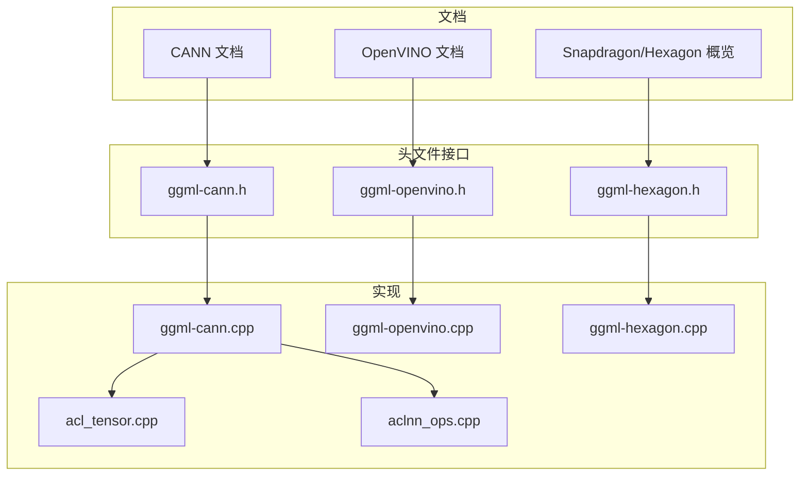
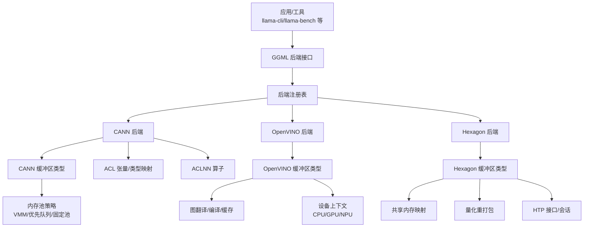
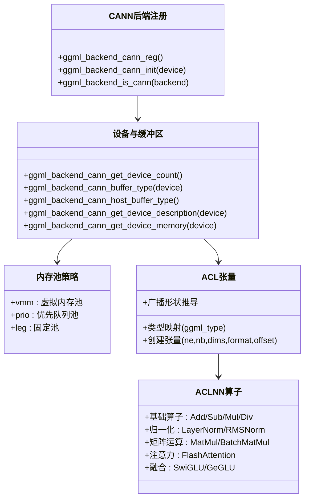
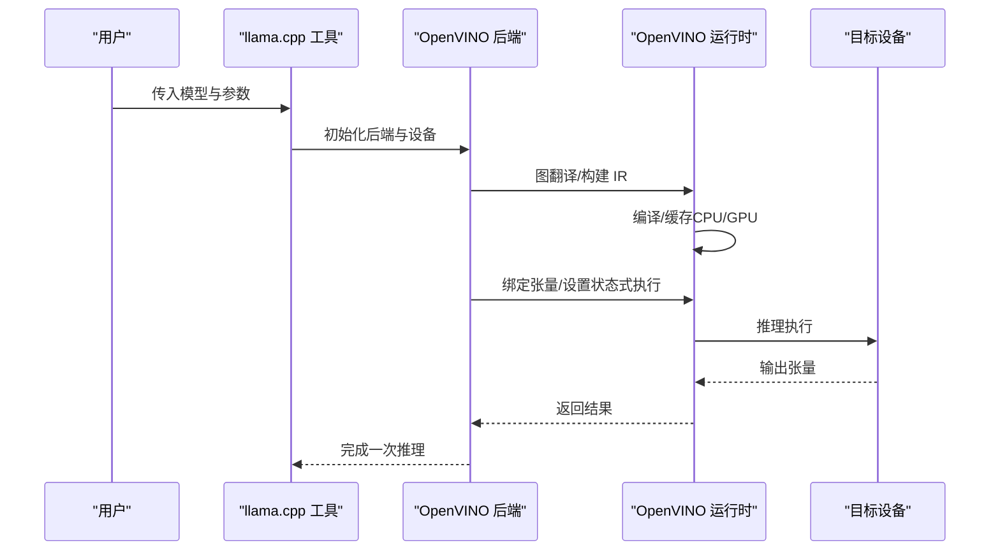
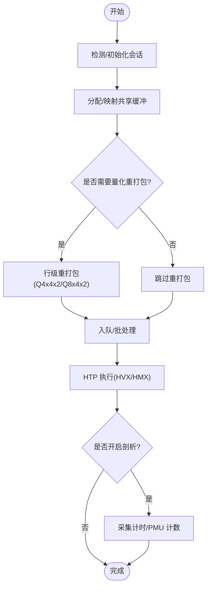
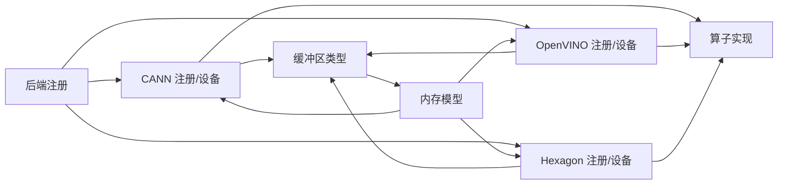

# 专用加速器

<cite>
**本文引用的文件**
- [CANN 文档](file://docs/backend/CANN.md)
- [OpenVINO 文档](file://docs/backend/OPENVINO.md)
- [Snapdragon/Hexagon 概览](file://docs/backend/snapdragon/README.md)
- [CANN 头文件](file://ggml/include/ggml-cann.h)
- [OpenVINO 头文件](file://ggml/include/ggml-openvino.h)
- [Hexagon 头文件](file://ggml/include/ggml-hexagon.h)
- [CANN 后端实现](file://ggml/src/ggml-cann/ggml-cann.cpp)
- [OpenVINO 后端实现](file://ggml/src/ggml-openvino/ggml-openvino.cpp)
- [Hexagon 后端实现](file://ggml/src/ggml-hexagon/ggml-hexagon.cpp)
- [ACL 张量与类型映射](file://ggml/src/ggml-cann/acl_tensor.cpp)
- [ACLNN 算子实现](file://ggml/src/ggml-cann/aclnn_ops.cpp)
</cite>

## 目录
1. [简介](#简介)
2. [项目结构](#项目结构)
3. [核心组件](#核心组件)
4. [架构总览](#架构总览)
5. [详细组件分析](#详细组件分析)
6. [依赖关系分析](#依赖关系分析)
7. [性能考量](#性能考量)
8. [故障排查指南](#故障排查指南)
9. [结论](#结论)
10. [附录](#附录)

## 简介
本文件系统性梳理 llama.cpp 在专用硬件加速器上的支持现状与实现细节，重点覆盖以下后端：
- 华为昇腾（CANN）：基于 ACL 张量与 ACLNN 算子的 NPU 加速路径，含内存池策略、图执行与算子融合。
- Intel OpenVINO：将 GGML 计算图翻译为 OpenVINO IR 并在 CPU/GPU/NPU 上执行，强调设备选择、量化适配与运行时配置。
- Qualcomm Hexagon：通过 HTP 接口在 DSP 上执行张量与算子，包含重打包（repack）机制与多会话并行。
- 寒武纪（Cambricon）：以 CANN 后端统一呈现，文档与实现均指向 CANN。

此外，文档还提供硬件平台选择建议、部署注意事项、编程模型与调试方法，帮助用户在不同场景下做出合理决策。

## 项目结构
llama.cpp 将后端抽象为独立模块，并通过公共接口与上层推理管线对接。关键目录与文件如下：
- 文档层：docs/backend 下分别维护各后端使用说明与特性清单
- 头文件层：ggml/include 下声明后端注册、缓冲区类型与设备接口
- 实现层：ggml/src 下按后端划分目录，包含缓冲区管理、张量与算子实现
- 工程集成：CMake 构建选项控制后端启用与编译参数

图表来源
- [CANN 文档](file://docs/backend/CANN.md)
- [OpenVINO 文档](file://docs/backend/OPENVINO.md)
- [Snapdragon/Hexagon 概览](file://docs/backend/snapdragon/README.md)
- [CANN 头文件](file://ggml/include/ggml-cann.h)
- [OpenVINO 头文件](file://ggml/include/ggml-openvino.h)
- [Hexagon 头文件](file://ggml/include/ggml-hexagon.h)
- [CANN 后端实现](file://ggml/src/ggml-cann/ggml-cann.cpp)
- [OpenVINO 后端实现](file://ggml/src/ggml-openvino/ggml-openvino.cpp)
- [Hexagon 后端实现](file://ggml/src/ggml-hexagon/ggml-hexagon.cpp)
- [ACL 张量与类型映射](file://ggml/src/ggml-cann/acl_tensor.cpp)
- [ACLNN 算子实现](file://ggml/src/ggml-cann/aclnn_ops.cpp)

章节来源
- [CANN 文档](file://docs/backend/CANN.md)
- [OpenVINO 文档](file://docs/backend/OPENVINO.md)
- [Snapdragon/Hexagon 概览](file://docs/backend/snapdragon/README.md)
- [CANN 头文件](file://ggml/include/ggml-cann.h)
- [OpenVINO 头文件](file://ggml/include/ggml-openvino.h)
- [Hexagon 头文件](file://ggml/include/ggml-hexagon.h)

## 核心组件
- CANN 后端
  - 设备与缓冲区：设备枚举、描述、内存查询；主机/设备缓冲区类型；多策略内存池（VMM、优先队列、固定池）
  - 张量与算子：ACL 张量创建与广播、ACLNN 算子封装（加减乘除、归一化、矩阵乘、注意力等）
  - 图执行与融合：可选 ACL Graph 执行、图缓存容量、预填充阶段图执行、算子融合开关
- OpenVINO 后端
  - 设备与缓冲区：CPU/GPU/NPU 设备抽象；主机/远程缓冲区；权重常量节点与 KV 缓存张量绑定
  - 运行时：图翻译、编译与缓存；状态式执行（stateful）；调试与性能分析开关
- Hexagon 后端
  - 会话与缓冲：多设备/多会话；共享内存映射；主机缓冲开关
  - 量化重打包：Q4x4x2/Q8x4x2 行级重打包；HVX/HMX 执行路径；PMU 性能计数
  - 调试：详细日志、阶段过滤、性能剖析

章节来源
- [CANN 头文件](file://ggml/include/ggml-cann.h)
- [OpenVINO 头文件](file://ggml/include/ggml-openvino.h)
- [Hexagon 头文件](file://ggml/include/ggml-hexagon.h)
- [CANN 后端实现](file://ggml/src/ggml-cann/ggml-cann.cpp)
- [OpenVINO 后端实现](file://ggml/src/ggml-openvino/ggml-openvino.cpp)
- [Hexagon 后端实现](file://ggml/src/ggml-hexagon/ggml-hexagon.cpp)

## 架构总览
llama.cpp 的后端采用“后端注册 + 设备缓冲区类型 + 具体算子实现”的分层设计。上层通过通用接口调度，底层根据目标硬件选择对应实现。

图表来源
- [CANN 头文件](file://ggml/include/ggml-cann.h)
- [OpenVINO 头文件](file://ggml/include/ggml-openvino.h)
- [Hexagon 头文件](file://ggml/include/ggml-hexagon.h)
- [CANN 后端实现](file://ggml/src/ggml-cann/ggml-cann.cpp)
- [OpenVINO 后端实现](file://ggml/src/ggml-openvino/ggml-openvino.cpp)
- [Hexagon 后端实现](file://ggml/src/ggml-hexagon/ggml-hexagon.cpp)

## 详细组件分析

### CANN 后端：ACL 张量与算子实现
- 设备与缓冲区
  - 设备枚举与描述：查询设备数量、SoC 名称、HBM 内存大小
  - 主机/设备缓冲区类型：区分 host/device buffer type
  - 内存池策略：支持 vmm（虚拟内存池，回退到 legacy）、优先队列池、固定池；可通过环境变量控制
- 张量与广播
  - 类型映射：将 GGML 数据类型映射到 ACL 数据类型
  - 张量创建：支持常规/广播形状、步长与偏移；自动反转维度顺序以适配 ACL 存储布局
- 算子实现要点
  - 基础算子：加减乘除、缩放、裁剪、归一化、矩阵乘、注意力等
  - 融合与优化：SwiGLU/GeGLU 融合、算子融合开关、ACL Graph 执行与缓存
  - 预填充阶段：可启用图执行以降低首 token 延迟
- 运行时环境变量
  - 内存池：GGML_CANN_MEM_POOL、GGML_CANN_DISABLE_BUF_POOL_CLEAN
  - 权重量格式：GGML_CANN_WEIGHT_NZ（ND->NZ）
  - 图执行：GGML_CANN_ACL_GRAPH、GGML_CANN_GRAPH_CACHE_CAPACITY、GGML_CANN_PREFILL_USE_GRAPH
  - 算子融合：GGML_CANN_OPERATOR_FUSION

图表来源
- [CANN 头文件](file://ggml/include/ggml-cann.h)
- [CANN 后端实现](file://ggml/src/ggml-cann/ggml-cann.cpp)
- [ACL 张量与类型映射](file://ggml/src/ggml-cann/acl_tensor.cpp)
- [ACLNN 算子实现](file://ggml/src/ggml-cann/aclnn_ops.cpp)

章节来源
- [CANN 文档](file://docs/backend/CANN.md)
- [CANN 头文件](file://ggml/include/ggml-cann.h)
- [CANN 后端实现](file://ggml/src/ggml-cann/ggml-cann.cpp)
- [ACL 张量与类型映射](file://ggml/src/ggml-cann/acl_tensor.cpp)
- [ACLNN 算子实现](file://ggml/src/ggml-cann/aclnn_ops.cpp)

### OpenVINO 后端：神经形态计算优化与设备适配
- 设备与缓冲区
  - 设备抽象：CPU/GPU/NPU；主机/远程缓冲区；设备属性查询
  - 权重量处理：权重张量预构建为常量节点，避免拷贝；量化权重抽取与 requant 化
  - KV 缓存：GPU 使用远程张量（USM），NPU 侧内存受限，建议小上下文
- 运行时与优化
  - 图翻译：遍历 GGML 图，识别输入/输出/权重/KV 缓存，构建 OpenVINO 模型
  - 编译与缓存：首次推理触发编译，后续复用缓存；NPU 不支持缓存
  - 状态式执行：启用后可内建 KV 缓存，提升 CPU/GPU 性能
- 量化支持
  - CPU/GPU：Q4_0/Q4_1/Q4_K_M/Q6_K；Q5_K/Q6_K 运行时转换为 Q8_0_C
  - NPU：主量化方案 Q4_0；部分张量（如嵌入）可能 dequant 到 FP16 或转换为 Q8_0_C
- 运行时环境变量
  - 设备选择：GGML_OPENVINO_DEVICE（CPU/GPU/NPU）
  - 缓存与调试：GGML_OPENVINO_CACHE_DIR、GGML_OPENVINO_STATEFUL_EXECUTION、GGML_OPENVINO_PROFILING、调试开关

图表来源
- [OpenVINO 文档](file://docs/backend/OPENVINO.md)
- [OpenVINO 头文件](file://ggml/include/ggml-openvino.h)
- [OpenVINO 后端实现](file://ggml/src/ggml-openvino/ggml-openvino.cpp)

章节来源
- [OpenVINO 文档](file://docs/backend/OPENVINO.md)
- [OpenVINO 头文件](file://ggml/include/ggml-openvino.h)
- [OpenVINO 后端实现](file://ggml/src/ggml-openvino/ggml-openvino.cpp)

### Qualcomm Hexagon 后端：DSP 加速与重打包
- 会话与缓冲
  - 多设备/多会话：支持 NDEV 控制设备数量；每个会话绑定 HTP 设备域
  - 共享内存映射：通过 rpcmem/fastrpc 映射，支持 pinned 与延迟映射
  - 主机缓冲：默认启用主机缓冲，测试时可强制启用以满足 REPACK 需求
- 量化重打包
  - Q4x4x2/Q8x4x2 行级重打包：将块内量化数据与尺度分离存储，提升 NPU 访存效率
  - 逐行复制/解包：处理不完整块与尾部元素，确保对齐与正确性
- 执行与调试
  - HTP 接口：队列提交、批处理、阶段过滤（仅排队/仅计算）
  - 性能剖析：支持基本计时与 PMU 计数；可输出日志供后处理生成报告
  - 环境变量：设备数量、HVX 线程数、主机缓冲、详细日志、剖析模式、阶段过滤、算子过滤

图表来源
- [Hexagon 头文件](file://ggml/include/ggml-hexagon.h)
- [Hexagon 后端实现](file://ggml/src/ggml-hexagon/ggml-hexagon.cpp)

章节来源
- [Snapdragon/Hexagon 概览](file://docs/backend/snapdragon/README.md)
- [Hexagon 头文件](file://ggml/include/ggml-hexagon.h)
- [Hexagon 后端实现](file://ggml/src/ggml-hexagon/ggml-hexagon.cpp)

### 寒武纪（Cambricon）后端：统一以 CANN 呈现
- Cambricon NPU 在本仓库中通过 CANN 后端统一接入，包括设备枚举、ACL 张量/算子、内存池与图执行等能力
- 文档与实现均指向 CANN，无需额外独立实现

章节来源
- [CANN 文档](file://docs/backend/CANN.md)
- [CANN 头文件](file://ggml/include/ggml-cann.h)
- [CANN 后端实现](file://ggml/src/ggml-cann/ggml-cann.cpp)

## 依赖关系分析
- 后端注册与设备接口
  - 各后端通过注册函数暴露后端实例与设备信息，供上层统一调度
- 缓冲区类型与内存模型
  - CANN：VMM/优先队列/固定池三类内存池；主机/设备缓冲区类型
  - OpenVINO：主机缓冲区与远程缓冲区（GPU USM）；权重常量节点与 KV 缓存张量
  - Hexagon：共享内存映射缓冲；主机缓冲开关；量化重打包缓冲
- 算子依赖
  - CANN：ACL 张量与 ACLNN 算子紧密耦合；广播与视图处理贯穿
  - OpenVINO：图翻译依赖 OpenVINO 前端与运行时；状态式执行依赖设备驱动
  - Hexagon：HTP 接口与 RPC/FASTRPC；HVX/HMX 执行路径

图表来源
- [CANN 头文件](file://ggml/include/ggml-cann.h)
- [OpenVINO 头文件](file://ggml/include/ggml-openvino.h)
- [Hexagon 头文件](file://ggml/include/ggml-hexagon.h)
- [CANN 后端实现](file://ggml/src/ggml-cann/ggml-cann.cpp)
- [OpenVINO 后端实现](file://ggml/src/ggml-openvino/ggml-openvino.cpp)
- [Hexagon 后端实现](file://ggml/src/ggml-hexagon/ggml-hexagon.cpp)

章节来源
- [CANN 头文件](file://ggml/include/ggml-cann.h)
- [OpenVINO 头文件](file://ggml/include/ggml-openvino.h)
- [Hexagon 头文件](file://ggml/include/ggml-hexagon.h)

## 性能考量
- CANN
  - 内存池策略：VMM 适合大模型与高并发；优先队列池适合动态重用；固定池适合稳定场景
  - 图执行与缓存：启用 ACL Graph 可减少启动开销；图缓存容量影响热图命中率
  - 算子融合：融合 ADD+RMS_NORM 等可降低核间通信与内存带宽压力
- OpenVINO
  - 设备选择：GPU/NPU 性能差异显著；NPU 上下文过大易失败，建议限制上下文长度
  - 状态式执行：在 CPU/GPU 上可提升性能；NPU 不支持缓存与多并行序列
  - 量化：NPU 主量化 Q4_0；注意嵌入与最终 matmul 的特殊处理
- Hexagon
  - 量化重打包：Q4x4x2/Q8x4x2 提升访存局部性；大模型需多会话并行
  - 执行路径：HVX/HMX 选择；剖析模式用于定位瓶颈

## 故障排查指南
- CANN
  - 设备切换错误：检查当前线程设备与目标设备一致性；必要时重新设置
  - 内存不足：调整内存池策略或释放缓存；关注 VMM/优先队列池的清理阈值
  - 图执行异常：关闭 ACL Graph 或降低图缓存容量；确认 Flash Attention 参数兼容性
- OpenVINO
  - GPU 无状态执行问题：启用状态式执行；多 GPU 时明确指定 GPU.N
  - NPU 上下文过大：减小上下文长度；避免模型缓存（NPU 不支持）
  - 运行时错误：开启调试与剖析，查看 IR 序列化与张量地址映射
- Hexagon
  - 重打包失败：确认主机缓冲开关；检查量化块大小与尾部处理
  - HTP 错误码：根据状态码判断 VTCM 太小、参数无效或内部错误；调整批大小与会话数

章节来源
- [CANN 文档](file://docs/backend/CANN.md)
- [OpenVINO 文档](file://docs/backend/OPENVINO.md)
- [Snapdragon/Hexagon 概览](file://docs/backend/snapdragon/README.md)

## 结论
llama.cpp 在专用硬件加速器上提供了完善的后端抽象与实现：
- CANN 通过 ACL 张量与 ACLNN 算子实现高效 NPU 推理，并提供灵活的内存池与图执行策略
- OpenVINO 将 GGML 图翻译为 OpenVINO IR，在 CPU/GPU/NPU 上实现统一的设备适配与优化
- Hexagon 通过 HTP 接口与量化重打包，充分利用 DSP 的向量执行能力
- 寒武纪以 CANN 后端统一接入，便于维护与扩展

建议在实际部署中结合模型规模、设备资源与精度需求，选择合适的后端与运行时配置，并利用调试与剖析工具持续优化性能。

## 附录
- 硬件平台选择指南
  - CANN：昇腾 910B/310P 系列；优先考虑 VMM 内存池与图执行
  - OpenVINO：Intel CPU/GPU/NPU；NPU 场景建议小上下文与状态式执行
  - Hexagon：高通骁龙移动平台；大模型建议多会话并行与量化重打包
- 编程模型与调试方法
  - CANN：通过环境变量控制内存池、图执行与融合；使用 ACL Graph 缓存
  - OpenVINO：通过环境变量选择设备与启用状态式执行；开启剖析与调试输出
  - Hexagon：通过环境变量控制会话数、HVX 线程与剖析模式；使用日志与后处理脚本