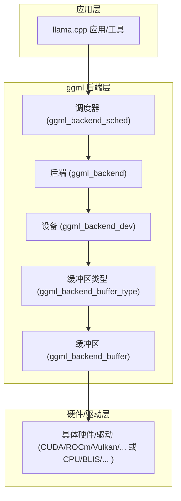
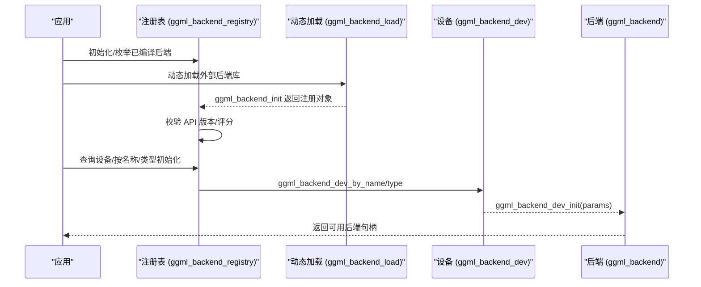
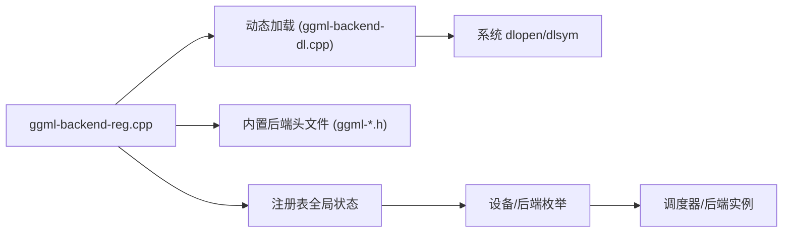

# 后端开发指南

<cite>
**本文引用的文件**
- [ggml-backend.h](file://ggml/include/ggml-backend.h)
- [ggml-backend-impl.h](file://ggml/src/ggml-backend-impl.h)
- [ggml-backend.cpp](file://ggml/src/ggml-backend.cpp)
- [ggml-backend-reg.cpp](file://ggml/src/ggml-backend-reg.cpp)
- [ggml-backend-dl.cpp](file://ggml/src/ggml-backend-dl.cpp)
- [ggml-cpu.cpp](file://ggml/src/ggml-cpu/ggml-cpu.cpp)
- [CANN 文档](file://docs/backend/CANN.md)
- [CUDA 安装文档](file://docs/backend/CUDA-FEDORA.md)
- [OpenCL 文档](file://docs/backend/OPENCL.md)
- [SYCL 文档](file://docs/backend/SYCL.md)
- [OpenVINO 文档](file://docs/backend/OPENVINO.md)
- [VirtGPU 配置文档](file://docs/backend/VirtGPU/configuration.md)
- [BLIS 安装文档](file://docs/backend/BLIS.md)
</cite>

## 目录
1. [简介](#简介)
2. [项目结构](#项目结构)
3. [核心组件](#核心组件)
4. [架构总览](#架构总览)
5. [详细组件分析](#详细组件分析)
6. [依赖关系分析](#依赖关系分析)
7. [性能考量](#性能考量)
8. [故障排查指南](#故障排查指南)
9. [结论](#结论)
10. [附录](#附录)

## 简介
本指南面向希望在 llama.cpp 中新增或扩展后端（硬件加速/异构计算）的开发者。内容涵盖：
- 后端接口规范与实现要求
- 新硬件平台接入流程（接口定义、算子实现、性能优化）
- 后端注册机制、动态加载与版本兼容
- 测试框架、单元测试与集成测试策略
- 调试工具、性能分析与问题诊断
- 文档编写与维护建议

## 项目结构
llama.cpp 的后端体系由 ggml 子系统统一抽象，通过“设备（Device）—缓冲区类型（BufferType）—缓冲区（Buffer）—后端（Backend）”四层接口组织，上层模型与图执行通过调度器（Scheduler）进行任务分发与内存管理。

图表来源
- [ggml-backend.h:1-432](file://ggml/include/ggml-backend.h#L1-L432)
- [ggml-backend-impl.h:1-276](file://ggml/src/ggml-backend-impl.h#L1-L276)

章节来源
- [ggml-backend.h:1-432](file://ggml/include/ggml-backend.h#L1-L432)
- [ggml-backend-impl.h:1-276](file://ggml/src/ggml-backend-impl.h#L1-L276)

## 核心组件
- 设备（Device）：描述硬件能力、内存、属性与初始化后端的能力接口。
- 缓冲区类型（BufferType）：定义内存对齐、最大容量、分配大小、是否主机内存等特性。
- 缓冲区（Buffer）：承载张量数据，提供 set/get/memset/copy 等访问接口。
- 后端（Backend）：实现图计算、异步操作、事件同步、缓冲区分配等。
- 调度器（Scheduler）：多后端协同，自动选择最优后端、分配缓冲区、复制张量、执行图。
- 注册表（Registry）：集中注册后端，支持动态加载与枚举。

章节来源
- [ggml-backend.h:34-193](file://ggml/include/ggml-backend.h#L34-L193)
- [ggml-backend-impl.h:14-231](file://ggml/src/ggml-backend-impl.h#L14-L231)

## 架构总览
下图展示后端从注册到运行的关键流程，包括动态加载、版本校验、设备枚举与后端初始化。

图表来源
- [ggml-backend-reg.cpp:213-282](file://ggml/src/ggml-backend-reg.cpp#L213-L282)
- [ggml-backend-dl.cpp:1-49](file://ggml/src/ggml-backend-dl.cpp#L1-L49)
- [ggml-backend.h:244-258](file://ggml/include/ggml-backend.h#L244-L258)

章节来源
- [ggml-backend-reg.cpp:285-587](file://ggml/src/ggml-backend-reg.cpp#L285-L587)
- [ggml-backend-dl.cpp:1-49](file://ggml/src/ggml-backend-dl.cpp#L1-L49)

## 详细组件分析

### 接口规范与实现要点
- 设备接口：提供名称/描述、内存查询、类型、属性、后端初始化、缓冲区类型、主机缓冲区类型、从指针创建缓冲区、支持算子/缓冲区类型、卸载偏好、事件等。
- 缓冲区类型接口：名称、分配缓冲区、对齐、最大容量、分配尺寸、是否主机内存等。
- 缓冲区接口：基址、张量初始化、memset/set/get、二维拷贝、跨缓冲区拷贝、清空、重置等。
- 后端接口：名称、释放、异步 set/get/2d、跨后端拷贝、同步、图计划/计算、事件记录/等待、图优化等。
- 调度器：多后端优先级、节点后端绑定、分割/复制、预留/分配、执行、回调、元设备（张量切分）等。

章节来源
- [ggml-backend.h:34-193](file://ggml/include/ggml-backend.h#L34-L193)
- [ggml-backend-impl.h:14-231](file://ggml/src/ggml-backend-impl.h#L14-L231)

### 后端注册与动态加载
- 内置后端：在注册表构造时按编译宏注册（如 CUDA、Metal、SYCL、Vulkan、OpenCL、CANN、OpenVINO、CPU 等）。
- 动态加载：通过路径扫描、符号查找（ggml_backend_init/ggml_backend_score）、API 版本校验、注册到全局表。
- 卸载：移除设备、注销后端。
- 环境变量：GGML_BACKEND_PATH 可指定外部后端库路径；部分后端还支持自定义搜索路径与评分。

章节来源
- [ggml-backend-reg.cpp:106-198](file://ggml/src/ggml-backend-reg.cpp#L106-L198)
- [ggml-backend-reg.cpp:213-282](file://ggml/src/ggml-backend-reg.cpp#L213-L282)
- [ggml-backend-reg.cpp:385-587](file://ggml/src/ggml-backend-reg.cpp#L385-L587)
- [ggml-backend-dl.cpp:1-49](file://ggml/src/ggml-backend-dl.cpp#L1-L49)

### 多后端调度与张量复制
- 调度器负责根据“支持算子、权重所在缓冲区位置、张量布局”选择后端，必要时在后端间复制张量。
- 支持设置评估回调、批量节点观察、同步、重置、分配与执行。
- 元设备（Meta）：将大张量沿某一轴切分到多个设备，配合 split state 管理段与设备映射。

章节来源
- [ggml-backend.h:260-424](file://ggml/include/ggml-backend.h#L260-L424)

### CPU 后端实现要点
- 提供额外缓冲区类型（如 AMX、KleidiAI、Spacemit、Repack 等）以增强性能。
- 图计划/计算：基于线程池与工作区内存，支持中止回调与参考实现切换。
- 释放与资源回收：清理工作区与上下文。

章节来源
- [ggml-cpu.cpp:42-95](file://ggml/src/ggml-cpu/ggml-cpu.cpp#L42-L95)
- [ggml-cpu.cpp:97-200](file://ggml/src/ggml-cpu/ggml-cpu.cpp#L97-L200)

### 新硬件平台接入流程（以 CANN 为例）
- 准备环境：安装驱动与工具链，配置环境变量。
- 编译：启用 GGML_CANN=ON，构建 llama.cpp。
- 运行：选择单卡或多卡切分模式，推理验证。
- 性能调优：内存池策略、ACL 图执行、算子融合、预填充阶段图执行开关等。

章节来源
- [CANN 文档:206-358](file://docs/backend/CANN.md#L206-L358)

### 其他后端参考
- CUDA（Fedora 环境）：容器化安装驱动与工具链，配置 PATH，编译与运行。
- OpenCL：Android/Windows 11 Arm64/Linux 平台构建与运行，量化策略与内核嵌入选项。
- SYCL：Intel GPU 适配，oneAPI 工具链与库，设备选择与运行参数。
- OpenVINO：CPU/GPU/NPU 设备支持，状态式执行、缓存目录、调试与性能分析。
- VirtGPU：前端/宿主/虚拟化层环境变量配置，APIR/Venus 能力集切换。
- BLIS：BLAS 框架集成，OpenMP 线程控制与编译选项。

章节来源
- [CUDA 安装文档:1-284](file://docs/backend/CUDA-FEDORA.md#L1-L284)
- [OpenCL 文档:1-283](file://docs/backend/OPENCL.md#L1-L283)
- [SYCL 文档:1-826](file://docs/backend/SYCL.md#L1-L826)
- [OpenVINO 文档:1-387](file://docs/backend/OPENVINO.md#L1-L387)
- [VirtGPU 配置文档:1-175](file://docs/backend/VirtGPU/configuration.md#L1-L175)
- [BLIS 安装文档:1-61](file://docs/backend/BLIS.md#L1-L61)

## 依赖关系分析
后端注册与加载的依赖关系如下：

图表来源
- [ggml-backend-reg.cpp:1-110](file://ggml/src/ggml-backend-reg.cpp#L1-L110)
- [ggml-backend-dl.cpp:1-49](file://ggml/src/ggml-backend-dl.cpp#L1-L49)

章节来源
- [ggml-backend-reg.cpp:1-110](file://ggml/src/ggml-backend-reg.cpp#L1-L110)
- [ggml-backend-dl.cpp:1-49](file://ggml/src/ggml-backend-dl.cpp#L1-L49)

## 性能考量
- 缓冲区对齐与最大容量：确保分配满足硬件对齐与上限约束，减少碎片。
- 异步传输与事件：利用异步 set/get/拷贝与事件同步降低 CPU 等待。
- 图计划与优化：复用计划、图优化、算子融合（如 CANN 的 operator fusion、SYCL 的 oneDNN/oneMKL）。
- 设备选择与切分：根据权重位置与算子支持选择后端；大模型可采用元设备切分。
- 线程与内存：CPU 后端的工作区内存与线程池规模；SYCL 的主机内存回退与设备内存超过 4GB 的支持。
- 量化与内核：针对特定后端优化量化格式与内核（如 OpenCL 的 Q4_0 优化、CANN 的 ACL 图）。

章节来源
- [ggml-backend.h:34-193](file://ggml/include/ggml-backend.h#L34-L193)
- [ggml-backend.cpp:254-322](file://ggml/src/ggml-backend.cpp#L254-L322)
- [CANN 文档:318-358](file://docs/backend/CANN.md#L318-L358)
- [SYCL 文档:710-740](file://docs/backend/SYCL.md#L710-L740)
- [OpenCL 文档:78-86](file://docs/backend/OPENCL.md#L78-L86)

## 故障排查指南
- 动态加载失败：检查 ggml_backend_init/ggml_backend_score 符号是否存在，API 版本是否匹配，库路径与权限。
- 设备不可见：确认设备枚举函数返回值、驱动安装与用户组加入（如 Linux 的 video/render 组）。
- 性能异常：对比同步/异步路径、检查图计划复用、事件同步点、缓冲区拷贝次数。
- 环境变量：不同后端有专用环境变量（如 GGML_CANN_*、GGML_OPENCL_*、GGML_SYCL_*、GGML_OPENVINO_*），逐项核对。
- 调试日志：开启后端/工具链日志（如 SYCL 的 ZES_ENABLE_SYSMAN、OpenVINO 的缓存/调试开关）。

章节来源
- [ggml-backend-reg.cpp:213-282](file://ggml/src/ggml-backend-reg.cpp#L213-L282)
- [ggml-backend-dl.cpp:1-49](file://ggml/src/ggml-backend-dl.cpp#L1-L49)
- [SYCL 文档:710-740](file://docs/backend/SYCL.md#L710-L740)
- [OpenVINO 文档:318-339](file://docs/backend/OPENVINO.md#L318-L339)

## 结论
llama.cpp 的后端体系以清晰的接口分层与强大的调度能力为核心，既支持内置后端，也允许通过动态加载扩展新硬件。开发者应遵循接口规范、关注版本兼容、合理设计缓冲区与图执行策略，并结合各后端的环境变量与性能开关进行针对性优化。

## 附录

### 开发流程清单
- 明确硬件能力与驱动要求，准备编译与运行环境。
- 实现设备/缓冲区类型/后端接口，提供注册函数与可选评分。
- 在注册表中注册或通过动态加载导入。
- 编写最小可运行示例，验证设备枚举、缓冲区分配、简单算子执行。
- 使用调度器进行多后端协作与张量复制。
- 针对目标后端启用性能开关与量化优化。
- 编写单元测试与集成测试，覆盖边界条件与错误路径。
- 记录环境变量与已知限制，完善文档与发布说明。

### 最佳实践
- 保持接口最小可用，逐步扩展功能。
- 严格区分“设备能力查询”与“后端实例”，避免在设备层做过多状态管理。
- 优先使用异步接口与事件同步，减少阻塞。
- 对于大模型，优先考虑元设备切分与权重驻留策略。
- 为不同后端提供一致的环境变量命名约定，便于运维与排障。

### 常见陷阱
- 忽视 API 版本不兼容导致动态加载失败。
- 未正确设置对齐/最大容量，引发分配失败或越界。
- 在 CPU 回退路径上忽略性能损失，导致整体吞吐下降。
- 未启用后端特定优化（如 SYCL oneDNN、CANN ACL 图、OpenCL 内核嵌入）。
- 忘记清理/重置调度器状态，造成重复分配与悬挂指针。