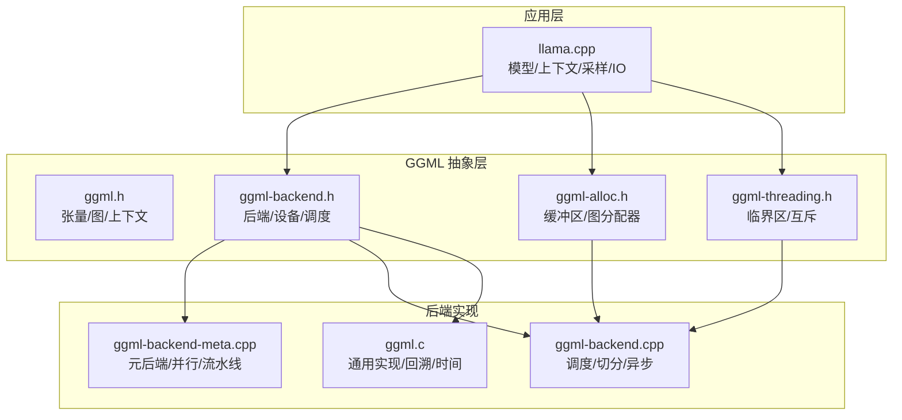
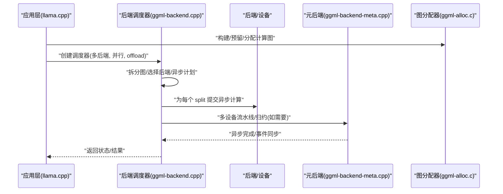
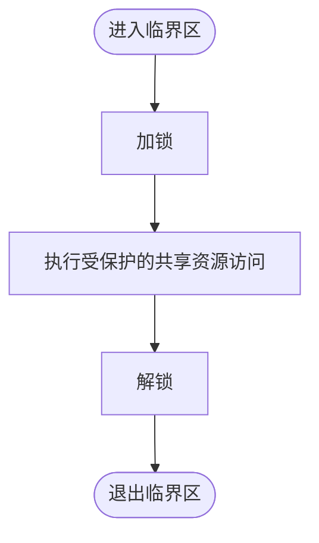
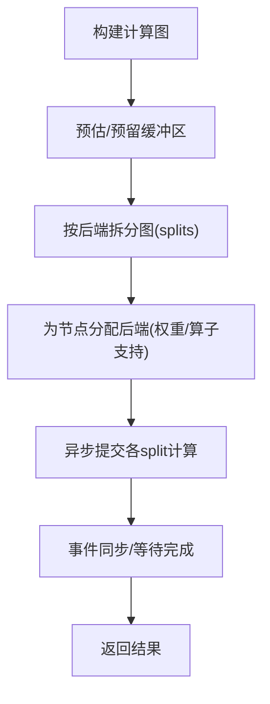
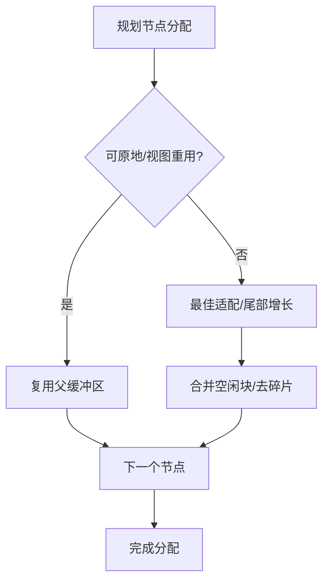
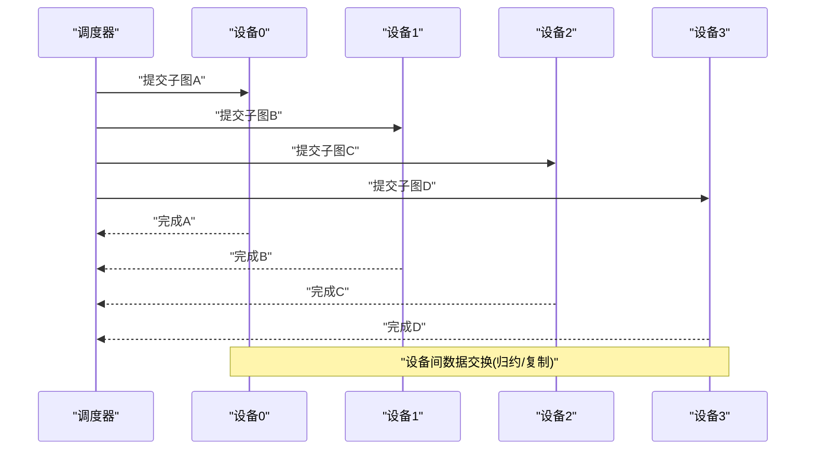
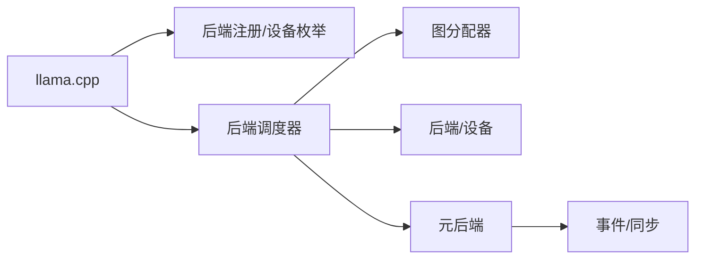

# 后端性能优化

<cite>
**本文引用的文件**   
- [ggml-threading.h](file://ggml/src/ggml-threading.h)
- [ggml-threading.cpp](file://ggml/src/ggml-threading.cpp)
- [ggml-backend.h](file://ggml/include/ggml-backend.h)
- [ggml.h](file://ggml/include/ggml.h)
- [ggml.c](file://ggml/src/ggml.c)
- [ggml-alloc.h](file://ggml/include/ggml-alloc.h)
- [ggml-alloc.c](file://ggml/src/ggml-alloc.c)
- [ggml-backend.cpp](file://ggml/src/ggml-backend.cpp)
- [ggml-backend-meta.cpp](file://ggml/src/ggml-backend-meta.cpp)
- [llama.cpp](file://src/llama.cpp)
- [llama-bench.cpp](file://tools/llama-bench/llama-bench.cpp)
- [CANN.md](file://docs/backend/CANN.md)
- [OPENVINO.md](file://docs/backend/OPENVINO.md)
- [test-barrier.cpp](file://tests/test-barrier.cpp)
- [testing.h](file://tests/testing.h)
</cite>

## 目录
1. [简介](#简介)
2. [项目结构](#项目结构)
3. [核心组件](#核心组件)
4. [架构总览](#架构总览)
5. [详细组件分析](#详细组件分析)
6. [依赖关系分析](#依赖关系分析)
7. [性能考量](#性能考量)
8. [故障排查指南](#故障排查指南)
9. [结论](#结论)
10. [附录](#附录)

## 简介
本文件系统性梳理 llama.cpp 在后端性能优化方面的技术与最佳实践，覆盖线程池管理、并行计算策略、负载均衡、内存分配与缓存友好布局、内存池、算子融合与内核优化、流水线并行、不同后端的性能特征与调优、基准测试方法与结果分析、带宽利用率与功耗管理，以及基于硬件与模型规模的后端配置选择建议。内容以代码为依据，辅以图示帮助理解。

## 项目结构
llama.cpp 的性能优化能力由两层协同实现：
- ggml 张量与后端抽象层：提供统一的张量操作、后端注册与调度、缓冲区类型与分配器、事件同步等能力。
- llama 应用层：在 ggml 基础上构建模型加载、KV 缓存、采样、推理管线，并通过后端调度器进行跨设备/多后端的计算分配与执行。

**图表来源**
- [llama.cpp:83-108](file://src/llama.cpp#L83-L108)
- [ggml-backend.h:260-353](file://ggml/include/ggml-backend.h#L260-L353)
- [ggml-alloc.h:24-82](file://ggml/include/ggml-alloc.h#L24-L82)
- [ggml-threading.h:1-15](file://ggml/src/ggml-threading.h#L1-L15)
- [ggml-backend.cpp:1541-1706](file://ggml/src/ggml-backend.cpp#L1541-L1706)
- [ggml-backend-meta.cpp:2014-2072](file://ggml/src/ggml-backend-meta.cpp#L2014-L2072)
- [ggml.c:1-200](file://ggml/src/ggml.c#L1-L200)

**章节来源**
- [llama.cpp:83-108](file://src/llama.cpp#L83-L108)
- [ggml-backend.h:260-353](file://ggml/include/ggml-backend.h#L260-L353)
- [ggml-alloc.h:24-82](file://ggml/include/ggml-alloc.h#L24-L82)
- [ggml-threading.h:1-15](file://ggml/src/ggml-threading.h#L1-L15)
- [ggml-backend.cpp:1541-1706](file://ggml/src/ggml-backend.cpp#L1541-L1706)
- [ggml-backend-meta.cpp:2014-2072](file://ggml/src/ggml-backend-meta.cpp#L2014-L2072)
- [ggml.c:1-200](file://ggml/src/ggml.c#L1-L200)

## 核心组件
- 后端与设备抽象：定义后端、缓冲区类型、设备能力、事件与同步接口，支持 CPU/GPU/IGPU/加速器/元设备等。
- 调度器：负责将计算图拆分为多个 split，按 op 支持性与权重位置优先选择后端，异步执行并处理跨后端数据拷贝。
- 图分配器：对计算图节点进行缓冲区分配规划，尽量复用/视图重用，减少碎片与峰值内存。
- 线程池与临界区：提供互斥保护与临界区封装，保障并发安全。
- 元后端与流水线并行：通过“蝴蝶归约”等拓扑在多设备间进行数据交换与聚合，实现流水线式并行。

**章节来源**
- [ggml-backend.h:24-188](file://ggml/include/ggml-backend.h#L24-L188)
- [ggml-backend.h:305-353](file://ggml/include/ggml-backend.h#L305-L353)
- [ggml-alloc.h:24-82](file://ggml/include/ggml-alloc.h#L24-L82)
- [ggml-threading.h:1-15](file://ggml/src/ggml-threading.h#L1-L15)
- [ggml-threading.cpp:1-13](file://ggml/src/ggml-threading.cpp#L1-L13)
- [ggml-backend-meta.cpp:2014-2072](file://ggml/src/ggml-backend-meta.cpp#L2014-L2072)

## 架构总览
下图展示从应用到后端调度与执行的关键路径，包括线程池参数传递、异步图计算、事件同步与元后端流水线。

**图表来源**
- [llama.cpp:83-108](file://src/llama.cpp#L83-L108)
- [ggml-backend.cpp:1541-1706](file://ggml/src/ggml-backend.cpp#L1541-L1706)
- [ggml-backend-meta.cpp:2014-2072](file://ggml/src/ggml-backend-meta.cpp#L2014-L2072)
- [ggml-alloc.c:622-911](file://ggml/src/ggml-alloc.c#L622-L911)

## 详细组件分析

### 线程池管理与临界区
- 临界区封装：通过互斥锁保护共享资源访问，避免竞态。
- 线程池参数：应用层可设置后端线程数，影响矩阵乘等密集计算的并行度。
- 测试验证：测试覆盖了动态切换线程数、并发图计算与屏障场景，确保线程安全与正确性。

**图表来源**
- [ggml-threading.cpp:1-13](file://ggml/src/ggml-threading.cpp#L1-L13)

**章节来源**
- [ggml-threading.h:1-15](file://ggml/src/ggml-threading.h#L1-L15)
- [ggml-threading.cpp:1-13](file://ggml/src/ggml-threading.cpp#L1-L13)
- [test-barrier.cpp:89-196](file://tests/test-barrier.cpp#L89-L196)

### 并行计算策略与负载均衡
- 多后端调度：调度器根据 op 支持性、权重所在缓冲区位置优先选择后端；支持异步提交与事件同步。
- 设备能力：设备能力标志（异步、主机固定缓冲、事件）决定是否启用高级特性。
- 负载均衡：通过 split 将图划分到多个后端，结合权重位置与内存布局优化跨设备数据移动。

**图表来源**
- [ggml-backend.h:305-353](file://ggml/include/ggml-backend.h#L305-L353)
- [ggml-backend.cpp:1541-1706](file://ggml/src/ggml-backend.cpp#L1541-L1706)

**章节来源**
- [ggml-backend.h:134-193](file://ggml/include/ggml-backend.h#L134-L193)
- [ggml-backend.cpp:1541-1706](file://ggml/src/ggml-backend.cpp#L1541-L1706)

### 内存分配优化与缓存友好布局
- 图分配器：记录每个节点与源张量的缓冲区分配信息，支持视图重用与原地计算，降低峰值内存。
- 分配策略：优先复用父张量缓冲区，释放多余空间，合并空闲块，避免碎片。
- 缓冲区类型：区分权重/计算用途，按对齐与最大尺寸规划，减少跨后端拷贝。

**图表来源**
- [ggml-alloc.c:622-911](file://ggml/src/ggml-alloc.c#L622-L911)

**章节来源**
- [ggml-alloc.h:24-82](file://ggml/include/ggml-alloc.h#L24-L82)
- [ggml-alloc.c:134-311](file://ggml/src/ggml-alloc.c#L134-L311)
- [ggml-alloc.c:622-911](file://ggml/src/ggml-alloc.c#L622-L911)

### 算子融合、内核优化与流水线并行
- 算子融合：提供检测连续算子序列是否可融合的工具，减少中间结果与调度开销。
- 内核优化：通过后端注册函数暴露能力标志与特性，结合量化/向量化/专用指令集优化。
- 流水线并行：元后端采用“蝴蝶归约”拓扑在多设备间进行数据交换与聚合，提升吞吐。

**图表来源**
- [ggml-backend-meta.cpp:2014-2072](file://ggml/src/ggml-backend-meta.cpp#L2014-L2072)

**章节来源**
- [ggml-impl.h:698-712](file://ggml/src/ggml-impl.h#L698-L712)
- [ggml-backend-meta.cpp:2014-2072](file://ggml/src/ggml-backend-meta.cpp#L2014-L2072)
- [CANN.md:355-358](file://docs/backend/CANN.md#L355-L358)

### 不同后端的性能特征与调优
- CPU 后端：适合小模型或低延迟场景，注意 NUMA 初始化与线程数设置。
- GPU/IGPU 后端：适合大模型与高吞吐，关注带宽、显存占用与异步拷贝。
- 元后端：多设备并行，适合超大规模模型，需关注拓扑与通信成本。
- 特定后端文档：如 CANN 支持算子融合开关；OpenVINO 文档标注性能与内存优化仍在进行中。

**章节来源**
- [llama.cpp:94-104](file://src/llama.cpp#L94-L104)
- [ggml-backend.h:134-193](file://ggml/include/ggml-backend.h#L134-L193)
- [CANN.md:355-358](file://docs/backend/CANN.md#L355-L358)
- [OPENVINO.md:381-387](file://docs/backend/OPENVINO.md#L381-L387)

## 依赖关系分析
- 应用层依赖后端注册与调度接口，通过后端初始化与设备枚举选择最优后端组合。
- 调度器依赖图分配器与缓冲区类型，按节点属性与设备能力进行分配与拆分。
- 元后端依赖事件与异步计算接口，实现设备间流水线与归约。

**图表来源**
- [llama.cpp:83-108](file://src/llama.cpp#L83-L108)
- [ggml-backend.h:234-258](file://ggml/include/ggml-backend.h#L234-L258)
- [ggml-backend.cpp:1541-1706](file://ggml/src/ggml-backend.cpp#L1541-L1706)
- [ggml-backend-meta.cpp:2014-2072](file://ggml/src/ggml-backend-meta.cpp#L2014-L2072)

**章节来源**
- [llama.cpp:83-108](file://src/llama.cpp#L83-L108)
- [ggml-backend.h:234-258](file://ggml/include/ggml-backend.h#L234-L258)
- [ggml-backend.cpp:1541-1706](file://ggml/src/ggml-backend.cpp#L1541-L1706)
- [ggml-backend-meta.cpp:2014-2072](file://ggml/src/ggml-backend-meta.cpp#L2014-L2072)

## 性能考量
- 线程与并行
  - 设置合适的后端线程数，平衡 CPU 利用率与调度开销。
  - 使用异步计算与事件同步，避免阻塞等待。
- 内存与带宽
  - 优先原地/视图重用，减少峰值内存与跨设备拷贝。
  - 合理对齐与缓冲区类型选择，提升访存效率。
- 算子与内核
  - 启用后端支持的融合/优化路径（如 CANN 融合开关）。
  - 针对特定后端启用量化/向量化/专用内核。
- 流水线与拓扑
  - 元后端的“蝴蝶归约”拓扑适合多设备流水线，注意通信与聚合时机。
- 功耗与稳定性
  - 控制并发与拷贝频率，避免带宽饱和导致抖动。
  - 在测试中验证线程数变化与图切换的稳定性。

[本节为通用指导，无需具体文件来源]

## 故障排查指南
- 回溯与调试
  - 在不支持平台禁用回溯或使用环境变量控制；必要时开启更详细的调试输出。
- 线程池与并发
  - 使用测试用例验证动态线程数切换与多图交替执行的正确性。
- 分配与内存
  - 检查图分配是否成功、缓冲区大小是否满足需求、是否存在碎片。
- 后端初始化
  - 确保后端已加载且设备可用；错误提示会给出加载建议。

**章节来源**
- [ggml.c:152-200](file://ggml/src/ggml.c#L152-L200)
- [test-barrier.cpp:89-196](file://tests/test-barrier.cpp#L89-L196)
- [ggml-alloc.c:248-259](file://ggml/src/ggml-alloc.c#L248-L259)

## 结论
llama.cpp 的性能优化建立在统一的后端抽象与调度框架之上：通过多后端调度、图分配器、事件与异步执行，结合算子融合与流水线并行，实现从 CPU 到 GPU/IGPU 的高效推理。实际部署中应依据硬件能力与模型规模选择后端组合，合理设置线程数与内存布局，并借助基准测试持续评估与迭代。

[本节为总结，无需具体文件来源]

## 附录

### 基准测试方法与结果分析
- 工具与指标
  - 使用 llama-bench 统计设备信息、运行时长、吞吐等；支持多设备组合与 RPC 服务器注册。
  - 测试框架提供微基准统计（平均/标准差），便于对比不同配置。
- 建议流程
  - 明确目标后端与设备列表，准备模型与输入；运行基准工具收集数据；分析吞吐、延迟与内存占用；调整线程数/融合/对齐等参数再测。

**章节来源**
- [llama-bench.cpp:118-200](file://tools/llama-bench/llama-bench.cpp#L118-L200)
- [llama-bench.cpp:142-194](file://tools/llama-bench/llama-bench.cpp#L142-L194)
- [testing.h:155-195](file://tests/testing.h#L155-L195)

### 硬件与模型规模的后端选择建议
- 小模型/低延迟：优先 CPU 后端，适当提高线程数；避免不必要的跨设备拷贝。
- 中大型模型/高吞吐：优先 GPU/IGPU 后端；启用异步与事件；合理对齐与缓冲区类型。
- 超大规模模型：考虑元后端多设备流水线；关注拓扑与通信成本；启用融合与内核优化。
- 特定后端：参考后端文档中的特性与限制（如 CANN 融合开关、OpenVINO 当前优化方向）。

**章节来源**
- [llama.cpp:94-104](file://src/llama.cpp#L94-L104)
- [ggml-backend.h:134-193](file://ggml/include/ggml-backend.h#L134-L193)
- [CANN.md:355-358](file://docs/backend/CANN.md#L355-L358)
- [OPENVINO.md:381-387](file://docs/backend/OPENVINO.md#L381-L387)