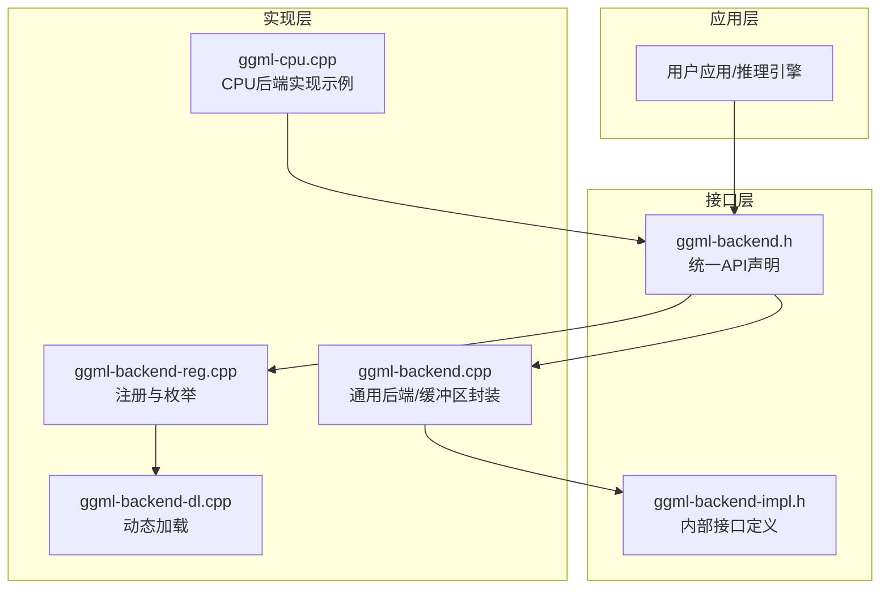
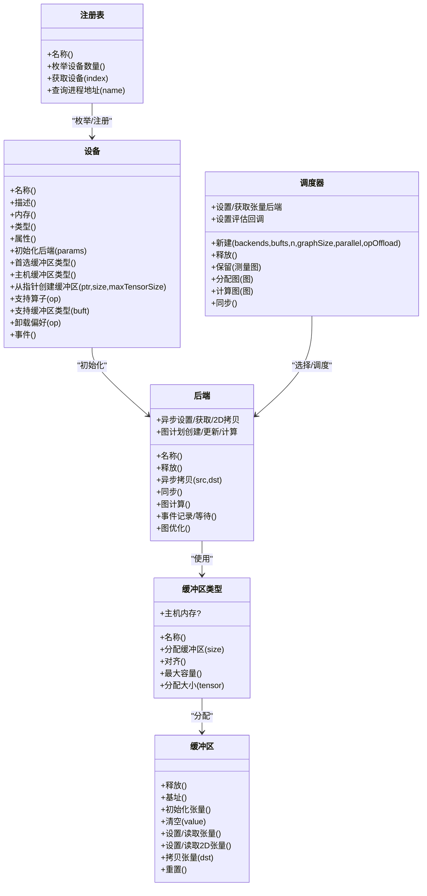
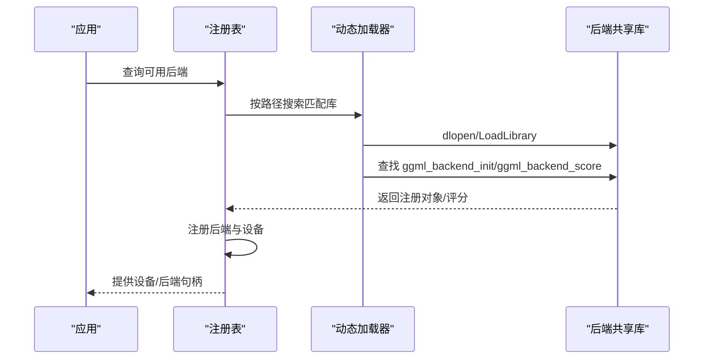
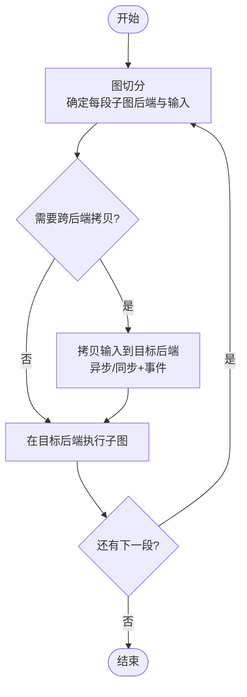
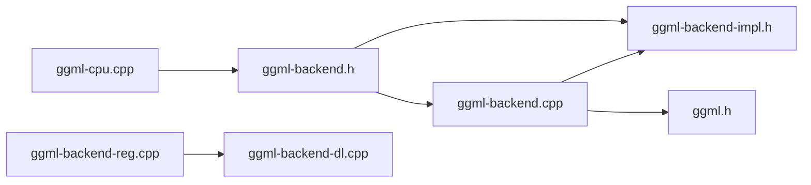

# 后端架构设计

<cite>
**本文档引用的文件**
- [ggml-backend.h](file://ggml/include/ggml-backend.h)
- [ggml-backend.cpp](file://ggml/src/ggml-backend.cpp)
- [ggml-backend-reg.cpp](file://ggml/src/ggml-backend-reg.cpp)
- [ggml-backend-dl.cpp](file://ggml/src/ggml-backend-dl.cpp)
- [ggml-backend-impl.h](file://ggml/src/ggml-backend-impl.h)
- [ggml-cpu.cpp](file://ggml/src/ggml-cpu/ggml-cpu.cpp)
- [ggml.h](file://ggml/include/ggml.h)
</cite>

## 目录
1. [引言](#引言)
2. [项目结构](#项目结构)
3. [核心组件](#核心组件)
4. [架构总览](#架构总览)
5. [详细组件分析](#详细组件分析)
6. [依赖关系分析](#依赖关系分析)
7. [性能考虑](#性能考虑)
8. [故障排查指南](#故障排查指南)
9. [结论](#结论)
10. [附录：后端开发指南](#附录后端开发指南)

## 引言
本文件系统性梳理 ggml 后端抽象层的设计理念、接口规范与实现机制，重点覆盖以下主题：
- 后端注册系统与动态加载机制
- 统一接口设计与多后端调度
- 生命周期管理、资源分配与内存管理策略
- 面向新硬件后端的开发指南
- 性能优化策略与调试技巧

目标是帮助开发者在不改变上层计算图的前提下，快速接入新的硬件后端，并稳定地运行在 CPU/GPU/加速器等异构平台上。

## 项目结构
后端抽象层位于 ggml 子模块中，采用“接口定义 + 内部实现 + 动态加载 + 调度器”的分层设计：
- 接口层：对外暴露统一的后端 API（缓冲区类型、缓冲区、后端、设备、注册表、调度器）
- 实现层：内部接口与通用缓冲区/多缓冲区封装
- 注册与加载：静态/动态注册后端，按需动态加载共享库
- 调度层：根据算子支持、权重位置与内存布局自动选择后端并进行图切分与数据拷贝

图表来源
- [ggml-backend.h:1-432](file://ggml/include/ggml-backend.h#L1-L432)
- [ggml-backend.cpp:1-200](file://ggml/src/ggml-backend.cpp#L1-L200)
- [ggml-backend-reg.cpp:1-120](file://ggml/src/ggml-backend-reg.cpp#L1-L120)
- [ggml-backend-dl.cpp:1-49](file://ggml/src/ggml-backend-dl.cpp#L1-L49)
- [ggml-backend-impl.h:1-120](file://ggml/src/ggml-backend-impl.h#L1-L120)
- [ggml-cpu.cpp:1-120](file://ggml/src/ggml-cpu/ggml-cpu.cpp#L1-L120)

章节来源
- [ggml-backend.h:1-432](file://ggml/include/ggml-backend.h#L1-L432)
- [ggml-backend.cpp:1-200](file://ggml/src/ggml-backend.cpp#L1-L200)
- [ggml-backend-reg.cpp:1-120](file://ggml/src/ggml-backend-reg.cpp#L1-L120)
- [ggml-backend-dl.cpp:1-49](file://ggml/src/ggml-backend-dl.cpp#L1-L49)
- [ggml-backend-impl.h:1-120](file://ggml/src/ggml-backend-impl.h#L1-L120)
- [ggml-cpu.cpp:1-120](file://ggml/src/ggml-cpu/ggml-cpu.cpp#L1-L120)

## 核心组件
- 后端缓冲区类型（Buffer Type）：描述某类内存的分配策略、对齐、最大容量、是否主机内存等属性
- 后端缓冲区（Buffer）：具体内存块，提供初始化张量、清空、设置/读取、2D拷贝、跨后端拷贝等能力
- 后端（Stream）：执行计算的流，支持异步数据访问、事件同步、图计划与计算
- 设备（Device）：物理或逻辑设备，提供名称、描述、内存、类型、属性、首选缓冲区类型、主机缓冲区类型、从指针创建缓冲区、算子/缓冲区类型支持判定、卸载偏好等
- 注册表（Registry）：后端注册、枚举、动态加载、进程导出函数查询
- 调度器（Scheduler）：多后端协作，自动分配张量到后端、图切分、输入拷贝、事件同步与管线并行

章节来源
- [ggml-backend.h:24-129](file://ggml/include/ggml-backend.h#L24-L129)
- [ggml-backend.h:130-251](file://ggml/include/ggml-backend.h#L130-L251)
- [ggml-backend.h:252-432](file://ggml/include/ggml-backend.h#L252-L432)
- [ggml-backend-impl.h:17-100](file://ggml/src/ggml-backend-impl.h#L17-L100)
- [ggml-backend-impl.h:105-209](file://ggml/src/ggml-backend-impl.h#L105-L209)
- [ggml-backend-impl.h:214-276](file://ggml/src/ggml-backend-impl.h#L214-L276)

## 架构总览
后端抽象层通过“设备 → 后端 → 缓冲区类型 → 缓冲区”的层级组织，配合调度器完成跨后端的图执行与数据搬运。动态加载允许在运行时按需加载第三方后端库，注册表负责统一管理。

图表来源
- [ggml-backend.h:24-129](file://ggml/include/ggml-backend.h#L24-L129)
- [ggml-backend.h:130-251](file://ggml/include/ggml-backend.h#L130-L251)
- [ggml-backend.h:252-432](file://ggml/include/ggml-backend.h#L252-L432)
- [ggml-backend-impl.h:17-100](file://ggml/src/ggml-backend-impl.h#L17-L100)
- [ggml-backend-impl.h:105-209](file://ggml/src/ggml-backend-impl.h#L105-L209)
- [ggml-backend-impl.h:214-276](file://ggml/src/ggml-backend-impl.h#L214-L276)

## 详细组件分析

### 1) 统一接口与数据结构
- 缓冲区类型接口：提供 get_name/alloc_buffer/get_alignment/get_max_size/get_alloc_size/is_host 等方法，屏蔽不同内存来源的差异
- 缓冲区接口：提供 free/get_base/init_tensor/memset/set/get/set_2d/get_2d/cpy/clear/reset 等操作，统一张量数据访问与拷贝
- 后端接口：get_name/free/set/get/set_2d/get_2d/cpy_async/synchronize/graph_plan_* /graph_compute/event_* /graph_optimize
- 设备接口：get_name/get_description/get_memory/get_type/get_props/init_backend/get_buffer_type/get_host_buffer_type/buffer_from_host_ptr/supports_op/supports_buft/offload_op/event*
- 注册表接口：get_name/get_device_count/get_device/get_proc_address

这些接口构成后端抽象层的核心契约，确保上层无需感知底层实现细节。

章节来源
- [ggml-backend-impl.h:17-100](file://ggml/src/ggml-backend-impl.h#L17-L100)
- [ggml-backend-impl.h:105-209](file://ggml/src/ggml-backend-impl.h#L105-L209)
- [ggml-backend-impl.h:214-276](file://ggml/src/ggml-backend-impl.h#L214-L276)

### 2) 后端注册系统与动态加载
- 静态注册：构建期通过条件编译将各后端（如 CUDA、Metal、SYCL、Vulkan、OpenCL、CPU 等）注册进全局注册表
- 动态加载：运行时扫描目录，按约定命名规则（libggml-*.so 或 ggml-*.dll）查找并加载共享库；通过符号 ggml_backend_init 获取注册对象；可选 ggml_backend_score 用于评分选择最优后端
- 卸载：注销已加载后端并移除其设备

图表来源
- [ggml-backend-reg.cpp:213-283](file://ggml/src/ggml-backend-reg.cpp#L213-L283)
- [ggml-backend-reg.cpp:385-490](file://ggml/src/ggml-backend-reg.cpp#L385-L490)
- [ggml-backend-dl.cpp:1-49](file://ggml/src/ggml-backend-dl.cpp#L1-L49)

章节来源
- [ggml-backend-reg.cpp:1-120](file://ggml/src/ggml-backend-reg.cpp#L1-L120)
- [ggml-backend-reg.cpp:213-283](file://ggml/src/ggml-backend-reg.cpp#L213-L283)
- [ggml-backend-reg.cpp:385-490](file://ggml/src/ggml-backend-reg.cpp#L385-L490)
- [ggml-backend-dl.cpp:1-49](file://ggml/src/ggml-backend-dl.cpp#L1-L49)

### 3) 多后端调度与图执行
- 图切分：根据张量所在后端、权重位置、算子支持与缓冲区类型兼容性，将大图拆分为多个子图（Split），每个子图在单一后端上执行
- 输入拷贝：当输入张量来自其他后端时，按需进行异步/同步拷贝；支持事件等待与流水线复制（多份拷贝）
- 执行顺序：按切分顺序依次执行，必要时进行同步；支持回调观察节点输出
- 资源管理：基于哈希集与映射表跟踪张量后端归属与拷贝副本，避免重复拷贝与悬挂指针

图表来源
- [ggml-backend.cpp:1014-1487](file://ggml/src/ggml-backend.cpp#L1014-L1487)
- [ggml-backend.cpp:1541-1725](file://ggml/src/ggml-backend.cpp#L1541-L1725)

章节来源
- [ggml-backend.cpp:750-828](file://ggml/src/ggml-backend.cpp#L750-L828)
- [ggml-backend.cpp:1014-1487](file://ggml/src/ggml-backend.cpp#L1014-L1487)
- [ggml-backend.cpp:1541-1725](file://ggml/src/ggml-backend.cpp#L1541-L1725)

### 4) 生命周期管理与资源分配
- 后端生命周期：设备初始化后端 → 后端持有上下文/工作区 → 计算完成后释放
- 缓冲区生命周期：缓冲区类型分配 → 缓冲区初始化张量 → 使用完毕清空/重置 → 释放
- 多缓冲区：将多个缓冲区聚合为一个逻辑缓冲区，统一管理使用场景（如权重/计算分离）
- 调度器生命周期：新建/保留/分配/计算/同步/释放；支持重置以回收状态

章节来源
- [ggml-backend.cpp:87-121](file://ggml/src/ggml-backend.cpp#L87-L121)
- [ggml-backend.cpp:668-736](file://ggml/src/ggml-backend.cpp#L668-L736)
- [ggml-backend.cpp:1727-1820](file://ggml/src/ggml-backend.cpp#L1727-L1820)

### 5) 内存管理策略
- 对齐与容量：缓冲区类型提供对齐与最大容量约束，避免越界与对齐问题
- 分配大小：可自定义分配大小（含填充），满足特定后端的对齐/填充需求
- 主机/非主机：区分主机内存与设备内存，影响拷贝策略与性能
- 清空与重置：提供整块清空与张量初始化重置，便于复用与调试

章节来源
- [ggml-backend-impl.h:17-35](file://ggml/src/ggml-backend-impl.h#L17-L35)
- [ggml-backend-impl.h:41-70](file://ggml/src/ggml-backend-impl.h#L41-L70)
- [ggml-backend.cpp:2211-2294](file://ggml/src/ggml-backend.cpp#L2211-L2294)

### 6) CPU 后端实现示例
CPU 后端展示了如何实现后端接口：提供图计划/计算、工作区分配、线程池、中止回调、参考实现开关等；同时支持额外缓冲区类型（如 AMX、重打包等）扩展。

章节来源
- [ggml-cpu.cpp:1-200](file://ggml/src/ggml-cpu/ggml-cpu.cpp#L1-L200)

## 依赖关系分析
- 接口依赖：所有后端实现均依赖 ggml-backend.h 的统一接口；内部实现依赖 ggml-backend-impl.h 的内部契约
- 运行时依赖：注册表依赖动态加载器；调度器依赖 ggml-alloc 与 ggml 图执行框架
- 平台依赖：动态加载在 Windows/macOS/Linux 上分别通过 Win32、mach-o、dl 来实现

图表来源
- [ggml-backend.h:1-40](file://ggml/include/ggml-backend.h#L1-L40)
- [ggml-backend.cpp:1-30](file://ggml/src/ggml-backend.cpp#L1-L30)
- [ggml-backend-impl.h:1-20](file://ggml/src/ggml-backend-impl.h#L1-L20)
- [ggml-backend-reg.cpp:1-20](file://ggml/src/ggml-backend-reg.cpp#L1-L20)
- [ggml-backend-dl.cpp:1-20](file://ggml/src/ggml-backend-dl.cpp#L1-L20)
- [ggml-cpu.cpp:1-20](file://ggml/src/ggml-cpu/ggml-cpu.cpp#L1-L20)
- [ggml.h:1-40](file://ggml/include/ggml.h#L1-L40)

章节来源
- [ggml-backend.h:1-40](file://ggml/include/ggml-backend.h#L1-L40)
- [ggml-backend.cpp:1-30](file://ggml/src/ggml-backend.cpp#L1-L30)
- [ggml-backend-impl.h:1-20](file://ggml/src/ggml-backend-impl.h#L1-L20)
- [ggml-backend-reg.cpp:1-20](file://ggml/src/ggml-backend-reg.cpp#L1-L20)
- [ggml-backend-dl.cpp:1-20](file://ggml/src/ggml-backend-dl.cpp#L1-L20)
- [ggml-cpu.cpp:1-20](file://ggml/src/ggml-cpu/ggml-cpu.cpp#L1-L20)
- [ggml.h:1-40](file://ggml/include/ggml.h#L1-L40)

## 性能考虑
- 异步与事件：优先使用异步设置/获取与事件同步，减少不必要的阻塞
- 管线并行：多拷贝（n_copies）与事件结合，提升并发度
- 减少拷贝：尽量让权重与计算在同一后端上，避免频繁跨后端拷贝
- 专家切分：对 MoE 等场景仅拷贝被使用的专家，降低带宽压力
- 对齐与填充：合理设置缓冲区对齐与分配大小，避免碎片化与越界检查开销
- 线程与工作区：CPU 后端可配置线程数与工作区大小，平衡吞吐与延迟

[本节为通用指导，不直接分析具体文件]

## 故障排查指南
- 后端不可用：检查 ggml_backend_score 返回值与环境变量（如 GGML_DISABLE_VULKAN）；确认动态库路径与权限
- 拷贝失败：确认源/目的后端支持 cpy_tensor_async；若不支持，回退到同步拷贝并手动同步
- 内存不足：检查设备内存与缓冲区最大容量；适当降低批大小或启用专家切分
- 调度异常：开启 GGML_SCHED_DEBUG/GGML_SCHED_DEBUG_REALLOC 观察图切分与重分配情况
- 中断与中止：通过后端设置中止回调，在长耗时计算中及时响应

章节来源
- [ggml-backend-reg.cpp:126-132](file://ggml/src/ggml-backend-reg.cpp#L126-L132)
- [ggml-backend.cpp:500-520](file://ggml/src/ggml-backend.cpp#L500-L520)
- [ggml-backend.cpp:1821-1862](file://ggml/src/ggml-backend.cpp#L1821-L1862)

## 结论
ggml 后端抽象层通过清晰的接口契约、灵活的注册与动态加载机制、以及强大的多后端调度器，实现了对异构硬件的统一编程模型。开发者只需遵循统一接口，即可快速接入新后端，并在不修改上层计算图的情况下获得稳定的跨平台性能表现。

[本节为总结性内容，不直接分析具体文件]

## 附录：后端开发指南

### 1) 必备接口与流程
- 实现注册函数 ggml_backend_init，返回后端注册对象（包含名称、设备枚举、进程导出函数查询）
- 可选实现 ggml_backend_score，返回支持度评分（0 表示不支持）
- 实现设备接口：名称/描述/内存/类型/属性、初始化后端、缓冲区类型、主机缓冲区类型、从指针创建缓冲区、支持判定、卸载偏好、事件
- 实现后端接口：名称/释放、异步数据访问、异步拷贝、同步、图计划/计算、事件记录/等待、图优化
- 实现缓冲区类型与缓冲区接口：名称/分配/对齐/容量/分配大小/主机判断；缓冲区的基址/初始化/清空/设置/读取/2D拷贝/拷贝/重置

章节来源
- [ggml-backend-impl.h:105-209](file://ggml/src/ggml-backend-impl.h#L105-L209)
- [ggml-backend-impl.h:214-276](file://ggml/src/ggml-backend-impl.h#L214-L276)
- [ggml-backend.h:252-432](file://ggml/include/ggml-backend.h#L252-L432)

### 2) 动态加载与发布
- 共享库命名规范：Windows 使用 ggml-*.dll，类 Unix 使用 libggml-*.so
- 导出符号：ggml_backend_init（必需）、ggml_backend_score（可选）
- 发布方式：将后端库放置于默认搜索路径或通过 GGML_BACKEND_PATH 指定路径

章节来源
- [ggml-backend-reg.cpp:457-471](file://ggml/src/ggml-backend-reg.cpp#L457-L471)
- [ggml-backend-reg.cpp:555-586](file://ggml/src/ggml-backend-reg.cpp#L555-L586)
- [ggml-backend-dl.cpp:1-49](file://ggml/src/ggml-backend-dl.cpp#L1-L49)

### 3) 调试与验证
- 使用 ggml_backend_compare_graph_backend 对比两个后端输出一致性
- 使用 ggml_backend_sched_set_eval_callback 观察中间节点输出
- 开启调试环境变量：GGML_SCHED_DEBUG、GGML_SCHED_DEBUG_REALLOC

章节来源
- [ggml-backend.h:416-432](file://ggml/include/ggml-backend.h#L416-L432)
- [ggml-backend.cpp:1917-1921](file://ggml/src/ggml-backend.cpp#L1917-L1921)
- [ggml-backend.cpp:1821-1862](file://ggml/src/ggml-backend.cpp#L1821-L1862)

### 4) 最佳实践
- 优先实现异步接口与事件同步，减少阻塞
- 在设备接口中明确支持的算子与缓冲区类型，避免运行时错误
- 合理设置对齐与分配大小，兼顾性能与内存利用率
- 提供额外缓冲区类型以适配特殊数据布局或量化格式

章节来源
- [ggml-backend-impl.h:17-35](file://ggml/src/ggml-backend-impl.h#L17-L35)
- [ggml-backend-impl.h:105-140](file://ggml/src/ggml-backend-impl.h#L105-L140)
- [ggml-cpu.cpp:42-95](file://ggml/src/ggml-cpu/ggml-cpu.cpp#L42-L95)