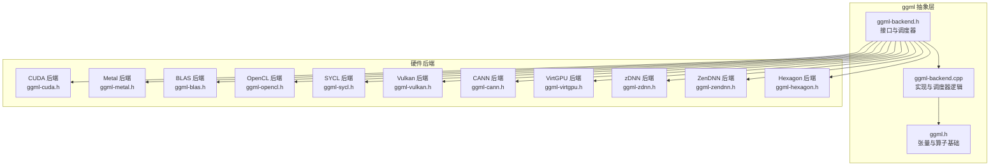
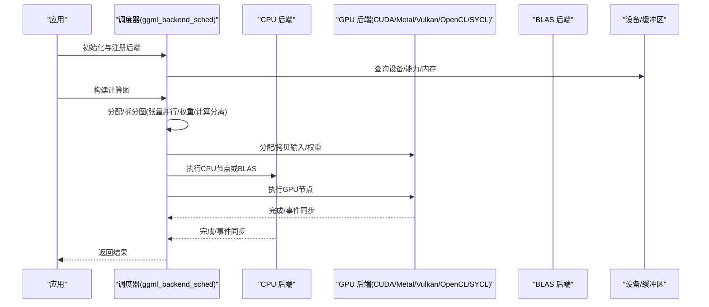
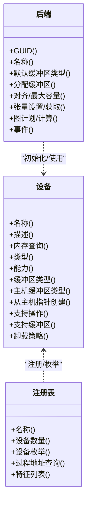

# 硬件后端支持

<cite>
**本文引用的文件**
- [ggml-backend.h](file://ggml/include/ggml-backend.h)
- [ggml-backend.cpp](file://ggml/src/ggml-backend.cpp)
- [ggml.h](file://ggml/include/ggml.h)
- [ggml-cuda.h](file://ggml/include/ggml-cuda.h)
- [ggml-metal.h](file://ggml/include/ggml-metal.h)
- [ggml-opencl.h](file://ggml/include/ggml-opencl.h)
- [ggml-blas.h](file://ggml/include/ggml-blas.h)
- [ggml-sycl.h](file://ggml/include/ggml-sycl.h)
- [ggml-vulkan.h](file://ggml/include/ggml-vulkan.h)
- [ggml-cpu.h](file://ggml/include/ggml-cpu.h)
- [ggml-cann.h](file://ggml/include/ggml-cann.h)
- [ggml-hexagon.h](file://ggml/include/ggml-hexagon.h)
- [README.md](file://README.md)
- [docs/backend/CUDA-FEDORA.md](file://docs/backend/CUDA-FEDORA.md)
- [docs/backend/OPENCL.md](file://docs/backend/OPENCL.md)
- [docs/backend/OPENVINO.md](file://docs/backend/OPENVINO.md)
- [docs/backend/SYCL.md](file://docs/backend/SYCL.md)
- [docs/backend/VirtGPU/development.md](file://docs/backend/VirtGPU/development.md)
- [docs/backend/ZenDNN.md](file://docs/backend/ZenDNN.md)
- [docs/backend/zDNN.md](file://docs/backend/zDNN.md)
- [docs/backend/snapdragon/README.md](file://docs/backend/snapdragon/README.md)
</cite>

## 目录
1. [简介](#简介)
2. [项目结构](#项目结构)
3. [核心组件](#核心组件)
4. [架构总览](#架构总览)
5. [详细组件分析](#详细组件分析)
6. [依赖关系分析](#依赖关系分析)
7. [性能考量](#性能考量)
8. [故障排除指南](#故障排除指南)
9. [结论](#结论)
10. [附录](#附录)

## 简介
本文件系统性梳理 llama.cpp 的硬件后端体系，重点覆盖以下方面：
- 各硬件后端（CUDA、Metal、BLAS、OpenCL、SYCL、Vulkan、CANN、VirtGPU、zDNN、ZenDNN、Snapdragon Hexagon 等）的特性与适用场景
- ggml 后端抽象层的设计理念、接口规范与调度器工作机制
- 各后端的实现要点（如 GPU 加速、Apple Silicon 优化、CPU 向量化、跨平台 OpenCL 支持等）
- 性能特点、配置选项与后端选择指南
- 新平台接入流程与接口规范
- 常见问题排查与调试建议

## 项目结构
llama.cpp 将“计算图”与“后端执行”解耦，通过 ggml 抽象层统一调度不同硬件后端。核心目录与职责概览：
- ggml/include：后端接口头文件（如 ggml-cuda.h、ggml-metal.h、ggml-blas.h 等），定义后端注册、设备枚举、缓冲区类型、调度器 API 等
- ggml/src：后端抽象层实现（如 ggml-backend.cpp），负责后端注册、设备能力查询、缓冲区分配、图计划与执行、事件同步等
- ggml/src/ggml-cuda、ggml-metal、ggml-opencl、ggml-sycl、ggml-vulkan 等：各后端具体实现
- docs/backend/*：各后端的开发与使用文档
- examples、tools、src：调用示例与工具，展示如何在应用中选择与配置后端

**图表来源**
- [ggml-backend.h](file://ggml/include/ggml-backend.h)
- [ggml-backend.cpp](file://ggml/src/ggml-backend.cpp)
- [ggml.h](file://ggml/include/ggml.h)
- [ggml-cuda.h](file://ggml/include/ggml-cuda.h)
- [ggml-metal.h](file://ggml/include/ggml-metal.h)
- [ggml-blas.h](file://ggml/include/ggml-blas.h)
- [ggml-opencl.h](file://ggml/include/ggml-opencl.h)
- [ggml-sycl.h](file://ggml/include/ggml-sycl.h)
- [ggml-vulkan.h](file://ggml/include/ggml-vulkan.h)
- [ggml-cann.h](file://ggml/include/ggml-cann.h)
- [ggml-hexagon.h](file://ggml/include/ggml-hexagon.h)

**章节来源**
- [ggml-backend.h](file://ggml/include/ggml-backend.h)
- [ggml-backend.cpp](file://ggml/src/ggml-backend.cpp)
- [ggml.h](file://ggml/include/ggml.h)

## 核心组件
- 后端抽象层（ggml-backend.*）
  - 设备与后端注册：通过注册表管理后端设备，支持按名称/类型初始化后端
  - 缓冲区类型与缓冲区：统一内存抽象，支持主机/设备/专用显存等，支持对齐、最大容量、分配大小估算
  - 张量操作：异步/同步数据设置/读取、批量拷贝、事件同步
  - 图执行：图计划创建/释放、异步/同步图计算、调度器（多后端、权重/计算分离、张量并行）
- 张量与算子（ggml.h）
  - 定义张量布局、类型、算子集合、量化类型、图构建与执行等
- 各后端接口（ggml-*.h）
  - 暴露后端初始化、设备枚举、缓冲区类型、主机缓冲区、张量并行切分、设备描述/内存查询等

**章节来源**
- [ggml-backend.h](file://ggml/include/ggml-backend.h)
- [ggml-backend.cpp](file://ggml/src/ggml-backend.cpp)
- [ggml.h](file://ggml/include/ggml.h)

## 架构总览
下图展示了从应用到后端的调用链路与调度器如何在多后端间分配计算与数据搬运。

**图表来源**
- [ggml-backend.h](file://ggml/include/ggml-backend.h)
- [ggml-backend.cpp](file://ggml/src/ggml-backend.cpp)

## 详细组件分析

### CUDA 后端
- 能力与特性
  - 多设备支持、设备计数与描述、显存查询
  - 主机固定缓冲区（提高 CPU/GPU 拷贝效率）、跨设备 allreduce、张量按行切分
  - 支持 cuBLAS（或 HIP/ROCm 对应的 hipBLAS、MUSA 对应的 muBLAS）
- 关键接口
  - 后端初始化、缓冲区类型、主机缓冲区、设备枚举与内存查询、张量并行切分
- 适用场景
  - 高带宽矩阵乘与卷积密集型推理；多 GPU 张量并行；需要快速主机/设备拷贝时启用 pinned host buffer
- 配置与注意事项
  - 可根据模型规模与显存选择主设备与切分策略；注意不同厂商驱动版本差异

**章节来源**
- [ggml-cuda.h](file://ggml/include/ggml-cuda.h)

### Metal 后端（Apple Silicon）
- 能力与特性
  - Apple 平台 GPU 加速；可捕获命令缓冲以进行性能分析；支持设备族检查
- 关键接口
  - 后端初始化、是否 Metal 后端判断、设备族支持检测、捕获下一次计算、注册表
- 适用场景
  - macOS/iOS/tvOS/visionOS 上的本地推理；需要与 Metal 性能工具链配合
- 配置与注意事项
  - 注意设备族兼容性与 Metal 版本；必要时启用命令缓冲捕获定位瓶颈

**章节来源**
- [ggml-metal.h](file://ggml/include/ggml-metal.h)

### BLAS 后端（CPU 向量化）
- 能力与特性
  - 利用 OpenBLAS/BLIS 等高性能库进行矩阵运算；可设置线程数控制并行度
- 关键接口
  - 后端初始化、是否 BLAS 后端判断、设置线程数、注册表
- 适用场景
  - 无独立 GPU 或小规模推理；在多核 CPU 上通过向量化提升吞吐
- 配置与注意事项
  - 线程数与 CPU 核心数匹配；量化模型可进一步降低内存占用

**章节来源**
- [ggml-blas.h](file://ggml/include/ggml-blas.h)

### OpenCL 后端
- 能力与特性
  - 跨平台通用计算后端；支持主机/设备缓冲区类型
- 关键接口
  - 后端初始化、是否 OpenCL 后端判断、缓冲区类型、注册表
- 适用场景
  - 需要跨 GPU/加速器平台运行；部分嵌入式/旧平台
- 配置与注意事项
  - 需要合适的 OpenCL 运行时与设备驱动；注意内存拷贝开销

**章节来源**
- [ggml-opencl.h](file://ggml/include/ggml-opencl.h)

### SYCL 后端
- 能力与特性
  - 跨架构（Intel/ARM/AMD/NVIDIA 等）统一编程模型；设备枚举、描述、内存查询
  - 支持主机固定缓冲区（注释说明不支持注册）
- 关键接口
  - 后端初始化、缓冲区类型、设备枚举与描述、内存查询、注册表
- 适用场景
  - 需要在多种异构平台上复用同一套内核；Intel GPU/多厂商异构环境
- 配置与注意事项
  - 选择合适的 SYCL 后端（如 oneAPI/DPC++）与设备；关注主机缓冲区限制

**章节来源**
- [ggml-sycl.h](file://ggml/include/ggml-sycl.h)

### Vulkan 后端
- 能力与特性
  - 跨平台图形与计算 API；设备枚举、描述、内存查询、主机固定缓冲区
- 关键接口
  - 后端初始化、设备枚举与描述、内存查询、缓冲区类型、注册表
- 适用场景
  - 需要跨平台 GPU 计算；与 Vulkan 工具链结合进行性能分析
- 配置与注意事项
  - 需要 Vulkan 运行时与驱动；注意内存拷贝与同步成本

**章节来源**
- [ggml-vulkan.h](file://ggml/include/ggml-vulkan.h)

### 其他后端
- CANN（华为昇腾）
  - 提供后端注册接口，适合在华为 AI 芯片上部署
- VirtGPU（虚拟 GPU）
  - 文档侧重开发与配置，适合容器化/云环境
- zDNN / ZenDNN（IBM Z）
  - 面向 IBM z/OS 平台的深度学习优化
- Snapdragon（高通）
  - 移动/边缘侧神经网络加速，文档涵盖开发者指南与平台说明

**章节来源**
- [ggml-cann.h](file://ggml/include/ggml-cann.h)
- [ggml-zdnn.h](file://ggml/include/ggml-zdnn.h)
- [ggml-zendnn.h](file://ggml/include/ggml-zendnn.h)
- [ggml-virtgpu.h](file://ggml/include/ggml-virtgpu.h)
- [ggml-hexagon.h](file://ggml/include/ggml-hexagon.h)
- [docs/backend/CANN.md](file://docs/backend/CANN.md)
- [docs/backend/VirtGPU/development.md](file://docs/backend/VirtGPU/development.md)
- [docs/backend/zDNN.md](file://docs/backend/zDNN.md)
- [docs/backend/ZenDNN.md](file://docs/backend/ZenDNN.md)
- [docs/backend/snapdragon/README.md](file://docs/backend/snapdragon/README.md)

## 依赖关系分析
- 接口契约
  - 后端通过注册表暴露名称、设备数量、设备枚举、过程地址查询等
  - 设备提供缓冲区类型、主机缓冲区类型、从主机指针直接创建缓冲区的能力、能力位（异步、事件、主机固定缓冲等）
  - 后端提供默认缓冲区类型、张量设置/获取、图计划与计算、事件等
- 调度器耦合
  - 调度器根据“支持的操作”“缓冲区用途（权重/计算）”“张量位置”自动分配节点到后端
  - 支持张量并行（按轴切分）、元设备（Meta）包装多设备、通信回调（allreduce）

**图表来源**
- [ggml-backend.h](file://ggml/include/ggml-backend.h)
- [ggml-backend.cpp](file://ggml/src/ggml-backend.cpp)

**章节来源**
- [ggml-backend.h](file://ggml/include/ggml-backend.h)
- [ggml-backend.cpp](file://ggml/src/ggml-backend.cpp)

## 性能考量
- 内存与拷贝
  - 使用主机固定缓冲区可显著降低 CPU/GPU 拷贝延迟（CUDA、SYCL 等支持）
  - 合理划分“权重缓冲区（权重）”与“计算缓冲区（激活）”，减少跨后端拷贝
- 并行与调度
  - 张量并行（按行切分）可扩展至多 GPU；注意 allreduce 与通信开销
  - 调度器会尽量让使用“权重缓冲区”的节点在同后端执行，减少搬运
- 算子与数据类型
  - 量化（Q4/Q8/BF16 等）可降低内存与带宽压力，但可能影响精度
  - BLAS 后端在 CPU 上通过向量化与多线程获得良好吞吐
- 设备选择
  - 有独立 GPU 且显存充足优先 CUDA/Metal/Vulkan/SYCL
  - 无独立 GPU 或小模型可选 BLAS/CPU 后端
  - 跨平台需求可用 OpenCL/Vulkan/SYCL

[本节为通用性能讨论，无需列出具体文件来源]

## 故障排除指南
- 设备不可用或驱动问题
  - CUDA：确认驱动与 CUDA 版本匹配；参考发行版安装文档
  - Metal：确认设备族支持与系统版本；必要时启用命令缓冲捕获
  - Vulkan：确认运行时与驱动；检查设备枚举与内存查询
  - OpenCL：确认运行时与设备驱动；检查缓冲区类型与拷贝路径
  - SYCL：确认所选后端（如 oneAPI）与设备；注意主机缓冲区限制
- 显存不足
  - 减少批大小、使用量化、启用张量并行切分、降低序列长度
- 性能异常
  - 开启主机固定缓冲区（若后端支持）
  - 检查调度器是否正确将权重与计算放在同一后端
  - 使用后端提供的设备描述/内存查询接口诊断
- 调试建议
  - 启用日志与错误回调；必要时使用后端特定工具（如 Metal 性能分析、Vulkan 工具链）
  - 对比不同后端输出一致性（比较后端 API）

**章节来源**
- [docs/backend/CUDA-FEDORA.md](file://docs/backend/CUDA-FEDORA.md)
- [docs/backend/OPENCL.md](file://docs/backend/OPENCL.md)
- [docs/backend/OPENVINO.md](file://docs/backend/OPENVINO.md)
- [docs/backend/SYCL.md](file://docs/backend/SYCL.md)
- [ggml-backend.h](file://ggml/include/ggml-backend.h)

## 结论
llama.cpp 的硬件后端体系以 ggml 抽象层为核心，通过统一的设备/后端/缓冲区/调度器接口，实现了对 CUDA、Metal、BLAS、OpenCL、SYCL、Vulkan、CANN、VirtGPU、zDNN、ZenDNN、Snapdragon Hexagon 等多种硬件平台的支持。合理选择后端、配置缓冲区与调度策略，可在不同硬件上取得最佳性能与稳定性。

[本节为总结性内容，无需列出具体文件来源]

## 附录

### 后端选择指南（基于场景）
- 需要极致 GPU 吞吐且有 NVIDIA 设备：CUDA
- Apple 生态设备（macOS/iOS/tvOS/visionOS）：Metal
- 跨平台通用计算：OpenCL/Vulkan/SYCL
- 无独立 GPU 或小模型：BLAS/CPU
- 华为昇腾芯片：CANN
- IBM Z 平台：zDNN/ZenDNN
- 虚拟化/容器化环境：VirtGPU
- 高通移动/边缘：Snapdragon Hexagon

[本节为概念性指导，无需列出具体文件来源]

### 新平台接入流程（接口规范与实现要求）
- 接口规范
  - 实现后端注册表（名称、设备枚举、过程地址查询、特征列表）
  - 实现设备接口（名称/描述/类型/能力/缓冲区类型/主机缓冲区/从主机指针创建/支持操作/支持缓冲区/卸载策略）
  - 实现后端接口（名称/GUID/默认缓冲区类型/分配/张量设置/图计划/事件）
  - 提供缓冲区类型与缓冲区实现（对齐、最大容量、分配大小估算、清空、memset、set/get/copy 等）
- 实现要求
  - 支持异步操作与事件同步（若设备支持）
  - 提供主机固定缓冲区类型（若支持）以优化拷贝
  - 提供设备枚举与内存查询接口
  - 在调度器层面支持张量并行与元设备包装
- 示例参考
  - CUDA/Metal/Vulkan/OpenCL/SYCL/BLAS 的接口与实现可作为新后端的参考模板

**章节来源**
- [ggml-backend.h](file://ggml/include/ggml-backend.h)
- [ggml-backend.cpp](file://ggml/src/ggml-backend.cpp)
- [ggml-cuda.h](file://ggml/include/ggml-cuda.h)
- [ggml-metal.h](file://ggml/include/ggml-metal.h)
- [ggml-opencl.h](file://ggml/include/ggml-opencl.h)
- [ggml-vulkan.h](file://ggml/include/ggml-vulkan.h)
- [ggml-sycl.h](file://ggml/include/ggml-sycl.h)
- [ggml-blas.h](file://ggml/include/ggml-blas.h)