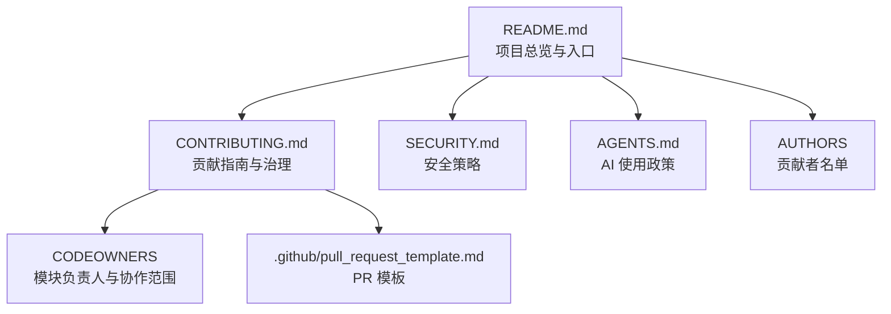
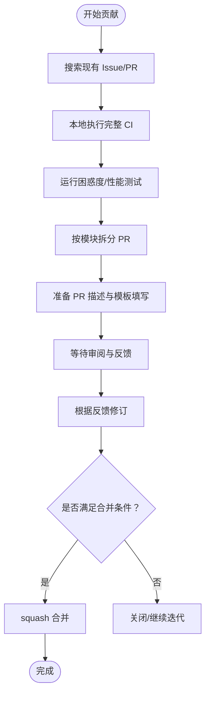
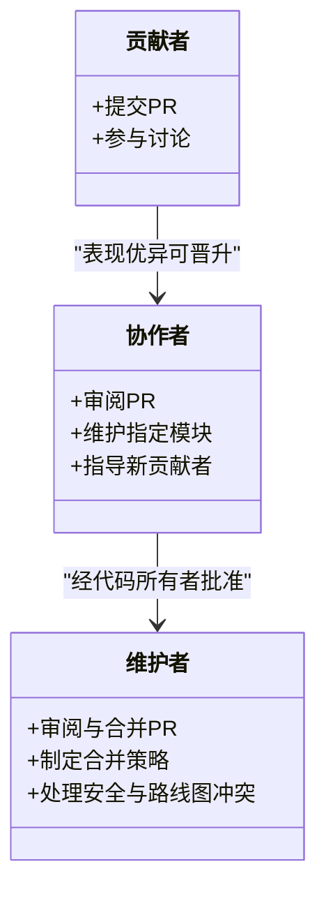
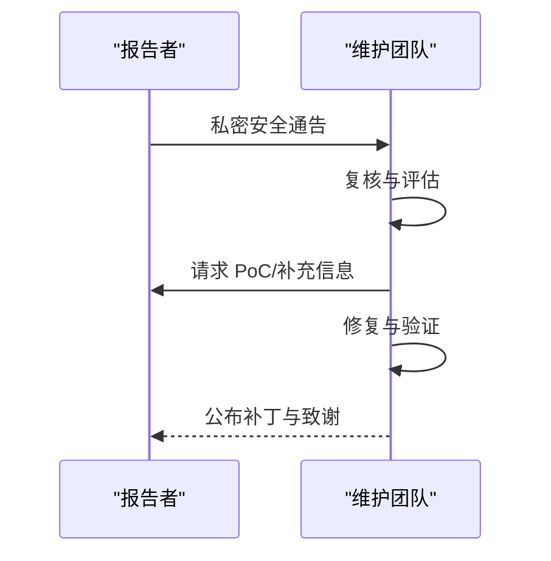
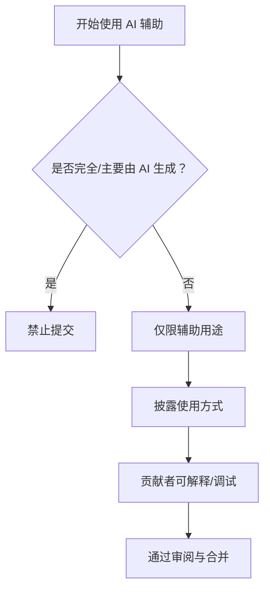
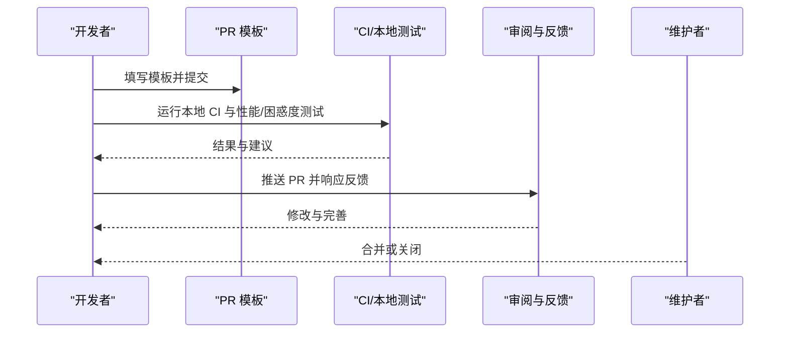
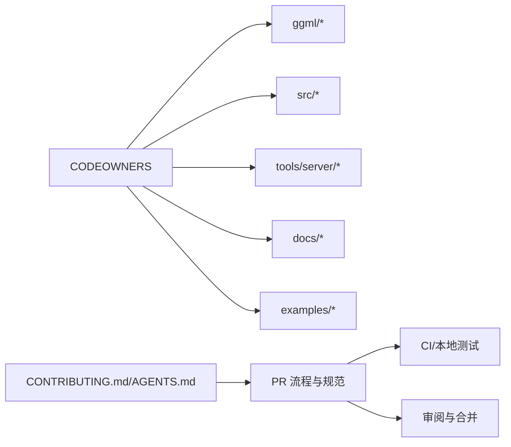

# 社区和贡献

<cite>
**本文引用的文件**
- [CONTRIBUTING.md](file://CONTRIBUTING.md)
- [README.md](file://README.md)
- [AGENTS.md](file://AGENTS.md)
- [.github/pull_request_template.md](file://.github/pull_request_template.md)
- [CODEOWNERS](file://CODEOWNERS)
- [SECURITY.md](file://SECURITY.md)
- [AUTHORS](file://AUTHORS)
</cite>

## 目录
1. [简介](#简介)
2. [项目结构](#项目结构)
3. [核心组件](#核心组件)
4. [架构总览](#架构总览)
5. [详细组件分析](#详细组件分析)
6. [依赖关系分析](#依赖关系分析)
7. [性能考量](#性能考量)
8. [故障排查指南](#故障排查指南)
9. [结论](#结论)
10. [附录](#附录)

## 简介
本章节面向希望参与 llama.cpp 项目的贡献者与使用者，系统性介绍项目的社区生态、治理结构、贡献流程、代码审查标准、安全策略、致谢与贡献者认可机制，以及文档与翻译贡献方式。内容基于仓库内现有文档与配置文件整理而成，帮助新老贡献者快速理解如何高质量地参与项目。

## 项目结构
llama.cpp 是一个以 C/C++ 实现的大模型推理库，围绕 ggml 张量库构建，支持多后端（CPU、CUDA、Metal、Vulkan、SYCL 等），并提供命令行工具、HTTP 服务端、量化转换脚本、示例应用等。项目通过 CODEOWNERS 明确各模块的维护者与协作范围；通过 GitHub Issues/PRs 与 Discussions 承载社区交流；通过 SECURITY.md 规范漏洞披露流程；通过 AGENTS.md 与 CONTRIBUTING.md 统一 AI 使用与贡献规范。

图表来源
- [README.md](file://README.md)
- [CONTRIBUTING.md](file://CONTRIBUTING.md)
- [SECURITY.md](file://SECURITY.md)
- [AGENTS.md](file://AGENTS.md)
- [CODEOWNERS](file://CODEOWNERS)
- [.github/pull_request_template.md](file://.github/pull_request_template.md)
- [AUTHORS](file://AUTHORS)

章节来源
- [README.md](file://README.md)
- [CONTRIBUTING.md](file://CONTRIBUTING.md)
- [SECURITY.md](file://SECURITY.md)
- [AGENTS.md](file://AGENTS.md)
- [CODEOWNERS](file://CODEOWNERS)
- [.github/pull_request_template.md](file://.github/pull_request_template.md)
- [AUTHORS](file://AUTHORS)

## 核心组件
- 贡献者等级与职责
  - 贡献者：曾为项目做出过贡献的个人，无特殊权限。
  - 协作者（Triage）：对部分代码有维护责任，负责审阅与跟进所负责模块的 PR。
  - 维护者：负责审阅与合并 PR，需经代码所有者批准。
- AI 使用政策
  - 不接受完全或主要由 AI 生成的 PR；AI 工具仅可作为辅助。
  - 若使用 AI 生成了代码，必须披露使用方式、进行人工复核、能逐行解释、且不得用 AI 代写报告/请求/描述/讨论回复等。
- 贡献流程（PR）
  - 提交前：搜索已有 PR/Issues；在本地执行完整 CI；验证困惑度与性能；按模块拆分 PR；优先实现 CPU 支持，再扩展到其他后端；新增数据类型需满足额外评测要求。
  - 提交后：配合修改意见；保持 PR 新鲜度；可允许审阅者直接推送修改；新贡献者建议一次只开一个 PR。
  - 维护者合并：采用 squash 合并；提交标题格式规范；尊重维护者拒绝审阅/关闭 PR 的权利（如重复、已列入路线图/分配给他人、违反指南等）。
- 代码审查与质量
  - 遵循编码与命名规范；避免引入第三方依赖与冗余文件；保持跨平台兼容；尽量使用基础语法与清晰布局；矩阵乘法约定与张量维度说明见指南。
- 文档与资源
  - 文档是社区共同维护；可在头文件中补充 API 使用摘要；发现错误或过时信息及时更新；GitHub Issues/PR/Discussions 与项目看板是知识宝库。

章节来源
- [CONTRIBUTING.md](file://CONTRIBUTING.md)
- [AGENTS.md](file://AGENTS.md)

## 架构总览
下图展示社区治理与贡献流程的关键节点与交互：

图表来源
- [CONTRIBUTING.md](file://CONTRIBUTING.md)
- [.github/pull_request_template.md](file://.github/pull_request_template.md)

章节来源
- [CONTRIBUTING.md](file://CONTRIBUTING.md)
- [.github/pull_request_template.md](file://.github/pull_request_template.md)

## 详细组件分析

### 治理结构与角色
- 贡献者/协作者/维护者三级角色定义明确，职责边界清晰。
- CODEOWNERS 文件列出各模块与子目录的负责人，便于定向审阅与问题分流。
- 维护者拥有合并权限与最终裁决权，同时强调长期维护责任。

图表来源
- [CONTRIBUTING.md](file://CONTRIBUTING.md)
- [CODEOWNERS](file://CODEOWNERS)

章节来源
- [CONTRIBUTING.md](file://CONTRIBUTING.md)
- [CODEOWNERS](file://CODEOWNERS)

### 安全策略与漏洞披露
- 仅对受保护范围内的组件进行私密披露；服务器 Web UI、实验性/不推荐用于不可信环境的功能不在覆盖范围内。
- 披露需提供可复现 PoC；团队有合理时间修复后再公开；协作者可协助审阅私密披露。
- 使用建议涵盖不受信任模型/输入、数据隐私、网络与多租户隔离等场景。

图表来源
- [SECURITY.md](file://SECURITY.md)

章节来源
- [SECURITY.md](file://SECURITY.md)

### AI 使用政策与合规
- 明确禁止完全/主要由 AI 生成的 PR；AI 只能用于辅助（学习探索、机械任务、文档草稿、在贡献者已设计好的方案上加速实现）。
- 必须披露 AI 的使用情况；贡献者需能独立解释与调试代码；不得用 AI 代写 PR 描述、评论回复等。
- 对 AI 编码代理的约束：不得代写 PR 描述/评论/提交；必须在贡献者充分理解的前提下推进；优先小而可维护的改动。

图表来源
- [AGENTS.md](file://AGENTS.md)
- [CONTRIBUTING.md](file://CONTRIBUTING.md)

章节来源
- [AGENTS.md](file://AGENTS.md)
- [CONTRIBUTING.md](file://CONTRIBUTING.md)

### 贡献流程与 PR 模板
- 提交前：搜索现有工作、本地 CI、性能与困惑度验证、按模块拆分、CPU 优先、新增数据类型需额外评测。
- 提交后：配合修改、保持活跃、允许审阅者推送、新贡献者限制 PR 数量。
- 维护者：squash 合并、标题格式规范、尊重拒绝审阅/关闭的权利。
- PR 模板要求阅读并同意贡献指南、披露 AI 使用情况。

图表来源
- [CONTRIBUTING.md](file://CONTRIBUTING.md)
- [.github/pull_request_template.md](file://.github/pull_request_template.md)

章节来源
- [CONTRIBUTING.md](file://CONTRIBUTING.md)
- [.github/pull_request_template.md](file://.github/pull_request_template.md)

### 代码审查标准与质量要求
- 编码风格：避免第三方依赖、跨平台兼容、基础语法、清晰布局、尺寸化整数类型、结构体声明规范等。
- 命名规范：snake_case、最长公共前缀优化、枚举大写前缀、类方法命名模式、类型后缀 _t 等。
- 维护性：新增/修改大块代码需添加 CI 与硬件支持；遵循现有模式；server 变更需参考服务端开发文档。
- 数据与张量：行主序存储、矩阵乘法约定、维度标注等。

章节来源
- [CONTRIBUTING.md](file://CONTRIBUTING.md)

### 文档贡献与翻译
- 文档是社区共同维护；发现错误或过时信息应及时更新；可在头文件中补充 API 使用摘要以便未来查阅。
- 项目 README 中提供了大量外部文档链接与开发指南入口，便于贡献者查找与补充。

章节来源
- [CONTRIBUTING.md](file://CONTRIBUTING.md)
- [README.md](file://README.md)

### 致谢与贡献者认可
- 项目维护者会邀请有显著贡献的人成为协作者；贡献者名单由自动生成脚本维护。
- 社区资源与支持渠道：GitHub Issues/PR/Discussions、项目看板、相关项目链接等。

章节来源
- [CONTRIBUTING.md](file://CONTRIBUTING.md)
- [AUTHORS](file://AUTHORS)
- [README.md](file://README.md)

## 依赖关系分析
- 模块与负责人映射：CODEOWNERS 将各目录/子模块与具体维护者/团队绑定，确保问题能快速定位到合适的人。
- 贡献流程与政策：CONTRIBUTING.md 与 AGENTS.md 为 PR 流程与 AI 使用提供统一约束；PR 模板确保每次提交符合最低要求。

图表来源
- [CODEOWNERS](file://CODEOWNERS)
- [CONTRIBUTING.md](file://CONTRIBUTING.md)
- [AGENTS.md](file://AGENTS.md)

章节来源
- [CODEOWNERS](file://CODEOWNERS)
- [CONTRIBUTING.md](file://CONTRIBUTING.md)
- [AGENTS.md](file://AGENTS.md)

## 性能考量
- 在 PR 提交前需使用提供的工具链验证困惑度与性能，避免对现有指标产生负面影响。
- 新增数据类型需提供与 FP16/BF16 的困惑度对比、KL 散度数据与纯 CPU 性能对比，以证明其价值与可维护性。

章节来源
- [CONTRIBUTING.md](file://CONTRIBUTING.md)

## 故障排查指南
- 安全问题：严格按 SECURITY.md 的私密披露流程进行，提供可复现 PoC，避免公开讨论。
- 贡献问题：遵循 CONTRIBUTING.md 的 PR 规范与 AGENTS.md 的 AI 使用政策；若被拒绝审阅/关闭，先对照政策与现有工作，再针对性改进。
- 本地验证：在提交前执行完整 CI、性能与困惑度测试，确保变更不会降低质量。

章节来源
- [SECURITY.md](file://SECURITY.md)
- [CONTRIBUTING.md](file://CONTRIBUTING.md)
- [AGENTS.md](file://AGENTS.md)

## 结论
llama.cpp 的社区与贡献体系以清晰的角色分工、严格的 AI 使用政策、完善的审阅与合并流程为核心，辅以安全披露机制与文档维护规范，保障项目的长期健康演进。新贡献者应从搜索现有工作、本地验证、按模块拆分 PR 开始，严格遵守编码与命名规范，并在需要时主动披露 AI 使用情况。协作者与维护者则承担起模块维护与长期支持的责任，确保变更的质量与可持续性。

## 附录
- 新贡献者入门建议
  - 阅读 CONTRIBUTING.md 与 AGENTS.md，理解角色、流程与规范。
  - 从“good first issue”入手，选择小型、明确的任务。
  - 在本地完成 CI 与性能/困惑度测试，确保 PR 可被顺利审阅。
  - 保持沟通简洁、直接，尊重审阅者的时间与专业判断。
- 社区资源与支持渠道
  - GitHub Issues/PR/Discussions、项目看板、相关项目链接等。
- 文档贡献与翻译
  - 发现错误或过时信息及时更新；在头文件中补充 API 使用摘要；遵循现有文档风格与结构。

章节来源
- [README.md](file://README.md)
- [CONTRIBUTING.md](file://CONTRIBUTING.md)
- [AGENTS.md](file://AGENTS.md)