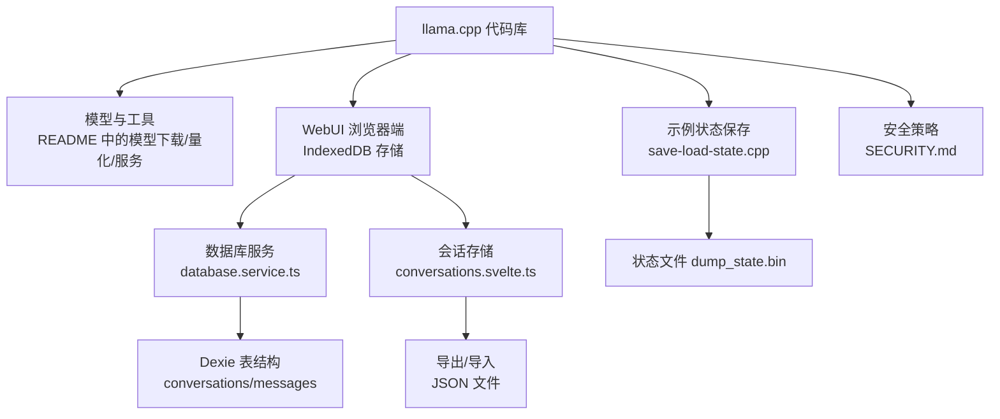
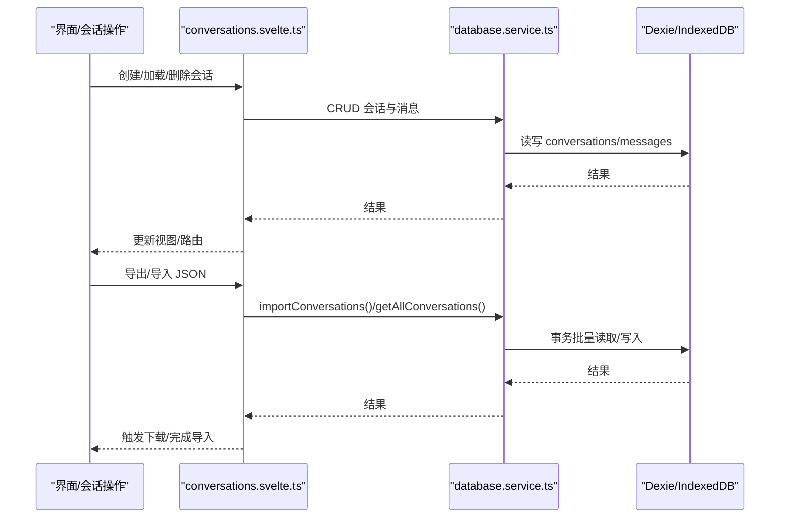
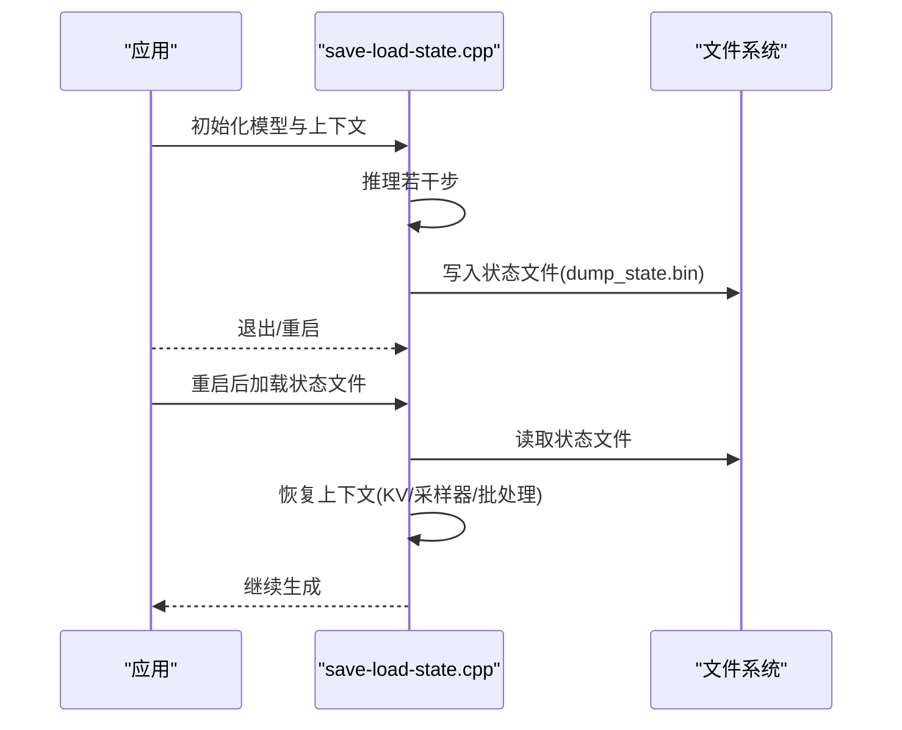
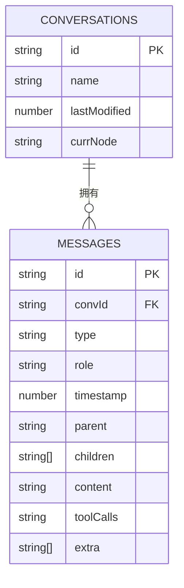
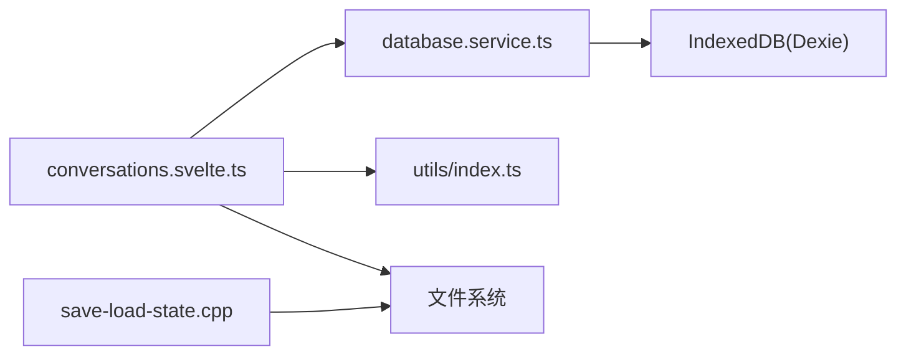

# 备份恢复

<cite>
**本文引用的文件**   
- [README.md](file://README.md)
- [SECURITY.md](file://SECURITY.md)
- [CONTRIBUTING.md](file://CONTRIBUTING.md)
- [save-load-state.cpp](file://examples/save-load-state/save-load-state.cpp)
- [database.service.ts](file://tools/server/webui/src/lib/services/database.service.ts)
- [conversations.svelte.ts](file://tools/server/webui/src/lib/stores/conversations.svelte.ts)
- [index.ts](file://tools/server/webui/src/lib/utils/index.ts)
- [database-flow.md](file://tools/server/webui/docs/flows/database-flow.md)
- [conversations-flow.md](file://tools/server/webui/docs/flows/conversations-flow.md)
</cite>

## 目录
1. [简介](#简介)
2. [项目结构](#项目结构)
3. [核心组件](#核心组件)
4. [架构总览](#架构总览)
5. [详细组件分析](#详细组件分析)
6. [依赖关系分析](#依赖关系分析)
7. [性能考量](#性能考量)
8. [故障排查指南](#故障排查指南)
9. [结论](#结论)
10. [附录](#附录)

## 简介
本文件面向 llama.cpp 的生产与运维场景，系统性地建立“模型文件、配置文件、运行状态、数据库与持久化数据”的完整备份与恢复策略，并配套灾难恢复计划、数据迁移与版本升级的备份要求、备份验证与恢复测试流程、安全与可靠性保障、自动化脚本与监控告警建议，以及备份数据生命周期管理与清理策略。文档以仓库中现有实现为依据，结合浏览器端 IndexedDB 存储与示例状态保存能力，给出可落地的实践路径。

## 项目结构
围绕备份与恢复的关键位置如下：
- 模型与工具：README 中描述了模型获取、量化与服务启动等能力，是备份对象的重要来源与目标。
- 浏览器端 WebUI 数据持久化：使用 IndexedDB（Dexie）进行对话与消息的本地存储，支持导出/导入与分支导航。
- 示例状态保存：提供将推理上下文（KV 缓存、采样器状态等）序列化到文件的能力，用于会话级恢复。
- 安全与合规：安全策略对输入、模型来源、网络传输等提出要求，直接影响备份与恢复过程中的数据处理方式。

图表来源
- [README.md: 297-443:297-443](file://README.md#L297-L443)
- [database.service.ts: 1-492:1-492](file://tools/server/webui/src/lib/services/database.service.ts#L1-L492)
- [conversations.svelte.ts: 1-800:1-800](file://tools/server/webui/src/lib/stores/conversations.svelte.ts#L1-L800)
- [save-load-state.cpp: 1-239:1-239](file://examples/save-load-state/save-load-state.cpp#L1-L239)
- [SECURITY.md: 51-98:51-98](file://SECURITY.md#L51-L98)

章节来源
- [README.md: 297-443:297-443](file://README.md#L297-L443)
- [SECURITY.md: 51-98:51-98](file://SECURITY.md#L51-L98)

## 核心组件
- 模型文件与元数据
  - 来源：Hugging Face 或其他托管平台；转换为 GGUF 后由 CLI/服务器加载。
  - 备份对象：GGUF 模型文件、量化参数、转换脚本产物、HF 缓存索引。
- 配置文件与运行状态
  - 配置：CLI/服务器参数、模板、语法约束、MCP 服务器覆盖等。
  - 运行状态：推理上下文（KV 缓存、采样器状态、批处理状态）。
- 数据库与持久化数据（浏览器端）
  - IndexedDB（Dexie）：会话与消息树、当前节点、MCP 覆盖、附件等。
  - 导出/导入：JSON 文件，支持按会话或全量导出。
- 安全与合规
  - 输入与模型来源的隔离、哈希校验、网络传输加密、多租户隔离等。

章节来源
- [README.md: 297-443:297-443](file://README.md#L297-L443)
- [database.service.ts: 1-492:1-492](file://tools/server/webui/src/lib/services/database.service.ts#L1-L492)
- [conversations.svelte.ts: 1-800:1-800](file://tools/server/webui/src/lib/stores/conversations.svelte.ts#L1-L800)
- [save-load-state.cpp: 1-239:1-239](file://examples/save-load-state/save-load-state.cpp#L1-L239)
- [SECURITY.md: 51-98:51-98](file://SECURITY.md#L51-L98)

## 架构总览
下图展示浏览器端 WebUI 的数据库层、会话存储层与导出/导入流程之间的交互，以及与 IndexedDB 的映射关系。

图表来源
- [database-flow.md: 1-175:1-175](file://tools/server/webui/docs/flows/database-flow.md#L1-L175)
- [conversations-flow.md: 1-184:1-184](file://tools/server/webui/docs/flows/conversations-flow.md#L1-L184)
- [database.service.ts: 1-492:1-492](file://tools/server/webui/src/lib/services/database.service.ts#L1-L492)
- [conversations.svelte.ts: 1-800:1-800](file://tools/server/webui/src/lib/stores/conversations.svelte.ts#L1-L800)

## 详细组件分析

### 组件一：模型文件备份与恢复
- 全量备份
  - 备份内容：GGUF 模型文件、量化参数、转换脚本产物、HF 缓存索引。
  - 建议策略：定期扫描模型目录，生成清单并归档；对大文件采用分块校验与去重。
- 增量备份
  - 基于时间戳或哈希变化检测；仅同步变更文件。
- 恢复流程
  - 将备份文件还原至原模型目录；校验哈希一致性；重新注册/索引。
- 版本升级与迁移
  - 升级前先做全量备份；如涉及格式变更，先在测试环境验证转换脚本与兼容性。
- 安全与可靠性
  - 使用只读挂载与最小权限；对传输链路启用加密；对备份介质进行访问控制与异地存放。

章节来源
- [README.md: 297-443:297-443](file://README.md#L297-L443)

### 组件二：配置文件备份与恢复
- 备份对象
  - CLI/服务器参数文件、模板文件、语法约束文件、MCP 服务器覆盖（localStorage）。
- 备份策略
  - 全量：打包配置目录；增量：基于文件变更事件。
- 恢复流程
  - 将配置文件回放到对应路径；重启服务使新配置生效。
- 注意事项
  - 不同部署环境的参数差异需单独维护；敏感参数（如密钥）应加密存储。

章节来源
- [conversations.svelte.ts: 79-106:79-106](file://tools/server/webui/src/lib/stores/conversations.svelte.ts#L79-L106)
- [index.ts: 161-162:161-162](file://tools/server/webui/src/lib/utils/index.ts#L161-L162)

### 组件三：运行状态备份与恢复（推理上下文）
- 能力来源
  - 示例程序提供将推理上下文（KV 缓存、采样器状态等）保存到文件的能力。
- 备份策略
  - 全量：在关键节点调用保存接口，生成状态文件；增量：记录状态文件大小与时间戳，仅同步变化部分。
- 恢复流程
  - 在相同模型与参数条件下加载状态文件，重建上下文后继续生成。
- 注意事项
  - 状态文件与模型版本强耦合；不同后端/线程数可能不兼容；需严格版本匹配与一致性校验。

图表来源
- [save-load-state.cpp: 1-239:1-239](file://examples/save-load-state/save-load-state.cpp#L1-L239)

章节来源
- [save-load-state.cpp: 1-239:1-239](file://examples/save-load-state/save-load-state.cpp#L1-L239)

### 组件四：数据库与持久化数据（IndexedDB）备份与恢复
- 数据模型
  - conversations 表：会话元数据（ID、名称、最后修改时间、当前节点等）。
  - messages 表：消息树（ID、会话ID、类型、角色、时间戳、父/子节点等）。
- 备份策略
  - 全量：导出所有会话与消息为 JSON；增量：基于 lastModified 或时间窗口筛选。
- 恢复流程
  - 从 JSON 导入时跳过已存在的会话；确保父子关系与当前节点一致性。
- 分支与导航
  - 支持兄弟节点切换、叶子节点查找、级联删除等操作；导入时保留分支完整性。
- 导出/导入实现要点
  - 会话存储负责生成文件名、触发下载、解析上传文件并调用数据库服务导入。

图表来源
- [database.service.ts: 5-17:5-17](file://tools/server/webui/src/lib/services/database.service.ts#L5-L17)

章节来源
- [database.service.ts: 1-492:1-492](file://tools/server/webui/src/lib/services/database.service.ts#L1-L492)
- [conversations.svelte.ts: 745-800:745-800](file://tools/server/webui/src/lib/stores/conversations.svelte.ts#L745-L800)
- [database-flow.md: 1-175:1-175](file://tools/server/webui/docs/flows/database-flow.md#L1-L175)
- [conversations-flow.md: 1-184:1-184](file://tools/server/webui/docs/flows/conversations-flow.md#L1-L184)

### 组件五：灾难恢复计划设计与演练
- 场景设计
  - 模型损坏/丢失、配置丢失、IndexedDB 数据库损坏、状态文件不可用。
- 恢复步骤
  - 快速定位最近可用备份；验证哈希与完整性；按顺序恢复模型/配置/数据库/状态；进行功能回归测试。
- 演练频率
  - 至少每季度一次；关键业务环境每月一次。
- 记录与评审
  - 详细记录演练过程与耗时；针对暴露的问题优化流程与工具。

章节来源
- [SECURITY.md: 51-98:51-98](file://SECURITY.md#L51-L98)

### 组件六：数据迁移与版本升级的备份要求
- 升级前
  - 对模型、配置、数据库与状态文件执行全量备份；记录当前版本与参数。
- 升级中
  - 如涉及格式变更，先在测试环境验证转换脚本与兼容性；逐步灰度。
- 升级后
  - 执行一致性校验与性能回归测试；回滚通道准备就绪。
- 版本回退
  - 优先使用最近一次全量备份；必要时回退到上一个稳定版本。

章节来源
- [README.md: 297-443:297-443](file://README.md#L297-L443)

### 组件七：备份验证与恢复测试流程
- 验证清单
  - 备份完整性（文件数量、大小、哈希）、可恢复性（恢复后能正常启动）、数据一致性（消息树、当前节点、标题生成）。
- 自动化测试
  - 编写脚本执行“备份→恢复→校验”闭环；集成到 CI/CD。
- 回归测试
  - 恢复后运行典型对话、分支导航、导出/导入等关键路径。

章节来源
- [conversations-flow.md: 162-184:162-184](file://tools/server/webui/docs/flows/conversations-flow.md#L162-L184)

### 组件八：备份存储的安全性与可靠性保障
- 安全
  - 传输加密、访问控制、最小权限原则；对敏感配置与状态文件加密存储。
- 可靠性
  - 多副本与异地容灾；定期校验与健康检查；备份介质轮换与销毁策略。
- 合规
  - 遵循组织与行业安全策略；审计日志与变更追踪。

章节来源
- [SECURITY.md: 51-98:51-98](file://SECURITY.md#L51-L98)

### 组件九：自动化备份脚本与监控告警配置
- 自动化脚本建议
  - 模型备份：定时扫描模型目录，生成清单与哈希，归档到远端存储。
  - 配置备份：监听配置文件变更，增量同步到备份系统。
  - 数据库备份：定时导出 JSON 并上传；失败重试与通知。
  - 状态备份：在关键节点触发保存，周期性校验状态文件有效性。
- 监控告警
  - 备份任务成功率、完成时间、存储容量、网络异常、哈希校验失败等指标告警。

章节来源
- [README.md: 297-443:297-443](file://README.md#L297-L443)
- [database.service.ts: 379-406:379-406](file://tools/server/webui/src/lib/services/database.service.ts#L379-L406)

### 组件十：备份数据生命周期管理与清理策略
- 生命周期
  - 保留期：根据法规与业务需求设定；到期自动归档或销毁。
- 清理策略
  - 定期清理过期备份；去重与压缩；介质回收与安全擦除。
- 审计
  - 记录每次清理操作与责任人；定期审计合规性。

## 依赖关系分析
- 浏览器端 WebUI 依赖 IndexedDB（Dexie）进行数据持久化；会话存储通过数据库服务封装 CRUD；导出/导入由会话存储驱动。
- 示例状态保存依赖模型上下文与采样器状态，输出二进制状态文件，供后续恢复使用。
- 安全策略影响备份与恢复过程中的数据处理方式，如输入预处理、网络传输加密、多租户隔离等。

图表来源
- [conversations.svelte.ts: 1-800:1-800](file://tools/server/webui/src/lib/stores/conversations.svelte.ts#L1-L800)
- [database.service.ts: 1-492:1-492](file://tools/server/webui/src/lib/services/database.service.ts#L1-L492)
- [index.ts: 1-196:1-196](file://tools/server/webui/src/lib/utils/index.ts#L1-L196)
- [save-load-state.cpp: 1-239:1-239](file://examples/save-load-state/save-load-state.cpp#L1-L239)

章节来源
- [conversations.svelte.ts: 1-800:1-800](file://tools/server/webui/src/lib/stores/conversations.svelte.ts#L1-L800)
- [database.service.ts: 1-492:1-492](file://tools/server/webui/src/lib/services/database.service.ts#L1-L492)
- [index.ts: 1-196:1-196](file://tools/server/webui/src/lib/utils/index.ts#L1-L196)
- [save-load-state.cpp: 1-239:1-239](file://examples/save-load-state/save-load-state.cpp#L1-L239)

## 性能考量
- 备份性能
  - 对大模型文件采用并行与分块策略；对数据库导出采用流式写入；对状态文件采用增量保存。
- 恢复性能
  - 优先恢复索引与元数据；延迟加载非关键资源；缓存热点数据。
- 资源占用
  - 控制并发度与内存峰值；避免长时间阻塞主线程。

## 故障排查指南
- 模型相关
  - 哈希不一致：核对来源与完整性；重新下载或转换。
  - 格式不兼容：确认模型版本与后端支持情况；必要时重新转换。
- 配置相关
  - 参数缺失：检查配置文件是否完整；回滚到最近一次备份。
- 数据库相关
  - 导入重复：确认导入逻辑是否跳过已存在会话；检查 ID 冲突。
  - 分支异常：检查父子关系与当前节点一致性；必要时重建路径。
- 状态相关
  - 加载失败：确认模型版本与参数一致；检查状态文件完整性与可读性。

章节来源
- [database.service.ts: 379-406:379-406](file://tools/server/webui/src/lib/services/database.service.ts#L379-L406)
- [save-load-state.cpp: 105-110:105-110](file://examples/save-load-state/save-load-state.cpp#L105-L110)

## 结论
通过将模型文件、配置、运行状态与浏览器端 IndexedDB 数据纳入统一的备份体系，并结合灾难恢复演练、自动化脚本与监控告警，可以显著提升 llama.cpp 生产环境的可靠性与可维护性。建议以“全量+增量”双轨备份为核心，配合严格的版本与一致性校验，确保在任何异常情况下都能快速、准确地恢复业务。

## 附录
- 关键实现参考
  - 模型与工具：[README.md: 297-443:297-443](file://README.md#L297-L443)
  - 数据库服务：[database.service.ts: 1-492:1-492](file://tools/server/webui/src/lib/services/database.service.ts#L1-L492)
  - 会话存储与导出/导入：[conversations.svelte.ts: 745-800:745-800](file://tools/server/webui/src/lib/stores/conversations.svelte.ts#L745-L800)
  - 示例状态保存：[save-load-state.cpp: 1-239:1-239](file://examples/save-load-state/save-load-state.cpp#L1-L239)
  - 安全策略：[SECURITY.md: 51-98:51-98](file://SECURITY.md#L51-L98)
- 流程图参考
  - 数据库流程：[database-flow.md: 1-175:1-175](file://tools/server/webui/docs/flows/database-flow.md#L1-L175)
  - 会话流程：[conversations-flow.md: 1-184:1-184](file://tools/server/webui/docs/flows/conversations-flow.md#L1-L184)