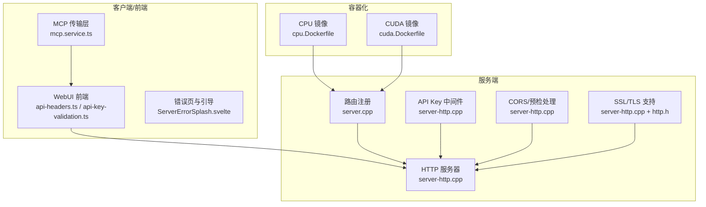
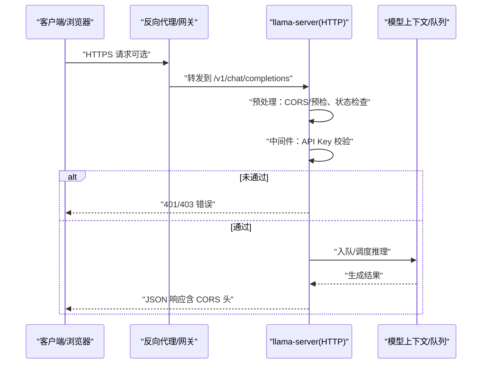
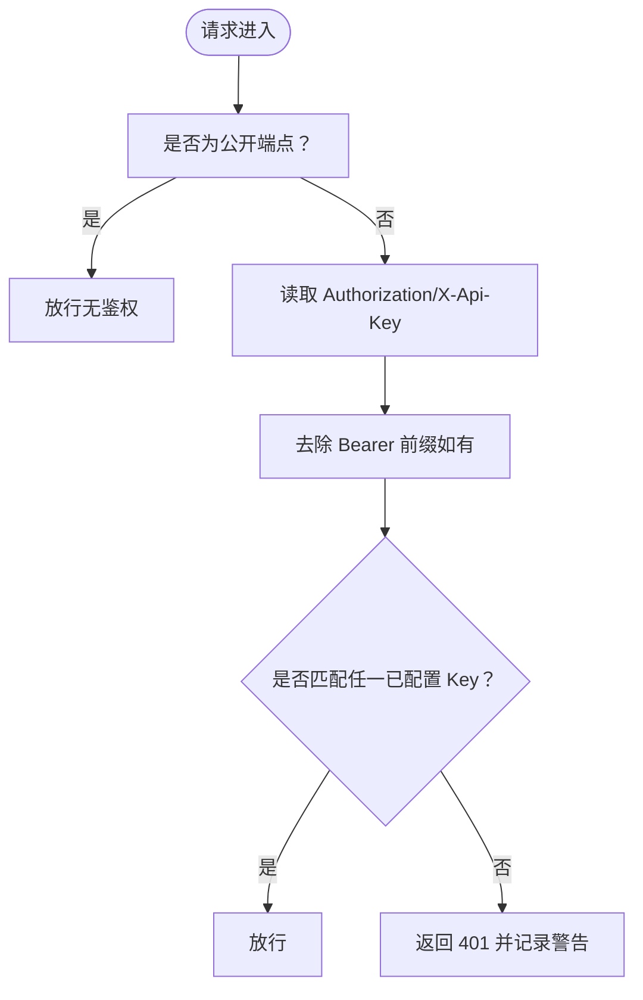
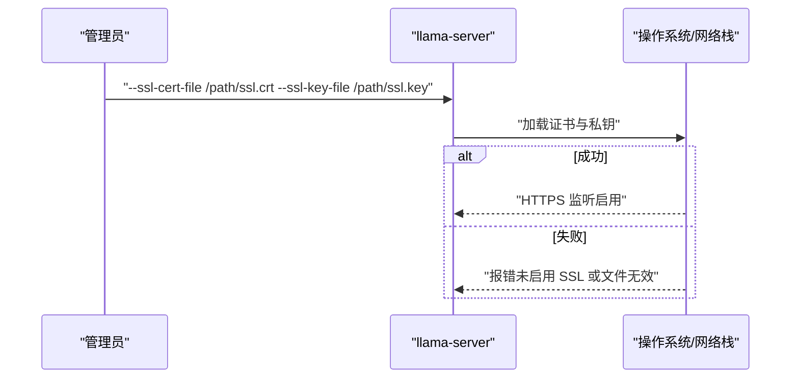
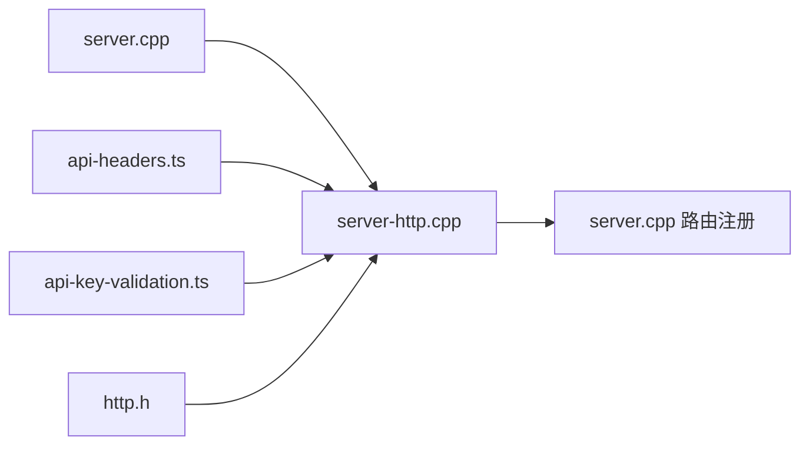

# 安全加固

<cite>
**本文引用的文件**
- [SECURITY.md](file://SECURITY.md)
- [README.md](file://README.md)
- [server-http.cpp](file://tools/server/server-http.cpp)
- [server.cpp](file://tools/server/server.cpp)
- [arg.cpp](file://common/arg.cpp)
- [http.h](file://common/http.h)
- [cpu.Dockerfile](file://.devops/cpu.Dockerfile)
- [cuda.Dockerfile](file://.devops/cuda.Dockerfile)
- [api-key-validation.ts](file://tools/server/webui/src/lib/utils/api-key-validation.ts)
- [api-headers.ts](file://tools/server/webui/src/lib/utils/api-headers.ts)
- [ServerErrorSplash.svelte](file://tools/server/webui/src/lib/components/app/server/ServerErrorSplash.svelte)
- [mcp.service.ts](file://tools/server/webui/src/lib/services/mcp.service.ts)
- [download.cpp](file://common/download.cpp)
</cite>

## 目录
1. [引言](#引言)
2. [项目结构](#项目结构)
3. [核心组件](#核心组件)
4. [架构总览](#架构总览)
5. [详细组件分析](#详细组件分析)
6. [依赖关系分析](#依赖关系分析)
7. [性能考量](#性能考量)
8. [故障排查指南](#故障排查指南)
9. [结论](#结论)
10. [附录](#附录)

## 引言
本文件面向 llama.cpp 在生产环境中的安全加固，围绕访问控制与身份认证、网络安全（TLS/SSL 证书与防火墙）、数据保护（敏感信息与传输安全）、容器安全（只读文件系统与最小权限）、模型与用户数据访问控制、安全审计与合规、漏洞扫描与更新策略、以及安全事件响应与应急处置等方面，提供可操作的策略与实施建议。内容基于仓库中现有实现与文档进行提炼，并结合通用安全最佳实践。

## 项目结构
llama.cpp 提供多种运行形态：命令行工具、服务端（OpenAI 兼容 API）与 WebUI。服务端通过 HTTP 暴露 REST 接口，支持 API Key 认证、CORS 处理、健康检查与基础 SSL/TLS 能力；WebUI 提供前端交互与认证头管理；容器化构建脚本提供多架构与后端（CPU/CUDA）镜像基线。

图示来源
- [server-http.cpp:114-246](file://tools/server/server-http.cpp#L114-L246)
- [server.cpp:172-225](file://tools/server/server.cpp#L172-L225)
- [api-headers.ts:9-24](file://tools/server/webui/src/lib/utils/api-headers.ts#L9-L24)
- [api-key-validation.ts:10-45](file://tools/server/webui/src/lib/utils/api-key-validation.ts#L10-L45)
- [cpu.Dockerfile:83-92](file://.devops/cpu.Dockerfile#L83-L92)
- [cuda.Dockerfile:89-98](file://.devops/cuda.Dockerfile#L89-L98)

章节来源
- [README.md:375-443](file://README.md#L375-L443)
- [server-http.cpp:114-246](file://tools/server/server-http.cpp#L114-L246)
- [server.cpp:172-225](file://tools/server/server.cpp#L172-L225)

## 核心组件
- HTTP 服务器与中间件：负责监听端口、设置超时、CORS、SSL/TLS、请求日志、异常处理、健康检查与状态机（未就绪返回 503），以及 API Key 校验中间件。
- 路由注册：在 server.cpp 中集中注册健康、指标、模型列表、补全、聊天、嵌入、重排等接口，并对实验性功能（如 CORS Proxy、内置工具）给出安全提示。
- 认证与授权：支持单个或多个 API Key，校验 Authorization 或 X-Api-Key 头，公开端点（如 /health、/models）跳过校验。
- 网络安全：在编译期启用 SSL/TLS 时，支持加载证书与私钥；HTTP 客户端侧在 HTTPS 不可用时抛出明确错误。
- 容器化：提供 CPU 与 CUDA 双镜像，统一 HEALTHCHECK，入口参数暴露主机绑定与端口配置。
- 前端安全：WebUI 提供 Bearer Token 头注入、敏感头红化显示、错误页引导输入 API Key 并验证。

章节来源
- [server-http.cpp:114-246](file://tools/server/server-http.cpp#L114-L246)
- [server.cpp:172-225](file://tools/server/server.cpp#L172-L225)
- [arg.cpp:2923-2936](file://common/arg.cpp#L2923-L2936)
- [http.h:68-95](file://common/http.h#L68-L95)
- [cpu.Dockerfile:83-92](file://.devops/cpu.Dockerfile#L83-L92)
- [cuda.Dockerfile:89-98](file://.devops/cuda.Dockerfile#L89-L98)
- [api-headers.ts:9-24](file://tools/server/webui/src/lib/utils/api-headers.ts#L9-L24)
- [api-key-validation.ts:10-45](file://tools/server/webui/src/lib/utils/api-key-validation.ts#L10-L45)
- [ServerErrorSplash.svelte:58-92](file://tools/server/webui/src/lib/components/app/server/ServerErrorSplash.svelte#L58-L92)

## 架构总览
下图展示生产部署中的典型访问链路：客户端/前端 → 反向代理/网关（可选）→ 服务端（API Key 校验、CORS、SSL/TLS）→ 模型推理与队列。

图示来源
- [server-http.cpp:228-246](file://tools/server/server-http.cpp#L228-L246)
- [server.cpp:172-225](file://tools/server/server.cpp#L172-L225)

## 详细组件分析

### 访问控制与身份认证
- API Key 管理
  - 支持单个或多个 API Key，启动时仅打印末尾若干字符以降低泄露风险。
  - 校验逻辑：忽略 Authorization 头前缀“Bearer ”，允许使用 X-Api-Key 头作为备选；命中任一即放行；否则返回 401。
  - 公开端点豁免：/health、/v1/health、/models、/v1/models、根路径与静态资源不校验。
- 前端集成
  - WebUI 自动注入 Authorization: Bearer 头；敏感头值在日志/调试中被红化。
  - 错误页检测 401/403 并引导用户重新输入 API Key，验证成功后自动跳转首页。
- 实验性功能限制
  - CORS Proxy 与内置工具为实验特性，文档明确提示不要在不受信任环境暴露。

图示来源
- [server-http.cpp:140-196](file://tools/server/server-http.cpp#L140-L196)
- [api-headers.ts:9-24](file://tools/server/webui/src/lib/utils/api-headers.ts#L9-L24)
- [ServerErrorSplash.svelte:58-92](file://tools/server/webui/src/lib/components/app/server/ServerErrorSplash.svelte#L58-L92)

章节来源
- [server-http.cpp:128-196](file://tools/server/server-http.cpp#L128-L196)
- [api-key-validation.ts:10-45](file://tools/server/webui/src/lib/utils/api-key-validation.ts#L10-L45)
- [server.cpp:208-225](file://tools/server/server.cpp#L208-L225)

### OAuth 集成说明
- 当前服务端实现未内置 OAuth 协议支持。若需对接外部身份提供商（如 OIDC/OAuth2），建议通过前置反向代理（如 Nginx、Envoy、Keycloak、Auth0）完成认证与令牌发放，服务端仍以 API Key 进行细粒度访问控制。
- 前端 WebUI 已具备标准 Bearer Token 注入能力，可配合代理颁发的访问令牌使用。

章节来源
- [server-http.cpp:162-173](file://tools/server/server-http.cpp#L162-L173)
- [api-headers.ts:9-24](file://tools/server/webui/src/lib/utils/api-headers.ts#L9-L24)

### 网络安全配置（TLS/SSL 与防火墙）
- TLS/SSL
  - 编译期启用 SSL 支持时，可通过命令行参数指定证书与私钥文件路径；运行时加载成功则启用 HTTPS。
  - 若未启用 SSL 功能却传入证书/密钥，将记录错误并拒绝启动。
  - HTTP 客户端侧在 HTTPS 不受支持时抛出明确错误，避免静默失败。
- 防火墙与监听
  - 默认绑定到 0.0.0.0 的 8080 端口（容器镜像中设置），建议在生产中限定绑定地址并开启防火墙策略，仅放行必要端口。
  - 健康检查使用 curl 访问 /health，便于容器编排平台进行存活探针。

图示来源
- [server-http.cpp:61-77](file://tools/server/server-http.cpp#L61-L77)
- [arg.cpp:2923-2936](file://common/arg.cpp#L2923-L2936)
- [http.h:75-84](file://common/http.h#L75-L84)
- [cpu.Dockerfile:83-89](file://.devops/cpu.Dockerfile#L83-L89)

章节来源
- [server-http.cpp:61-77](file://tools/server/server-http.cpp#L61-L77)
- [arg.cpp:2923-2936](file://common/arg.cpp#L2923-L2936)
- [http.h:68-95](file://common/http.h#L68-L95)
- [cpu.Dockerfile:83-92](file://.devops/cpu.Dockerfile#L83-L92)

### 数据保护（敏感信息与传输安全）
- 敏感信息处理
  - 启动日志仅打印 API Key 末尾字符片段，避免泄露完整密钥。
  - WebUI 对敏感头值进行红化显示，减少日志泄露风险。
- 传输安全
  - 通过 HTTPS 通道传输，避免明文传输；客户端侧对不支持 HTTPS 的场景给出明确错误。
  - 建议在反向代理层强制启用 TLS1.2+/强密码套件与 HSTS。

章节来源
- [server-http.cpp:128-134](file://tools/server/server-http.cpp#L128-L134)
- [api-headers.ts:38-45](file://tools/server/webui/src/lib/utils/api-headers.ts#L38-L45)
- [http.h:75-84](file://common/http.h#L75-L84)

### 容器安全最佳实践
- 最小权限与只读文件系统
  - 使用非 root 用户运行（镜像未显式设置，建议在编排层添加 runAsUser/runAsGroup）。
  - 将容器根文件系统挂载为只读，仅挂载必要的卷（模型、日志、配置）。
- 镜像基线
  - CPU 与 CUDA 镜像均设置 HEALTHCHECK，便于编排平台进行自愈。
  - 建议固定镜像版本标签，启用镜像签名与漏洞扫描。
- 网络隔离
  - 限制容器对外出站连接，仅放行必要域名（如模型下载源）。
  - 使用网络策略隔离不同租户实例。

章节来源
- [cpu.Dockerfile:83-92](file://.devops/cpu.Dockerfile#L83-L92)
- [cuda.Dockerfile:89-98](file://.devops/cuda.Dockerfile#L89-L98)

### 模型文件与用户数据访问控制
- 模型文件
  - 建议将模型目录映射为只读卷，避免容器内写入；通过参数传递模型路径，确保路径可控。
- 用户数据
  - 严格区分请求体与响应体中的敏感字段，避免在日志中输出；WebUI 已对头部进行红化。
  - 对上传的多部分表单数据进行大小限制与类型校验，防止滥用。

章节来源
- [server-http.cpp:438-482](file://tools/server/server-http.cpp#L438-L482)
- [api-headers.ts:38-45](file://tools/server/webui/src/lib/utils/api-headers.ts#L38-L45)

### 安全审计与合规
- 日志与可观测性
  - 服务器对常规健康/模型端点请求进行抑制日志，避免噪声；其他端点记录请求与响应摘要。
  - 建议接入集中式日志系统，对 401/403、5xx、异常堆栈进行告警。
- 合规性
  - 对外暴露的 API 应满足最小权限原则；对敏感端点（如 /models、/slots）进行更严格的访问控制。
  - 多租户场景需确保租户间隔离与资源配额，参考安全策略文档中的多租户章节。

章节来源
- [server-http.cpp:34-52](file://tools/server/server-http.cpp#L34-L52)
- [SECURITY.md:87-98](file://SECURITY.md#L87-L98)

### 漏洞扫描与安全更新策略
- 供应链安全
  - 容器镜像构建阶段安装依赖后清理缓存与临时文件，减少漏洞面。
  - 对第三方依赖（如 OpenSSL、cpp-httplib）定期升级，关注 CVE 公告。
- 运行时安全
  - 通过 HEALTHCHECK 与日志监控发现异常；对异常请求（大量 429/401）进行限速与封禁。
  - 对模型下载与远程加载进行白名单与哈希校验（参考安全策略文档的模型与输入处理建议）。

章节来源
- [cpu.Dockerfile:38-44](file://.devops/cpu.Dockerfile#L38-L44)
- [cuda.Dockerfile:43-49](file://.devops/cuda.Dockerfile#L43-L49)
- [SECURITY.md:51-98](file://SECURITY.md#L51-L98)

### 安全事件响应与应急处置
- 快速处置
  - 发现 401/403 高频或异常 5xx 时，立即检查 API Key 泄露、中间件异常与队列阻塞。
  - 对受影响实例执行滚动重启，回滚至上一个稳定镜像版本。
- 证据保全
  - 保留最近 7 天的日志与指标，导出异常请求的请求头与查询参数（注意脱敏）。
- 复盘与修复
  - 更新 API Key，必要时启用多 Key 轮换；加强前端与后端的头部红化与异常处理。
  - 对外发布安全公告，说明影响范围与缓解措施。

章节来源
- [server.cpp:38-72](file://tools/server/server.cpp#L38-L72)
- [ServerErrorSplash.svelte:58-92](file://tools/server/webui/src/lib/components/app/server/ServerErrorSplash.svelte#L58-L92)

## 依赖关系分析
- 组件耦合
  - server.cpp 作为入口，初始化 HTTP 上下文与路由；HTTP 中间件与路由紧密耦合，认证与状态检查在预路由阶段执行。
  - WebUI 通过 api-headers.ts 注入认证头，api-key-validation.ts 在浏览器侧发起 /props 校验。
- 外部依赖
  - cpp-httplib 提供 HTTP/HTTPS 服务端能力；OpenSSL 可选编译开关决定是否启用。
  - 容器镜像基于 Ubuntu/CUDA 运行时，依赖系统库与运行时组件。

图示来源
- [server.cpp:172-225](file://tools/server/server.cpp#L172-L225)
- [server-http.cpp:114-246](file://tools/server/server-http.cpp#L114-L246)
- [api-headers.ts:9-24](file://tools/server/webui/src/lib/utils/api-headers.ts#L9-L24)
- [api-key-validation.ts:10-45](file://tools/server/webui/src/lib/utils/api-key-validation.ts#L10-L45)
- [http.h:68-95](file://common/http.h#L68-L95)

## 性能考量
- 线程池与并发
  - HTTP 服务器根据并发与硬件核数动态配置线程池，避免过多动态线程导致资源争用。
- 超时与健康
  - 设置读/写超时，防止慢连接占用资源；健康检查用于快速发现不可用实例。
- 多租户隔离
  - 多租户场景建议独立进程/容器实例，避免共享 KV 缓存造成资源竞争与数据串扰。

章节来源
- [server-http.cpp:248-260](file://tools/server/server-http.cpp#L248-L260)
- [server.cpp:300-350](file://tools/server/server.cpp#L300-L350)
- [SECURITY.md:87-98](file://SECURITY.md#L87-L98)

## 故障排查指南
- 401/403 认证失败
  - 检查 Authorization 头是否正确（含 Bearer 前缀）；确认 API Key 是否在服务端配置列表中。
  - WebUI 错误页会提示无效 API Key，并允许重新输入。
- HTTPS 启动失败
  - 确认编译时启用了 SSL 支持；检查证书与私钥路径与权限。
- 健康检查失败
  - 查看容器日志与 /health 响应；确认监听地址与端口映射正确。
- 实验性功能导致问题
  - CORS Proxy 与内置工具为实验特性，可能带来额外攻击面，建议关闭并在受控环境使用。

章节来源
- [server-http.cpp:162-196](file://tools/server/server-http.cpp#L162-L196)
- [ServerErrorSplash.svelte:58-92](file://tools/server/webui/src/lib/components/app/server/ServerErrorSplash.svelte#L58-L92)
- [server.cpp:208-225](file://tools/server/server.cpp#L208-L225)

## 结论
通过在服务端引入严格的 API Key 中间件、CORS 预检处理与 SSL/TLS 支持，在容器层面落实最小权限与只读文件系统，并在前端实现认证头注入与敏感信息红化，llama.cpp 在生产环境中可达到较高的安全基线。建议进一步完善 OAuth 集成（通过前置代理）、强化多租户隔离、建立持续漏洞扫描与应急响应流程，以满足企业级合规与安全要求。

## 附录
- 关键参数与环境变量
  - --ssl-key-file/--ssl-cert-file：指定 PEM 私钥与证书路径
  - LLAMA_ARG_HOST：容器默认绑定地址
- 建议的生产部署清单
  - 反向代理 + TLS 终止
  - API Key 管理与轮换
  - 容器只读文件系统与最小权限
  - 多租户隔离与资源配额
  - 漏洞扫描与镜像签名
  - 安全事件响应预案与演练

章节来源
- [arg.cpp:2923-2936](file://common/arg.cpp#L2923-L2936)
- [cpu.Dockerfile:83-89](file://.devops/cpu.Dockerfile#L83-L89)
- [SECURITY.md:51-98](file://SECURITY.md#L51-L98)