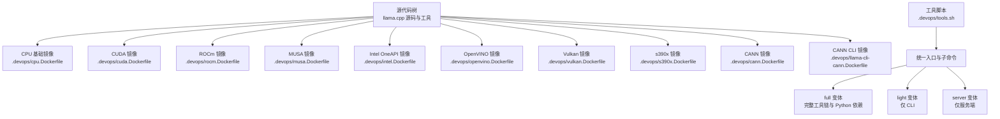
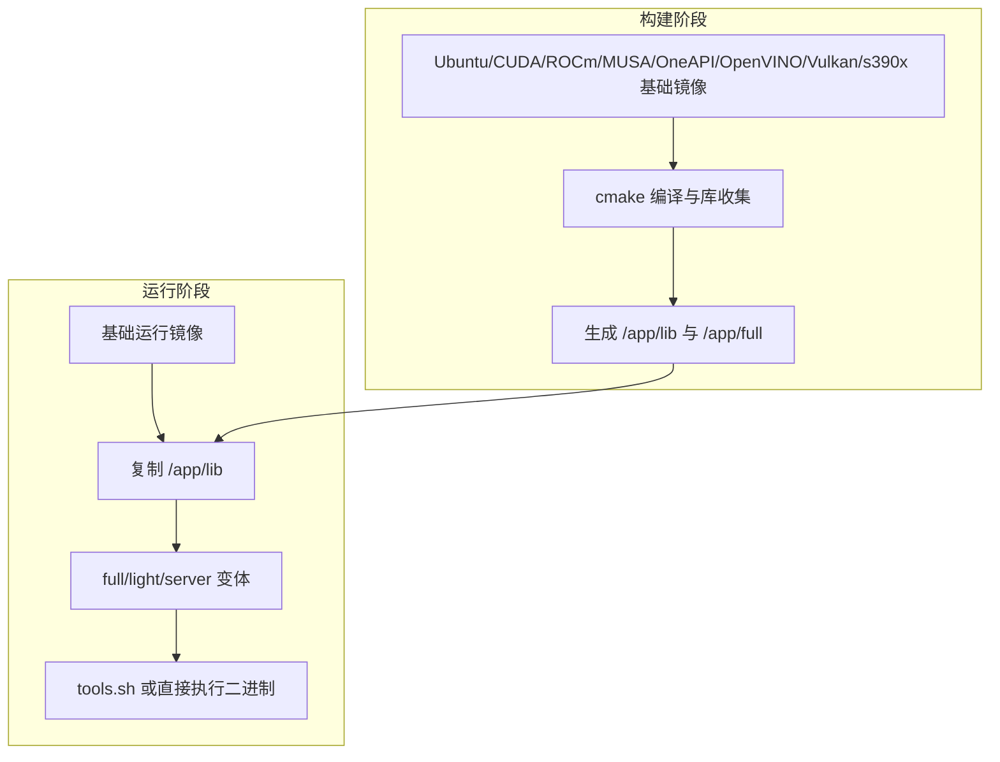
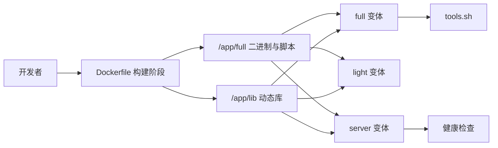

# 容器化部署

<cite>
**本文引用的文件**
- [.devops/cpu.Dockerfile](file://.devops/cpu.Dockerfile)
- [.devops/cuda.Dockerfile](file://.devops/cuda.Dockerfile)
- [.devops/rocm.Dockerfile](file://.devops/rocm.Dockerfile)
- [.devops/musa.Dockerfile](file://.devops/musa.Dockerfile)
- [.devops/intel.Dockerfile](file://.devops/intel.Dockerfile)
- [.devops/openvino.Dockerfile](file://.devops/openvino.Dockerfile)
- [.devops/vulkan.Dockerfile](file://.devops/vulkan.Dockerfile)
- [.devops/s390x.Dockerfile](file://.devops/s390x.Dockerfile)
- [.devops/llama-cli-cann.Dockerfile](file://.devops/llama-cli-cann.Dockerfile)
- [.devops/cann.Dockerfile](file://.devops/cann.Dockerfile)
- [.devops/tools.sh](file://.devops/tools.sh)
- [.devops/llama-cpp-cuda.srpm.spec](file://.devops/llama-cpp-cuda.srpm.spec)
- [.devops/llama-cpp.srpm.spec](file://.devops/llama-cpp.srpm.spec)
- [docs/docker.md](file://docs/docker.md)
</cite>

## 目录
1. [简介](#简介)
2. [项目结构](#项目结构)
3. [核心组件](#核心组件)
4. [架构总览](#架构总览)
5. [详细组件分析](#详细组件分析)
6. [依赖关系分析](#依赖关系分析)
7. [性能考量](#性能考量)
8. [故障排除指南](#故障排除指南)
9. [结论](#结论)
10. [附录](#附录)

## 简介
本文件面向在容器环境中部署 llama.cpp 的工程团队与运维人员，系统性阐述多平台、多后端的 Docker 镜像架构与构建策略，对比 full/light/server 三种镜像变体的差异与适用场景，提供 GPU 加速（CUDA、ROCm、MUSA、CANN、Intel SYCL/OpenCL/Vulkan、OpenVINO）容器化配置要点，以及容器间通信、网络、资源限制、健康检查、重启策略、安全与权限等生产级最佳实践。同时给出基于仓库现有 Dockerfile 的镜像变体选择建议与故障排除思路。

## 项目结构
围绕容器化部署，仓库中与 Docker 相关的关键文件集中在 .devops 目录，按后端/平台拆分，形成“按需构建”的镜像族谱。主要文件如下：
- 多后端 Dockerfile：cpu.Dockerfile、cuda.Dockerfile、rocm.Dockerfile、musa.Dockerfile、intel.Dockerfile、openvino.Dockerfile、vulkan.Dockerfile、s390x.Dockerfile、cann.Dockerfile、llama-cli-cann.Dockerfile
- 工具入口脚本：tools.sh，统一暴露转换、量化、推理、基准测试、服务启动等命令
- RPM 打包规格：llama-cpp.srpm.spec、llama-cpp-cuda.srpm.spec（用于非容器场景的系统级打包参考）
- 文档：docs/docker.md（官方容器使用说明）

图示来源
- [.devops/cpu.Dockerfile:1-92](file://.devops/cpu.Dockerfile#L1-L92)
- [.devops/cuda.Dockerfile:1-98](file://.devops/cuda.Dockerfile#L1-L98)
- [.devops/rocm.Dockerfile:1-114](file://.devops/rocm.Dockerfile#L1-L114)
- [.devops/musa.Dockerfile:1-102](file://.devops/musa.Dockerfile#L1-L102)
- [.devops/intel.Dockerfile:1-113](file://.devops/intel.Dockerfile#L1-L113)
- [.devops/openvino.Dockerfile:1-185](file://.devops/openvino.Dockerfile#L1-L185)
- [.devops/vulkan.Dockerfile:1-95](file://.devops/vulkan.Dockerfile#L1-L95)
- [.devops/s390x.Dockerfile:1-127](file://.devops/s390x.Dockerfile#L1-L127)
- [.devops/cann.Dockerfile:1-131](file://.devops/cann.Dockerfile#L1-L131)
- [.devops/llama-cli-cann.Dockerfile:1-46](file://.devops/llama-cli-cann.Dockerfile#L1-L46)
- [.devops/tools.sh:1-54](file://.devops/tools.sh#L1-L54)

章节来源
- [.devops/cpu.Dockerfile:1-92](file://.devops/cpu.Dockerfile#L1-L92)
- [.devops/cuda.Dockerfile:1-98](file://.devops/cuda.Dockerfile#L1-L98)
- [.devops/rocm.Dockerfile:1-114](file://.devops/rocm.Dockerfile#L1-L114)
- [.devops/musa.Dockerfile:1-102](file://.devops/musa.Dockerfile#L1-L102)
- [.devops/intel.Dockerfile:1-113](file://.devops/intel.Dockerfile#L1-L113)
- [.devops/openvino.Dockerfile:1-185](file://.devops/openvino.Dockerfile#L1-L185)
- [.devops/vulkan.Dockerfile:1-95](file://.devops/vulkan.Dockerfile#L1-L95)
- [.devops/s390x.Dockerfile:1-127](file://.devops/s390x.Dockerfile#L1-L127)
- [.devops/cann.Dockerfile:1-131](file://.devops/cann.Dockerfile#L1-L131)
- [.devops/llama-cli-cann.Dockerfile:1-46](file://.devops/llama-cli-cann.Dockerfile#L1-L46)
- [.devops/tools.sh:1-54](file://.devops/tools.sh#L1-L54)

## 核心组件
- 统一入口脚本 tools.sh：集中封装模型转换、量化、CLI 推理、基准测试、困惑度评估、服务启动等命令，作为 full/light/server 变体的默认入口或可选入口。
- 多后端 Dockerfile：按硬件后端（CPU/CUDA/ROCm/MUSA/Intel/AMD CANN/OpenVINO/Vulkan/s390x）分别定义构建阶段、运行时依赖与目标变体。
- 变体策略：
  - full：包含所有二进制、Python 依赖与工具脚本，适合本地开发与批量处理。
  - light：仅包含 CLI 工具，镜像最小，适合只做推理调用的场景。
  - server：仅包含服务端二进制，内置健康检查，适合对外提供 API 的服务形态。

章节来源
- [.devops/tools.sh:1-54](file://.devops/tools.sh#L1-L54)
- [.devops/cpu.Dockerfile:48-91](file://.devops/cpu.Dockerfile#L48-L91)
- [.devops/cuda.Dockerfile:53-97](file://.devops/cuda.Dockerfile#L53-L97)
- [.devops/rocm.Dockerfile:70-113](file://.devops/rocm.Dockerfile#L70-L113)
- [.devops/musa.Dockerfile:58-101](file://.devops/musa.Dockerfile#L58-L101)
- [.devops/intel.Dockerfile:61-112](file://.devops/intel.Dockerfile#L61-L112)
- [.devops/openvino.Dockerfile:136-184](file://.devops/openvino.Dockerfile#L136-L184)
- [.devops/vulkan.Dockerfile:45-94](file://.devops/vulkan.Dockerfile#L45-L94)
- [.devops/s390x.Dockerfile:72-126](file://.devops/s390x.Dockerfile#L72-L126)
- [.devops/cann.Dockerfile:91-131](file://.devops/cann.Dockerfile#L91-L131)
- [.devops/llama-cli-cann.Dockerfile:1-46](file://.devops/llama-cli-cann.Dockerfile#L1-L46)

## 架构总览
下图展示以 Dockerfile 为骨架的镜像构建与运行架构，强调“按后端分层”“多变体输出”“统一入口脚本”的设计。

图示来源
- [.devops/cpu.Dockerfile:1-92](file://.devops/cpu.Dockerfile#L1-L92)
- [.devops/cuda.Dockerfile:1-98](file://.devops/cuda.Dockerfile#L1-L98)
- [.devops/rocm.Dockerfile:1-114](file://.devops/rocm.Dockerfile#L1-L114)
- [.devops/musa.Dockerfile:1-102](file://.devops/musa.Dockerfile#L1-L102)
- [.devops/intel.Dockerfile:1-113](file://.devops/intel.Dockerfile#L1-L113)
- [.devops/openvino.Dockerfile:1-185](file://.devops/openvino.Dockerfile#L1-L185)
- [.devops/vulkan.Dockerfile:1-95](file://.devops/vulkan.Dockerfile#L1-L95)
- [.devops/s390x.Dockerfile:1-127](file://.devops/s390x.Dockerfile#L1-L127)
- [.devops/cann.Dockerfile:1-131](file://.devops/cann.Dockerfile#L1-L131)

## 详细组件分析

### CPU 镜像（cpu.Dockerfile）
- 特点：通用 CPU 后端，支持多 CPU 架构变体；构建参数启用动态后端加载与 CPU 全变体。
- 变体：
  - full：安装 Python 与依赖，入口为 tools.sh。
  - light：仅复制 CLI 工具，入口为 CLI。
  - server：设置监听地址与健康检查，入口为服务端。

章节来源
- [.devops/cpu.Dockerfile:1-92](file://.devops/cpu.Dockerfile#L1-L92)

### CUDA 镜像（cuda.Dockerfile）
- 特点：基于 NVIDIA CUDA 运行时镜像，支持指定 CUDA 架构；构建启用 CUDA 后端。
- 变体：同上，含 full/light/server，server 默认健康检查访问本地健康端点。

章节来源
- [.devops/cuda.Dockerfile:1-98](file://.devops/cuda.Dockerfile#L1-L98)

### ROCm 镜像（rocm.Dockerfile）
- 特点：基于 rocm/dev-* 开发镜像，设置 AMDGPU_TARGETS 并启用 HIP 后端；构建启用 HIP/ROCWMMA。
- 变体：同上，server 内置健康检查。

章节来源
- [.devops/rocm.Dockerfile:1-114](file://.devops/rocm.Dockerfile#L1-L114)

### MUSA 镜像（musa.Dockerfile）
- 特点：基于 MThreads MUSA 镜像，支持指定 MUSA 架构；构建启用 MUSA 后端。
- 变体：同上，server 内置健康检查。

章节来源
- [.devops/musa.Dockerfile:1-102](file://.devops/musa.Dockerfile#L1-L102)

### Intel（SYCL/OpenCL/Vulkan）镜像（intel.Dockerfile 与 openvino.Dockerfile）
- Intel OneAPI 镜像：基于 Intel DL Essentials，支持 icx/icpx 编译器与 SYCL 后端；可选开启半精度；使用虚拟环境隔离 Python 依赖。
- OpenVINO 镜像：自建 Ubuntu 基础，下载并安装 OpenVINO 运行时与驱动，构建启用 OpenVINO 后端；运行时安装 Intel GPU 与 NPU 驱动包。

章节来源
- [.devops/intel.Dockerfile:1-113](file://.devops/intel.Dockerfile#L1-L113)
- [.devops/openvino.Dockerfile:1-185](file://.devops/openvino.Dockerfile#L1-L185)

### Vulkan 镜像（vulkan.Dockerfile）
- 特点：安装 Vulkan SDK 与相关开发包，构建启用 Vulkan 后端；运行时安装 Vulkan 驱动与 GL 库；使用 uv 创建 Python 虚拟环境。

章节来源
- [.devops/vulkan.Dockerfile:1-95](file://.devops/vulkan.Dockerfile#L1-L95)

### s390x 镜像（s390x.Dockerfile）
- 特点：使用 gcc 基础镜像进行构建，最终以最小化运行镜像输出；通过多阶段构建收集二进制与库，再复制到运行镜像。
- 变体：full/light/server，server 显式暴露 8080 端口。

章节来源
- [.devops/s390x.Dockerfile:1-127](file://.devops/s390x.Dockerfile#L1-L127)

### 华为昇腾（CANN）镜像（cann.Dockerfile 与 llama-cli-cann.Dockerfile）
- 全量 CANN 镜像：基于 Ascend CANN 镜像，设置 Toolkit 环境变量，构建启用 CANN 后端；提供 full/light/server 变体。
- CLI 专用镜像：仅构建并复制 CLI 工具，适合轻量调用场景。

章节来源
- [.devops/cann.Dockerfile:1-131](file://.devops/cann.Dockerfile#L1-L131)
- [.devops/llama-cli-cann.Dockerfile:1-46](file://.devops/llama-cli-cann.Dockerfile#L1-L46)

### 统一入口脚本（tools.sh）
- 功能：解析首个参数，转发到对应子命令（转换、量化、CLI、基准、困惑度、服务），便于容器内统一入口与调试。
- 使用建议：在 full 变体中作为默认入口；在 server 变体中可通过覆盖入口或传参方式调用服务。

章节来源
- [.devops/tools.sh:1-54](file://.devops/tools.sh#L1-L54)

## 依赖关系分析
- 构建期依赖：各后端 Dockerfile 在构建阶段安装编译器、CMake、SSL、OpenCL/OpenVINO/Vulkan/ROCm/MUSA 等头文件与库。
- 运行期依赖：运行镜像安装运行时库（如 libgomp、curl、Vulkan 驱动、OpenCL ICD、Intel GPU/NPU 驱动等）。
- 变体耦合：三类变体（full/light/server）均从同一构建产物复制二进制与库，保持一致性。

图示来源
- [.devops/cpu.Dockerfile:24-33](file://.devops/cpu.Dockerfile#L24-L33)
- [.devops/cuda.Dockerfile:23-38](file://.devops/cuda.Dockerfile#L23-L38)
- [.devops/rocm.Dockerfile:37-55](file://.devops/rocm.Dockerfile#L37-L55)
- [.devops/musa.Dockerfile:28-43](file://.devops/musa.Dockerfile#L28-L43)
- [.devops/intel.Dockerfile:41-51](file://.devops/intel.Dockerfile#L41-L51)
- [.devops/openvino.Dockerfile:48-74](file://.devops/openvino.Dockerfile#L48-L74)
- [.devops/vulkan.Dockerfile:20-29](file://.devops/vulkan.Dockerfile#L20-L29)
- [.devops/s390x.Dockerfile:43-50](file://.devops/s390x.Dockerfile#L43-L50)
- [.devops/cann.Dockerfile:50-62](file://.devops/cann.Dockerfile#L50-L62)
- [.devops/tools.sh:1-54](file://.devops/tools.sh#L1-L54)

## 性能考量
- 构建优化
  - 多阶段构建减少镜像体积，分离构建与运行依赖。
  - 指定后端架构参数（如 CUDA/ROCm/MUSA 架构）可避免过度泛化导致的性能损失。
  - 使用缓存（如 s390x 中的 ccache）提升重复构建速度。
- 运行优化
  - 选择合适变体：仅需要服务端 API 时优先 server，减少 Python 环境开销。
  - 为 GPU 后端准备匹配的驱动与运行时镜像，确保设备可见与内存分配正常。
  - 对 OpenVINO/Intel SYCL 场景，预装驱动与运行时库，避免首次调用的延迟。

章节来源
- [.devops/s390x.Dockerfile:20-33](file://.devops/s390x.Dockerfile#L20-L33)
- [.devops/cuda.Dockerfile:23-27](file://.devops/cuda.Dockerfile#L23-L27)
- [.devops/rocm.Dockerfile:22-44](file://.devops/rocm.Dockerfile#L22-L44)
- [.devops/musa.Dockerfile:28-32](file://.devops/musa.Dockerfile#L28-L32)
- [.devops/openvino.Dockerfile:100-132](file://.devops/openvino.Dockerfile#L100-L132)
- [.devops/intel.Dockerfile:41-51](file://.devops/intel.Dockerfile#L41-L51)

## 故障排除指南
- 健康检查失败
  - server 变体内置健康检查，若失败请确认监听地址与端口、模型加载状态与内存占用。
  - 参考路径：[server 健康检查](file://.devops/cpu.Dockerfile#L89)
- GPU 设备不可见
  - 确认宿主机驱动与容器运行时版本匹配；对 OpenVINO/Intel 场景，检查驱动包安装是否成功。
  - 参考路径：[OpenVINO 驱动安装:106-132](file://.devops/openvino.Dockerfile#L106-L132)，[Intel 驱动安装:41-51](file://.devops/intel.Dockerfile#L41-L51)
- Python 依赖问题
  - full 变体在运行时安装依赖，若失败可尝试使用虚拟环境或固定索引策略。
  - 参考路径：[Python 安装与虚拟环境:69-83](file://.devops/intel.Dockerfile#L69-L83)，[uv 虚拟环境:62-70](file://.devops/vulkan.Dockerfile#L62-L70)
- s390x 运行异常
  - 注意最小化运行镜像缺少部分库，需确保运行时已安装必要依赖。
  - 参考路径：[s390x 运行依赖安装:55-66](file://.devops/s390x.Dockerfile#L55-L66)
- CANN 环境变量
  - 构建与运行阶段均需正确设置 Ascend Toolkit 环境变量，否则无法找到运行库。
  - 参考路径：[CANN 环境变量设置:26-80](file://.devops/cann.Dockerfile#L26-L80)，[CLI CANN 环境变量设置:10-43](file://.devops/llama-cli-cann.Dockerfile#L10-L43)

章节来源
- [.devops/cpu.Dockerfile](file://.devops/cpu.Dockerfile#L89)
- [.devops/openvino.Dockerfile:106-132](file://.devops/openvino.Dockerfile#L106-L132)
- [.devops/intel.Dockerfile:41-51](file://.devops/intel.Dockerfile#L41-L51)
- [.devops/intel.Dockerfile:69-83](file://.devops/intel.Dockerfile#L69-L83)
- [.devops/vulkan.Dockerfile:62-70](file://.devops/vulkan.Dockerfile#L62-L70)
- [.devops/s390x.Dockerfile:55-66](file://.devops/s390x.Dockerfile#L55-L66)
- [.devops/cann.Dockerfile:26-80](file://.devops/cann.Dockerfile#L26-L80)
- [.devops/llama-cli-cann.Dockerfile:10-43](file://.devops/llama-cli-cann.Dockerfile#L10-L43)

## 结论
本仓库提供了覆盖主流 CPU/GPU/异构加速平台的 Dockerfile 族谱，配合 tools.sh 实现统一入口与多场景适配。生产部署建议：
- 依据硬件后端选择对应 Dockerfile 构建镜像；
- 优先使用 server 变体提供对外 API；
- 配置健康检查、资源限制与重启策略；
- 关注运行时驱动与依赖完整性；
- 通过日志与健康检查快速定位问题。

## 附录

### GPU 加速容器配置要点
- CUDA
  - 使用 cuda.Dockerfile，指定 CUDA 架构参数，确保运行时镜像与宿主机驱动匹配。
  - 参考路径：[CUDA 构建与运行:1-98](file://.devops/cuda.Dockerfile#L1-L98)
- ROCm
  - 设置 AMDGPU_TARGETS，启用 HIP 后端；确保运行时镜像包含 ROCm 运行库。
  - 参考路径：[ROCm 构建与运行:1-114](file://.devops/rocm.Dockerfile#L1-L114)
- MUSA
  - 指定 MUSA 架构参数，启用 MUSA 后端；运行时镜像包含 MUSA 运行库。
  - 参考路径：[MUSA 构建与运行:1-102](file://.devops/musa.Dockerfile#L1-L102)
- CANN（昇腾）
  - 设置 Toolkit 环境变量，启用 CANN 后端；可使用全量或 CLI 专用镜像。
  - 参考路径：[CANN 构建与运行:1-131](file://.devops/cann.Dockerfile#L1-L131)，[CLI CANN:1-46](file://.devops/llama-cli-cann.Dockerfile#L1-L46)
- Intel（SYCL/OpenCL/Vulkan）
  - OneAPI 镜像：使用 icx/icpx 编译器，可选半精度；使用虚拟环境。
  - OpenVINO 镜像：预装驱动与运行时库。
  - 参考路径：[Intel 镜像:1-113](file://.devops/intel.Dockerfile#L1-L113)，[OpenVINO 镜像:1-185](file://.devops/openvino.Dockerfile#L1-L185)
- Vulkan
  - 安装 Vulkan SDK 与驱动，启用 Vulkan 后端；使用 uv 虚拟环境。
  - 参考路径：[Vulkan 镜像:1-95](file://.devops/vulkan.Dockerfile#L1-L95)

### 变体选择与适用场景
- full
  - 适用：需要 Python 工具链、批量转换/量化/基准/困惑度、本地开发与调试。
  - 参考路径：[CPU full:48-69](file://.devops/cpu.Dockerfile#L48-L69)，[CUDA full:53-75](file://.devops/cuda.Dockerfile#L53-L75)，[ROCm full:70-91](file://.devops/rocm.Dockerfile#L70-L91)，[MUSA full:58-79](file://.devops/musa.Dockerfile#L58-L79)，[Intel full:61-87](file://.devops/intel.Dockerfile#L61-L87)，[OpenVINO full:136-161](file://.devops/openvino.Dockerfile#L136-L161)，[Vulkan full:45-72](file://.devops/vulkan.Dockerfile#L45-L72)
- light
  - 适用：仅需 CLI 推理，追求最小镜像体积。
  - 参考路径：[CPU light:71-78](file://.devops/cpu.Dockerfile#L71-L78)，[CUDA light:77-84](file://.devops/cuda.Dockerfile#L77-L84)，[ROCm light:93-100](file://.devops/rocm.Dockerfile#L93-L100)，[MUSA light:81-88](file://.devops/musa.Dockerfile#L81-L88)，[Intel light:89-97](file://.devops/intel.Dockerfile#L89-L97)，[OpenVINO light:164-171](file://.devops/openvino.Dockerfile#L164-L171)，[Vulkan light:74-81](file://.devops/vulkan.Dockerfile#L74-L81)，[s390x light:101-110](file://.devops/s390x.Dockerfile#L101-L110)
- server
  - 适用：对外提供 API 服务，内置健康检查。
  - 参考路径：[CPU server:80-91](file://.devops/cpu.Dockerfile#L80-L91)，[CUDA server:86-98](file://.devops/cuda.Dockerfile#L86-L98)，[ROCm server:102-114](file://.devops/rocm.Dockerfile#L102-L114)，[MUSA server:90-102](file://.devops/musa.Dockerfile#L90-L102)，[Intel server:99-112](file://.devops/intel.Dockerfile#L99-L112)，[OpenVINO server:173-184](file://.devops/openvino.Dockerfile#L173-L184)，[Vulkan server:83-95](file://.devops/vulkan.Dockerfile#L83-L95)，[s390x server:113-126](file://.devops/s390x.Dockerfile#L113-L126)

### 生产环境容器编排建议
- 资源限制
  - 为 GPU 容器设置 GPU 可见设备与显存上限（如 nvidia-container-toolkit 的资源约束）。
  - 为 CPU 容器设置 CPU/内存限额，避免争抢。
- 健康检查
  - server 变体已内置健康检查，建议结合外部探针与日志监控。
  - 参考路径：[健康检查定义](file://.devops/cpu.Dockerfile#L89)
- 重启策略
  - 建议使用“始终”重启策略，配合健康检查与日志告警。
- 网络与通信
  - 将容器暴露端口映射到宿主机，确保防火墙放行；跨节点通信建议使用服务网格或反向代理。
- 安全与权限
  - 使用非 root 用户运行（如需）；挂载只读模型目录；限制容器能力（capabilities）；启用只读根文件系统（谨慎使用）。

### 官方文档参考
- 官方 Docker 使用说明：docs/docker.md

章节来源
- [.devops/cpu.Dockerfile](file://.devops/cpu.Dockerfile#L89)
- [.devops/cuda.Dockerfile:86-98](file://.devops/cuda.Dockerfile#L86-L98)
- [.devops/rocm.Dockerfile:102-114](file://.devops/rocm.Dockerfile#L102-L114)
- [.devops/musa.Dockerfile:90-102](file://.devops/musa.Dockerfile#L90-L102)
- [.devops/intel.Dockerfile:99-112](file://.devops/intel.Dockerfile#L99-L112)
- [.devops/openvino.Dockerfile:173-184](file://.devops/openvino.Dockerfile#L173-L184)
- [.devops/vulkan.Dockerfile:83-95](file://.devops/vulkan.Dockerfile#L83-L95)
- [.devops/s390x.Dockerfile:113-126](file://.devops/s390x.Dockerfile#L113-L126)
- [docs/docker.md](file://docs/docker.md)