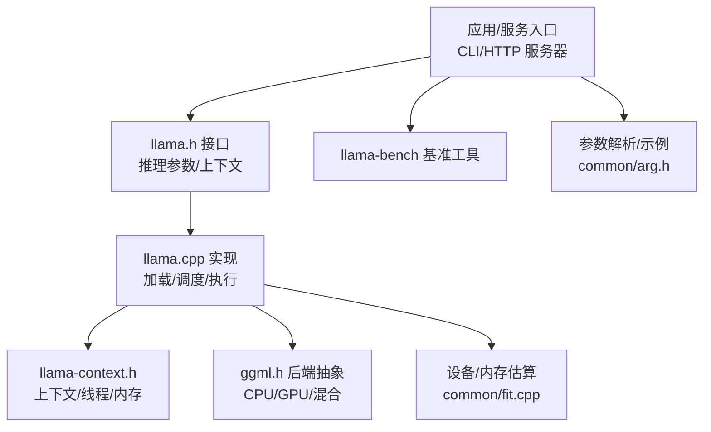
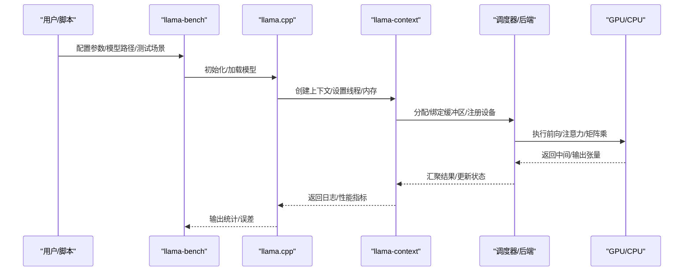
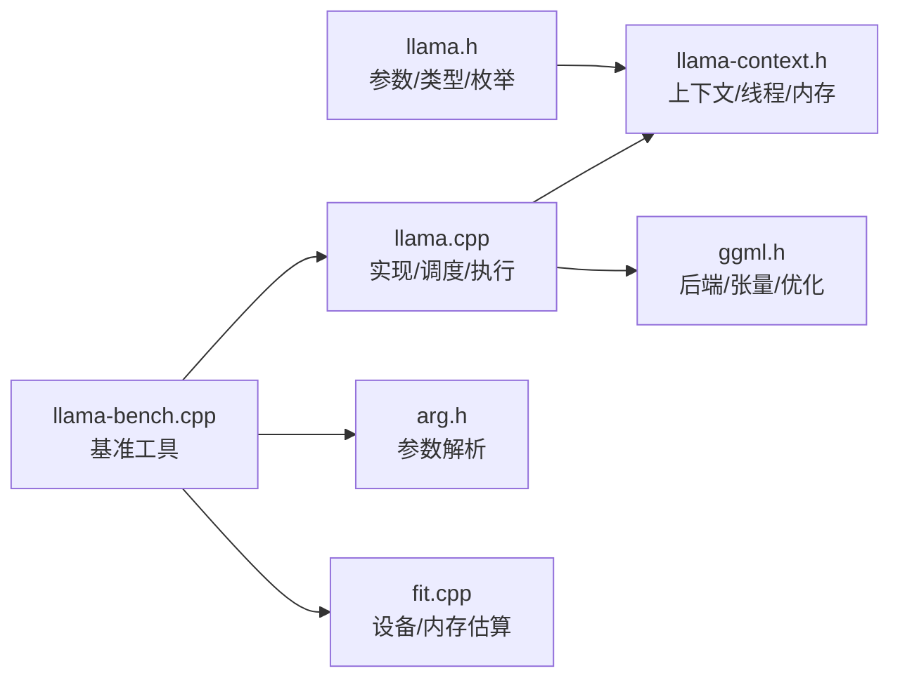

# 性能调优

<cite>
**本文引用的文件**
- [README.md](file://README.md)
- [token_generation_performance_tips.md](file://docs/development/token_generation_performance_tips.md)
- [llama.h](file://include/llama.h)
- [llama.cpp](file://src/llama.cpp)
- [llama-context.h](file://src/llama-context.h)
- [ggml.h](file://ggml/include/ggml.h)
- [llama-bench.cpp](file://tools/llama-bench/llama-bench.cpp)
- [arg.h](file://common/arg.h)
- [fit.cpp](file://common/fit.cpp)
</cite>

## 目录
1. [简介](#简介)
2. [项目结构](#项目结构)
3. [核心组件](#核心组件)
4. [架构总览](#架构总览)
5. [详细组件分析](#详细组件分析)
6. [依赖关系分析](#依赖关系分析)
7. [性能考量与优化建议](#性能考量与优化建议)
8. [故障排查指南](#故障排查指南)
9. [结论](#结论)
10. [附录](#附录)

## 简介
本指南面向在多类硬件平台上部署与运行 llama.cpp 的工程师与运维人员，系统化梳理从硬件加速到软件参数、内存管理、并发与网络等维度的性能调优策略，并结合仓库内现有工具与文档给出可操作的基准测试与问题定位方法。内容覆盖：
- 硬件加速优化：CUDA 核心数配置、内存带宽优化、并行度调整
- 软件层面优化：批处理大小、序列长度、量化精度选择
- 内存管理优化：KV 缓存大小、内存池与设备/主机内存分配策略
- 多实例部署：资源隔离、负载均衡与资源分配
- 网络延迟优化：连接池与服务端参数
- 基准测试：llama-bench 使用与结果解读
- 平台差异与最佳实践：不同后端（CUDA/Metal/BLAS）下的调优要点
- 瓶颈识别与解决：日志、计时与采样指标

## 项目结构
llama.cpp 采用“模型/推理内核 + 后端抽象 + 工具链”的分层组织。与性能调优直接相关的核心位置如下：
- 推理接口与参数定义：include/llama.h
- 上下文与调度：src/llama-context.h、src/llama.cpp
- 后端与张量计算：ggml/include/ggml.h
- 基准测试：tools/llama-bench/llama-bench.cpp
- 参数解析与示例：common/arg.h
- 设备/内存估算与策略：common/fit.cpp
- 文档与性能提示：docs/development/token_generation_performance_tips.md

图示来源
- [llama.h](file://include/llama.h)
- [llama.cpp](file://src/llama.cpp)
- [llama-context.h](file://src/llama-context.h)
- [ggml.h](file://ggml/include/ggml.h)
- [llama-bench.cpp](file://tools/llama-bench/llama-bench.cpp)
- [arg.h](file://common/arg.h)
- [fit.cpp](file://common/fit.cpp)

章节来源
- [README.md](file://README.md)
- [llama.h](file://include/llama.h)
- [llama.cpp](file://src/llama.cpp)
- [llama-context.h](file://src/llama-context.h)
- [ggml.h](file://ggml/include/ggml.h)
- [llama-bench.cpp](file://tools/llama-bench/llama-bench.cpp)
- [arg.h](file://common/arg.h)
- [fit.cpp](file://common/fit.cpp)

## 核心组件
- 推理接口与参数
  - llama.h 定义了模型/上下文/采样器等核心类型与枚举，如量化格式、注意力类型、池化类型、拆分模式等，是性能调优的参数入口。
- 上下文与调度
  - llama-context.h 描述了上下文生命周期、线程设置、内存更新、性能统计与状态保存等，直接影响吞吐与延迟。
- 后端与张量计算
  - ggml.h 提供张量运算、自动微分、优化算法与多后端支持，是硬件加速与内存布局的基础。
- 基准测试
  - llama-bench.cpp 提供多种测试场景（预填充/生成）、设备信息采集、统计输出，是评估调优效果的权威工具。
- 参数解析与示例
  - common/arg.h 提供统一的命令行参数解析框架，便于批量注入与预设。
- 设备/内存估算
  - common/fit.cpp 提供设备内存数据采集、目标余量设定、按层/部分层迁移策略等，指导离线规划与运行时动态调整。

章节来源
- [llama.h](file://include/llama.h)
- [llama-context.h](file://src/llama-context.h)
- [ggml.h](file://ggml/include/ggml.h)
- [llama-bench.cpp](file://tools/llama-bench/llama-bench.cpp)
- [arg.h](file://common/arg.h)
- [fit.cpp](file://common/fit.cpp)

## 架构总览
llama.cpp 将模型加载、上下文构建、批处理与图执行解耦，通过 ggml 的后端调度器在 CPU/GPU/混合设备上执行。llama-bench 在此基础上对不同参数组合进行系统化评测。

图示来源
- [llama.cpp](file://src/llama.cpp)
- [llama-context.h](file://src/llama-context.h)
- [ggml.h](file://ggml/include/ggml.h)
- [llama-bench.cpp](file://tools/llama-bench/llama-bench.cpp)

## 详细组件分析

### 硬件加速与并行度
- CUDA 与 GPU offload
  - 文档明确指出需正确编译以启用 GPU offload，并通过参数将尽可能多的层卸载到 GPU；运行时会打印实际卸载层数与显存占用，用于验证。
- 线程与并行
  - 过高的线程数可能导致 CPU 过载，应根据物理核心数或实测逐步调整；在 GPU 加速场景下，先尝试单线程以排除 CPU 瓶颈。
- 后端选择与设备
  - ggml 支持多后端（CUDA/Metal/BLAS/ROCm/CANN 等），llama-bench 可采集 CPU/GPU 列表，便于在多设备环境中选择最优设备组合。

章节来源
- [token_generation_performance_tips.md](file://docs/development/token_generation_performance_tips.md)
- [llama.h](file://include/llama.h)
- [ggml.h](file://ggml/include/ggml.h)
- [llama-bench.cpp](file://tools/llama-bench/llama-bench.cpp)

### 软件参数：批处理、序列长度与量化
- 批处理大小与逻辑批
  - llama.h 中的批处理结构包含 token、位置、序列 ID、logits 输出标记等字段，逻辑批大小与上下文大小共同决定内存与吞吐。
- 序列长度
  - 上下文大小（n_ctx/n_ctx_seq）影响 KV 缓存与峰值显存；增大序列长度会显著增加显存占用。
- 量化精度
  - llama.h 定义了丰富的量化格式（如 Q4_0/Q4_1/Q8_0/Q5_0/Q5_1/Q2_K/Q3_K_* 等），量化越低通常带来更低显存与更高吞吐，但可能牺牲质量；需结合任务与硬件特性权衡。

章节来源
- [llama.h](file://include/llama.h)
- [llama-context.h](file://src/llama-context.h)

### 内存管理与 KV 缓存
- KV 缓存与上下文
  - 上下文维护 n_ctx/n_ctx_seq/n_batch/n_ubatch 等容量参数，decode/encode 期间会复用 KV 缓存；过长的上下文会放大显存压力。
- 设备/主机内存分配
  - fit.cpp 提供设备内存数据采集、目标余量与按层/部分层迁移策略，可用于离线规划与运行时动态调整，减少溢出风险。
- 内存池与缓冲区类型
  - llama.h 支持为匹配特定模式的张量指定缓冲区类型（tensor_buft_overrides），可将 MoE 等大张量迁移到系统内存，缓解显存不足。

章节来源
- [llama-context.h](file://src/llama-context.h)
- [fit.cpp](file://common/fit.cpp)
- [llama.h](file://include/llama.h)

### 多实例部署与资源分配
- 多 GPU/多实例
  - llama.h 定义了拆分模式（按层/按行/按张量），可将模型切分到多个 GPU；fit.cpp 的设备内存估算可辅助规划每卡承载层数。
- NUMA 与线程亲和
  - llama.cpp 支持 NUMA 初始化，有助于在多 NUMA 节点环境下提升跨节点内存访问效率。
- 连接池与并发
  - 服务端（llama-server）支持并发请求与队列，结合线程数与批大小可平衡延迟与吞吐。

章节来源
- [llama.h](file://include/llama.h)
- [fit.cpp](file://common/fit.cpp)
- [README.md](file://README.md)

### 网络延迟优化与连接池
- 服务端参数
  - 通过服务端参数控制并发、上下文大小、采样策略等，避免单实例成为瓶颈。
- 连接池与超时
  - 在高并发场景下，合理设置连接池上限与超时，避免排队与资源争用导致尾延迟升高。

章节来源
- [README.md](file://README.md)

### 基准测试与工具使用
- llama-bench
  - 支持预填充/生成等多场景测试，自动采集 CPU/GPU 信息，输出吞吐均值与标准差；适合对比不同参数组合的性能表现。
- 结果解读
  - 关注 tokens/秒、稳定波动范围与异常值；结合设备日志确认是否发生频繁回退到 CPU 或显存溢出。

章节来源
- [llama-bench.cpp](file://tools/llama-bench/llama-bench.cpp)

## 依赖关系分析
llama.cpp 的性能调优涉及以下关键依赖链：
- 参数入口（llama.h）→ 上下文/调度（llama-context.h/llama.cpp）→ 后端（ggml.h）→ 设备（GPU/CPU）
- 基准工具（llama-bench.cpp）→ 参数解析（arg.h）→ 设备/内存估算（fit.cpp）

图示来源
- [llama.h](file://include/llama.h)
- [llama-context.h](file://src/llama-context.h)
- [llama.cpp](file://src/llama.cpp)
- [ggml.h](file://ggml/include/ggml.h)
- [llama-bench.cpp](file://tools/llama-bench/llama-bench.cpp)
- [arg.h](file://common/arg.h)
- [fit.cpp](file://common/fit.cpp)

章节来源
- [llama.h](file://include/llama.h)
- [llama-context.h](file://src/llama-context.h)
- [llama.cpp](file://src/llama.cpp)
- [ggml.h](file://ggml/include/ggml.h)
- [llama-bench.cpp](file://tools/llama-bench/llama-bench.cpp)
- [arg.h](file://common/arg.h)
- [fit.cpp](file://common/fit.cpp)

## 性能考量与优化建议

### 硬件加速优化
- CUDA 核心数与显存
  - 通过参数将尽可能多的层卸载到 GPU，并观察运行时日志确认实际卸载层数与显存占用；若出现极低吞吐，优先检查是否过度卸载导致设备过载。
- 内存带宽优化
  - 选择合适的量化格式与批大小，避免频繁的主机/设备间数据搬运；必要时将非关键张量迁移到系统内存。
- 并行度调整
  - 先将线程数降至物理核心数或 1，确认 CPU 不再饱和后再逐步提升；在 GPU 场景下，优先保证 GPU 利用率而非盲目加线程。

章节来源
- [token_generation_performance_tips.md](file://docs/development/token_generation_performance_tips.md)
- [fit.cpp](file://common/fit.cpp)

### 软件层面优化
- 批处理大小
  - 增大批处理可提升吞吐，但会提高峰值内存与首 token 延迟；需结合序列长度与上下文大小综合评估。
- 序列长度
  - 上下文越大，KV 缓存占用越高；在对话/检索等场景中，可考虑截断或重用历史上下文以降低显存压力。
- 量化精度
  - 低比特量化（如 Q4_*）通常更省显存且更快，但可能影响生成质量；可在灰度环境对比后再推广。

章节来源
- [llama.h](file://include/llama.h)
- [llama-context.h](file://src/llama-context.h)

### 内存管理优化
- KV 缓存大小
  - 合理设置 n_ctx/n_ctx_seq，避免不必要的长上下文；对多会话场景，可按会话独立上下文并及时释放。
- 内存池与缓冲区类型
  - 使用 tensor_buft_overrides 将 MoE 等大张量迁移到系统内存，缓解显存不足；fit.cpp 可帮助估算迁移后的盈余/赤字。
- 动态策略
  - 在运行时根据设备内存剩余情况动态调整上下文或迁移策略，避免显存溢出。

章节来源
- [llama.h](file://include/llama.h)
- [fit.cpp](file://common/fit.cpp)

### 多实例部署
- 资源隔离
  - 每个实例绑定独立设备/线程池，避免跨实例争抢；NUMA 初始化可提升跨节点访问效率。
- 负载均衡
  - 通过连接池与并发参数限制单实例压力，结合多实例横向扩展；注意会话粘性与状态持久化。

章节来源
- [llama.h](file://include/llama.h)
- [fit.cpp](file://common/fit.cpp)

### 网络延迟优化
- 服务端参数
  - 控制并发数、批大小与采样策略，避免单实例成为瓶颈；对长上下文请求单独限流。
- 连接池
  - 设置合理的最大连接数与超时时间，防止排队与资源耗尽。

章节来源
- [README.md](file://README.md)

### 基准测试方法与工具
- 使用 llama-bench 对比不同参数组合（量化、批大小、上下文、线程数、设备）的吞吐与稳定性。
- 记录 CPU/GPU 信息与设备显存占用，结合日志判断是否存在回退到 CPU 或显存溢出。

章节来源
- [llama-bench.cpp](file://tools/llama-bench/llama-bench.cpp)

### 平台差异与最佳实践
- CUDA/Metal/BLAS
  - 不同后端在算子实现与内存访问模式上存在差异，需针对平台特性分别调参；例如 Metal 在 Apple Silicon 上通常具备较好的能效。
- 多 GPU
  - 依据 fit.cpp 的设备内存估算选择拆分模式与每卡层数，确保各卡利用率均衡。

章节来源
- [README.md](file://README.md)
- [fit.cpp](file://common/fit.cpp)

### 瓶颈识别与解决
- 日志与诊断
  - 观察运行时日志中的 GPU 卸载信息与错误提示，快速定位是否为设备/驱动/显存问题。
- 性能指标
  - 使用 llama-bench 的统计输出评估吞吐与稳定性；关注首 token 延迟与后续 token 吞吐的平衡。
- 采样与调度
  - 若采样开销过大，可简化采样策略或降低采样频率；同时检查调度器是否频繁切换设备。

章节来源
- [token_generation_performance_tips.md](file://docs/development/token_generation_performance_tips.md)
- [llama-bench.cpp](file://tools/llama-bench/llama-bench.cpp)

## 故障排查指南
- GPU 未被使用
  - 检查编译选项与运行参数是否支持 GPU offload；查看日志中卸载层数与显存占用。
- 吞吐极低
  - 尝试将线程数降至 1 或物理核心数，确认 CPU 是否过载；随后逐步提升。
- 显存溢出
  - 减小上下文大小、降低批大小、选择更高量化精度或迁移部分张量到系统内存；使用 fit.cpp 评估盈余/赤字。
- 延迟偏高
  - 优化批大小与采样策略；检查是否存在频繁的主机/设备同步；适当增加连接池上限与并发。

章节来源
- [token_generation_performance_tips.md](file://docs/development/token_generation_performance_tips.md)
- [fit.cpp](file://common/fit.cpp)

## 结论
llama.cpp 的性能调优是一个“软硬协同”的过程：在硬件侧充分利用 GPU/多核能力，在软件侧通过批大小、序列长度、量化与内存策略进行精细化控制，并借助 llama-bench 系统化评估。结合设备内存估算与运行时日志，可快速定位瓶颈并迭代优化，最终在不同硬件平台上获得稳定、高效的推理体验。

## 附录
- 快速检查清单
  - 确认 GPU 后端可用且已卸载足够层数
  - 线程数适配物理核心，避免 CPU 过载
  - 量化与批大小平衡显存与吞吐
  - 上下文大小与 KV 缓存合理
  - 使用 llama-bench 对比不同配置
  - 多实例部署时做好资源隔离与连接池配置