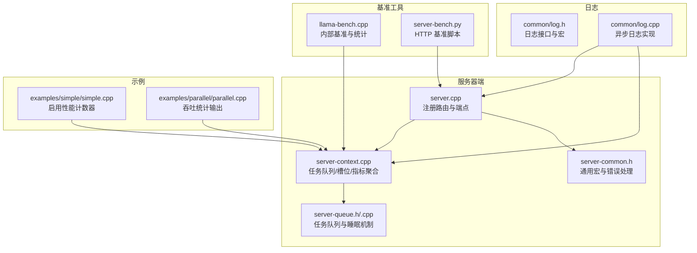
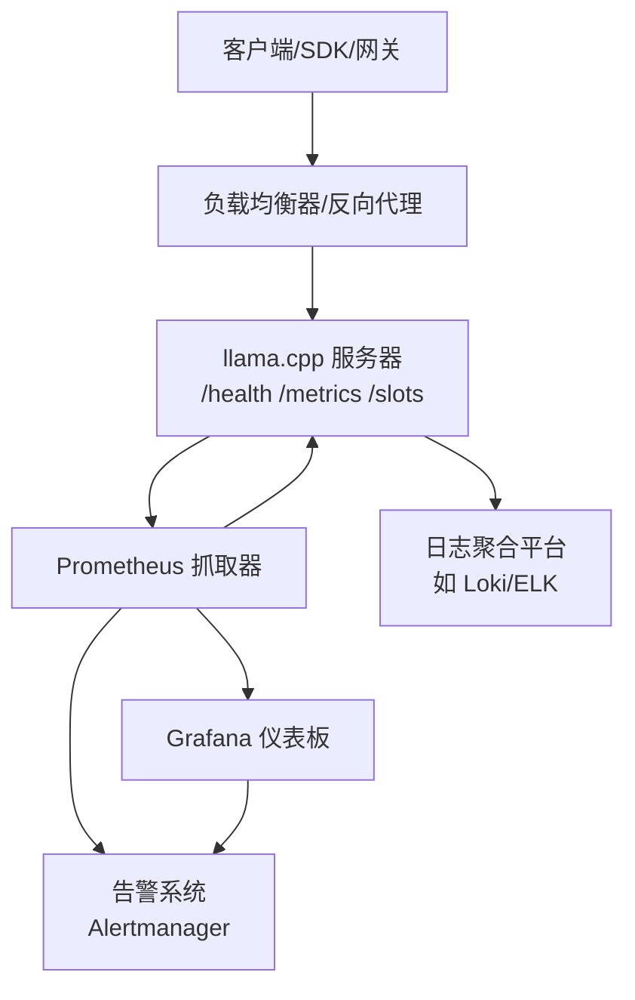
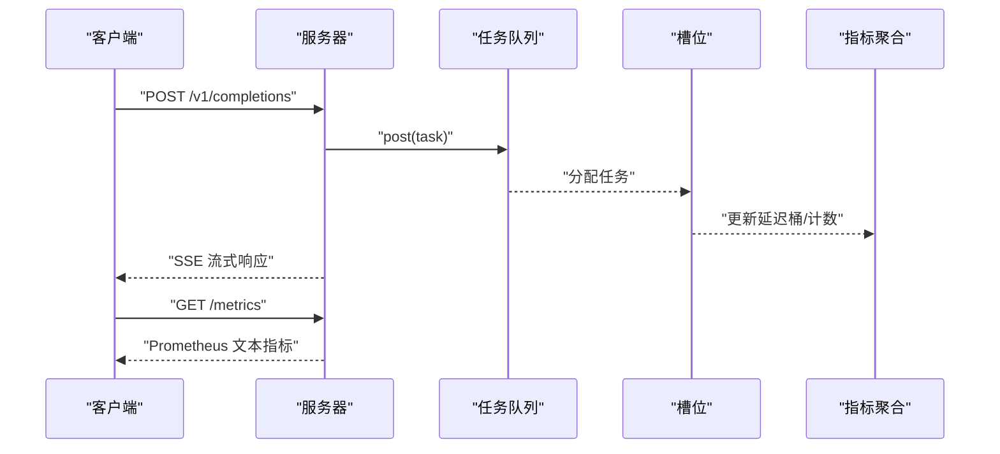
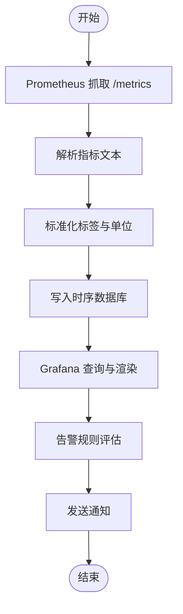
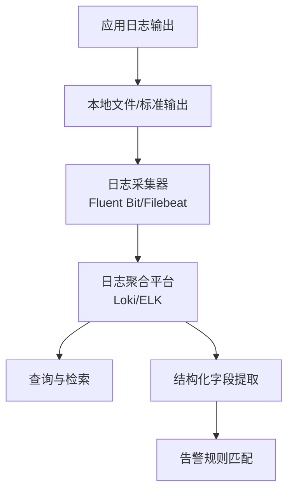
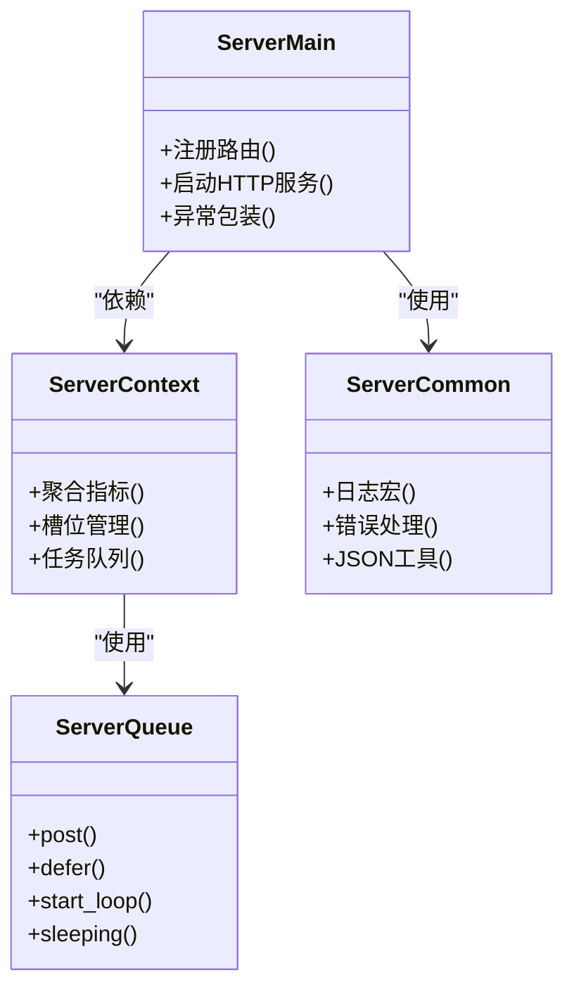

# 监控告警

<cite>
**本文引用的文件**   
- [tools/server/server.cpp](file://tools/server/server.cpp)
- [tools/server/server-context.cpp](file://tools/server/server-context.cpp)
- [tools/server/server-common.h](file://tools/server/server-common.h)
- [tools/server/server-queue.h](file://tools/server/server-queue.h)
- [tools/server/server-queue.cpp](file://tools/server/server-queue.cpp)
- [tools/llama-bench/llama-bench.cpp](file://tools/llama-bench/llama-bench.cpp)
- [scripts/server-bench.py](file://scripts/server-bench.py)
- [examples/parallel/parallel.cpp](file://examples/parallel/parallel.cpp)
- [common/log.h](file://common/log.h)
- [common/log.cpp](file://common/log.cpp)
- [examples/simple/simple.cpp](file://examples/simple/simple.cpp)
- [.github/workflows/bench.yml.disabled](file://.github/workflows/bench.yml.disabled)
</cite>

## 目录
1. [简介](#简介)
2. [项目结构](#项目结构)
3. [核心组件](#核心组件)
4. [架构总览](#架构总览)
5. [详细组件分析](#详细组件分析)
6. [依赖关系分析](#依赖关系分析)
7. [性能考量](#性能考量)
8. [故障排查指南](#故障排查指南)
9. [结论](#结论)
10. [附录](#附录)

## 简介
本文件面向 llama.cpp 在生产环境中的监控与告警体系建设，围绕关键性能指标（KPI）定义与测量方法、Prometheus/Grafana 集成、日志采集与分析、告警规则配置、监控面板设计与可视化最佳实践、性能基线与异常检测、以及监控数据的长期存储与归档策略进行系统化说明。文档以仓库内现有实现为依据，结合服务器端点、基准工具与日志框架，给出可落地的监控方案。

## 项目结构
llama.cpp 提供了多种运行形态与工具，其中与监控密切相关的关键位置包括：
- 服务器端：提供 /metrics、/health、/slots 等端点，用于健康检查与指标导出；支持路由模式与多模型管理。
- 基准工具：llama-bench 与 server-bench 脚本，用于吞吐、首 token 时间、生成速率等指标的采集与可视化。
- 日志框架：统一的日志模块，支持时间戳前缀、颜色输出、文件落盘与异步写入，便于集中化采集与分析。
- 示例与工具：simple 示例启用性能计数器，parallel 示例输出吞吐统计，便于理解指标来源。

**图表来源**
- [tools/server/server.cpp:74-200](file://tools/server/server.cpp#L74-L200)
- [tools/server/server-context.cpp:1920-2119](file://tools/server/server-context.cpp#L1920-L2119)
- [tools/server/server-queue.h:1-91](file://tools/server/server-queue.h#L1-L91)
- [tools/server/server-queue.cpp:211-245](file://tools/server/server-queue.cpp#L211-L245)
- [tools/server/server-common.h:1-374](file://tools/server/server-common.h#L1-L374)
- [tools/llama-bench/llama-bench.cpp:1-200](file://tools/llama-bench/llama-bench.cpp#L1-L200)
- [scripts/server-bench.py:1-299](file://scripts/server-bench.py#L1-L299)
- [common/log.h:1-124](file://common/log.h#L1-L124)
- [common/log.cpp:1-454](file://common/log.cpp#L1-L454)
- [examples/simple/simple.cpp:1-200](file://examples/simple/simple.cpp#L1-L200)
- [examples/parallel/parallel.cpp:503-520](file://examples/parallel/parallel.cpp#L503-L520)

**章节来源**
- [tools/server/server.cpp:74-200](file://tools/server/server.cpp#L74-L200)
- [tools/server/server-context.cpp:1920-2119](file://tools/server/server-context.cpp#L1920-L2119)
- [tools/server/server-common.h:1-374](file://tools/server/server-common.h#L1-L374)
- [tools/server/server-queue.h:1-91](file://tools/server/server-queue.h#L1-L91)
- [tools/server/server-queue.cpp:211-245](file://tools/server/server-queue.cpp#L211-L245)
- [tools/llama-bench/llama-bench.cpp:1-200](file://tools/llama-bench/llama-bench.cpp#L1-L200)
- [scripts/server-bench.py:1-299](file://scripts/server-bench.py#L1-L299)
- [common/log.h:1-124](file://common/log.h#L1-L124)
- [common/log.cpp:1-454](file://common/log.cpp#L1-L454)
- [examples/simple/simple.cpp:1-200](file://examples/simple/simple.cpp#L1-L200)
- [examples/parallel/parallel.cpp:503-520](file://examples/parallel/parallel.cpp#L503-L520)

## 核心组件
- 服务器与端点
  - /metrics：导出 Prometheus 文本格式指标，包含槽位状态、请求延迟桶、吞吐统计等。
  - /health：健康检查端点，用于存活探针。
  - /slots：在启用 slots 模式时返回槽位详情。
- 指标聚合与导出
  - 服务器上下文维护请求与生成的累计统计、当前处理槽位数、延迟桶等，并按 Prometheus 规范格式化输出。
- 基准与性能度量
  - llama-bench：内部基准工具，计算平均/分位延迟、吞吐、生成速率等。
  - server-bench.py：通过 HTTP 接口对服务进行并发压力测试，输出请求吞吐、首 token 时间、生成速率等。
- 日志与可观测性
  - 统一日志模块支持异步写入、时间戳前缀、颜色输出、文件落盘，便于集中化采集与分析。
  - 示例程序启用性能计数器，输出加载、评估、采样等阶段耗时与吞吐统计。

**章节来源**
- [tools/server/server.cpp:172-200](file://tools/server/server.cpp#L172-L200)
- [tools/server/server-context.cpp:1920-2119](file://tools/server/server-context.cpp#L1920-L2119)
- [tools/server/server-context.cpp:3516-3545](file://tools/server/server-context.cpp#L3516-L3545)
- [tools/llama-bench/llama-bench.cpp:100-116](file://tools/llama-bench/llama-bench.cpp#L100-L116)
- [scripts/server-bench.py:232-242](file://scripts/server-bench.py#L232-L242)
- [common/log.h:1-124](file://common/log.h#L1-L124)
- [common/log.cpp:1-454](file://common/log.cpp#L1-L454)
- [examples/simple/simple.cpp:116-129](file://examples/simple/simple.cpp#L116-L129)
- [examples/parallel/parallel.cpp:503-520](file://examples/parallel/parallel.cpp#L503-L520)

## 架构总览
下图展示生产监控体系中各组件的交互关系：客户端/负载均衡器访问服务器端点，服务器聚合指标并通过 /metrics 导出；Prometheus 抓取指标，Grafana 进行可视化；日志通过统一日志模块输出，支持集中化采集与检索。

[此图为概念性架构示意，不直接映射具体源码文件，故无“图表来源”]

## 详细组件分析

### 指标定义与测量方法
- 推理延迟
  - 首 token 延迟：server-bench.py 对每个请求记录提交时间与首个 token 到达时间，计算首 token 延迟分布。
  - 请求级 P50/P95/P99：bench 工具与 GitHub 工作流中展示请求时延分位数。
  - 生成速率：llama-bench 与 server-bench 输出 tokens/s、每槽位生成速率。
- 吞吐量
  - 请求吞吐：server-bench 计算 requests/s、requests/min。
  - 令牌吞吐：llama-bench 输出平均/峰值生成速度。
- 内存使用率
  - 日志与性能计数器输出显示内存占用与分解信息，可用于监控峰值与趋势。
- 槽位与队列
  - 槽位空闲/处理数量、延迟桶、排队任务数、睡眠状态等，由服务器上下文聚合并通过 /metrics 导出。

**图表来源**
- [tools/server/server.cpp:172-200](file://tools/server/server.cpp#L172-L200)
- [tools/server/server-context.cpp:1920-2119](file://tools/server/server-context.cpp#L1920-L2119)
- [tools/server/server-queue.h:34-76](file://tools/server/server-queue.h#L34-L76)

**章节来源**
- [scripts/server-bench.py:232-242](file://scripts/server-bench.py#L232-L242)
- [.github/workflows/bench.yml.disabled:234-272](file://.github/workflows/bench.yml.disabled#L234-L272)
- [tools/server/server-context.cpp:1920-2119](file://tools/server/server-context.cpp#L1920-L2119)
- [tools/server/server-queue.h:34-76](file://tools/server/server-queue.h#L34-L76)

### Prometheus 与 Grafana 集成
- 指标导出
  - 服务器通过 /metrics 端点以 Prometheus 文本格式输出指标，包含帮助信息与类型声明。
- 抓取配置建议
  - 抓取间隔：根据业务负载选择 15s–60s。
  - 超时与重试：设置合理超时与重试策略，避免抖动放大。
- 仪表板设计
  - 关键面板：请求吞吐、P50/P95 延迟、生成速率、槽位利用率、内存与缓存使用、错误率。
  - 分维度：按模型、路由目标、实例 IP、部署版本等标签分组。
- 可视化最佳实践
  - 使用分位数曲线替代单一均值，关注尾部延迟。
  - 引入速率与比率类指标，避免绝对值漂移导致误判。
  - 结合时间窗聚合与去噪算法，减少短期波动影响。

[此图为概念性流程示意，不直接映射具体源码文件，故无“图表来源”]

**章节来源**
- [tools/server/server-context.cpp:3516-3545](file://tools/server/server-context.cpp#L3516-L3545)
- [tools/server/server.cpp:172-200](file://tools/server/server.cpp#L172-L200)

### 日志收集与分析策略
- 结构化日志
  - 统一日志模块支持时间戳前缀与颜色输出，便于解析与过滤。
  - 建议在生产环境启用时间戳与前缀，确保日志可排序与可关联。
- 日志落盘与轮转
  - 支持将日志写入文件，便于与集中化日志平台对接。
- 日志聚合与检索
  - 建议使用日志聚合平台（如 Loki/ELK）进行索引与查询。
  - 建立关键日志模式（如错误、警告、性能异常、OOM/资源不足）的告警规则。

**图表来源**
- [common/log.cpp:76-121](file://common/log.cpp#L76-L121)
- [common/log.cpp:308-322](file://common/log.cpp#L308-L322)
- [common/log.h:64-91](file://common/log.h#L64-L91)

**章节来源**
- [common/log.h:1-124](file://common/log.h#L1-L124)
- [common/log.cpp:1-454](file://common/log.cpp#L1-L454)

### 告警规则配置
- 阈值设定与告警级别
  - 即时告警（严重）：/health 不可用、/metrics 获取失败、P95 延迟超过阈值、错误率突增。
  - 性能退化（警告）：P95 延迟接近阈值、生成速率下降、槽位积压。
  - 资源告警（警告/严重）：内存使用率高、磁盘空间不足、GPU/CPU 利用率异常。
- 告警级别划分
  - 严重：服务不可用或关键路径异常。
  - 警告：性能退化或潜在风险。
  - 通知：变更与恢复事件。
- 告警抑制与静默
  - 在维护窗口内静默相关告警，避免误报干扰。
  - 对同源告警进行抑制，合并同类事件。

[本节为通用告警策略说明，未直接分析具体源码文件，故无“章节来源”]

### 监控仪表板设计与可视化最佳实践
- 面板布局
  - 顶部：总体吞吐、延迟、错误率、资源使用。
  - 中部：按模型/路由/实例拆分的子面板。
  - 底部：日志与事件摘要。
- 图表类型
  - 时序折线：延迟、吞吐、资源使用。
  - 分位数曲线：尾部延迟分布。
  - 热力图：并发与延迟热区。
- 交互与联动
  - 支持时间范围联动、点击钻取到实例/模型维度。
  - 将告警与面板联动，点击告警直达相关图表。

[本节为通用可视化建议，未直接分析具体源码文件，故无“章节来源”]

### 性能基线建立与异常检测
- 基线建立
  - 使用 llama-bench 与 server-bench 在稳定环境下采集平均/分位延迟、吞吐、生成速率等指标，形成基线。
  - 记录不同硬件、批大小、上下文长度下的基线，作为回归对比。
- 异常检测
  - 统计方法：基于均值与标准差的 3σ 规则。
  - 机器学习：使用孤立森林或一类 SVM 检测离群点。
  - 告警联动：异常触发后自动关联日志与指标，辅助根因定位。

**章节来源**
- [tools/llama-bench/llama-bench.cpp:100-116](file://tools/llama-bench/llama-bench.cpp#L100-L116)
- [scripts/server-bench.py:232-242](file://scripts/server-bench.py#L232-L242)

### 监控数据的长期存储与归档
- 存储层
  - 时序数据库：保留短期高频数据（如 7–14 天），压缩与分区策略优化成本。
  - 归档存储：将低频历史数据迁移至对象存储（S3/OSS），支持冷热分层。
- 归档策略
  - 按月/季度归档，保留关键指标与摘要。
  - 清理过期数据与冗余副本，控制成本。
- 查询与回放
  - 提供历史回放能力，支持故障复盘与容量规划。

[本节为通用存储策略说明，未直接分析具体源码文件，故无“章节来源”]

## 依赖关系分析
服务器端组件之间的耦合与协作如下：

**图表来源**
- [tools/server/server.cpp:74-200](file://tools/server/server.cpp#L74-L200)
- [tools/server/server-context.cpp:1920-2119](file://tools/server/server-context.cpp#L1920-L2119)
- [tools/server/server-queue.h:1-91](file://tools/server/server-queue.h#L1-L91)
- [tools/server/server-common.h:1-374](file://tools/server/server-common.h#L1-L374)

**章节来源**
- [tools/server/server.cpp:74-200](file://tools/server/server.cpp#L74-L200)
- [tools/server/server-context.cpp:1920-2119](file://tools/server/server-context.cpp#L1920-L2119)
- [tools/server/server-queue.h:1-91](file://tools/server/server-queue.h#L1-L91)
- [tools/server/server-common.h:1-374](file://tools/server/server-common.h#L1-L374)

## 性能考量
- 指标粒度与开销
  - 指标聚合与日志输出应避免阻塞主请求路径，采用异步与批量写入。
- 并发与资源
  - 通过 n_parallel 控制并发槽位，结合队列睡眠机制降低空闲 CPU 占用。
- 基准工具与回归
  - 使用 llama-bench 与 server-bench 定期回归，识别性能退化。

[本节为通用性能建议，未直接分析具体源码文件，故无“章节来源”]

## 故障排查指南
- 健康检查
  - 使用 /health 确认服务可用性，若不可用，检查日志与资源状态。
- 指标核验
  - 通过 /metrics 核验关键指标是否正常更新，确认抓取链路畅通。
- 日志定位
  - 利用统一日志模块的时间戳与前缀，快速定位异常发生时间点与上下文。
- 示例程序辅助
  - 启用性能计数器的示例程序可帮助理解各阶段耗时与吞吐统计。

**章节来源**
- [tools/server/server.cpp:172-200](file://tools/server/server.cpp#L172-L200)
- [common/log.h:64-91](file://common/log.h#L64-L91)
- [common/log.cpp:76-121](file://common/log.cpp#L76-L121)
- [examples/simple/simple.cpp:116-129](file://examples/simple/simple.cpp#L116-L129)

## 结论
llama.cpp 的服务器端点与日志框架为生产监控提供了坚实基础。通过 /metrics 指标导出、基准工具的量化能力、统一日志的可观测性，以及 Prometheus/Grafana 的集成，可以构建覆盖延迟、吞吐、资源与稳定性全链路的监控体系。配合合理的告警策略与可视化设计，能够有效保障生产环境的稳定性与可运维性。

## 附录
- 关键端点与职责
  - /health：健康检查
  - /metrics：指标导出（Prometheus 文本）
  - /slots：槽位详情（启用 slots 模式）
- 建议的 Prometheus 抓取参数
  - 抓取间隔：15–60s
  - 超时：10–30s
  - 重试：最多 2–3 次
- 常见告警阈值参考
  - P95 延迟：根据基线设定上/下限
  - 错误率：>0.1%
  - 吞吐：低于基线 30%
  - 资源：CPU/GPU/内存 >80%

[本节为附录汇总，未直接分析具体源码文件，故无“章节来源”]