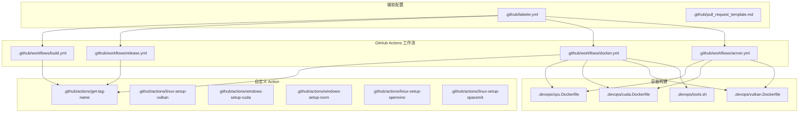
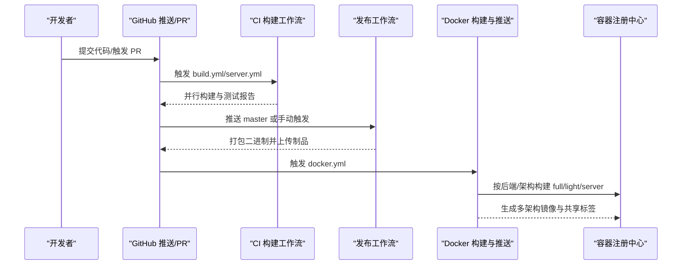
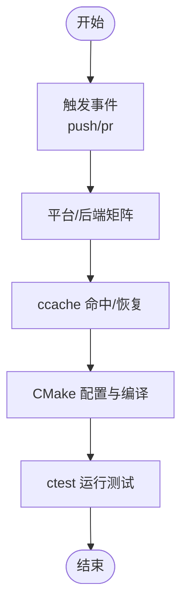
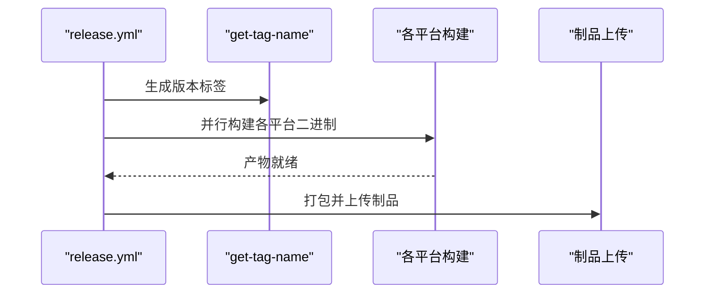
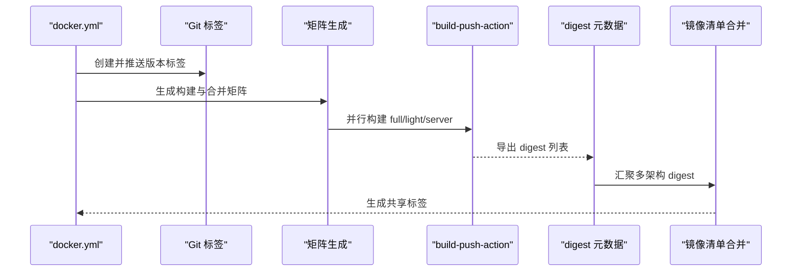
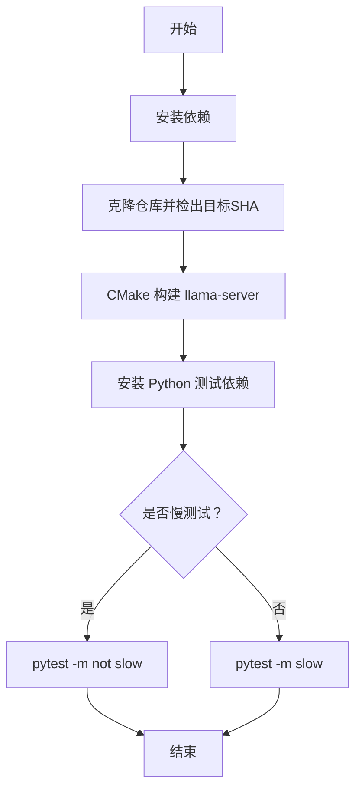
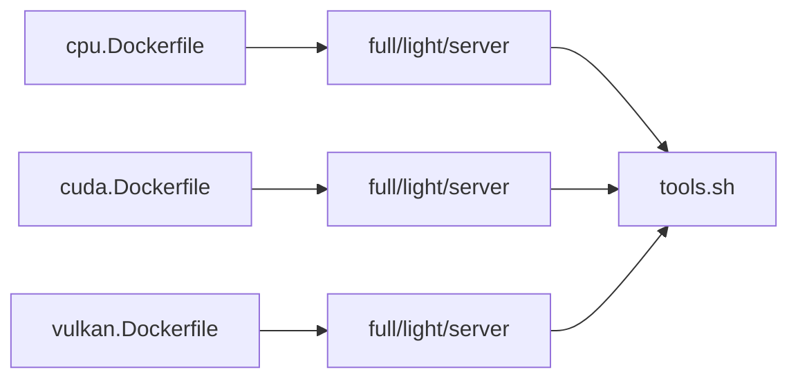
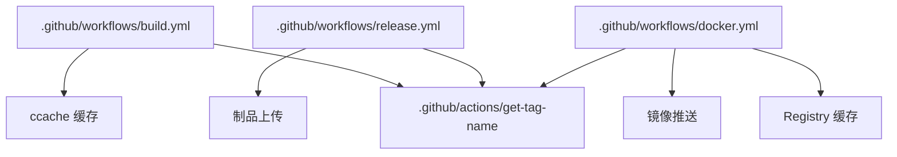

# 自动化部署

<cite>
**本文引用的文件**
- [.github/workflows/build.yml](file://.github/workflows/build.yml)
- [.github/workflows/release.yml](file://.github/workflows/release.yml)
- [.github/workflows/docker.yml](file://.github/workflows/docker.yml)
- [.github/workflows/server.yml](file://.github/workflows/server.yml)
- [.github/labeler.yml](file://.github/labeler.yml)
- [.github/pull_request_template.md](file://.github/pull_request_template.md)
- [.devops/cpu.Dockerfile](file://.devops/cpu.Dockerfile)
- [.devops/cuda.Dockerfile](file://.devops/cuda.Dockerfile)
- [.devops/vulkan.Dockerfile](file://.devops/vulkan.Dockerfile)
- [.devops/tools.sh](file://.devops/tools.sh)
- [.github/actions/get-tag-name/action.yml](file://.github/actions/get-tag-name/action.yml)
- [.github/actions/linux-setup-vulkan/action.yml](file://.github/actions/linux-setup-vulkan/action.yml)
- [.github/actions/windows-setup-cuda/action.yml](file://.github/actions/windows-setup-cuda/action.yml)
- [.github/actions/windows-setup-rocm/action.yml](file://.github/actions/windows-setup-rocm/action.yml)
- [.github/actions/linux-setup-openvino/action.yml](file://.github/actions/linux-setup-openvino/action.yml)
- [.github/actions/linux-setup-spacemit/action.yml](file://.github/actions/linux-setup-spacemit/action.yml)
</cite>

## 目录
1. [简介](#简介)
2. [项目结构](#项目结构)
3. [核心组件](#核心组件)
4. [架构总览](#架构总览)
5. [详细组件分析](#详细组件分析)
6. [依赖关系分析](#依赖关系分析)
7. [性能考量](#性能考量)
8. [故障排查指南](#故障排查指南)
9. [结论](#结论)
10. [附录](#附录)

## 简介
本文件系统性梳理 llama.cpp 的自动化部署与 CI/CD 流水线，覆盖多平台构建与测试、持续集成与发布、容器镜像构建与分发、蓝绿与滚动更新策略建议、自动化测试与验收测试集成、版本管理与发布自动化、基础设施即代码（IaC）示例、回滚与紧急修复流程、环境与配置管理最佳实践，以及部署监控与反馈闭环。

## 项目结构
llama.cpp 的 CI/CD 主要由以下部分组成：
- GitHub Actions 工作流：集中于 .github/workflows，涵盖通用构建、发布、Docker 镜像推送、服务端集成测试等。
- 自定义 Action：位于 .github/actions，用于标签生成、第三方工具链安装等。
- 容器构建：位于 .devops，包含多后端 Dockerfile（CPU、CUDA、Vulkan、ROCm、OpenVINO 等）及运行时入口脚本。
- 标签与 PR 模板：用于规范标签命名与贡献流程。

图表来源
- [.github/workflows/build.yml](file://.github/workflows/build.yml)
- [.github/workflows/release.yml](file://.github/workflows/release.yml)
- [.github/workflows/docker.yml](file://.github/workflows/docker.yml)
- [.github/workflows/server.yml](file://.github/workflows/server.yml)
- [.github/actions/get-tag-name/action.yml](file://.github/actions/get-tag-name/action.yml)
- [.devops/cpu.Dockerfile](file://.devops/cpu.Dockerfile)
- [.devops/cuda.Dockerfile](file://.devops/cuda.Dockerfile)
- [.devops/vulkan.Dockerfile](file://.devops/vulkan.Dockerfile)
- [.devops/tools.sh](file://.devops/tools.sh)
- [.github/labeler.yml](file://.github/labeler.yml)

章节来源
- [.github/workflows/build.yml](file://.github/workflows/build.yml)
- [.github/workflows/release.yml](file://.github/workflows/release.yml)
- [.github/workflows/docker.yml](file://.github/workflows/docker.yml)
- [.github/workflows/server.yml](file://.github/workflows/server.yml)
- [.github/labeler.yml](file://.github/labeler.yml)
- [.github/pull_request_template.md](file://.github/pull_request_template.md)

## 核心组件
- 多平台构建与测试流水线：在 macOS、Ubuntu、Windows 上并行构建与测试，覆盖 CPU、CUDA、Vulkan、HIP/ROCm、MUSA、OpenVINO、WebGPU、Android 等多种后端。
- 发布流水线：按平台打包二进制产物，生成带版本号的归档，并上传为工作流制品或镜像标签。
- Docker 镜像流水线：按后端与架构矩阵构建 full/light/server 三类镜像，使用按需缓存与多架构合并标签。
- 服务端集成测试：对 llama-server 进行功能与性能测试，支持慢测试开关。
- 标签与标签生成：统一版本标签命名，便于发布与镜像标记。
- 自定义 Action：封装重复性步骤，如标签生成、第三方 SDK 安装等。

章节来源
- [.github/workflows/build.yml](file://.github/workflows/build.yml)
- [.github/workflows/release.yml](file://.github/workflows/release.yml)
- [.github/workflows/docker.yml](file://.github/workflows/docker.yml)
- [.github/workflows/server.yml](file://.github/workflows/server.yml)
- [.github/actions/get-tag-name/action.yml](file://.github/actions/get-tag-name/action.yml)

## 架构总览
下图展示从代码提交到发布与容器镜像分发的整体流程：

图表来源
- [.github/workflows/build.yml](file://.github/workflows/build.yml)
- [.github/workflows/release.yml](file://.github/workflows/release.yml)
- [.github/workflows/docker.yml](file://.github/workflows/docker.yml)

## 详细组件分析

### 通用构建与测试（build.yml）
- 触发条件：master 分支推送与 PR 同步；限制路径匹配源码与构建相关文件。
- 并发控制：同一工作流内按分支/PR 取消进行中的执行，避免资源争用。
- 平台矩阵：
  - macOS：arm64/x64/WebGPU，Metal/非 Metal 配置，带内存泄漏检测与线程安全测试。
  - Ubuntu：x64/arm64/s390x/ppc64le，GCC 14 工具链适配，s390x 大端模型转换。
  - Windows：x64（静态/动态）、ARM64、CUDA、OpenCL（Adreno）、Vulkan、SYCL 等。
  - Android：NDK 工具链，CPU 全变体，禁用 OpenMP。
  - GPU 后端：CUDA（容器）、ROCm（容器）、MUSA（容器）、Vulkan（主机/容器）、OpenVINO（容器）。
- 缓存策略：ccache 按平台键缓存，仅在 master 推送时保存。
- 测试策略：ctest 过滤 main 测试集，超时控制，特定平台补充转换与推理测试。

图表来源
- [.github/workflows/build.yml](file://.github/workflows/build.yml)

章节来源
- [.github/workflows/build.yml](file://.github/workflows/build.yml)

### 发布流水线（release.yml）
- 触发条件：master 推送或手动触发；限制路径匹配构建相关文件。
- 平台与后端：
  - macOS：arm64（含 KLEIDIAI）、x64（Metal 关闭）。
  - Ubuntu：x64/arm64/s390x。
  - Windows：CPU（x64/arm64）、Vulkan、OpenCL（Adreno）、CUDA（12.4/13.1）、SYCL、ROCm。
  - Android：arm64。
  - OpenVINO：Ubuntu 24.04，缓存 toolkit。
- 标签生成：通过自定义 Action 获取版本标签，统一命名。
- 归档打包：复制 LICENSE，按平台打包 tar.gz/zip，上传为工作流制品。

图表来源
- [.github/workflows/release.yml](file://.github/workflows/release.yml)
- [.github/actions/get-tag-name/action.yml](file://.github/actions/get-tag-name/action.yml)

章节来源
- [.github/workflows/release.yml](file://.github/workflows/release.yml)

### Docker 镜像流水线（docker.yml）
- 触发条件：手动触发或定时任务；权限授予写入包。
- 标签策略：创建与推送 Git 标签，作为镜像版本标识。
- 矩阵构建：
  - 后端：cpu、cuda12、cuda13、musa、intel、vulkan、rocm、openvino。
  - 架构：amd64/arm64/s390x（部分后端不支持）。
  - 目标：full/light/server 三类镜像。
- 缓存与空间：Registry 缓存与磁盘清理，减少构建时间。
- 多架构合并：基于 digest 创建共享标签，实现跨架构统一标签。

图表来源
- [.github/workflows/docker.yml](file://.github/workflows/docker.yml)

章节来源
- [.github/workflows/docker.yml](file://.github/workflows/docker.yml)

### 服务端集成测试（server.yml）
- 触发条件：master 推送/PR 与手动触发；可指定慢测试开关。
- 平台：Linux 与 Windows。
- 流程：安装依赖 → 构建 llama-server → 安装测试依赖 → 运行 pytest（默认排除慢测试，计划任务或显式开启慢测试）。
- 环境变量：日志与详细度控制，便于问题定位。

图表来源
- [.github/workflows/server.yml](file://.github/workflows/server.yml)

章节来源
- [.github/workflows/server.yml](file://.github/workflows/server.yml)

### 容器镜像与运行时（Dockerfile 与 tools.sh）
- 多后端 Dockerfile：
  - cpu.Dockerfile：基础 CPU 构建，支持 amd64/arm64/s390x（s390x 仅运行时），安装 Python 依赖，提供 full/light/server 三层镜像。
  - cuda.Dockerfile：基于 nvidia/cuda 开发/运行镜像，支持指定 CUDA 架构，构建 CUDA 后端。
  - vulkan.Dockerfile：安装 Vulkan SDK 与驱动，构建 Vulkan 后端。
- 运行时入口脚本 tools.sh：统一入口，支持转换、量化、推理、基准、困惑度、服务器等命令，简化容器使用。

图表来源
- [.devops/cpu.Dockerfile](file://.devops/cpu.Dockerfile)
- [.devops/cuda.Dockerfile](file://.devops/cuda.Dockerfile)
- [.devops/vulkan.Dockerfile](file://.devops/vulkan.Dockerfile)
- [.devops/tools.sh](file://.devops/tools.sh)

章节来源
- [.devops/cpu.Dockerfile](file://.devops/cpu.Dockerfile)
- [.devops/cuda.Dockerfile](file://.devops/cuda.Dockerfile)
- [.devops/vulkan.Dockerfile](file://.devops/vulkan.Dockerfile)
- [.devops/tools.sh](file://.devops/tools.sh)

### 自定义 Action
- get-tag-name：根据分支/提交生成语义化版本标签，供发布与镜像使用。
- linux-setup-vulkan：安装并缓存 Vulkan SDK。
- windows-setup-cuda：安装并缓存 CUDA Toolkit。
- windows-setup-rocm：安装并缓存 ROCm。
- linux-setup-openvino：安装并缓存 OpenVINO。
- linux-setup-spacemit：安装 Spacemit 工具链（用于特定后端）。

章节来源
- [.github/actions/get-tag-name/action.yml](file://.github/actions/get-tag-name/action.yml)
- [.github/actions/linux-setup-vulkan/action.yml](file://.github/actions/linux-setup-vulkan/action.yml)
- [.github/actions/windows-setup-cuda/action.yml](file://.github/actions/windows-setup-cuda/action.yml)
- [.github/actions/windows-setup-rocm/action.yml](file://.github/actions/windows-setup-rocm/action.yml)
- [.github/actions/linux-setup-openvino/action.yml](file://.github/actions/linux-setup-openvino/action.yml)
- [.github/actions/linux-setup-spacemit/action.yml](file://.github/actions/linux-setup-spacemit/action.yml)

## 依赖关系分析
- 工作流耦合：
  - build.yml 与 server.yml 共享标签生成与构建参数，确保版本一致性。
  - docker.yml 依赖 release.yml 的标签生成，保证镜像与制品版本一致。
- 第三方依赖：
  - CUDA/ROCm/OpenVINO/Vulkan SDK 通过自定义 Action 缓存，降低构建时间。
- 资源与并发：
  - 使用 concurrency 控制同一工作流的并发执行，避免资源冲突。
- 产物与缓存：
  - ccache 与 registry 缓存提升重复构建速度；Docker 使用按后端/架构的缓存键。

图表来源
- [.github/workflows/build.yml](file://.github/workflows/build.yml)
- [.github/workflows/release.yml](file://.github/workflows/release.yml)
- [.github/workflows/docker.yml](file://.github/workflows/docker.yml)
- [.github/actions/get-tag-name/action.yml](file://.github/actions/get-tag-name/action.yml)

章节来源
- [.github/workflows/build.yml](file://.github/workflows/build.yml)
- [.github/workflows/release.yml](file://.github/workflows/release.yml)
- [.github/workflows/docker.yml](file://.github/workflows/docker.yml)

## 性能考量
- 并行矩阵：充分利用多平台/多后端并行，缩短整体构建时间。
- 缓存优化：ccache 与 registry 缓存显著减少重复构建开销。
- 工具链适配：针对新版本 GCC/Clang 设置 CC/CXX，避免兼容性问题。
- 磁盘空间：在 GPU/容器场景启用磁盘清理，避免空间不足导致失败。
- 测试粒度：区分快测与慢测，按调度或手动触发慢测，平衡吞吐与质量。

## 故障排查指南
- 构建失败（GPU 后端）：
  - 检查对应 Action 的缓存命中情况与 SDK 版本。
  - 查看并发取消与资源占用，必要时调整矩阵规模。
- Docker 构建失败：
  - 确认镜像目标（full/light/server）与后端是否匹配。
  - 检查 digest 元数据导出与合并阶段是否缺失。
- 服务端测试失败：
  - 查看日志详细度与慢测试开关，逐步缩小范围。
  - 确认模型下载与路径权限。
- 标签命名异常：
  - 检查 get-tag-name 的输入分支/提交，确保规则一致。

章节来源
- [.github/workflows/build.yml](file://.github/workflows/build.yml)
- [.github/workflows/docker.yml](file://.github/workflows/docker.yml)
- [.github/workflows/server.yml](file://.github/workflows/server.yml)
- [.github/actions/get-tag-name/action.yml](file://.github/actions/get-tag-name/action.yml)

## 结论
llama.cpp 的 CI/CD 体系通过多平台矩阵、缓存与并发优化、标准化标签与制品流程，实现了稳定高效的自动化交付。结合容器镜像与多后端支持，可在不同硬件与平台上快速复现与验证。建议在现有基础上进一步完善蓝绿/滚动更新策略、IaC 配置与监控告警，以形成完整的发布与运维闭环。

## 附录

### 持续集成流程（代码质量、单元测试、集成测试）
- 代码质量：通过路径过滤与并发控制，确保关键文件变更触发相应检查。
- 单元测试：ctest 过滤 main 测试集，超时控制，避免长耗时任务阻塞。
- 集成测试：server.yml 对 llama-server 进行功能与性能验证，支持慢测试开关。

章节来源
- [.github/workflows/build.yml](file://.github/workflows/build.yml)
- [.github/workflows/server.yml](file://.github/workflows/server.yml)

### 持续部署与发布策略
- 蓝绿部署建议：
  - 使用镜像标签区分当前（green）与待切换（blue）版本，通过负载均衡器逐步切流。
  - 在 docker.yml 中为每个后端/架构生成版本化标签，便于回滚。
- 滚动更新建议：
  - 以 Pod/容器组为单位，按批次替换，结合健康检查与超时重试。
  - 通过镜像 digest 固定版本，避免中间态漂移。

[本节为概念性指导，无需文件引用]

### 自动化测试与验收测试集成
- 将 server.yml 的测试结果纳入工作流状态，失败时阻止后续发布。
- 在 release.yml 中增加“测试通过”门禁，确保只有稳定版本进入发布。

章节来源
- [.github/workflows/server.yml](file://.github/workflows/server.yml)
- [.github/workflows/release.yml](file://.github/workflows/release.yml)

### 版本管理与发布自动化
- 统一标签生成：get-tag-name 保障版本号一致性。
- 发布制品：按平台打包归档，上传为工作流制品，便于审计与回溯。
- 镜像版本：以 Git 标签为镜像版本，结合多架构合并标签，简化用户选择。

章节来源
- [.github/actions/get-tag-name/action.yml](file://.github/actions/get-tag-name/action.yml)
- [.github/workflows/release.yml](file://.github/workflows/release.yml)
- [.github/workflows/docker.yml](file://.github/workflows/docker.yml)

### 基础设施即代码（IaC）配置示例
- Kubernetes（示例思路）：
  - Deployment：指定镜像（含 digest）、副本数、滚动更新策略。
  - Service：ClusterIP/LoadBalancer，暴露 8080 端口。
  - HPA：基于 CPU/内存或自定义指标扩缩容。
  - ConfigMap/Secret：挂载模型与密钥，避免硬编码。
- Terraform（示例思路）：
  - 定义容器注册中心访问凭据、网络与安全组。
  - 通过模块化复用，确保多环境一致性。

[本节为概念性示例，无需文件引用]

### 回滚与紧急修复自动化
- 快速回滚：通过镜像标签切换，立即恢复上一个稳定版本。
- 紧急修复：在 hotfix 分支合并后，触发最小化构建与测试，快速发布补丁版本。
- 发布门禁：强制要求测试通过与代码审查，防止问题进入生产。

[本节为流程建议，无需文件引用]

### 环境与配置管理最佳实践
- 环境隔离：开发/测试/预发布/生产使用独立命名空间/集群。
- 配置注入：使用 ConfigMap/Secret 管理敏感信息与参数，避免硬编码。
- 日志与追踪：统一日志格式与采样率，结合分布式追踪定位问题。

[本节为通用实践，无需文件引用]

### 部署监控与反馈闭环
- 指标采集：CPU/内存/GPU 利用率、请求延迟、错误率、吞吐量。
- 告警策略：阈值告警与趋势告警结合，区分严重与一般级别。
- 反馈闭环：问题自动转工单，修复后自动触发回归测试，形成闭环。

[本节为通用实践，无需文件引用]