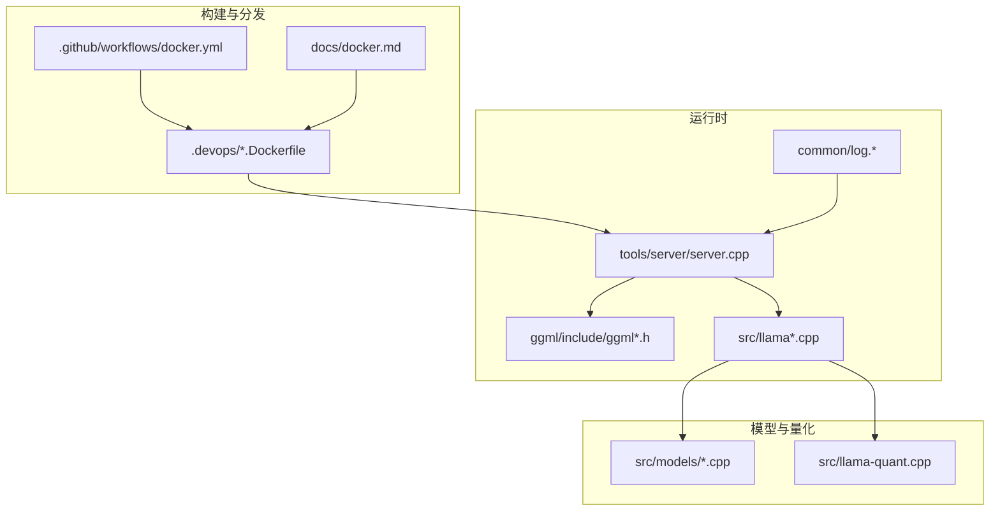
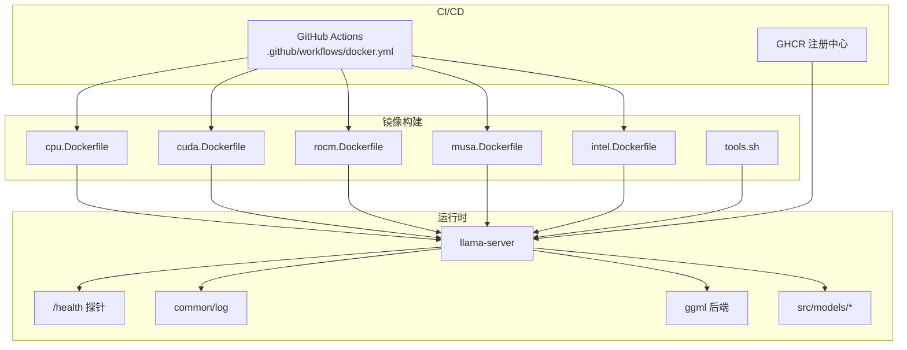
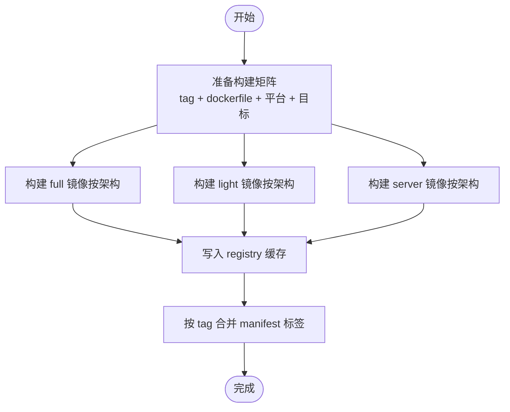
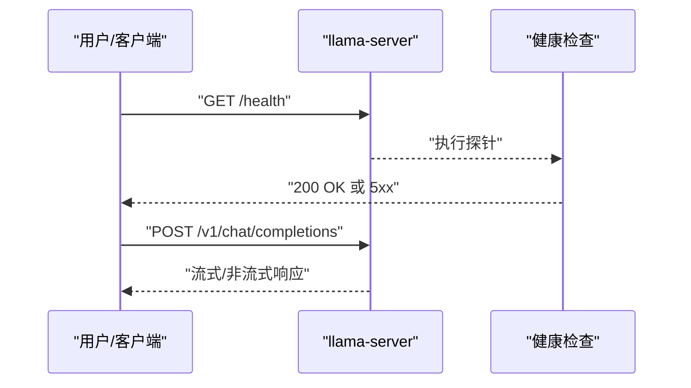
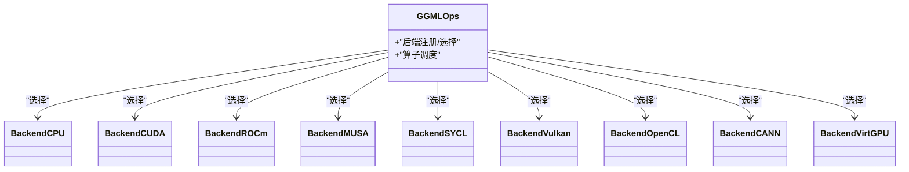
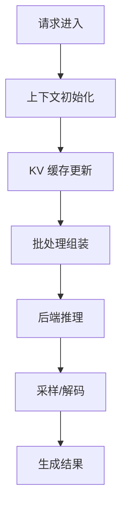
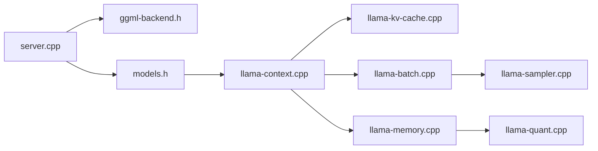

# 部署和运维

<cite>
**本文引用的文件**
- [README.md](file://README.md)
- [docs/docker.md](file://docs/docker.md)
- [.devops/tools.sh](file://.devops/tools.sh)
- [.devops/cpu.Dockerfile](file://.devops/cpu.Dockerfile)
- [.devops/cuda.Dockerfile](file://.devops/cuda.Dockerfile)
- [.devops/rocm.Dockerfile](file://.devops/rocm.Dockerfile)
- [.devops/musa.Dockerfile](file://.devops/musa.Dockerfile)
- [.devops/intel.Dockerfile](file://.devops/intel.Dockerfile)
- [.github/workflows/docker.yml](file://.github/workflows/docker.yml)
- [tools/server/server.cpp](file://tools/server/server.cpp)
- [tools/server/server-common.cpp](file://tools/server/server-common.cpp)
- [tools/server/server-http.cpp](file://tools/server/server-http.cpp)
- [tools/server/server-queue.cpp](file://tools/server/server-queue.cpp)
- [tools/server/server-models.cpp](file://tools/server/server-models.cpp)
- [common/log.cpp](file://common/log.cpp)
- [common/log.h](file://common/log.h)
- [common/common.cpp](file://common/common.cpp)
- [common/common.h](file://common/common.h)
- [ggml/include/ggml.h](file://ggml/include/ggml.h)
- [ggml/include/ggml-backend.h](file://ggml/include/ggml-backend.h)
- [ggml/src/ggml.cpp](file://ggml/src/ggml.cpp)
- [ggml/src/ggml-backend.cpp](file://ggml/src/ggml-backend.cpp)
- [ggml/src/ggml-threading.cpp](file://ggml/src/ggml-threading.cpp)
- [ggml/src/ggml-threading.h](file://ggml/src/ggml-threading.h)
- [src/llama.cpp](file://src/llama.cpp)
- [src/llama-context.cpp](file://src/llama-context.cpp)
- [src/llama-context.h](file://src/llama-context.h)
- [src/llama-memory.cpp](file://src/llama-memory.cpp)
- [src/llama-memory.h](file://src/llama-memory.h)
- [src/llama-kv-cache.cpp](file://src/llama-kv-cache.cpp)
- [src/llama-kv-cache.h](file://src/llama-kv-cache.h)
- [src/llama-batch.cpp](file://src/llama-batch.cpp)
- [src/llama-batch.h](file://src/llama-batch.h)
- [src/llama-sampler.cpp](file://src/llama-sampler.cpp)
- [src/llama-sampler.h](file://src/llama-sampler.h)
- [src/llama-impl.cpp](file://src/llama-impl.cpp)
- [src/llama-impl.h](file://src/llama-impl.h)
- [src/llama-arch.cpp](file://src/llama-arch.cpp)
- [src/llama-arch.h](file://src/llama-arch.h)
- [src/llama-model.cpp](file://src/llama-model.cpp)
- [src/llama-model.h](file://src/llama-model.h)
- [src/llama-io.cpp](file://src/llama-io.cpp)
- [src/llama-io.h](file://src/llama-io.h)
- [src/llama-quant.cpp](file://src/llama-quant.cpp)
- [src/llama-quant.h](file://src/llama-quant.h)
- [src/llama-chat.cpp](file://src/llama-chat.cpp)
- [src/llama-chat.h](file://src/llama-chat.h)
- [src/llama-graph.cpp](file://src/llama-graph.cpp)
- [src/llama-graph.h](file://src/llama-graph.h)
- [src/llama-memory-hybrid.cpp](file://src/llama-memory-hybrid.cpp)
- [src/llama-memory-hybrid.h](file://src/llama-memory-hybrid.h)
- [src/llama-memory-recurrent.cpp](file://src/llama-memory-recurrent.cpp)
- [src/llama-memory-recurrent.h](file://src/llama-memory-recurrent.h)
- [src/llama-kv-cache-iswa.cpp](file://src/llama-kv-cache-iswa.cpp)
- [src/llama-kv-cache-iswa.h](file://src/llama-kv-cache-iswa.h)
- [src/llama-memory-hybrid-iswa.cpp](file://src/llama-memory-hybrid-iswa.cpp)
- [src/llama-memory-hybrid-iswa.h](file://src/llama-memory-hybrid-iswa.h)
- [src/models/models.h](file://src/models/models.h)
- [src/models/llama.cpp](file://src/models/llama.cpp)
- [src/models/gemma.cpp](file://src/models/gemma.cpp)
- [src/models/qwen.cpp](file://src/models/qwen.cpp)
- [src/models/glm4.cpp](file://src/models/glm4.cpp)
- [src/models/command-r.cpp](file://src/models/command-r.cpp)
- [src/models/deepseek.cpp](file://src/models/deepseek.cpp)
- [src/models/mistral3.cpp](file://src/models/mistral3.cpp)
- [src/models/gpt2.cpp](file://src/models/gpt2.cpp)
- [src/models/phi3.cpp](file://src/models/phi3.cpp)
- [src/models/mamba.cpp](file://src/models/mamba.cpp)
- [src/models/gemma2-iswa.cpp](file://src/models/gemma2-iswa.cpp)
- [src/models/gemma3.cpp](file://src/models/gemma3.cpp)
- [src/models/gemma4-iswa.cpp](file://src/models/gemma4-iswa.cpp)
- [src/models/glm4-moe.cpp](file://src/models/glm4-moe.cpp)
- [src/models/nemotron.cpp](file://src/models/nemotron.cpp)
- [src/models/nemotron-h.cpp](file://src/models/nemotron-h.cpp)
- [src/models/olmo2.cpp](file://src/models/olmo2.cpp)
- [src/models/olmoe.cpp](file://src/models/olmoe.cpp)
- [src/models/granite.cpp](file://src/models/granite.cpp)
- [src/models/gptneox.cpp](file://src/models/gptneox.cpp)
- [src/models/bert.cpp](file://src/models/bert.cpp)
- [src/models/mpt.cpp](file://src/models/mpt.cpp)
- [src/models/falcon.cpp](file://src/models/falcon.cpp)
- [src/models/starcoder.cpp](file://src/models/starcoder.cpp)
- [src/models/refact.cpp](file://src/models/refact.cpp)
- [src/models/grok.cpp](file://src/models/grok.cpp)
- [src/models/ernie4-5.cpp](file://src/models/ernie4-5.cpp)
- [src/models/ernie4-5-moe.cpp](file://src/models/ernie4-5-moe.cpp)
- [src/models/jais.cpp](file://src/models/jais.cpp)
- [src/models/jais2.cpp](file://src/models/jais2.cpp)
- [src/models/bailinmoe2.cpp](file://src/models/bailinmoe2.cpp)
- [src/models/bailinmoe.cpp](file://src/models/bailinmoe.cpp)
- [src/models/afmoe.cpp](file://src/models/afmoe.cpp)
- [src/models/arctic.cpp](file://src/models/arctic.cpp)
- [src/models/arwkv7.cpp](file://src/models/arwkv7.cpp)
- [src/models/baichuan.cpp](file://src/models/baichuan.cpp)
- [src/models/bitnet.cpp](file://src/models/bitnet.cpp)
- [src/models/chameleon.cpp](file://src/models/chameleon.cpp)
- [src/models/codeshell.cpp](file://src/models/codeshell.cpp)
- [src/models/cohere2-iswa.cpp](file://src/models/cohere2-iswa.cpp)
- [src/models/dbrx.cpp](file://src/models/dbrx.cpp)
- [src/models/decimoe.cpp](file://src/models/decimoe.cpp)
- [src/models/exaone.cpp](file://src/models/exaone.cpp)
- [src/models/exaone4.cpp](file://src/models/exaone4.cpp)
- [src/models/falcon-h1.cpp](file://src/models/falcon-h1.cpp)
- [src/models/gemma-embedding.cpp](file://src/models/gemma-embedding.cpp)
- [src/models/glm4-moe.cpp](file://src/models/glm4-moe.cpp)
- [src/models/gpt2.cpp](file://src/models/gpt2.cpp)
- [src/models/gptneox.cpp](file://src/models/gptneox.cpp)
- [src/models/granite-hybrid.cpp](file://src/models/granite-hybrid.cpp)
- [src/models/grokmoe.cpp](file://src/models/grokmoe.cpp)
- [src/models/hunyuan-dense.cpp](file://src/models/hunyuan-dense.cpp)
- [src/models/hunyuan-moe.cpp](file://src/models/hunyuan-moe.cpp)
- [src/models/internlm2.cpp](file://src/models/internlm2.cpp)
- [src/models/jais.cpp](file://src/models/jais.cpp)
- [src/models/jais2.cpp](file://src/models/jais2.cpp)
- [src/models/jamba.cpp](file://src/models/jamba.cpp)
- [src/models/kimi-linear.cpp](file://src/models/kimi-linear.cpp)
- [src/models/lfm2.cpp](file://src/models/lfm2.cpp)
- [src/models/llada.cpp](file://src/models/llada.cpp)
- [src/models/llada-moe.cpp](file://src/models/llada-moe.cpp)
- [src/models/llama4.cpp](file://src/models/llama4.cpp)
- [src/models/maincoder.cpp](file://src/models/maincoder.cpp)
- [src/models/mamba-base.cpp](file://src/models/mamba-base.cpp)
- [src/models/minicpm3.cpp](file://src/models/minicpm3.cpp)
- [src/models/minimax-m2.cpp](file://src/models/minimax-m2.cpp)
- [src/models/mistral3.cpp](file://src/models/mistral3.cpp)
- [src/models/moondream.cpp](file://src/models/moondream.cpp)
- [src/models/moondream.cpp](file://src/models/moondream.cpp)
- [src/models/moondream.cpp](file://src/models/moondream.cpp)
- [src/models/moondream.cpp](file://src/models/moondream.cpp)
- [src/models/moondream.cpp](file://src/models/moondream.cpp)
- [src/models/moondream.cpp](file://src/models/moondream.cpp)
- [src/models/moondream.cpp](file://src/models/moondream.cpp)
- [src/models/moondream.cpp](file://src/models/moondream.cpp)
- [src/models/moondream.cpp](file://src/models/moondream.cpp)
- [src/models/moondream.cpp](file://src/models/moondream.cpp)
- [src/models/moondream.cpp](file://src/models/moondream.cpp)
- [src/models/moondream.cpp](file://src/models/moondream.cpp)
- [src/models/moondream.cpp](file://src/models/moondream.cpp)
- [src/models/moondream.cpp](file://src/models/moondream.cpp)
- [src/models/moondream.cpp](file://src/models/moondream.cpp)
- [src/models/moondream.cpp](file://src/models/moondream.cpp)
- [src/models/moondream.cpp](file://src/models/moondream.cpp)
- [src/models/moondream.cpp](file://src/models/moondream.cpp)
- [src/models/moondream.cpp](file://src/models/moondream.cpp)
- [src/models/moondream.cpp](file://src/models/moondream.cpp)
- [src/models/moondream.cpp](file://src/models/moondream.cpp)
- [src/models/moondream.cpp](file://src/models/moondream.cpp)
- [src/models/moondream.cpp](file://src/models/moondream.cpp)
- [src/models/moondream.cpp](file://src/models/moondream.cpp)
- [src/models/moondream.cpp](file://src/models/moondream.cpp......)
</cite>

## 目录
1. 引言
2. 项目结构
3. 核心组件
4. 架构总览
5. 详细组件分析
6. 依赖关系分析
7. 性能考量
8. 故障排查指南
9. 结论
10. 附录

## 引言
本文件面向生产环境的 llama.cpp 部署与运维，系统性覆盖容器化（Docker）与 Kubernetes 集成、性能监控与调优、负载均衡与高可用、日志与故障诊断、安全加固与访问控制、容量规划与资源管理、自动化流水线与镜像发布、备份与灾备等主题。内容基于仓库内官方文档、Dockerfile、CI 工作流以及服务端核心实现进行提炼与整合，帮助读者在不同硬件后端（CPU、CUDA、ROCm、MUSA、Intel SYCL、Vulkan 等）上稳定、高效地运行推理服务。

## 项目结构
llama.cpp 提供命令行工具与 HTTP 服务端，并通过多后端编译支持多种硬件平台。仓库中与部署运维直接相关的关键目录与文件：
- .devops：多后端 Dockerfile 与打包脚本，统一入口脚本 tools.sh
- .github/workflows：Docker 镜像自动构建与多架构标签合并
- docs/docker.md：官方 Docker 使用说明
- tools/server：HTTP 服务端实现（路由、队列、模型加载、任务执行）
- common：通用日志、参数解析、下载器等
- ggml：张量计算与后端抽象层（CPU、CUDA、ROCm、MUSA、SYCL、Vulkan 等）
- src：模型族适配与推理实现（LLaMA、Gemma、Qwen、Mamba 等）

图示来源
- [.devops/cpu.Dockerfile:1-92](file://.devops/cpu.Dockerfile#L1-L92)
- [.devops/cuda.Dockerfile:1-98](file://.devops/cuda.Dockerfile#L1-L98)
- [.devops/rocm.Dockerfile:1-114](file://.devops/rocm.Dockerfile#L1-L114)
- [.devops/musa.Dockerfile:1-102](file://.devops/musa.Dockerfile#L1-L102)
- [.devops/intel.Dockerfile:1-113](file://.devops/intel.Dockerfile#L1-L113)
- [.github/workflows/docker.yml:1-443](file://.github/workflows/docker.yml#L1-L443)
- [docs/docker.md:1-143](file://docs/docker.md#L1-L143)
- [tools/server/server.cpp](file://tools/server/server.cpp)
- [common/log.cpp](file://common/log.cpp)
- [ggml/include/ggml.h](file://ggml/include/ggml.h)
- [src/llama.cpp](file://src/llama.cpp)
- [src/models/models.h](file://src/models/models.h)

章节来源
- [README.md:325-444](file://README.md#L325-L444)
- [docs/docker.md:1-143](file://docs/docker.md#L1-L143)
- [.devops/tools.sh:1-54](file://.devops/tools.sh#L1-L54)
- [.devops/cpu.Dockerfile:1-92](file://.devops/cpu.Dockerfile#L1-L92)
- [.devops/cuda.Dockerfile:1-98](file://.devops/cuda.Dockerfile#L1-L98)
- [.devops/rocm.Dockerfile:1-114](file://.devops/rocm.Dockerfile#L1-L114)
- [.devops/musa.Dockerfile:1-102](file://.devops/musa.Dockerfile#L1-L102)
- [.devops/intel.Dockerfile:1-113](file://.devops/intel.Dockerfile#L1-L113)
- [.github/workflows/docker.yml:124-443](file://.github/workflows/docker.yml#L124-L443)

## 核心组件
- 容器镜像与运行时
  - 多后端 Dockerfile：CPU、CUDA、ROCm、MUSA、Intel SYCL、Vulkan、OpenVINO 等，分别产出 full/light/server 三类目标镜像
  - 统一入口脚本 tools.sh：封装 convert/quantize/run/bench/perplexity/all-in-one/server 等命令
  - 服务端健康检查：HEALTHCHECK 指向 /health 路由
- 服务端能力
  - OpenAI 兼容 API：/v1/chat/completions、/v1/embeddings、/v1/rerank 等
  - 并发与上下文：支持多用户并发、上下文长度、并行解码
  - 语法约束：支持 Grammar/GBNF 约束输出
  - 多模态：内置对图像输入的支持（见 README 与服务端实现）
- 日志与可观测性
  - 服务端日志：统一通过 common/log 输出，支持级别控制
  - 健康检查：/health 接口用于就绪/存活探测
- 后端与硬件加速
  - ggml 后端抽象：CPU、CUDA、ROCm、MUSA、SYCL、Vulkan、OpenCL、CANN、VirtGPU 等
  - 模型族适配：LLaMA、Gemma、Qwen、Mamba、Nemotron、Granite、GPT-NeoX 等

章节来源
- [docs/docker.md:7-143](file://docs/docker.md#L7-L143)
- [.devops/tools.sh:10-53](file://.devops/tools.sh#L10-L53)
- [.devops/cpu.Dockerfile:89-91](file://.devops/cpu.Dockerfile#L89-L91)
- [README.md:375-444](file://README.md#L375-L444)
- [common/log.cpp](file://common/log.cpp)
- [ggml/include/ggml-backend.h](file://ggml/include/ggml-backend.h)

## 架构总览
下图展示从容器到服务端、后端与模型族的整体交互关系，以及 CI 自动化镜像发布的流程。

图示来源
- [.github/workflows/docker.yml:124-443](file://.github/workflows/docker.yml#L124-L443)
- [.devops/cpu.Dockerfile:1-92](file://.devops/cpu.Dockerfile#L1-L92)
- [.devops/cuda.Dockerfile:1-98](file://.devops/cuda.Dockerfile#L1-L98)
- [.devops/rocm.Dockerfile:1-114](file://.devops/rocm.Dockerfile#L1-L114)
- [.devops/musa.Dockerfile:1-102](file://.devops/musa.Dockerfile#L1-L102)
- [.devops/intel.Dockerfile:1-113](file://.devops/intel.Dockerfile#L1-L113)
- [.devops/tools.sh:1-54](file://.devops/tools.sh#L1-L54)
- [tools/server/server.cpp](file://tools/server/server.cpp)
- [common/log.cpp](file://common/log.cpp)
- [ggml/include/ggml-backend.h](file://ggml/include/ggml-backend.h)
- [src/models/models.h](file://src/models/models.h)

## 详细组件分析

### 容器化与镜像构建
- 多后端镜像矩阵
  - 支持 CPU（amd64/arm64/s390x）、CUDA（12/13，amd64/arm64）、ROCm（amd64）、MUSA（amd64）、Intel SYCL（amd64）、Vulkan（amd64/arm64）、OpenVINO（amd64）
  - 每个后端产出 full/light/server 三种镜像目标，分别包含完整工具链、仅 CLI、仅服务端
- 构建与缓存
  - 使用 buildx 多架构构建，按后端 tag 写入 registry 缓存
  - 按架构汇总生成共享标签（manifest），便于跨架构使用
- 运行时入口
  - full 镜像以 tools.sh 为默认入口，提供 convert/quantize/run/bench/perplexity/all-in-one/server 等子命令
  - server 镜像设置 HEALTHCHECK /health，便于编排系统进行探活

图示来源
- [.github/workflows/docker.yml:56-123](file://.github/workflows/docker.yml#L56-L123)
- [.github/workflows/docker.yml:124-443](file://.github/workflows/docker.yml#L124-L443)

章节来源
- [.github/workflows/docker.yml:56-123](file://.github/workflows/docker.yml#L56-L123)
- [.github/workflows/docker.yml:124-443](file://.github/workflows/docker.yml#L124-L443)
- [docs/docker.md:7-143](file://docs/docker.md#L7-L143)
- [.devops/tools.sh:10-53](file://.devops/tools.sh#L10-L53)
- [.devops/cpu.Dockerfile:69-91](file://.devops/cpu.Dockerfile#L69-L91)

### 服务端启动与健康检查
- 启动方式
  - 通过 server 镜像或本地编译产物运行，绑定端口并设置监听地址
  - 默认暴露 /health 健康检查接口，供编排系统探测
- 常用参数
  - 端口、主机、并发、上下文长度、GPU 分层数、嵌入/重排序模式、语法约束等

图示来源
- [.devops/cpu.Dockerfile:89-91](file://.devops/cpu.Dockerfile#L89-L91)
- [tools/server/server.cpp](file://tools/server/server.cpp)
- [README.md:375-444](file://README.md#L375-L444)

章节来源
- [.devops/cpu.Dockerfile:89-91](file://.devops/cpu.Dockerfile#L89-L91)
- [README.md:375-444](file://README.md#L375-L444)

### 后端与硬件加速
- ggml 后端抽象
  - 支持 CPU、CUDA、ROCm、MUSA、SYCL、Vulkan、OpenCL、CANN、VirtGPU 等
  - 通过动态库加载与后端选择实现跨平台推理
- 关键实现位置
  - ggml 后端接口与实现位于 include 与 src 目录
  - 线程与内存管理在 ggml-threading 与 llama-memory 中实现

图示来源
- [ggml/include/ggml-backend.h](file://ggml/include/ggml-backend.h)
- [ggml/src/ggml-backend.cpp](file://ggml/src/ggml-backend.cpp)
- [ggml/src/ggml-threading.cpp](file://ggml/src/ggml-threading.cpp)
- [ggml/src/ggml-threading.h](file://ggml/src/ggml-threading.h)

章节来源
- [ggml/include/ggml-backend.h](file://ggml/include/ggml-backend.h)
- [ggml/src/ggml-backend.cpp](file://ggml/src/ggml-backend.cpp)
- [ggml/src/ggml-threading.cpp](file://ggml/src/ggml-threading.cpp)
- [ggml/src/ggml-threading.h](file://ggml/src/ggml-threading.h)

### 模型族与推理管线
- 模型族适配
  - src/models 下包含主流模型族实现（LLaMA、Gemma、Qwen、Mamba、Nemotron、Granite、GPT-NeoX 等）
  - 通过统一的 llama 模型接口与后端对接
- 推理关键模块
  - 上下文与 KV 缓存：llama-context、llama-kv-cache
  - 批处理与采样：llama-batch、llama-sampler
  - 内存与量化：llama-memory、llama-quant
  - 图与图执行：llama-graph

图示来源
- [src/llama-context.cpp](file://src/llama-context.cpp)
- [src/llama-kv-cache.cpp](file://src/llama-kv-cache.cpp)
- [src/llama-batch.cpp](file://src/llama-batch.cpp)
- [src/llama-sampler.cpp](file://src/llama-sampler.cpp)
- [src/llama-memory.cpp](file://src/llama-memory.cpp)
- [src/llama-quant.cpp](file://src/llama-quant.cpp)
- [src/llama-graph.cpp](file://src/llama-graph.cpp)

章节来源
- [src/models/models.h](file://src/models/models.h)
- [src/llama-context.cpp](file://src/llama-context.cpp)
- [src/llama-kv-cache.cpp](file://src/llama-kv-cache.cpp)
- [src/llama-batch.cpp](file://src/llama-batch.cpp)
- [src/llama-sampler.cpp](file://src/llama-sampler.cpp)
- [src/llama-memory.cpp](file://src/llama-memory.cpp)
- [src/llama-quant.cpp](file://src/llama-quant.cpp)
- [src/llama-graph.cpp](file://src/llama-graph.cpp)

### 日志与可观测性
- 日志模块
  - common/log 提供统一日志输出与级别控制，服务端可结合编排系统集中采集
- 健康检查
  - /health 接口用于就绪/存活探测，server 镜像已内置 HEALTHCHECK

章节来源
- [common/log.cpp](file://common/log.cpp)
- [common/log.h](file://common/log.h)
- [.devops/cpu.Dockerfile:89-91](file://.devops/cpu.Dockerfile#L89-L91)

## 依赖关系分析
- 组件耦合
  - 服务端依赖 ggml 后端与模型族实现；模型族依赖 llama 上下文与 KV 缓存；采样与批处理依赖上下文与后端
- 外部依赖
  - HTTP 服务器、JSON 库、图像/音频解码库等在 README 的依赖列表中给出
- 可能的循环依赖
  - 通过头文件分离与前置声明避免直接循环；后端与模型族通过抽象接口解耦

图示来源
- [tools/server/server.cpp](file://tools/server/server.cpp)
- [ggml/include/ggml-backend.h](file://ggml/include/ggml-backend.h)
- [src/models/models.h](file://src/models/models.h)
- [src/llama-context.cpp](file://src/llama-context.cpp)
- [src/llama-kv-cache.cpp](file://src/llama-kv-cache.cpp)
- [src/llama-batch.cpp](file://src/llama-batch.cpp)
- [src/llama-sampler.cpp](file://src/llama-sampler.cpp)
- [src/llama-memory.cpp](file://src/llama-memory.cpp)
- [src/llama-quant.cpp](file://src/llama-quant.cpp)

章节来源
- [tools/server/server.cpp](file://tools/server/server.cpp)
- [ggml/include/ggml-backend.h](file://ggml/include/ggml-backend.h)
- [src/models/models.h](file://src/models/models.h)
- [src/llama-context.cpp](file://src/llama-context.cpp)
- [src/llama-kv-cache.cpp](file://src/llama-kv-cache.cpp)
- [src/llama-batch.cpp](file://src/llama-batch.cpp)
- [src/llama-sampler.cpp](file://src/llama-sampler.cpp)
- [src/llama-memory.cpp](file://src/llama-memory.cpp)
- [src/llama-quant.cpp](file://src/llama-quant.cpp)

## 性能考量
- 硬件后端选择
  - CUDA/ROCm/MUSA/SYCL/Vulkan 等后端可显著提升吞吐；需匹配宿主机驱动版本与架构
- 线程与批处理
  - 合理设置线程数与批大小，避免过度竞争导致抖动
- 量化与内存
  - 采用更低比特量化可降低显存占用，但可能影响精度；根据场景权衡
- 上下文与 KV 缓存
  - 控制上下文长度与缓存命中率，减少重复编码开销
- 采样策略
  - 温度、top-p、top-k 等参数直接影响生成质量与延迟

章节来源
- [README.md:62-70](file://README.md#L62-L70)
- [src/llama-sampler.cpp](file://src/llama-sampler.cpp)
- [src/llama-memory.cpp](file://src/llama-memory.cpp)
- [src/llama-kv-cache.cpp](file://src/llama-kv-cache.cpp)

## 故障排查指南
- 健康检查失败
  - 检查 /health 是否可达；确认监听地址与端口映射正确
- GPU 后端异常
  - 确认容器运行时与驱动版本匹配；CUDA/ROCm/MUSA/SYCL 需对应镜像与参数
- 模型加载错误
  - 确认模型路径挂载正确、权限可读；检查 GGUF 格式与后端兼容性
- 日志定位
  - 查看服务端日志输出，结合请求上下文定位问题

章节来源
- [.devops/cpu.Dockerfile:89-91](file://.devops/cpu.Dockerfile#L89-L91)
- [common/log.cpp](file://common/log.cpp)
- [README.md:375-444](file://README.md#L375-L444)

## 结论
通过多后端 Docker 镜像与自动化 CI 流水线，llama.cpp 能够在多样化硬件平台上快速交付推理服务。结合服务端健康检查、日志与可观测性、后端抽象与模型族适配，可在生产环境中实现稳定、可扩展、可维护的部署与运维体系。

## 附录

### 容器化部署与 Kubernetes 集成
- Docker 使用要点
  - 使用官方镜像或自建镜像，按后端选择 full/light/server
  - 挂载模型目录，映射端口，设置监听地址
  - GPU 场景添加相应运行时与 nvidia-container-toolkit
- Kubernetes 集成建议
  - Deployment + Service + HPA；为 GPU Pod 设置节点选择器与资源限制
  - 使用 readinessProbe/ livenessProbe 指向 /health
  - 通过 ConfigMap/Secret 管理模型路径与运行参数

章节来源
- [docs/docker.md:43-143](file://docs/docker.md#L43-L143)
- [.devops/cpu.Dockerfile:89-91](file://.devops/cpu.Dockerfile#L89-L91)

### 生产环境性能监控与调优
- 指标采集
  - 服务端日志与 /health；结合 Prometheus/Grafana（参考 bench 目录配置）
- 调优方向
  - 线程数、批大小、上下文长度、采样参数、量化位宽、后端算子选择

章节来源
- [tools/server/bench/prometheus.yml](file://tools/server/bench/prometheus.yml)

### 负载均衡与高可用
- 多副本与会话亲和
  - 通过副本数与滚动升级实现高可用；会话亲和需结合状态保持策略
- 负载分发
  - Ingress/NLB 将请求均匀分发至多个实例

章节来源
- [README.md:262-265](file://README.md#L262-L265)

### 日志管理与故障诊断
- 日志集中化
  - 将 stdout/stderr 导出至集中式日志系统
- 故障定位
  - 结合请求 ID、时间戳与后端日志定位问题

章节来源
- [common/log.cpp](file://common/log.cpp)
- [common/log.h](file://common/log.h)

### 安全加固与访问控制
- 最小权限原则
  - 仅授予容器运行所需权限；避免特权模式
- 访问控制
  - 在网关层启用鉴权与速率限制；服务端可扩展鉴权中间件

章节来源
- [README.md:375-444](file://README.md#L375-L444)

### 容量规划与资源管理
- 资源估算
  - 基于模型大小、量化位宽、上下文长度与并发度估算显存/内存需求
- 动态扩缩容
  - HPA 根据 CPU/内存/自定义指标进行弹性伸缩

章节来源
- [README.md:297-324](file://README.md#L297-L324)

### 自动化部署与 CI/CD 流水线
- 镜像构建
  - 使用 GitHub Actions 按后端矩阵构建并推送至 GHCR
- 发布策略
  - 按标签合并 manifest，形成跨架构共享标签

章节来源
- [.github/workflows/docker.yml:124-443](file://.github/workflows/docker.yml#L124-L443)

### 备份恢复与灾难恢复
- 模型备份
  - 将 GGUF 模型与配置纳入备份范围
- 灾难恢复
  - 多副本与异地部署；结合快照与镜像仓库实现快速回滚

章节来源
- [README.md:297-324](file://README.md#L297-L324)