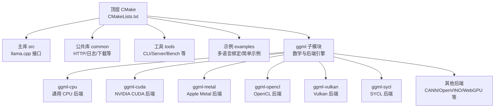
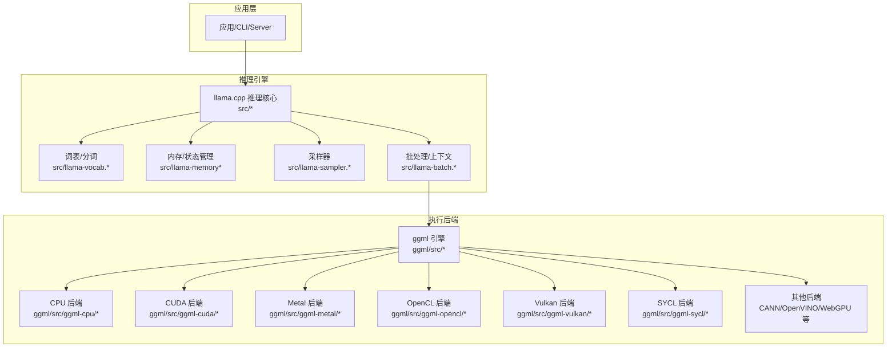
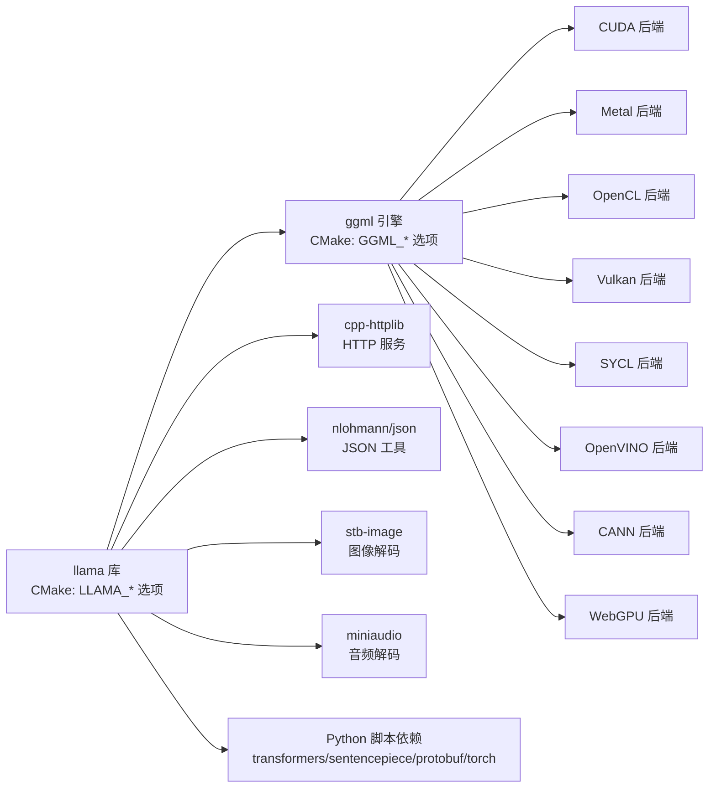
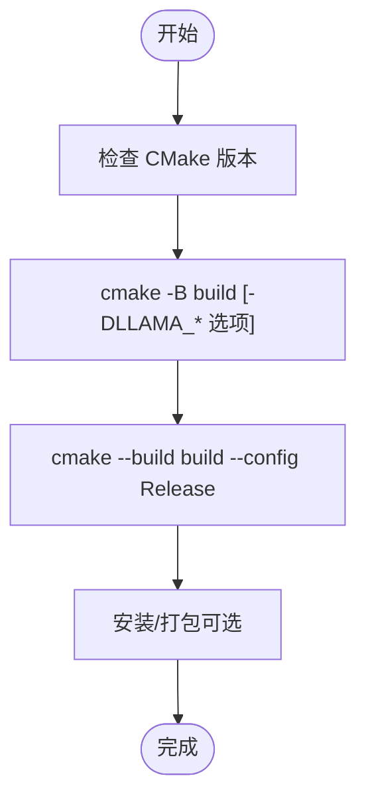
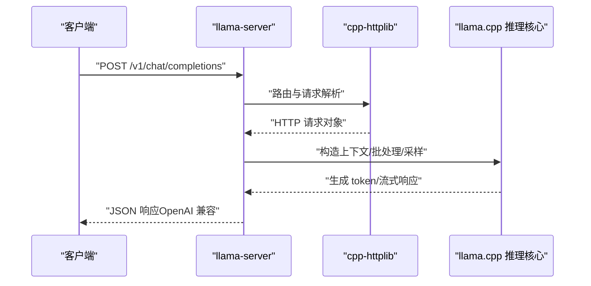

# 技术栈

<cite>
**本文引用的文件**
- [CMakeLists.txt](file://CMakeLists.txt)
- [README.md](file://README.md)
- [pyproject.toml](file://pyproject.toml)
- [requirements.txt](file://requirements.txt)
- [ggml/CMakeLists.txt](file://ggml/CMakeLists.txt)
- [cmake/common.cmake](file://cmake/common.cmake)
- [cmake/llama-config.cmake.in](file://cmake/llama-config.cmake.in)
- [common/CMakeLists.txt](file://common/CMakeLists.txt)
- [include/llama.h](file://include/llama.h)
- [docs/build.md](file://docs/build.md)
- [gguf-py/pyproject.toml](file://gguf-py/pyproject.toml)
</cite>

## 目录
1. [简介](#简介)
2. [项目结构](#项目结构)
3. [核心组件](#核心组件)
4. [架构总览](#架构总览)
5. [详细组件分析](#详细组件分析)
6. [依赖关系分析](#依赖关系分析)
7. [性能考量](#性能考量)
8. [故障排查指南](#故障排查指南)
9. [结论](#结论)
10. [附录](#附录)

## 简介
本文件系统化梳理 llama.cpp 的技术栈与实现要点，覆盖以下方面：
- 核心技术与构建系统：C/C++ 标准库、CMake、编译器选项与优化策略
- 第三方库与工具链：HTTP 服务器、JSON、图像解码、音频解码等
- 后端与硬件加速：CUDA、Metal、OpenCL、Vulkan、SYCL、CANN、OpenVINO、WebGPU 等
- 操作系统与平台：Windows、Linux、macOS、iOS、Android、WebAssembly
- 版本要求与兼容性：C/C++ 标准、CMake 版本范围、Python 依赖版本区间
- 为什么选择纯 C/C++：可移植性、零依赖、跨平台、低耦合、便于集成

## 项目结构
llama.cpp 采用“主库 + ggml 子模块 + 工具与示例”的分层组织方式：
- 主库与公共组件：src、include、common、examples、tools
- 数学与后端引擎：ggml 子目录，包含多后端实现（CUDA、Metal、OpenCL、Vulkan、SYCL 等）
- 构建系统：顶层 CMakeLists.txt 调度，cmake/*.cmake 提供通用配置
- 文档与示例：docs/* 提供构建、后端、移动端等文档；examples/* 提供多语言绑定与示例

图示来源
- [CMakeLists.txt:1-291](file://CMakeLists.txt#L1-L291)
- [ggml/CMakeLists.txt:1-505](file://ggml/CMakeLists.txt#L1-L505)

章节来源
- [CMakeLists.txt:1-291](file://CMakeLists.txt#L1-L291)
- [README.md:57-71](file://README.md#L57-L71)

## 核心组件
- C/C++ 标准库与编译特性
  - C 标准：C11
  - C++ 标准：C++17
  - 编译器选项：统一警告、错误处理、Sanitizer 支持（线程/地址/未定义）
- 构建系统：CMake（版本范围 3.14…3.28），支持多生成器（Ninja、Visual Studio、Xcode 等）
- 公共库与工具：common 提供 HTTP、日志、下载、缓存、语法解析、采样等能力
- 接口头文件：include/llama.h 定义 C 风格接口与数据类型

章节来源
- [ggml/CMakeLists.txt:284-288](file://ggml/CMakeLists.txt#L284-L288)
- [cmake/common.cmake:3-58](file://cmake/common.cmake#L3-L58)
- [CMakeLists.txt:1-291](file://CMakeLists.txt#L1-L291)
- [include/llama.h:1-200](file://include/llama.h#L1-L200)

## 架构总览
llama.cpp 的运行时由“模型加载/推理”和“后端执行”两部分构成：
- 模型侧：模型参数读取、KV 缓存、采样器、批处理、状态序列化
- 执行侧：通过 ggml 后端在 CPU 或 GPU 上执行张量运算，支持混合精度与量化

图示来源
- [include/llama.h:51-200](file://include/llama.h#L51-L200)
- [ggml/CMakeLists.txt:192-279](file://ggml/CMakeLists.txt#L192-L279)

章节来源
- [include/llama.h:51-200](file://include/llama.h#L51-L200)
- [ggml/CMakeLists.txt:192-279](file://ggml/CMakeLists.txt#L192-L279)

## 详细组件分析

### C/C++ 标准与编译器选项
- C/C++ 标准
  - C11：满足现代 C 语言特性与线程支持
  - C++17：启用并行算法、结构化绑定、内联变量等
- 统一编译选项
  - 开启严格警告与错误（可选）：-Wall/-Wextra/-Wpedantic 及编译器特定警告
  - Sanitizer：支持 Thread/Address/Undefined 三种模式
  - MSVC 特定：UTF-8 编译、大对象支持、抑制部分告警
- 代码可见性与导出
  - Windows 导出/导入宏；非 Windows 使用默认 visibility

章节来源
- [ggml/CMakeLists.txt:284-288](file://ggml/CMakeLists.txt#L284-L288)
- [cmake/common.cmake:3-58](file://cmake/common.cmake#L3-L58)
- [include/llama.h:15-35](file://include/llama.h#L15-L35)

### 构建系统与 CMake 选项
- 顶层 CMake
  - 最低版本：3.14…3.28
  - 默认构建类型：Release（若未指定）
  - 可选构建：tests、tools、examples、server、WebUI
  - OpenSSL 可选启用（HTTPS）
  - ggml 可作为子目录或系统库引入
- ggml 子模块
  - 后端开关：CUDA、HIP、Vulkan、Metal、OpenCL、SYCL、OpenVINO、WebGPU 等
  - 指令集优化：SSE/AVX/AVX2/AVX512/AMX、RVV、ZFH/ZVFH 等
  - BLAS/加速框架：Apple Accelerate、OpenMP、LLAMAFILE 等
- 常用 CMake 选项（示例）
  - -DGGML_CUDA=ON：启用 CUDA 后端
  - -DGGML_METAL=ON：启用 Metal 后端
  - -DGGML_OPENCL=ON：启用 OpenCL 后端
  - -DGGML_VULKAN=ON：启用 Vulkan 后端
  - -DGGML_SYCL=ON：启用 SYCL 后端
  - -DGGML_NATIVE=ON/OFF：是否针对当前 CPU 进行优化
  - -DBUILD_SHARED_LIBS=ON/OFF：是否构建共享库

章节来源
- [CMakeLists.txt:1-291](file://CMakeLists.txt#L1-L291)
- [ggml/CMakeLists.txt:1-505](file://ggml/CMakeLists.txt#L1-L505)
- [docs/build.md:132-200](file://docs/build.md#L132-L200)

### 第三方库与工具链
- HTTP 服务器（llama-server）
  - yhirose/cpp-httplib：单头文件 HTTP 库，MIT 许可
  - 用于内置 Web UI 与 REST API
- JSON 处理
  - nlohmann/json：单头文件 JSON 库，MIT 许可
  - 用于工具与示例中的 JSON 解析与生成
- 图像与音频解码
  - stb-image：单头文件图像解码，Public Domain
  - miniaudio：单头文件音频解码，Public Domain
- 进程与子进程
  - subprocess.h：单头文件进程启动，Public Domain
- Python 生态（脚本与转换）
  - 脚本入口：convert_hf_to_gguf.py 等
  - 依赖：transformers==5.5.1、sentencepiece、protobuf、torch（CPU 版本源）

章节来源
- [README.md:590-597](file://README.md#L590-L597)
- [common/CMakeLists.txt:138](file://common/CMakeLists.txt#L138)
- [pyproject.toml:17-28](file://pyproject.toml#L17-L28)

### 后端与硬件加速
- 后端矩阵
  - Metal：Apple Silicon（默认开启）
  - CUDA：NVIDIA GPU
  - HIP：AMD GPU（ROCm）
  - Vulkan：通用 GPU
  - OpenCL：Adreno GPU 等
  - SYCL：Intel GPU（含 DNN/Graphs）
  - CANN：昇腾 NPU
  - OpenVINO：Intel CPU/GPU/NPU
  - WebGPU：实验中
  - RPC：远程执行
  - 其他：BLIS、VirtGPU、zDNN、WebGPU 等
- 量化与混合精度
  - 支持 1.5/2/3/4/5/6/8 比特量化，BF16、NVFP4、MXFP4 等
  - FlashAttention、Tensor 并行、混合推理（CPU+GPU）

章节来源
- [README.md:275-296](file://README.md#L275-L296)
- [docs/build.md:132-200](file://docs/build.md#L132-L200)
- [ggml/CMakeLists.txt:192-279](file://ggml/CMakeLists.txt#L192-L279)

### 操作系统与平台支持
- Windows：MSVC/Clang，x86/x64/ARM64，支持 OpenSSL
- Linux：GCC/Clang，多后端可用
- macOS/iOS：Metal 默认启用，XCFramework 发布
- Android：Android 示例与 Gradle 工程
- WebAssembly：可选 64 位内存模式，HTML 输出
- 其他：RISC-V（RVV/ZFH/ZVFH）、IBM Z（zDNN）等

章节来源
- [docs/build.md:67-87](file://docs/build.md#L67-L87)
- [README.md:547-572](file://README.md#L547-L572)
- [CMakeLists.txt:38-60](file://CMakeLists.txt#L38-L60)

### Python 依赖与版本区间
- 顶层脚本依赖汇总：requirements.txt 组合多个子需求文件
- Poetry 项目（脚本集合）
  - Python >=3.9
  - transformers==5.5.1
  - sentencepiece >=0.1.98,<0.3.0
  - protobuf >=4.21.0,<5.0.0
  - torch（CPU 源）
  - gguf 包（本地路径）
- gguf-py 子包
  - Python >=3.8
  - numpy>=1.17、tqdm、pyyaml、requests
  - 可选 GUI：PySide6（Python 3.9–3.14）

章节来源
- [requirements.txt:1-14](file://requirements.txt#L1-L14)
- [pyproject.toml:17-28](file://pyproject.toml#L17-L28)
- [gguf-py/pyproject.toml:20-31](file://gguf-py/pyproject.toml#L20-L31)

### 为什么选择纯 C/C++ 实现
- 可移植性：无需虚拟机或运行时，直接在目标平台编译运行
- 零依赖：减少外部依赖带来的安全与兼容性风险
- 跨平台：统一的 C/C++ 接口与 CMake 构建，适配多操作系统与硬件
- 低耦合：接口清晰，易于嵌入到其他语言与框架中
- 易于集成：提供 C 接口与 pkg-config/CMake 包配置，便于下游消费

章节来源
- [README.md:59-71](file://README.md#L59-L71)
- [cmake/llama-config.cmake.in:1-31](file://cmake/llama-config.cmake.in#L1-L31)

## 依赖关系分析

图示来源
- [CMakeLists.txt:115-187](file://CMakeLists.txt#L115-L187)
- [ggml/CMakeLists.txt:192-279](file://ggml/CMakeLists.txt#L192-L279)
- [README.md:590-597](file://README.md#L590-L597)
- [common/CMakeLists.txt:138](file://common/CMakeLists.txt#L138)

章节来源
- [CMakeLists.txt:115-187](file://CMakeLists.txt#L115-L187)
- [ggml/CMakeLists.txt:192-279](file://ggml/CMakeLists.txt#L192-L279)
- [README.md:590-597](file://README.md#L590-L597)
- [common/CMakeLists.txt:138](file://common/CMakeLists.txt#L138)

## 性能考量
- 指令集优化：SSE/AVX/AVX2/AVX512/AMX、RVV、ZFH/ZVFH 等
- 后端选择：Metal（Apple）、CUDA（NVIDIA）、Vulkan（跨厂商 GPU）、OpenCL（Adreno）、SYCL（Intel）
- 量化策略：多比特整数量化、BF16、NVFP4、MXFP4，降低显存占用与提升吞吐
- 批处理与并行：批大小、线程数、FlashAttention、Tensor 并行与混合推理
- 构建优化：ccache、并行编译、链接时优化（LTO）、原生优化（GGML_NATIVE）

章节来源
- [ggml/CMakeLists.txt:140-182](file://ggml/CMakeLists.txt#L140-L182)
- [docs/build.md:132-200](file://docs/build.md#L132-L200)
- [README.md:62-70](file://README.md#L62-L70)

## 故障排查指南
- 构建失败
  - CMake 版本过低：确保在 3.14…3.28 范围内
  - 缺少后端依赖：按需安装 CUDA/ROCm/Vulkan SDK、OpenCL、SYCL 等
  - OpenSSL：如需 HTTPS，请安装开发头文件
- 运行时问题
  - Metal/CUDA 后端不可用：检查驱动与 SDK 版本匹配
  - 内存不足：尝试降低批大小、线程数或启用更高比特量化
  - 量化不兼容：确认模型 GGUF 量化类型与运行时支持情况
- 调试与诊断
  - 启用 Sanitizer：Thread/Address/Undefined 以定位并发与内存问题
  - 日志与调试：common 模块提供日志与调试输出

章节来源
- [docs/build.md:67-87](file://docs/build.md#L67-L87)
- [cmake/common.cmake:36-57](file://cmake/common.cmake#L36-L57)
- [common/CMakeLists.txt:72-100](file://common/CMakeLists.txt#L72-L100)

## 结论
llama.cpp 通过“纯 C/C++ + CMake + ggml 后端”的组合，在保证高性能与跨平台的同时，实现了对多硬件后端的广泛支持。其简洁的接口、完善的构建系统与丰富的文档，使其既能满足个人开发者快速上手，也能支撑企业级部署与二次集成。

## 附录

### 关键流程：构建与安装（CMake）

图示来源
- [CMakeLists.txt:1-291](file://CMakeLists.txt#L1-L291)

### 关键流程：HTTP 服务启动（llama-server）

图示来源
- [README.md:375-443](file://README.md#L375-L443)
- [common/CMakeLists.txt:138](file://common/CMakeLists.txt#L138)