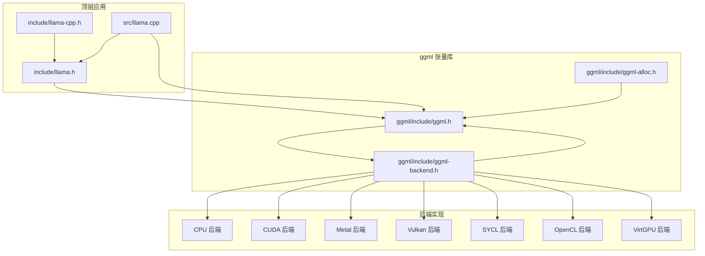
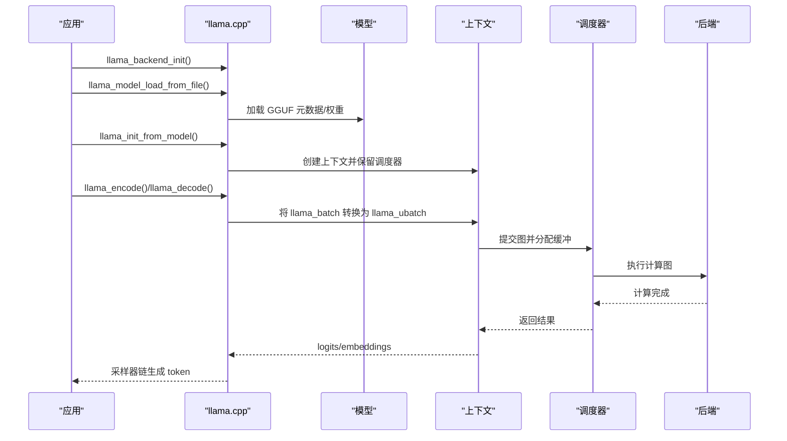
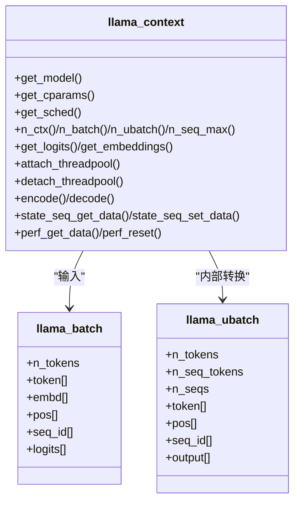
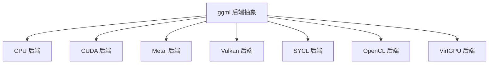
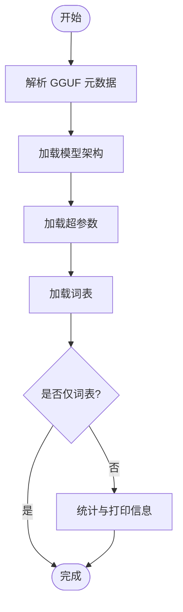
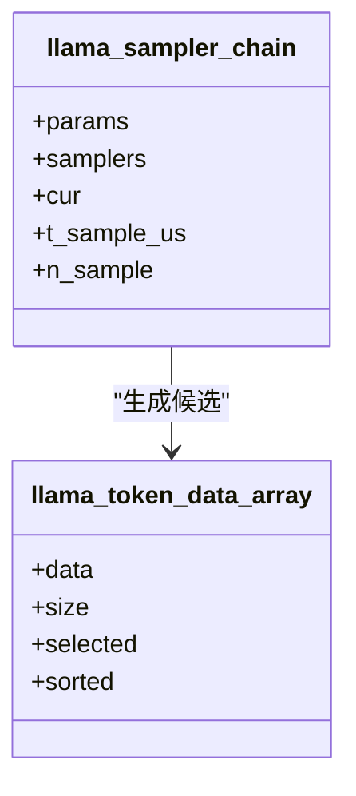
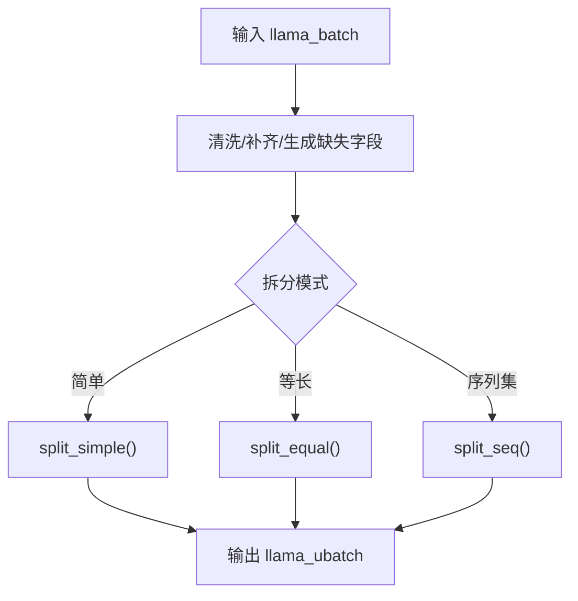
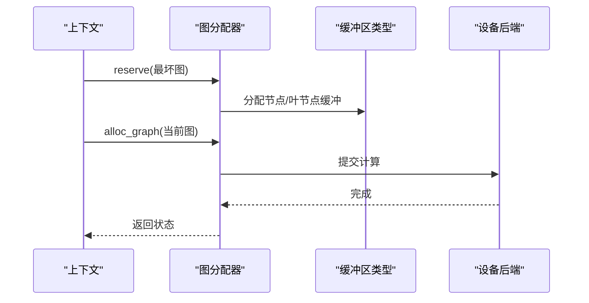
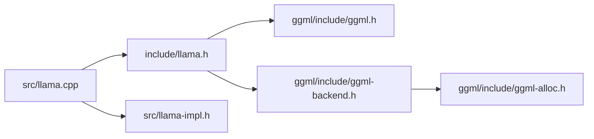

# 架构设计

<cite>
**本文引用的文件**
- [README.md](file://README.md)
- [CMakeLists.txt](file://CMakeLists.txt)
- [ggml/CMakeLists.txt](file://ggml/CMakeLists.txt)
- [include/llama.h](file://include/llama.h)
- [include/llama-cpp.h](file://include/llama-cpp.h)
- [ggml/include/ggml.h](file://ggml/include/ggml.h)
- [ggml/include/ggml-backend.h](file://ggml/include/ggml-backend.h)
- [ggml/include/ggml-alloc.h](file://ggml/include/ggml-alloc.h)
- [src/llama.cpp](file://src/llama.cpp)
- [src/llama-context.h](file://src/llama-context.h)
- [src/llama-model.h](file://src/llama-model.h)
- [src/llama-sampler.h](file://src/llama-sampler.h)
- [src/llama-batch.h](file://src/llama-batch.h)
- [src/llama-impl.h](file://src/llama-impl.h)
- [docs/ops.md](file://docs/ops.md)
- [docs/backend/VirtGPU.md](file://docs/backend/VirtGPU.md)
</cite>

## 目录
1. [引言](#引言)
2. [项目结构](#项目结构)
3. [核心组件](#核心组件)
4. [架构总览](#架构总览)
5. [详细组件分析](#详细组件分析)
6. [依赖关系分析](#依赖关系分析)
7. [性能考量](#性能考量)
8. [故障排查指南](#故障排查指南)
9. [结论](#结论)
10. [附录](#附录)

## 引言
本架构设计文档面向 llama.cpp 的使用者与贡献者，系统阐述其整体架构理念与实现方式，重点覆盖以下方面：
- 分层设计：从高层推理接口到底层张量计算与后端抽象的清晰分层
- 模块化组织：模型加载、上下文管理、批处理、采样器、内存与图执行等模块职责明确
- 插件化扩展机制：通过 ggml 后端注册与缓冲区类型抽象，支持多硬件后端（CPU、CUDA、Metal、Vulkan 等）
- 关键模块交互：推理引擎、后端抽象层、模型加载器、采样器之间的协作流程
- 内存管理策略：基于 ggml 的图分配器与缓冲区类型，支持主机/设备间异步拷贝与重用
- 批处理与并发：逻辑批大小、物理批大小、线程池与调度器的协同工作
- 架构图表与流程示意：帮助开发者快速理解内部工作机制与设计权衡

## 项目结构
llama.cpp 采用“顶层应用 + ggml 张量库 + 多后端”的分层组织方式：
- 顶层应用与公共头文件：提供 C/C++ 推理 API、上下文参数、采样器链等
- ggml 张量库：提供张量、自动微分、优化算法与后端抽象
- 后端子系统：通过 CMake 选项启用不同硬件后端，统一由 ggml 注册与调度
- 工具与示例：CLI、HTTP 服务、量化工具、基准测试等

**图表来源**
- [include/llama.h:1-120](file://include/llama.h#L1-L120)
- [include/llama-cpp.h:1-31](file://include/llama-cpp.h#L1-L31)
- [ggml/include/ggml.h:1-120](file://ggml/include/ggml.h#L1-L120)
- [ggml/include/ggml-backend.h:1-120](file://ggml/include/ggml-backend.h#L1-L120)
- [ggml/include/ggml-alloc.h:1-86](file://ggml/include/ggml-alloc.h#L1-L86)

**章节来源**
- [README.md:1-120](file://README.md#L1-L120)
- [CMakeLists.txt:170-230](file://CMakeLists.txt#L170-L230)
- [ggml/CMakeLists.txt:180-260](file://ggml/CMakeLists.txt#L180-L260)

## 核心组件
- 推理接口与上下文
  - 公共 API 定义于 include/llama.h，涵盖模型加载、上下文初始化、批处理提交、状态保存/恢复、采样器链配置等
  - C++ 包装器 include/llama-cpp.h 提供 RAII 智能指针封装
  - 实现入口与后端初始化在 src/llama.cpp 中完成
- 上下文与调度
  - src/llama-context.h 定义 llama_context，负责线程池绑定、调度器保留、内存更新、encode/decode 流程、状态序列读写等
- 模型与架构
  - src/llama-model.h 定义模型结构、超参、词汇表、内存布局等；配合 src/llama-arch.* 族文件描述具体模型架构
- 批处理与位置编码
  - src/llama-batch.h 定义 llama_ubatch 与批处理器，支持多序列、多维位置信息、输出标记等
- 采样器链
  - src/llama-sampler.h 定义采样器链结构，支持多采样器串联与性能计时
- ggml 抽象层
  - ggml/include/ggml.h 提供张量、计算图、自动微分与优化基础
  - ggml/include/ggml-backend.h 提供后端注册、设备、缓冲区类型与图执行接口
  - ggml/include/ggml-alloc.h 提供张量/图分配器，支持多缓冲区与重用

**章节来源**
- [include/llama.h:430-520](file://include/llama.h#L430-L520)
- [include/llama-cpp.h:1-31](file://include/llama-cpp.h#L1-L31)
- [src/llama.cpp:83-112](file://src/llama.cpp#L83-L112)
- [src/llama-context.h:26-120](file://src/llama-context.h#L26-L120)
- [src/llama-model.h:21-120](file://src/llama-model.h#L21-L120)
- [src/llama-batch.h:14-90](file://src/llama-batch.h#L14-L90)
- [src/llama-sampler.h:10-43](file://src/llama-sampler.h#L10-L43)
- [ggml/include/ggml.h:1-120](file://ggml/include/ggml.h#L1-L120)
- [ggml/include/ggml-backend.h:1-120](file://ggml/include/ggml-backend.h#L1-L120)
- [ggml/include/ggml-alloc.h:1-86](file://ggml/include/ggml-alloc.h#L1-L86)

## 架构总览
llama.cpp 的核心运行路径如下：
- 初始化阶段：调用 llama_backend_init 完成时间与量化表初始化；根据构建选项加载后端注册表
- 模型加载：通过 llama_model_load_from_file 等接口，使用 llama_model_loader 读取 GGUF 元数据与权重，构建模型架构与超参
- 上下文创建：llama_init_from_model 基于模型与上下文参数创建 llama_context，内部保留调度器与计算缓冲
- 批处理与执行：llama_batch 被转换为内部 llama_ubatch，按图类型（如 encode/decode）提交给调度器，后端执行计算图
- 输出与采样：采样器链对 logits 进行候选筛选与概率分布生成，返回最终 token
- 状态管理：支持完整或序列级状态保存/恢复，便于断点续跑与会话持久化

**图表来源**
- [src/llama.cpp:83-112](file://src/llama.cpp#L83-L112)
- [src/llama.cpp:171-200](file://src/llama.cpp#L171-L200)
- [src/llama-context.h:113-120](file://src/llama-context.h#L113-L120)
- [ggml/include/ggml-backend.h:100-110](file://ggml/include/ggml-backend.h#L100-L110)

**章节来源**
- [src/llama.cpp:83-112](file://src/llama.cpp#L83-L112)
- [src/llama.cpp:171-200](file://src/llama.cpp#L171-L200)
- [src/llama-context.h:113-120](file://src/llama-context.h#L113-L120)
- [ggml/include/ggml-backend.h:100-110](file://ggml/include/ggml-backend.h#L100-L110)

## 详细组件分析

### 推理引擎与上下文管理
- llama_context 负责：
  - 线程池绑定与解绑（attach/detach）
  - 调度器保留与同步（sched_reserve/synchronize）
  - 逻辑/物理批大小、序列最大数、注意力类型、RoPE 参数等上下文参数的承载
  - encode/decode 的统一入口，内部按 ubatch 图类型执行
  - 状态序列的保存/恢复（state_seq_*）
- 性能与调试：
  - perf_get_data/perf_reset 提供性能指标
  - memory_breakdown 展示内存占用分解

**图表来源**
- [src/llama-context.h:26-120](file://src/llama-context.h#L26-L120)
- [src/llama-batch.h:14-90](file://src/llama-batch.h#L14-L90)
- [include/llama.h:220-245](file://include/llama.h#L220-L245)

**章节来源**
- [src/llama-context.h:26-120](file://src/llama-context.h#L26-L120)
- [src/llama-batch.h:14-90](file://src/llama-batch.h#L14-L90)
- [include/llama.h:220-245](file://include/llama.h#L220-L245)

### 后端抽象层与多硬件支持
- ggml 后端抽象提供统一接口：
  - 设备枚举与属性查询（名称、类型、内存、能力）
  - 缓冲区类型与缓冲区分配（对齐、最大尺寸、用途）
  - 异步/同步张量拷贝、事件同步、图计划与执行
- 支持后端（示例）：CPU、CUDA、Metal、Vulkan、SYCL、OpenCL、VirtGPU 等
- ggml ops 能力矩阵可参考 docs/ops.md，展示各后端对常见算子的支持情况

**图表来源**
- [ggml/include/ggml-backend.h:130-200](file://ggml/include/ggml-backend.h#L130-L200)
- [docs/ops.md:15-122](file://docs/ops.md#L15-L122)
- [docs/backend/VirtGPU.md:80-137](file://docs/backend/VirtGPU.md#L80-L137)

**章节来源**
- [ggml/include/ggml-backend.h:130-200](file://ggml/include/ggml-backend.h#L130-L200)
- [docs/ops.md:15-122](file://docs/ops.md#L15-L122)
- [docs/backend/VirtGPU.md:80-137](file://docs/backend/VirtGPU.md#L80-L137)

### 模型加载器与架构适配
- 模型加载流程：
  - 解析 GGUF 元数据与权重分片
  - 加载架构、超参、词表
  - 可选：仅加载词表（vocab_only）、跳过张量加载（no_alloc）
- 模型架构与超参：
  - llama_model.h 定义模型结构体、层张量布局、注意力与归一化等
  - 不同模型（LLaMA、Gemma、Qwen、RWKV 等）通过架构族文件适配

**图表来源**
- [src/llama.cpp:114-169](file://src/llama.cpp#L114-L169)
- [src/llama-model.h:21-120](file://src/llama-model.h#L21-L120)

**章节来源**
- [src/llama.cpp:114-169](file://src/llama.cpp#L114-L169)
- [src/llama-model.h:21-120](file://src/llama-model.h#L21-L120)

### 采样器链与输出生成
- 采样器链：
  - 支持多采样器串联（如 top-k、top-p、温度、重复惩罚等）
  - 预分配候选缓冲避免频繁分配
  - 可记录采样耗时与次数
- 输出生成：
  - 从 logits 构造候选集，按策略筛选与概率归一化
  - 返回最终 token 与对应概率/logits

**图表来源**
- [src/llama-sampler.h:10-43](file://src/llama-sampler.h#L10-L43)
- [include/llama.h:200-216](file://include/llama.h#L200-L216)

**章节来源**
- [src/llama-sampler.h:10-43](file://src/llama-sampler.h#L10-L43)
- [include/llama.h:200-216](file://include/llama.h#L200-L216)

### 批处理机制与位置编码
- llama_batch 与 llama_ubatch：
  - 支持多序列、多维位置（如图像坐标）、输出标记
  - 批处理器负责清洗、补齐缺失字段、拆分不等长序列集合
- 位置编码：
  - 2D 位置支持用于多模态场景（如图像 token 的 y/x 坐标）

**图表来源**
- [src/llama-batch.h:72-115](file://src/llama-batch.h#L72-L115)
- [src/llama-batch.h:14-90](file://src/llama-batch.h#L14-L90)

**章节来源**
- [src/llama-batch.h:72-115](file://src/llama-batch.h#L72-L115)
- [src/llama-batch.h:14-90](file://src/llama-batch.h#L14-L90)

### 内存管理与图执行
- ggml 分配器：
  - 张量分配器（tallocr）与图分配器（gallocr）分离职责
  - 支持多缓冲区、预留最坏情况图以避免运行时重分配
- 缓冲区类型与设备：
  - 通过缓冲区类型抽象主机/设备内存，支持异步拷贝与事件同步
- 执行流程：
  - 构建计算图 → 分配缓冲 → 提交后端执行 → 同步/回调

**图表来源**
- [ggml/include/ggml-alloc.h:48-82](file://ggml/include/ggml-alloc.h#L48-L82)
- [ggml/include/ggml-backend.h:35-110](file://ggml/include/ggml-backend.h#L35-L110)

**章节来源**
- [ggml/include/ggml-alloc.h:48-82](file://ggml/include/ggml-alloc.h#L48-L82)
- [ggml/include/ggml-backend.h:35-110](file://ggml/include/ggml-backend.h#L35-L110)

## 依赖关系分析
- 顶层依赖
  - include/llama.h 依赖 ggml.h、ggml-backend.h、gguf.h
  - src/llama.cpp 依赖 llama.h、llama-impl.h、模型/上下文/IO 等模块头文件
- 后端依赖
  - ggml-backend.h 依赖 ggml.h、ggml-alloc.h
  - 各后端（CUDA/Metal/Vulkan/SYCL/OpenCL/VirtGPU）通过 ggml 注册表动态加载
- 构建与选项
  - CMakeLists.txt 控制是否使用系统 ggml、构建工具与安装目标
  - ggml/CMakeLists.txt 提供大量后端开关与编译特性

**图表来源**
- [include/llama.h:4-9](file://include/llama.h#L4-L9)
- [src/llama.cpp:1-17](file://src/llama.cpp#L1-L17)
- [ggml/include/ggml-backend.h:1-10](file://ggml/include/ggml-backend.h#L1-L10)
- [ggml/include/ggml-alloc.h:1-10](file://ggml/include/ggml-alloc.h#L1-L10)

**章节来源**
- [include/llama.h:4-9](file://include/llama.h#L4-L9)
- [src/llama.cpp:1-17](file://src/llama.cpp#L1-L17)
- [ggml/include/ggml-backend.h:1-10](file://ggml/include/ggml-backend.h#L1-L10)
- [ggml/include/ggml-alloc.h:1-10](file://ggml/include/ggml-alloc.h#L1-L10)

## 性能考量
- 线程与并发
  - 通过线程池绑定与上下文参数控制 encode/decode 并发度
  - NUMA 初始化可在多 NUMA 节点环境中提升内存带宽
- 批处理与图执行
  - 逻辑批大小与物理批大小分离，有助于吞吐与显存/内存占用平衡
  - 使用图分配器预留最坏情况图，减少运行时重分配开销
- 后端选择与 offload
  - GPU/IGPU 设备优先 offload KQV 与注意力计算，降低 CPU 压力
  - 支持混合精度与量化（如 Q2_K 到 Q8_0、IQ*、BF16 等），在精度与速度之间权衡
- I/O 与内存
  - 支持 mmap/mlock 与直通 IO，减少页错误与系统调用开销
  - 统一缓冲区类型与异步拷贝，降低主机/设备往返延迟

[本节为通用指导，无需特定文件引用]

## 故障排查指南
- 后端未加载
  - 现象：提示无后端可用
  - 排查：确认已加载后端注册（如 ggml_backend_load_all），或检查构建选项
- 模型加载失败
  - 现象：加载阶段抛出异常或返回错误码
  - 排查：检查 GGUF 文件完整性、分片命名、进度回调取消标志
- 批处理越界或序列不连续
  - 现象：encode/decode 返回错误或行为异常
  - 排查：使用批处理器的清洗与补齐功能，确保序列连续性与位置信息正确
- 性能异常
  - 现象：吞吐低、显存占用高
  - 排查：调整上下文参数（n_threads、n_threads_batch、n_batch、n_ubatch）、切换后端、启用/禁用 offload

**章节来源**
- [src/llama.cpp:197-200](file://src/llama.cpp#L197-L200)
- [src/llama.cpp:114-169](file://src/llama.cpp#L114-L169)
- [src/llama-batch.h:72-115](file://src/llama-batch.h#L72-L115)

## 结论
llama.cpp 通过清晰的分层设计与强大的 ggml 抽象，实现了跨平台、可扩展的推理框架。其模块化组织使模型加载、上下文管理、批处理与采样器链职责分明；插件化的后端机制则让多硬件后端得以统一接入。结合图分配器与缓冲区类型抽象，系统在性能与易用性之间取得良好平衡。建议在生产环境中：
- 明确批处理与并发参数，结合硬件能力进行调优
- 在首次部署时使用图预留策略，避免运行时重分配
- 根据任务需求选择合适的量化与后端组合

[本节为总结性内容，无需特定文件引用]

## 附录
- 关键 API 速览
  - llama_backend_init / llama_backend_free：后端初始化与清理
  - llama_model_load_from_file / llama_init_from_model：模型加载与上下文创建
  - llama_encode / llama_decode：编码与解码主入口
  - llama_state_* / llama_state_seq_*：状态保存/恢复
  - llama_sampler_chain_*：采样器链配置与采样
- 后端能力参考
  - docs/ops.md 提供各后端对常见算子的支持矩阵
  - docs/backend/VirtGPU.md 说明 VirtGPU 的协议与配置要点

**章节来源**
- [include/llama.h:440-520](file://include/llama.h#L440-L520)
- [docs/ops.md:15-122](file://docs/ops.md#L15-L122)
- [docs/backend/VirtGPU.md:80-137](file://docs/backend/VirtGPU.md#L80-L137)