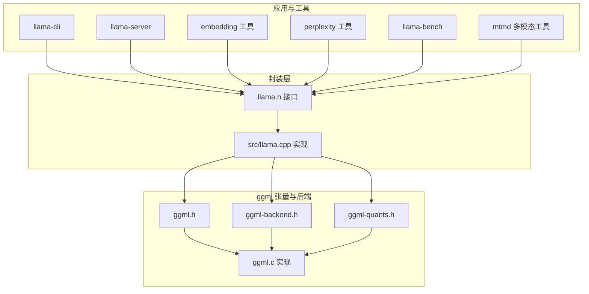
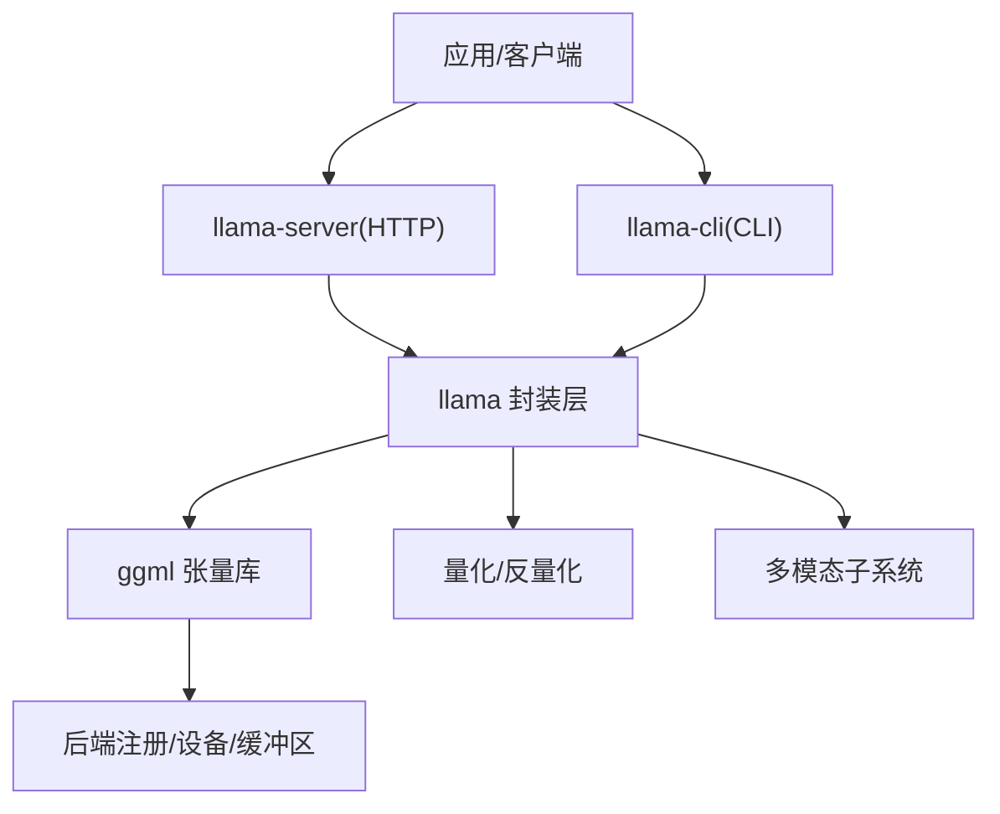
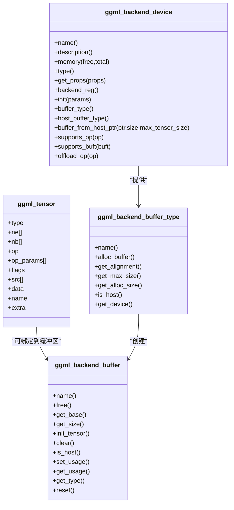
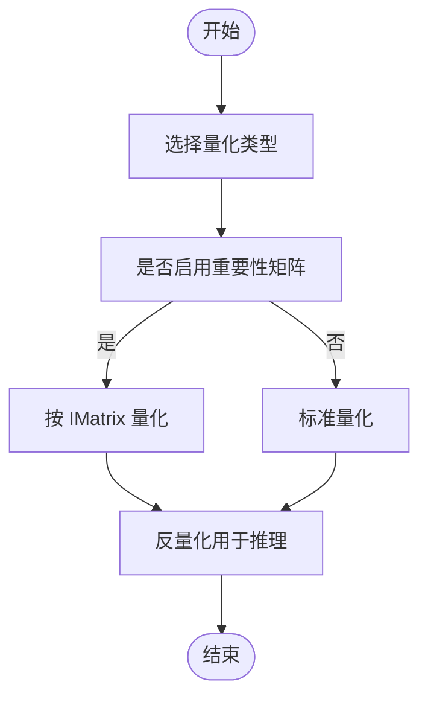
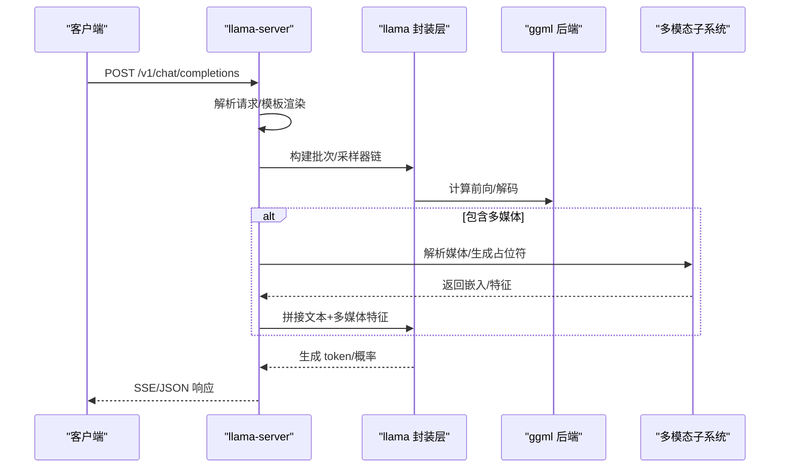
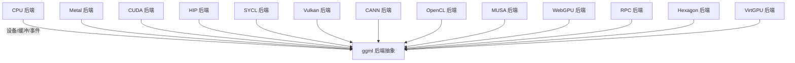
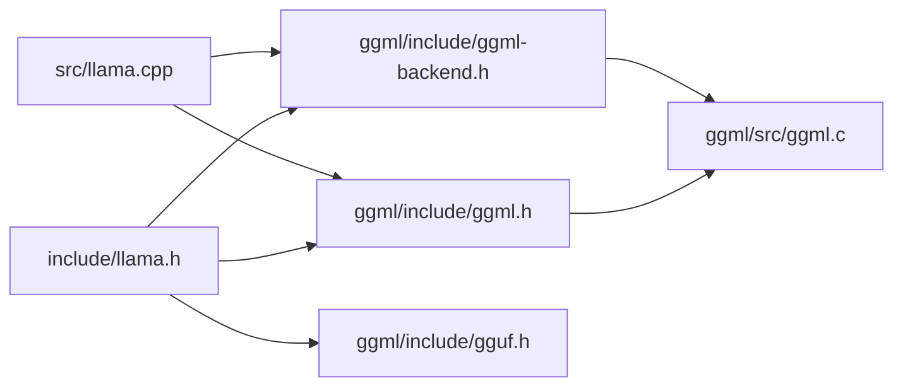

# 核心特性

<cite>
**本文引用的文件**   
- [README.md](file://README.md)
- [ggml/include/ggml.h](file://ggml/include/ggml.h)
- [ggml/include/ggml-backend.h](file://ggml/include/ggml-backend.h)
- [ggml/src/ggml.c](file://ggml/src/ggml.c)
- [ggml/src/ggml-quants.h](file://ggml/src/ggml-quants.h)
- [include/llama.h](file://include/llama.h)
- [src/llama.cpp](file://src/llama.cpp)
- [docs/build.md](file://docs/build.md)
- [docs/multimodal.md](file://docs/multimodal.md)
- [tools/server/README.md](file://tools/server/README.md)
</cite>

## 目录
1. [简介](#简介)
2. [项目结构](#项目结构)
3. [核心组件](#核心组件)
4. [架构总览](#架构总览)
5. [详细组件分析](#详细组件分析)
6. [依赖关系分析](#依赖关系分析)
7. [性能考量](#性能考量)
8. [故障排查指南](#故障排查指南)
9. [结论](#结论)
10. [附录](#附录)

## 简介
本节概述 llama.cpp 的核心目标与定位：在广泛硬件上实现“最小设置、极致性能”的大语言模型推理。项目以纯 C/C++ 实现，强调跨平台兼容、多后端硬件加速、量化优化、多模态能力与 OpenAI API 兼容服务端。

- 纯 C/C++ 实现，无外部依赖
- 多硬件后端支持：Apple Silicon、x86/ARM 向量指令、CUDA、HIP、SYCL、Vulkan、OpenCL、CANN、MUSA、WebGPU、RPC 等
- 1.5–8 位整数量化，显著降低显存与系统内存占用，提升吞吐
- 统一的 ggml 后端抽象层，屏蔽底层差异
- 多模态输入（图像/音频）与 OpenAI 兼容 HTTP 服务端
- 丰富的工具链与生态：CLI、HTTP 服务器、嵌入/重排、量化、基准测试、WebUI 等

章节来源
- [README.md: 57-71:57-71](file://README.md#L57-L71)
- [README.md: 275-296:275-296](file://README.md#L275-L296)

## 项目结构
llama.cpp 采用分层组织：
- ggml 子库：张量计算、自动微分、优化算法、后端抽象与设备管理
- llama 封装层：模型加载、上下文管理、采样器、KV 缓存、序列处理
- 工具与示例：CLI、HTTP 服务器、嵌入/重排、量化、基准测试、多模态工具
- 文档与构建：构建指南、后端适配、多模态说明、开发指南

图示来源
- [include/llama.h: 1-120:1-120](file://include/llama.h#L1-L120)
- [ggml/include/ggml.h: 1-120:1-120](file://ggml/include/ggml.h#L1-L120)
- [ggml/include/ggml-backend.h: 1-120:1-120](file://ggml/include/ggml-backend.h#L1-L120)
- [ggml/src/ggml-quants.h: 1-113:1-113](file://ggml/src/ggml-quants.h#L1-L113)
- [src/llama.cpp: 1-120:1-120](file://src/llama.cpp#L1-L120)

章节来源
- [README.md: 325-471:325-471](file://README.md#L325-L471)
- [docs/build.md: 1-60:1-60](file://docs/build.md#L1-L60)

## 核心组件
- ggml 张量库：提供张量类型、运算、自动微分、优化器、内存与对象管理
- ggml 后端抽象：统一设备（CPU/GPU/IGPU/加速器/元设备）、缓冲区类型、缓冲区、事件与计划
- llama 封装接口：模型加载/保存、上下文参数、采样器链、批处理、KV 缓存、状态序列
- 量化子系统：覆盖 Q 系列、IQ 系列、TQ 系列、MXFP4/NVFP4 等，支持重要性矩阵感知量化
- 多模态子系统：图像/音频输入、投影器 offload、OpenAI 兼容 API 扩展
- HTTP 服务端：OpenAI 兼容聊天/补全/嵌入、并发槽、连续批处理、监控端点、函数调用/工具

章节来源
- [ggml/include/ggml.h: 389-470:389-470](file://ggml/include/ggml.h#L389-L470)
- [ggml/include/ggml-backend.h: 24-120:24-120](file://ggml/include/ggml-backend.h#L24-L120)
- [include/llama.h: 115-160:115-160](file://include/llama.h#L115-L160)
- [ggml/src/ggml-quants.h: 14-113:14-113](file://ggml/src/ggml-quants.h#L14-L113)
- [docs/multimodal.md: 1-40:1-40](file://docs/multimodal.md#L1-L40)
- [tools/server/README.md: 1-40:1-40](file://tools/server/README.md#L1-L40)

## 架构总览
llama.cpp 通过 ggml 提供统一的张量与后端抽象，llama 封装层在此之上完成模型生命周期、上下文与采样器管理，并对外暴露 CLI 与 HTTP 服务端。量化模块贯穿权重与激活路径，多模态模块在服务端扩展为 OpenAI 兼容 API。

图示来源
- [include/llama.h: 434-520:434-520](file://include/llama.h#L434-L520)
- [ggml/include/ggml-backend.h: 198-220:198-220](file://ggml/include/ggml-backend.h#L198-L220)
- [src/llama.cpp: 83-108:83-108](file://src/llama.cpp#L83-L108)
- [tools/server/README.md: 1-40:1-40](file://tools/server/README.md#L1-L40)

## 详细组件分析

### 组件 A：ggml 张量与后端抽象
- 张量类型与运算：涵盖 F32/F16/Q 系列/I 系列/BF16/MXFP4/NVFP4 等，支持常见线性代数与卷积/池化/注意力等操作
- 后端设备与缓冲：统一 CPU/GPU/IGPU/加速器/元设备；缓冲区类型与缓冲区；事件同步；设备能力查询
- 内存与对象：上下文初始化/释放、对象打印、张量大小/行大小/块大小、对齐与字节对齐
- 量化接口：提供参考/实现的量化/反量化函数，支持 IQ/TQ/K 系列与 MXFP4/NVFP4

图示来源
- [ggml/include/ggml.h: 660-692:660-692](file://ggml/include/ggml.h#L660-L692)
- [ggml/include/ggml-backend.h: 24-120:24-120](file://ggml/include/ggml-backend.h#L24-L120)
- [ggml/include/ggml-backend.h: 134-193:134-193](file://ggml/include/ggml-backend.h#L134-L193)

章节来源
- [ggml/include/ggml.h: 389-470:389-470](file://ggml/include/ggml.h#L389-L470)
- [ggml/include/ggml-backend.h: 24-120:24-120](file://ggml/include/ggml-backend.h#L24-L120)
- [ggml/src/ggml-quants.h: 14-113:14-113](file://ggml/src/ggml-quants.h#L14-L113)

### 组件 B：量化优化与数据类型
- 支持范围：从 1.5 到 8 位整数量化，覆盖 Q 系列（Q4_0/Q4_1/Q5_0/Q5_1/Q8_0/Q8_1）、QK 系列（Q2_K/Q3_K/Q4_K/Q5_K/Q6_K/Q8_K）、IQ 系列（IQ2_XXS/IQ2_XS/IQ3_XXS/IQ1_S/IQ4_NL/IQ3_S/IQ2_S/IQ4_XS）、TQ 系列（TQ1_0/TQ2_0）、BF16、MXFP4/NVFP4、Q1_0 等
- 重要性矩阵感知量化：通过 IMatrix 在训练/量化时考虑激活分布，提升精度
- 反量化路径：按类型进行反量化，支撑推理阶段的高精度中间结果

图示来源
- [ggml/src/ggml-quants.h: 14-113:14-113](file://ggml/src/ggml-quants.h#L14-L113)
- [ggml/include/ggml.h: 389-470:389-470](file://ggml/include/ggml.h#L389-L470)

章节来源
- [README.md: 66](file://README.md#L66)
- [ggml/src/ggml-quants.h: 14-113:14-113](file://ggml/src/ggml-quants.h#L14-L113)
- [ggml/include/ggml.h: 389-470:389-470](file://ggml/include/ggml.h#L389-L470)

### 组件 C：多模态与 OpenAI 兼容服务端
- 多模态：图像/音频输入，支持通过 mmproj 投影器，服务端默认将投影器 offload 至 GPU
- OpenAI 兼容：/v1/chat/completions、/v1/embeddings、/v1/rerank 等端点；支持函数调用/工具、Schema 约束 JSON、并发槽与连续批处理
- 服务端特性：多用户并发、多 GPU 分片、KV 缓存 offload、性能指标、WebUI、SSL、路由与模型目录管理

图示来源
- [tools/server/README.md: 367-572:367-572](file://tools/server/README.md#L367-L572)
- [docs/multimodal.md: 18-32:18-32](file://docs/multimodal.md#L18-L32)
- [include/llama.h: 202-244:202-244](file://include/llama.h#L202-L244)

章节来源
- [docs/multimodal.md: 1-40:1-40](file://docs/multimodal.md#L1-L40)
- [tools/server/README.md: 1-40:1-40](file://tools/server/README.md#L1-L40)
- [tools/server/README.md: 367-572:367-572](file://tools/server/README.md#L367-L572)

### 组件 D：跨平台与多硬件后端
- 后端列表：Metal（Apple Silicon）、BLAS/BLIS、SYCL（Intel/NVIDIA GPU）、CUDA、HIP（AMD GPU）、Vulkan、CANN、OpenCL、MUSA、WebGPU、RPC、Hexagon、VirtGPU 等
- 设备能力：异步、主机固定缓冲、从主机指针创建缓冲、事件同步、设备属性与能力
- 构建选项：CPU/BLAS/Metal/CUDA/SYCL/Vulkan/CANN/OpenCL 等后端的编译开关与注意事项

图示来源
- [README.md: 275-296:275-296](file://README.md#L275-L296)
- [ggml/include/ggml-backend.h: 134-193:134-193](file://ggml/include/ggml-backend.h#L134-L193)
- [docs/build.md: 16-29:16-29](file://docs/build.md#L16-L29)

章节来源
- [README.md: 275-296:275-296](file://README.md#L275-L296)
- [docs/build.md: 16-29:16-29](file://docs/build.md#L16-L29)
- [ggml/include/ggml-backend.h: 134-193:134-193](file://ggml/include/ggml-backend.h#L134-L193)

## 依赖关系分析
- llama.h 依赖 ggml.h、ggml-backend.h、gguf.h，提供模型/上下文/采样器/量化类型等高层接口
- src/llama.cpp 依赖 ggml 与后端，负责模型加载、上下文初始化、NUMA 初始化、后端初始化/释放
- ggml.c 提供张量对象、内存分配、回溯打印、时间测量等基础能力
- 多模态与服务端在 tools/server 中扩展 OpenAI 兼容 API，内部仍依赖 llama/ggml

图示来源
- [include/llama.h: 1-14:1-14](file://include/llama.h#L1-L14)
- [src/llama.cpp: 1-17:1-17](file://src/llama.cpp#L1-L17)
- [ggml/include/ggml.h: 1-14:1-14](file://ggml/include/ggml.h#L1-L14)
- [ggml/include/ggml-backend.h: 1-5:1-5](file://ggml/include/ggml-backend.h#L1-L5)
- [ggml/src/ggml.c: 1-12:1-12](file://ggml/src/ggml.c#L1-L12)

章节来源
- [include/llama.h: 1-14:1-14](file://include/llama.h#L1-L14)
- [src/llama.cpp: 1-17:1-17](file://src/llama.cpp#L1-L17)
- [ggml/src/ggml.c: 1-12:1-12](file://ggml/src/ggml.c#L1-L12)

## 性能考量
- 量化策略：1.5–8 位整数量化显著降低显存与系统内存占用，提升吞吐；结合 KV 缓存 offload 与混合精度缓存类型可进一步优化
- 后端选择：Apple Silicon 使用 Metal；x86 可选 AVX/AVX2/AVX512/AMX；GPU 可选 CUDA/HIP/Vulkan/SYCL/OpenCL；部分后端支持异步与事件同步
- 连续批处理与并发槽：llama-server 支持多用户并发与连续批处理，提高资源利用率
- 预填充与提示缓存：通过提示缓存与 KV 移位复用，减少重复计算
- 规模与分片：多 GPU 场景下支持按层/行/张量分片，主 GPU 与张量比例配置

章节来源
- [README.md: 66](file://README.md#L66)
- [tools/server/README.md: 177-180:177-180](file://tools/server/README.md#L177-L180)
- [tools/server/README.md: 186-190:186-190](file://tools/server/README.md#L186-L190)
- [tools/server/README.md: 209-211:209-211](file://tools/server/README.md#L209-L211)

## 故障排查指南
- 后端未加载：若未加载任何后端，模型加载会失败；需先加载后端或在构建时启用相应后端
- NUMA 优化：可通过 llama_numa_init 启用 NUMA 优化，建议在首次运行前清理系统页面缓存
- 回溯与调试：ggml 提供回溯符号打印与时间测量，便于定位性能瓶颈与异常
- 多模态问题：确认模型与 mmproj 文件匹配，必要时禁用 mmproj offload 或指定本地 mmproj 路径

章节来源
- [src/llama.cpp: 197-200:197-200](file://src/llama.cpp#L197-L200)
- [src/llama.cpp: 94-104:94-104](file://src/llama.cpp#L94-L104)
- [ggml/src/ggml.c: 152-200:152-200](file://ggml/src/ggml.c#L152-L200)
- [docs/multimodal.md: 10-17:10-17](file://docs/multimodal.md#L10-L17)

## 结论
llama.cpp 通过纯 C/C++ 与 ggml 的统一抽象，实现了跨平台、多硬件后端的高性能推理；结合广泛的量化方案、多模态与 OpenAI 兼容服务端，满足从边缘到云端的多样化部署需求。其模块化设计与清晰的接口边界，使得开发者可以灵活组合工具链与后端，快速落地各类应用。

## 附录
- 快速开始与安装：见 README 的“快速开始”与“安装/构建”章节
- 后端构建指南：见 docs/build.md 的各后端章节
- 多模态使用：见 docs/multimodal.md 与 tools/server 的多模态参数
- 服务端 API：见 tools/server/README.md 的端点与参数说明

章节来源
- [README.md: 33-56:33-56](file://README.md#L33-L56)
- [docs/build.md: 1-60:1-60](file://docs/build.md#L1-L60)
- [docs/multimodal.md: 1-40:1-40](file://docs/multimodal.md#L1-L40)
- [tools/server/README.md: 1-40:1-40](file://tools/server/README.md#L1-L40)