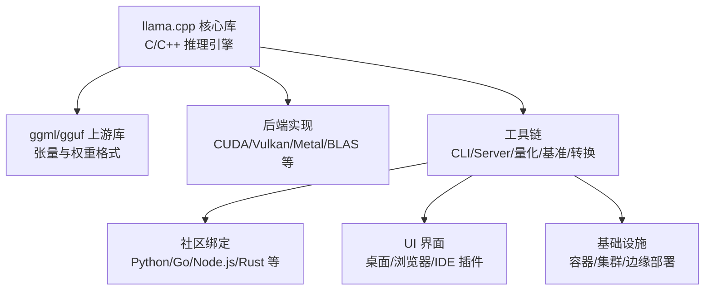
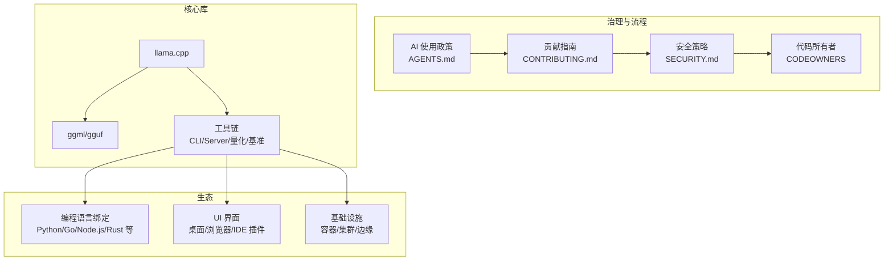
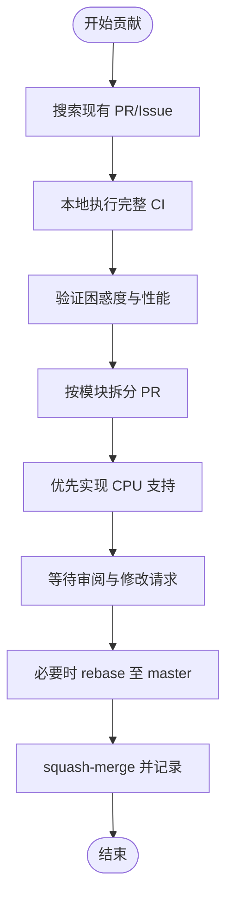
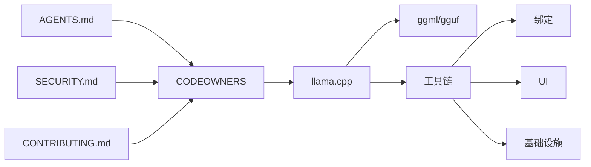

# 社区生态

<cite>
**本文引用的文件**
- [README.md](file://README.md)
- [CONTRIBUTING.md](file://CONTRIBUTING.md)
- [AGENTS.md](file://AGENTS.md)
- [SECURITY.md](file://SECURITY.md)
- [CODEOWNERS](file://CODEOWNERS)
- [AUTHORS](file://AUTHORS)
- [.github/pull_request_template.md](file://.github/pull_request_template.md)
</cite>

## 目录
1. [简介](#简介)
2. [项目结构](#项目结构)
3. [核心组件](#核心组件)
4. [架构总览](#架构总览)
5. [详细组件分析](#详细组件分析)
6. [依赖分析](#依赖分析)
7. [性能考量](#性能考量)
8. [故障排查指南](#故障排查指南)
9. [结论](#结论)
10. [附录](#附录)

## 简介
本文件系统性梳理 llama.cpp 的开源社区生态，涵盖贡献者与维护者群体、用户社区与合作伙伴关系、治理模式与贡献流程、社区规范与安全策略，并对第三方集成生态（编程语言绑定、UI 界面、工具与基础设施平台）进行全景式盘点。同时提供参与路径、问题反馈方式、影响力与协作关系说明，帮助读者快速理解并融入该生态。

## 项目结构
llama.cpp 是一个以 C/C++ 实现的大模型推理引擎，围绕其构建了丰富的上游库（ggml/gguf）、下游工具链（CLI/Server/示例）、多后端（CUDA/Vulkan/Metal 等）与广泛的社区生态。README 提供了“模型支持”“绑定生态”“UI 工具”“基础设施”等清单，体现了社区的多样性与跨语言、跨平台特性。

章节来源
- [README.md: 第1-597行:1-597](file://README.md#L1-L597)

## 核心组件
- 贡献者与维护者层级
  - 贡献者：曾为项目做出过贡献的个人
  - 协作者（Triage）：对部分代码有维护责任，负责审查与跟进相关贡献
  - 维护者：负责审查与合并 PR，协调项目进展
- 贡献流程与规范
  - 提交前需搜索现有 PR/Issue，避免重复；本地执行完整 CI；关注困惑度与性能指标；按模块拆分 PR；优先实现 CPU 支持后再扩展到其他后端
  - 明确命名与编码规范，避免引入额外依赖，保持跨平台兼容
- AI 使用政策
  - 不接受完全或主要由 AI 生成的 PR；允许以辅助角色使用 AI；要求披露 AI 使用情况并能逐行解释代码
- 安全策略
  - 私有漏洞上报渠道与处理周期；明确覆盖范围与不覆盖范围；针对不可信模型/输入/网络环境的安全建议
- 代码所有者（CODEOWNERS）
  - 按模块/子树指定维护者与团队，确保变更可追踪、可审查、可维护

章节来源
- [CONTRIBUTING.md: 第1-196行:1-196](file://CONTRIBUTING.md#L1-L196)
- [AGENTS.md: 第1-111行:1-111](file://AGENTS.md#L1-L111)
- [SECURITY.md: 第1-98行:1-98](file://SECURITY.md#L1-L98)
- [CODEOWNERS: 第1-121行:1-121](file://CODEOWNERS#L1-L121)

## 架构总览
下图展示社区生态中“llama.cpp 核心”与“上游/下游”的交互关系，以及治理与贡献流程的映射。

图表来源
- [README.md: 第164-265行:164-265](file://README.md#L164-L265)
- [CONTRIBUTING.md: 第29-70行:29-70](file://CONTRIBUTING.md#L29-L70)
- [AGENTS.md: 第12-52行:12-52](file://AGENTS.md#L12-L52)
- [SECURITY.md: 第13-47行:13-47](file://SECURITY.md#L13-L47)
- [CODEOWNERS: 第1-121行:1-121](file://CODEOWNERS#L1-L121)

## 详细组件分析

### 贡献者与维护者群体
- 层级与职责
  - 贡献者：历史贡献者，无特殊权限
  - 协作者（Triage）：对特定模块有维护责任，负责审查与跟进
  - 维护者：审查与合并 PR，协调项目推进
- 代表性维护者与团队
  - 多个后端与子模块的维护团队在 CODEOWNERS 中明确标注（如 CUDA、Metal、Vulkan、ggml-* 等）
  - 服务器与 WebUI、MTMD 等模块有专门维护者
- 贡献者统计
  - AUTHORS 列表包含来自全球的大量贡献者，体现社区的国际化与活跃度

章节来源
- [CONTRIBUTING.md: 第3-7行:3-7](file://CONTRIBUTING.md#L3-L7)
- [CODEOWNERS: 第4-18行:4-18](file://CODEOWNERS#L4-L18)
- [AUTHORS: 第1-800行:1-800](file://AUTHORS#L1-L800)

### 治理模式与贡献流程
- 分层治理
  - 贡献者 → 协作者 → 维护者，逐步授权与责任下沉
- PR 流程
  - 提交前：搜索现有工作、本地 CI、验证困惑度与性能、按模块拆分 PR、优先 CPU 支持
  - 提交后：接受修改请求、保持沟通、必要时允许审阅者直接推送以加速评审
- 合并与记录
  - 维护者采用 squash-merge，提交标题格式规范，便于追溯
- AI 使用与披露
  - 严格限制 AI 生成内容，要求披露并能逐行解释代码

图表来源
- [CONTRIBUTING.md: 第29-70行:29-70](file://CONTRIBUTING.md#L29-L70)
- [CONTRIBUTING.md: 第57-64行:57-64](file://CONTRIBUTING.md#L57-L64)

章节来源
- [CONTRIBUTING.md: 第29-70行:29-70](file://CONTRIBUTING.md#L29-L70)
- [CONTRIBUTING.md: 第57-64行:57-64](file://CONTRIBUTING.md#L57-L64)
- [.github/pull_request_template.md: 第13-14行:13-14](file://.github/pull_request_template.md#L13-L14)

### 社区规范与安全策略
- AI 使用政策
  - 明确禁止完全或主要由 AI 生成的 PR；允许以辅助角色使用 AI；要求披露并具备解释能力
- 安全策略
  - 私有漏洞上报渠道与处理周期；明确覆盖范围与不覆盖范围；针对不可信模型/输入/网络环境的安全建议
  - 对 RPC 与特定服务的使用风险提示

章节来源
- [AGENTS.md: 第12-52行:12-52](file://AGENTS.md#L12-L52)
- [SECURITY.md: 第13-47行:13-47](file://SECURITY.md#L13-L47)
- [SECURITY.md: 第51-98行:51-98](file://SECURITY.md#L51-L98)

### 第三方集成生态（绑定/UI/工具/基础设施）
- 编程语言绑定（节选）
  - Python：abetlen/llama-cpp-python、ddh0/easy-llama
  - Go：go-skynet/go-llama.cpp、hybridgroup/yzma
  - Node.js：withcatai/node-llama-cpp
  - JS/TS：lgrammel/modelfusion、ngxson/wllama
  - Rust：edgenai/llama_cpp-rs、mdrokz/rust-llama.cpp、utilityai/llama-cpp-rs、ShelbyJenkins/llm_client
  - 其他：C#/.NET、Ruby、Scala 3、Clojure、React Native、Java/JNA、Zig、Flutter/Dart、PHP、Swift、Delphi 等
- UI 界面（节选）
  - LM Studio、LocalAI、Jan、oobabooga/text-generation-webui、ollama/ollama、Mozilla-Ocho/llamafile、KanTV、Llama Assistant 等
- 工具（节选）
  - akx/ggify、akx/ollama-dl、gpustack/gguf-parser、unslothai/unsloth
- 基础设施（节选）
  - GPUStack、llmaz、LLMKube、llama-swap、ramalama、Paddler、llama_cpp_canister、kalavai-client

章节来源
- [README.md: 第164-265行:164-265](file://README.md#L164-L265)

### 主要社区项目与工具
- llama-cpp-python：官方推荐的 Python 绑定，广泛用于应用开发与数据科学场景
- LocalAI：开源的 OpenAI 兼容 API 服务，常与 llama.cpp 结合使用
- LM Studio：跨平台本地 AI 应用，内置模型管理与对话界面
- Ollama：模型分发与运行平台，支持 llama.cpp 后端
- Jan：开源的本地聊天应用，强调隐私与离线体验
- oobabooga/text-generation-webui：社区驱动的 Web UI，支持多种扩展与插件
- llamafile：将模型打包为可执行文件，便于分发与运行
- GPUStack/llmaz/LLMKube：面向企业与研究的集群化推理平台

章节来源
- [README.md: 第200-265行:200-265](file://README.md#L200-L265)

### 参与社区建设与贡献
- 如何参与
  - 阅读贡献指南与 AI 使用政策，按流程提交 PR
  - 在 GitHub 讨论区与 Issues 中交流想法与问题
  - 关注“good first issue”，从易到难逐步深入
- 报告问题
  - 使用 Issues 模板描述问题，提供复现步骤与环境信息
  - 涉及安全问题请通过私有安全通告渠道上报
- 文档与资源
  - 项目 Wiki、模块文档与示例工程是学习与贡献的重要入口

章节来源
- [README.md: 第509-519行:509-519](file://README.md#L509-L519)
- [CONTRIBUTING.md: 第193-196行:193-196](file://CONTRIBUTING.md#L193-L196)
- [SECURITY.md: 第13-22行:13-22](file://SECURITY.md#L13-L22)

## 依赖分析
- 治理与流程依赖
  - AGENTS.md 与 CONTRIBUTING.md 共同构成贡献与 AI 使用的双重约束
  - SECURITY.md 为安全问题提供独立处理通道
  - CODEOWNERS 将维护责任落实到具体模块，降低耦合度
- 生态依赖
  - 上游 ggml/gguf 为核心张量与权重格式基础
  - 工具链（CLI/Server/量化/基准）为生态提供统一入口
  - 绑定/UI/工具/基础设施围绕工具链形成多层扩展

图表来源
- [AGENTS.md: 第1-111行:1-111](file://AGENTS.md#L1-L111)
- [CONTRIBUTING.md: 第1-196行:1-196](file://CONTRIBUTING.md#L1-L196)
- [SECURITY.md: 第1-98行:1-98](file://SECURITY.md#L1-L98)
- [CODEOWNERS: 第1-121行:1-121](file://CODEOWNERS#L1-L121)

章节来源
- [AGENTS.md: 第1-111行:1-111](file://AGENTS.md#L1-L111)
- [CONTRIBUTING.md: 第1-196行:1-196](file://CONTRIBUTING.md#L1-L196)
- [SECURITY.md: 第1-98行:1-98](file://SECURITY.md#L1-L98)
- [CODEOWNERS: 第1-121行:1-121](file://CODEOWNERS#L1-L121)

## 性能考量
- 贡献流程中的性能与困惑度验证有助于维持生态整体质量
- 多后端实现（CUDA/Vulkan/Metal/BLAS 等）为不同硬件平台提供优化路径
- 基准工具（llama-bench）与量化工具（tools/quantize）支撑性能调优与资源控制

章节来源
- [CONTRIBUTING.md: 第34-38行:34-38](file://CONTRIBUTING.md#L34-L38)
- [README.md: 第275-296行:275-296](file://README.md#L275-L296)
- [README.md: 第472-491行:472-491](file://README.md#L472-L491)

## 故障排查指南
- 安全问题
  - 通过私有安全通告渠道上报，提供 PoC 脚本或附件
  - 明确覆盖范围与不覆盖范围，避免误报
- 一般问题
  - 使用 Issues 模板，提供最小复现、环境信息与期望行为
  - 参考工具链文档与示例工程定位问题
- 绑定与 UI
  - 检查版本兼容性与依赖安装
  - 查看对应项目的 Issues 与讨论区获取解决方案

章节来源
- [SECURITY.md: 第13-47行:13-47](file://SECURITY.md#L13-L47)
- [README.md: 第509-519行:509-519](file://README.md#L509-L519)

## 结论
llama.cpp 的社区生态以“核心库 + 上游库 + 工具链 + 多语言绑定 + UI/工具/基础设施”的多层次结构展开。严格的治理与贡献流程（AGENTS/CONTRIBUTING/SECURITY/CODEOWNERS）保障了高质量与可持续发展；活跃的国际贡献者群体与多样化的第三方集成进一步扩大了影响力。对于新参与者，建议从“贡献指南—AI 使用政策—安全策略—代码所有者—Issues/PR 模板”入手，循序渐进地参与生态建设。

## 附录
- 参与路径
  - 阅读贡献指南与 AI 使用政策
  - 选择感兴趣的模块或绑定，从小处着手
  - 通过 Issues/PR 模板与讨论区与维护者沟通
- 影响力与协作
  - 与 Hugging Face、Ollama、LocalAI 等项目存在紧密协作关系
  - 在本地推理、边缘部署与多后端优化方面具有显著影响力

章节来源
- [README.md: 第18-30行:18-30](file://README.md#L18-L30)
- [README.md: 第200-265行:200-265](file://README.md#L200-L265)