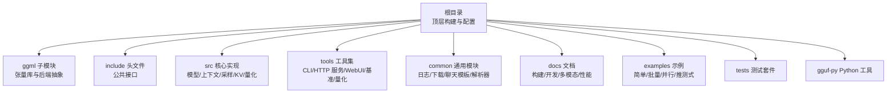
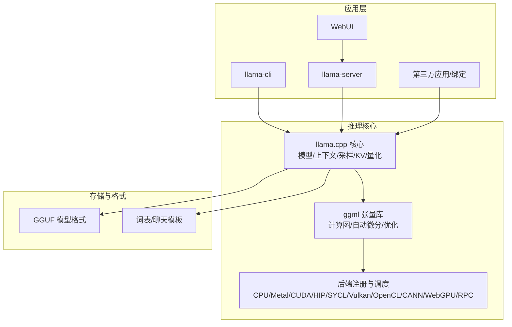
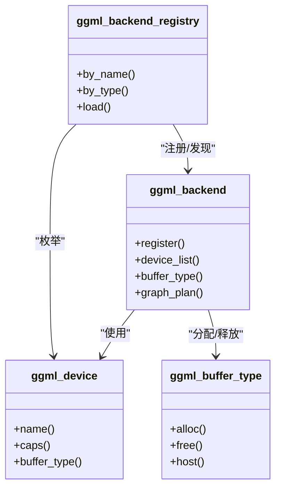
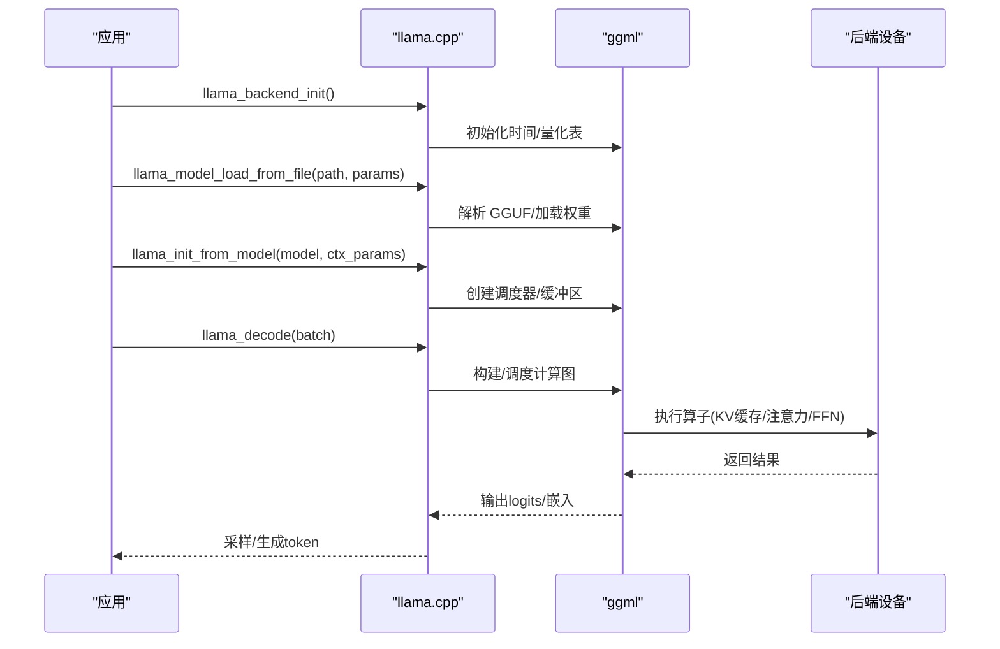
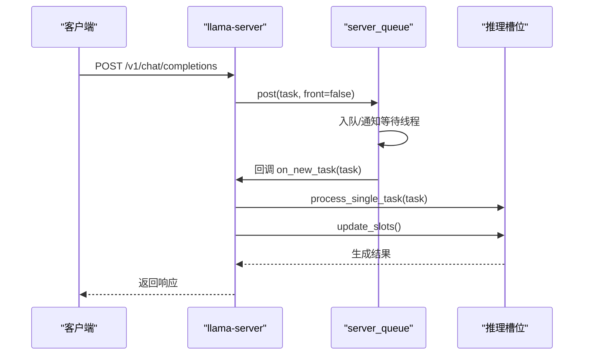
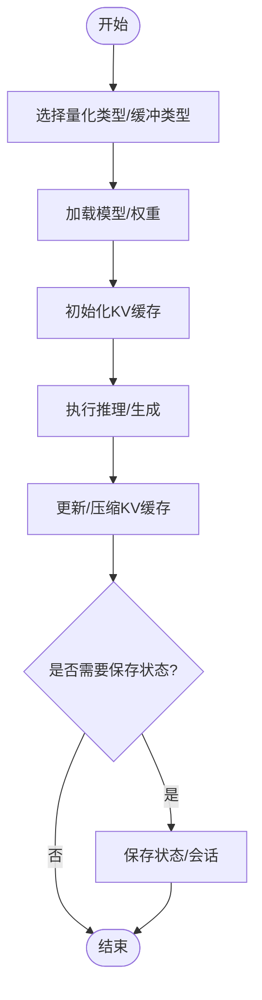
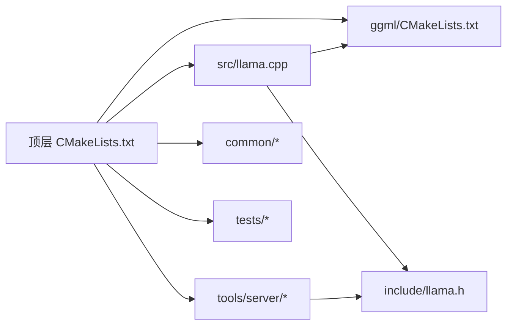

# 项目概述

<cite>
**本文引用的文件列表**
- [README.md](file://README.md)
- [CMakeLists.txt](file://CMakeLists.txt)
- [ggml/CMakeLists.txt](file://ggml/CMakeLists.txt)
- [include/llama.h](file://include/llama.h)
- [include/llama-cpp.h](file://include/llama-cpp.h)
- [ggml/include/ggml.h](file://ggml/include/ggml.h)
- [src/llama.cpp](file://src/llama.cpp)
- [docs/build.md](file://docs/build.md)
- [CONTRIBUTING.md](file://CONTRIBUTING.md)
- [tools/server/server-queue.cpp](file://tools/server/server-queue.cpp)
- [tools/server/server-context.cpp](file://tools/server/server-context.cpp)
</cite>

## 目录
1. [简介](#简介)
2. [项目结构](#项目结构)
3. [核心组件](#核心组件)
4. [架构总览](#架构总览)
5. [详细组件分析](#详细组件分析)
6. [依赖关系分析](#依赖关系分析)
7. [性能考量](#性能考量)
8. [故障排查指南](#故障排查指南)
9. [结论](#结论)
10. [附录](#附录)

## 简介
llama.cpp 是一个以纯 C/C++ 实现的大语言模型（LLM）推理引擎，强调“最小化设置、即开即用”的本地与云端部署体验，并在多硬件平台上实现卓越性能。其核心价值主张包括：
- 纯 C/C++ 实现，无外部运行时依赖，便于跨平台分发与集成
- 多后端统一抽象（ggml），覆盖 CPU、Metal、CUDA、HIP、SYCL、Vulkan、OpenCL、CANN、WebGPU、RPC 等
- 全量到细粒度的量化方案（1.5 至 8 比特整数量化等），显著降低显存占用并提升吞吐
- 跨平台兼容：从桌面到服务器、移动设备、嵌入式系统均有支持
- 提供命令行工具、HTTP 服务、WebUI、示例程序与丰富的绑定生态

llama.cpp 的主要目标是在广泛的硬件上提供“即插即用”的 LLM 推理能力，同时作为 ggml 的主实验场，持续推动算子、后端与量化优化的演进。

**章节来源**
- [README.md:57-71](file://README.md#L57-L71)

## 项目结构
项目采用模块化分层设计：
- 根目录构建入口与顶层配置：CMakeLists.txt 控制构建选项、可选组件与安装规则
- ggml 子模块：独立的张量计算与后端抽象库，llama.cpp 通过 ggml 提供统一的计算图与多后端调度
- include：对外公开的 C/C++ 接口头文件（llama.h、llama-cpp.h）
- src：llama.cpp 的核心实现，封装模型加载、上下文管理、采样器、KV 缓存、量化与内存管理等
- tools：CLI 工具、HTTP 服务、WebUI、基准测试、量化工具等
- common：通用工具、聊天模板、日志、下载器、解析器等
- docs：构建、开发、多模态、性能调优等文档
- examples：最小示例、批量推理、并行、推测式解码等示例
- tests：单元测试与回归测试
- gguf-py：Python 侧 GGUF 读写与元数据处理

**图表来源**
- [CMakeLists.txt:1-291](file://CMakeLists.txt#L1-L291)
- [ggml/CMakeLists.txt:1-505](file://ggml/CMakeLists.txt#L1-L505)

**章节来源**
- [CMakeLists.txt:172-230](file://CMakeLists.txt#L172-L230)
- [ggml/CMakeLists.txt:296-356](file://ggml/CMakeLists.txt#L296-L356)

## 核心组件
- ggml 张量库与后端抽象：提供统一的张量操作、自动微分、优化算法与多后端调度（CPU、Metal、CUDA、HIP、SYCL、Vulkan、OpenCL、CANN、WebGPU、RPC 等）
- llama.h/llama-cpp.h：对外 C/C++ 接口，定义模型、上下文、采样器、批处理、量化类型、参数结构体等
- src/llama.cpp：llama.cpp 的实现，负责模型加载、上下文初始化、推理执行、状态保存/恢复、适配器（LoRA）等
- tools：llama-cli（交互式）、llama-server（OpenAI 兼容 HTTP 服务）、WebUI、量化工具、基准工具等
- common：日志、下载、聊天模板、正则/PEG 解析、采样策略、调试工具等
- examples：简单示例、批量/并行/推测式解码、查找表、扩散模型等
- tests：后端一致性、量化性能、线程安全、语法/语义解析等测试

**章节来源**
- [include/llama.h:1-1566](file://include/llama.h#L1-L1566)
- [include/llama-cpp.h:1-31](file://include/llama-cpp.h#L1-L31)
- [src/llama.cpp:1-559](file://src/llama.cpp#L1-L559)

## 架构总览
llama.cpp 的整体架构围绕“模型/上下文/采样器/批处理/后端调度”展开，通过 ggml 提供统一的张量计算与后端抽象，实现跨平台、多后端的高性能推理。

**图表来源**
- [include/llama.h:434-524](file://include/llama.h#L434-L524)
- [ggml/include/ggml.h:1-200](file://ggml/include/ggml.h#L1-L200)
- [src/llama.cpp:83-108](file://src/llama.cpp#L83-L108)

## 详细组件分析

### 组件一：ggml 后端抽象层
- 设计理念：以“后端注册/设备/缓冲区类型/调度器”为核心抽象，屏蔽底层硬件差异，统一算子与内存管理
- 关键点：
  - 后端注册与动态加载：支持 CPU、Metal、CUDA、HIP、SYCL、Vulkan、OpenCL、CANN、WebGPU、RPC 等
  - 设备与缓冲区类型：按设备能力选择最优缓冲类型（如显存/主机内存/统一内存）
  - 调度器：支持流水线并行、复制与重排、图优化与内核融合
- 优势：一次实现，多后端受益；便于扩展新硬件与新后端

**图表来源**
- [ggml/include/ggml.h:1-200](file://ggml/include/ggml.h#L1-L200)
- [ggml/CMakeLists.txt:192-279](file://ggml/CMakeLists.txt#L192-L279)

**章节来源**
- [ggml/include/ggml.h:1-200](file://ggml/include/ggml.h#L1-L200)
- [ggml/CMakeLists.txt:192-279](file://ggml/CMakeLists.txt#L192-L279)

### 组件二：llama.cpp 接口与生命周期
- 接口要点：
  - llama_backend_init/free：初始化/释放后端环境
  - llama_model_load_from_file：从 GGUF 文件加载模型
  - llama_init_from_model：基于模型创建上下文
  - llama_decode/llama_encode：执行解码/编码（含嵌入与重排序）
  - llama_state_get/set_data：保存/恢复会话状态
  - llama_model_quantize：量化转换
- 生命周期：后端初始化 → 加载模型 → 初始化上下文 → 推理/生成 → 保存状态 → 释放资源

**图表来源**
- [include/llama.h:442-524](file://include/llama.h#L442-L524)
- [src/llama.cpp:83-108](file://src/llama.cpp#L83-L108)

**章节来源**
- [include/llama.h:442-524](file://include/llama.h#L442-L524)
- [src/llama.cpp:83-108](file://src/llama.cpp#L83-L108)

### 组件三：HTTP 服务与任务队列
- llama-server：提供 OpenAI 兼容的 REST API，支持多用户并发、嵌入/重排序、多模态等
- 任务队列：server_queue 将请求任务入队，按优先级与空闲策略调度执行，支持延迟与睡眠唤醒
- 上下文更新：周期性触发 slot 更新，驱动多路并发推理

**图表来源**
- [tools/server/server-queue.cpp:22-61](file://tools/server/server-queue.cpp#L22-L61)
- [tools/server/server-context.cpp:992-1001](file://tools/server/server-context.cpp#L992-L1001)

**章节来源**
- [tools/server/server-queue.cpp:22-61](file://tools/server/server-queue.cpp#L22-L61)
- [tools/server/server-context.cpp:992-1001](file://tools/server/server-context.cpp#L992-L1001)

### 组件四：量化与内存管理
- 量化类型：涵盖 1.5/2/3/4/5/6/8 比特整数量化，以及 IQ2_XXS/IQ3_XS/IQ4_XS 等混合精度方案
- 内存管理：KV 缓存、统一缓冲区、按序列清理/拷贝/移除、位置偏移与缩放
- 优化策略：按张量模式选择缓冲类型、权重重打包、分片与混合推理（CPU+GPU）

**图表来源**
- [include/llama.h:116-160](file://include/llama.h#L116-L160)
- [include/llama.h:693-762](file://include/llama.h#L693-L762)

**章节来源**
- [include/llama.h:116-160](file://include/llama.h#L116-L160)
- [include/llama.h:693-762](file://include/llama.h#L693-L762)

## 依赖关系分析
- 构建系统：顶层 CMakeLists.txt 控制构建选项、可选组件（tests/tools/examples/server）、安装规则；ggml 子模块独立构建并导出配置
- 运行时依赖：cpp-httplib（HTTP 服务）、stb-image（图像解码）、nlohmann/json（JSON）、miniaudio（音频解码）、subprocess.h（进程）
- 后端依赖：根据编译选项启用对应后端（CUDA/ROCm/HIP/SYCL/Vulkan/OpenCL/CANN/WebGPU 等）

**图表来源**
- [CMakeLists.txt:172-230](file://CMakeLists.txt#L172-L230)
- [ggml/CMakeLists.txt:296-356](file://ggml/CMakeLists.txt#L296-L356)

**章节来源**
- [CMakeLists.txt:172-230](file://CMakeLists.txt#L172-L230)
- [ggml/CMakeLists.txt:296-356](file://ggml/CMakeLists.txt#L296-L356)

## 性能考量
- 后端选择：优先 Metal（Apple Silicon）、CUDA（NVIDIA）、HIP（AMD）、SYCL（Intel GPU）、Vulkan/OpenCL（跨平台 GPU）、CANN（Ascend）、WebGPU（未来）
- 量化策略：根据模型大小与精度需求选择合适量化类型，兼顾速度与质量
- 并行与批处理：合理设置 n_threads/n_threads_batch、n_batch/n_ubatch、n_seq_max，避免过度并行导致抖动
- KV 缓存：SWA/Unified 缓存策略、按序列清理与位置偏移，减少碎片与重复计算
- 基准与测试：使用 llama-bench 与 llama-perplexity 对比不同配置与量化方案

[本节为通用指导，不直接分析具体文件]

## 故障排查指南
- 后端未加载：确保已加载至少一个后端（CPU/Metal/CUDA/HIP/SYCL/Vulkan/OpenCL/CANN/WebGPU/RPC），或在模型参数中指定设备
- 模型加载失败：检查 GGUF 文件完整性、路径正确性、量化类型与硬件匹配
- 内存不足：尝试降低 n_ctx、n_batch、量化级别，或启用混合推理（CPU+GPU）
- 服务异常：查看 server 日志，确认任务队列状态、槽位更新与超时设置
- 线程安全：避免在多线程中共享同一上下文，必要时使用独立上下文或加锁

**章节来源**
- [src/llama.cpp:197-200](file://src/llama.cpp#L197-L200)
- [tools/server/server-queue.cpp:125-175](file://tools/server/server-queue.cpp#L125-L175)

## 结论
llama.cpp 以 ggml 为统一后端抽象，结合纯 C/C++ 实现与丰富的量化/多后端支持，在本地与云端实现了“即插即用”的 LLM 推理体验。其模块化架构、清晰的接口与完善的工具链，使其既能满足初学者快速上手，也能为有经验的开发者提供深入定制与优化的空间。在开源 AI 生态中，llama.cpp 既是基础设施也是创新试验田，持续推动着推理效率与硬件兼容性的边界。

[本节为总结性内容，不直接分析具体文件]

## 附录
- 快速开始与安装：参考 README 的“Quick start”与“Installation”
- 构建指南：参考 docs/build.md，涵盖 CPU、Metal、CUDA、HIP、SYCL、Vulkan、OpenCL、CANN、WebGPU 等后端
- 社区与生态：README 列出了大量绑定、UI、工具与基础设施项目
- 贡献指南：CONTRIBUTING.md 规定了贡献流程、代码规范与测试要求

**章节来源**
- [README.md:33-56](file://README.md#L33-L56)
- [docs/build.md:1-30](file://docs/build.md#L1-L30)
- [CONTRIBUTING.md:29-78](file://CONTRIBUTING.md#L29-L78)