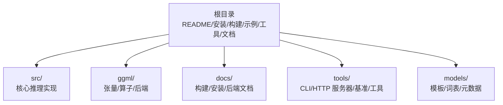
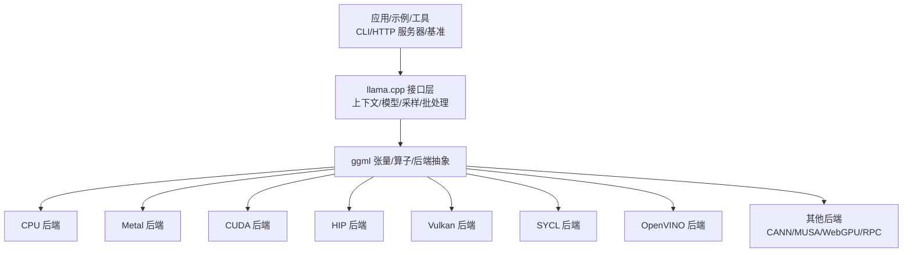
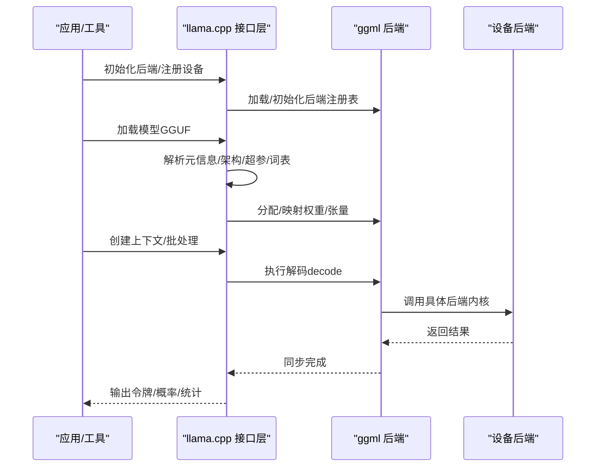
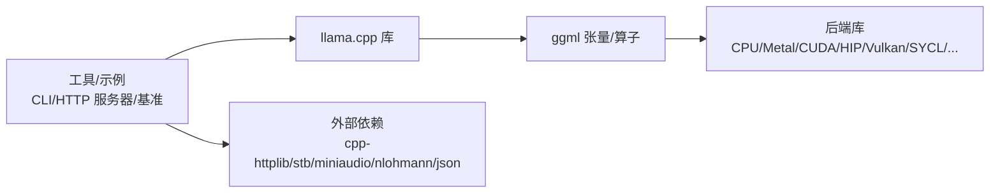

# 项目简介

<cite>
**本文引用的文件**
- [README.md](file://README.md)
- [CMakeLists.txt](file://CMakeLists.txt)
- [docs/build.md](file://docs/build.md)
- [docs/install.md](file://docs/install.md)
- [ggml/CMakeLists.txt](file://ggml/CMakeLists.txt)
- [src/llama.cpp](file://src/llama.cpp)
- [CONTRIBUTING.md](file://CONTRIBUTING.md)
- [AUTHORS](file://AUTHORS)
</cite>

## 目录
1. [引言](#引言)
2. [项目结构](#项目结构)
3. [核心组件](#核心组件)
4. [架构总览](#架构总览)
5. [详细组件分析](#详细组件分析)
6. [依赖关系分析](#依赖关系分析)
7. [性能考量](#性能考量)
8. [故障排查指南](#故障排查指南)
9. [结论](#结论)
10. [附录](#附录)

## 引言
llama.cpp 的核心使命是：在尽可能低的设置门槛下，在各类硬件（本地与云端）上实现“状态一流”的大语言模型（LLM）推理体验。项目以纯 C/C++ 实现，强调无外部依赖、跨平台兼容、极致性能与资源效率，致力于让 LLM 推理回归到“简单、可靠、可移植”的本真形态。

llama.cpp 不仅是面向开发者的高性能推理引擎，也是面向用户的即装即用工具集，覆盖命令行、HTTP 服务、WebUI、多后端加速（CPU、Metal、CUDA、HIP、Vulkan、SYCL、OpenVINO 等），并提供丰富的模型支持与生态集成。

## 项目结构
从仓库组织看，llama.cpp 采用“库 + 工具 + 示例 + 文档 + 后端 ggml”的分层设计：
- 根目录顶层提供安装与构建指引、示例程序、工具集合（CLI、HTTP 服务器、基准测试等）、多后端文档与模型模板。
- src 目录为核心推理实现，封装了上下文、模型加载、KV 缓存、采样器、批处理等关键模块。
- ggml 子仓库作为张量与算子后端，提供统一的设备抽象与多后端实现（CPU、CUDA、Metal、Vulkan、SYCL 等）。
- CMake 构建系统将 llama.cpp 与 ggml 组织为可配置的多后端工程，支持静态/动态库、安装与打包。

图示来源
- [CMakeLists.txt](file://CMakeLists.txt)
- [ggml/CMakeLists.txt](file://ggml/CMakeLists.txt)

章节来源
- [README.md](file://README.md)
- [CMakeLists.txt](file://CMakeLists.txt)
- [docs/build.md](file://docs/build.md)

## 核心组件
- 推理接口与生命周期
  - 初始化与后端注册：在启动时初始化时间与量化表，并按需加载后端（CPU/Metal/CUDA/Vulkan/SYCL 等）。
  - 模型加载：从 GGUF 文件解析元信息、架构、超参、词表与权重，支持 mmap、直通 IO、校验与分片加载。
  - 上下文管理：创建/销毁推理上下文，管理批处理、KV 缓存、采样链与内存分配。
- 批处理与解码
  - 将提示与生成令牌打包为批，执行解码（decode）并同步等待完成；支持预热、清空中间态与测量耗时。
- 采样与输出
  - 提供默认采样链参数，支持温度、top-p、重复惩罚等策略；可按需返回日志概率或令牌序列。
- 多后端与设备选择
  - 支持 CPU、Metal、CUDA、HIP、Vulkan、SYCL、OpenVINO、CANN、MUSA、WebGPU、RPC 等后端；运行时可指定设备或自动选择。

章节来源
- [src/llama.cpp](file://src/llama.cpp)
- [README.md](file://README.md)

## 架构总览
llama.cpp 的整体架构围绕“统一接口 + 可插拔后端”展开：应用通过 C 风格接口调用，内部由 ggml 抽象设备与算子，再映射到具体后端实现。构建系统通过 CMake 将核心库与工具、示例、测试统一编译与安装。

图示来源
- [README.md](file://README.md)
- [ggml/CMakeLists.txt](file://ggml/CMakeLists.txt)
- [CMakeLists.txt](file://CMakeLists.txt)

## 详细组件分析

### 设计理念与优势
- 纯 C/C++ 实现，无第三方运行时依赖，便于在多种平台与环境中快速部署。
- 跨平台兼容：支持 macOS（Metal）、Linux（BLAS/CPU/ROCm/Intel/ARM 等）、Windows（CUDA/ROCm/MSVC/Clang）、Android、WebAssembly 等。
- 性能与资源效率：提供多精度量化（1.5/2/3/4/5/6/8 比特整数量化）、批处理、KV 缓存、Speculative Decoding、混合 CPU+GPU 推理等优化手段。
- 开放生态：提供 CLI、HTTP 服务器、WebUI、多语言绑定、UI、基础设施与工具链，降低接入成本。

章节来源
- [README.md](file://README.md)
- [docs/build.md](file://docs/build.md)

### 模型与后端支持概览
- 模型：覆盖 LLaMA、Mistral、Mixtral、Jamba、Falcon、BERT、Baichuan、Qwen、Phi、Gemma、Mamba、Grok、Command-R、ChatGLM、GLMEdge、SmolLM、EXAONE、RWKV、GigaChat、Trillion、Ling、LFM2、Hunyuan、BailingMoe 等主流文本与多模态模型族。
- 后端：Metal、BLAS、SYCL、CUDA、HIP、Vulkan、CANN、MUSA、OpenCL、OpenVINO、WebGPU、RPC、VirtGPU、Hexagon、IBM zDNN、ZenDNN 等。

章节来源
- [README.md](file://README.md)

### 构建与安装
- 本地构建：通过 CMake 配置与编译，支持多后端开关、静态/动态库、安装与打包；提供 CPU、Metal、CUDA、HIP、Vulkan、SYCL、OpenVINO 等后端的详细构建说明。
- 预构建安装：支持 Homebrew、Winget、MacPorts、Nix 等渠道一键安装，简化用户入门。

章节来源
- [docs/build.md](file://docs/build.md)
- [docs/install.md](file://docs/install.md)

### 推理流程（代码级）
以下序列图展示从初始化到解码的关键步骤，体现接口层与后端抽象的协作：

图示来源
- [src/llama.cpp](file://src/llama.cpp)
- [ggml/CMakeLists.txt](file://ggml/CMakeLists.txt)

### 关键实现要点
- 后端初始化与 NUMA：在启动阶段初始化时间与量化表，必要时进行 NUMA 初始化。
- 模型加载：通过模型加载器解析 GGUF 元数据，加载架构、超参、词表与权重，支持 mmap 与直通 IO。
- 解码与同步：将输入令牌打包为批，执行解码并同步等待，期间可清空中间态以稳定后续测量。
- 设备能力检测：运行时检测可用设备类型（CPU/GPU/IGPU），决定是否启用 GPU 卸载或 RPC。

章节来源
- [src/llama.cpp](file://src/llama.cpp)

## 依赖关系分析
- 内部依赖
  - llama.cpp 依赖 ggml 作为张量与算子后端，通过 CMake 子目录方式集成，支持动态加载后端库。
  - 工具与示例依赖核心库与公共组件（common），并通过 CMake 控制构建选项。
- 外部依赖
  - HTTP 服务器使用单头库（cpp-httplib），图像/音频/JSON 等工具使用 stb、miniaudio、nlohmann/json 等轻量库。
- 平台与编译器
  - 支持 GCC/Clang/MSVC/Xcode 等主流编译器；针对不同平台启用相应指令集与后端特性。

图示来源
- [CMakeLists.txt](file://CMakeLists.txt)
- [ggml/CMakeLists.txt](file://ggml/CMakeLists.txt)
- [README.md](file://README.md)

章节来源
- [CMakeLists.txt](file://CMakeLists.txt)
- [ggml/CMakeLists.txt](file://ggml/CMakeLists.txt)
- [README.md](file://README.md)

## 性能考量
- 量化与精度：提供 1.5/2/3/4/5/6/8 比特整数量化，显著降低显存占用并提升吞吐。
- 批处理与 KV 缓存：通过批处理与 KV 缓存减少重复计算，提高长上下文场景下的效率。
- Speculative Decoding：通过草稿模型提前预测，减少主模型解码次数，提升生成速度。
- 多后端优化：根据硬件特性选择最优后端（Metal/CUDA/Vulkan/SYCL 等），并利用指令集（AVX/AVX2/AVX512/AMX/RVV 等）与专用内核。
- 混合推理：当模型规模超过显存容量时，可采用 CPU+GPU 混合推理策略。

章节来源
- [README.md](file://README.md)
- [docs/build.md](file://docs/build.md)

## 故障排查指南
- 构建问题
  - 缺少依赖：根据平台安装 OpenSSL、BLAS、Vulkan SDK、ROCm/ROCm SDK、CUDA Toolkit 等。
  - 后端未启用：检查 CMake 选项（如 GGML_CUDA、GGML_METAL、GGML_VULKAN 等）与环境变量。
- 运行问题
  - 设备不可用：确认设备列表与可见性（如 CUDA_VISIBLE_DEVICES、HIP_VISIBLE_DEVICES），或使用 --device none 完全禁用 GPU。
  - 显存不足：尝试降低批大小、启用量化、使用混合推理或切换到 CPU 后端。
- 模型问题
  - GGUF 格式不匹配：确保使用转换脚本将 PyTorch 模型转为 GGUF，并检查模型元数据与量化类型。
- 性能异常
  - 使用 llama-bench 对比不同后端与配置，定位瓶颈；关注提示处理与生成阶段的差异。

章节来源
- [docs/build.md](file://docs/build.md)
- [README.md](file://README.md)

## 结论
llama.cpp 以“纯 C/C++ + ggml 后端抽象”的架构，实现了在多平台、多后端上的高性能 LLM 推理。其设计理念聚焦于“简单、可靠、高效”，既满足开发者对可移植与可控性的需求，也为终端用户提供了开箱即用的工具链与生态。随着模型与硬件的持续演进，llama.cpp 将继续在性能、兼容性与易用性之间寻求最佳平衡。

## 附录

### 初学者问答：什么是 LLM 推理？
- 简单来说，LLM 推理就是让训练好的大模型“回答问题、写文章、做翻译”等。llama.cpp 提供了在本地或云端高效运行这些能力的工具与接口。

### 为什么需要 llama.cpp 这样的解决方案？
- 传统方案常存在依赖复杂、性能瓶颈、部署困难等问题。llama.cpp 通过纯 C/C++ 实现、无外部依赖、多后端加速与丰富工具链，有效降低了门槛并提升了灵活性。

### 发展历程与社区
- 项目自开源以来，持续迭代新功能与后端支持，社区贡献者众多，涵盖模型适配、工具扩展、平台移植与性能优化等方面。

章节来源
- [AUTHORS](file://AUTHORS)
- [CONTRIBUTING.md](file://CONTRIBUTING.md)
- [README.md](file://README.md)